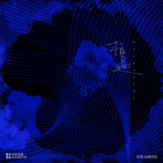

相遇
============================

|  |  |
| :--: | :-- |
| [ 相遇](https://emumo.xiami.com/album/2105321857) | **艺人**: [上海彩虹室内合唱团](../index.md) **语种**: 国语 **唱片公司**: StreetVoice, 西瓜山 **发行时间**: 2019年10月10日 **专辑类别**: EP, 单曲 **专辑风格**:  **播放数**: 20330 **收藏数**: 82 **评论数**: 5  |

## 简介

套曲《相遇》是上海彩虹室内合唱团受上海城市空间艺术季委约，于2019年完成的艺术套曲。 专辑由七个篇章组成，按时序描绘了杨浦滨江的七个图景。既是一天之中的七个缩影，也描绘着杨浦滨江的前世今⽣。  
不同于彩虹以往的室内乐风格套曲，《相遇》在创作和制作过程中，⼤量融⼊了现代的音乐创作和⾳响设计思维。制作人金承志、田汨以合唱为情感骨架，管弦乐、电子乐、采样音乐甚至戏剧念白作为表达手法，传递了更多层次的听觉感受，进一步拓展合唱艺术的可能性。  
  
套曲《相遇》  
作词/文本设计 ：金承志  
制作人 ：金承志，田汨  
项目制作人：高宁  
作曲：金承志，田汨，罗赓  
编曲：田汨，罗赓，吴经纬  
指挥：金承志  
演唱：上海彩虹室内合唱团  
参与专辑录音及首演团员名单：  
女高：段可儿，居雪，刘雪茗，柳扬，吕亚倩，王于阗，郑晓，朱静怡，诸春飞  
女中：董琪泽，高卉，金禧，欧阳传婧，夏晋，叶*，郑寒潇，周齐昕  
男高：陈戌侃，高宁，姜智伟，蓝思成，刘政，马卓毅，吴经纬，吴愉  
男低：李嘉程 ，林明晨，邵宇轩，施嘉俊，王欣，王逸凡，许诗雨  
人声录音：莫家伟@上海广播大厦录音棚  
笛/箫/埙：屠化冰  
琵琶：施文卿  
笙：张梦  
沪语念白：舞台剧《繁花》部分主创及主演  
现场演出弦乐团：朴英弦乐团  
录音弦乐团：国际首席爱乐乐团  
弦乐录音监制：李朋  
弦乐编写: 田汨，罗赓，谭畅  
混音/母带工程师：莫家伟@上海广播大厦录音棚  
影像作品《水之记忆》：高橋啓祐  
封面：高橋啓祐  
  
曲目单：  
七之一《遥远的呼唤》  
作词: 金承志  
作曲: 金承志  
编曲: 田汨  
  
七之二《奔腾的江水》  
作词: 金承志  
作曲: 金承志，罗赓  
编曲: 罗赓  
  
七之三《高耸入云》  
作词: 金承志  
作曲: 金承志，田汨  
编曲: 田汨  
沪语念白：何政庭  
  
七之四《卖花姑娘》  
作词: 金承志  
作曲: 金承志，吴经纬  
编曲: 金承志，吴经纬  
沪语对话：杜光祎，何政庭，沈波尔，王怡  
  
七之五《繁星落江》  
作词: 金承志  
作曲: 金承志，罗赓  
编曲: 罗赓  
  
七之六《水底之声》  
作词 : 金承志  
作曲: 金承志，田汨  
编曲: 田汨  
念白：居雪 马卓毅 邵宇轩 夏晋 朱静怡  
独唱: 朱静怡  
  
七之七《故事》  
作词: 金承志  
作曲: 金承志  
编曲: 田汨  
  
Commissioned by this year’s Shanghai Urban Space Art Season, Shanghai Rainbow Chamber Singers (RCS) has written a song cycle called “Encounter”. It is a joint work by the group’s artistic director Jin Chengzhi, also the piece’s songwriter, and Tian Mi, Luo Geng and Wu Jingwei, the musicians responsible for its sound engineering. The album is consisted of 7 singles, each depicting a particular scene of the Riverside of Yangpu District in chronological order. Together these scenes demonstrate the seven different states the river is in during a day, and how it flows from the past to the present.  
In composing “Encounter”, RCS has swung from its usual predilection for chamber music features to contemporary music features, in the process incorporating the creative techniques and the audio elements of contemporary music into some parts of the song cycle in an effort to furnish the audience with a more enriched and layered listening experience, and further explore the possibilities of chorus art.  
  
Encounter  
Lyric/Story Design: Jin Chengzhi  
Producer: Jin Chengzhi, Tian Mi  
Project Producer: Gao Ning  
Composer : Jin Chengzhi, Tian Mi, Luo Geng  
Arrangement:  Tian Mi, Luo Geng, Wu Jingwei  
Artists: Rainbow Chamber Singers  
Album Recording Participants and Debut Performers:  
Soprano: Duan Keer, Ju Xue, Liu Xueming, Liu Yang,  Lyu Yaqian, Wang Yutian, Zheng Xiao, Zhu Jingyi, Zhu Chunfei  
Alto: Dong Qize, Gao Hui, Jin Xi, Ouyang Chuanjing, Xia Jin, Ye Zi, Zheng Hanxiao, Zhou Qixin  
Tenor: Chen Xukan, Gao Ning, Jiang Zhiwei, Lan Sicheng, Liu Zheng, Ma Zhuoyi, Wu Jingwei, Wu Yu  
Bass: Li Jiacheng, Lin Mingchen, Shao Yuxuan, Shi Jiajun, Wang Xin, Wang Yifan, Xu ShiyuVocal  
Recording: Mo Jiawei@ Shanghai Broadcast Building Studio  
Dizi/Xiao/Xun: Tu Huabing  
Pipa: Shi Wenqing  
Sheng: Zhang Meng  
Shanghainese Recording: Lead actors and actresses from the drama “Blossoms”  
Strings Orchestra For The Show: Piao Ying String Orchestra  
Strings Orchestra For The Program Recording: International Chief Philharmonic Orchestra  
Strings Recording Monitor: Li Peng  
String Arrangement: Tian Mi, Luo Geng, Tan Chang  
Mixing/Mastering Engineer: Mo Jiawei@ Shanghai Broadcast Building Studio  
Video Installation-Memory of Water: Takahashi Keisuke  
Cover: Takahashi Keisuke  
  
7-1 A Call from Afar     
Lyrics: Jin Chengzhi  
Composer: Jin Chengzhi   
Arrangement: Tian Mi  
  
7-2 Rolling River  
Lyrics: Jin Chengzhi  
Composer: Jin Chengzhi, Luo Geng   
Arrangement: Luo Geng  
  
7-3 Piercing the Sky  
Lyrics: Jin Chengzhi  
Composer : Jin Chengzhi, Tian Mi  
Arrangement: Tian Mi  
Shanghainese Monologue: He Zhengting  
  
7-4 Flower-selling Girl    
Lyrics: Jin Chengzhi  
Composer: Jin Chengzhi, Wu Jingwei   
Arrangement: Jin Chengzhi, Wu Jingwei   
Shanghainese Dialogue: Du Guangyi, He Zhengting, Shen Boer, Wang Yi  
  
7-5 Stars Fall on the River  
Lyrics: Jin Chengzhi  
Composer: Jin Chengzhi, Luo Geng   
Arrangement: Luo Geng  
  
7-6 Sound of Underwater    
Lyrics: Jin Chengzhi  
Composer: Jin Chengzhi, Tian Mi  
Arrangement: Tian Mi  
Dialogue: Ju Xue, Ma Zhuoyi, Shao Yuxuan, Xia Jin, Zhu Jingyi  
Soprano Solo: Zhu Jingyi  
  
7-7 Stories  
Lyrics: Jin Chengzhi  
Composer: Jin Chengzhi   
Arrangement: Tian Mi  
 

## 曲目

## 评论

|  |  |  |
| :-- | :-- | :-- |
|  [虾米用户](https://emumo.xiami.com/u/14024057) 会守到最后一刻。 2019-10-22 16:29 赞(1) 踩(0) | 
最喜欢《卖花姑娘》和《故事》。 心被打动了~
 |
|  [虾米用户](https://emumo.xiami.com/u/1598471)  2019-10-16 22:06 赞(1) 踩(0) | 
前两首听起来像加了词的某一张窦唯，后面沪语念白有趣
 |
|  [虾米用户](https://emumo.xiami.com/u/5479402) 我喜欢清澈的感觉。 2019-10-16 12:31 赞(1) 踩(0) | 
上海味道，直击人心。 
 |
|  [虾米用户](https://emumo.xiami.com/u/54534458) 造化隨順，風雅之誠。 2019-10-15 15:17 赞(1) 踩(0) | 
当所有故事的铺陈已经足够，一首〈故事〉足以将全套曲的灵魂一击而出。
 |
|  [虾米用户](https://emumo.xiami.com/u/128009332)   2019-10-10 17:21 赞(3) 踩(0) | 
“人间烟火气，最抚凡人心”
 |
