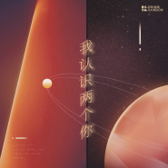

我认识两个你
============================

|  |  |
| :--: | :-- |
| [ 我认识两个你](https://emumo.xiami.com/album/5021849546) | **艺人**: [上海彩虹室内合唱团](../index.md) **语种**: 国语 **唱片公司**: StreetVoice, 西瓜山 **发行时间**: 2020年11月13日 **专辑类别**: EP, 单曲 **专辑风格**: 国语流行 Mandarin Pop **播放数**: 88272 **收藏数**: 50 **评论数**: 9  |

## 简介

电话这头，一个等待的我。

电话那头，是温暖的你。

即便身处两地，冷暖自知，每当铃声响起，总有温柔以待。

————————

词曲：金承志

演唱：上海彩虹室内合唱团

原声版

钢琴编配：吴经纬

人声录音：陆晓幸@三友录音棚

钢琴录音：莫家伟

混音：陆晓幸@三友录音棚

录音室版

编曲：徐肖@Alnova

人声录音：吴身宝@Soundhub

吉他：劳国贤

弦乐：辉音国际爱乐乐团

木管：吴丹

混音：阿烈@Soundhub

Here on the phone I await.

Longing for your warmth on the other end.

Even miles and two hearts apart, your tenderness ever awaits me when the ringtone comes.

————————

Music/ lyrics: Jin Chengzhi

Vocal: Rainbow Chamber Singers

Acoustic Version

Piano Arrangement: Wu Jingwei

Piano Recording: Mo Jiawei

Vocal Recording: Lu Xiaoxing@3U Studio

Mixing: Lu Xiaoxing@3U Studio

Studio Version:

Arrangement: Marco Xu@Alnova

Vocal Recording: Bob Wu@Soundhub

Guitar: Lao Guoxian

String Orchestra: Huiyin International Philharmonic Orchestra

Wind: Wu Dan

Mixing: Alex@Soundhu

## 曲目

## 评论

|  |  |  |
| :-- | :-- | :-- |
|  [虾米用户](https://emumo.xiami.com/u/43290876) 我还没想好要写什么... 2020-11-18 15:36 赞(0) 踩(0) | 
咦，封面↙️是  ai0 0 2 7mhe reforyou  嘛。。
 |
|  [虾米用户](https://emumo.xiami.com/u/71478) 这里住着未在任何世界露脸... 2020-11-18 02:47 赞(3) 踩(0) | 
等一个广州现场听的机会
 |
|  [虾米用户](https://emumo.xiami.com/u/337185561) 离别倒计时。无妨。 2020-11-18 00:28 赞(2) 踩(0) | 
“说不出话的我  在想念里 一份真诚  温柔以待”
 |
|  [虾米用户](https://emumo.xiami.com/u/43234284)   2020-11-14 19:43 赞(2) 踩(0) | 
感谢彩虹和我们一起成长。感谢彩虹里的每一位团员。你们的歌声和故事、琴声和手势，让我在面对成人世界慌乱的时候，能停下来在少年的梦里漂浮一会儿。失重。特别美好的淹没。
 |
|  [虾米用户](https://emumo.xiami.com/u/401687702) 我还没想好要写什么... 2020-11-14 12:11 赞(0) 踩(0) | 
很认真
 |
|  [虾米用户](https://emumo.xiami.com/u/113164526) 忠实愤青，极爱吐槽。 2020-11-13 22:44 赞(1) 踩(0) | 
金承志的作品，细腻到细无声的境界。他分明是个男人呀
 |
|  [虾米用户](https://emumo.xiami.com/u/7829598)  2020-11-13 19:23 赞(1) 踩(0) | 
喜欢伴奏，吉他好听，我选了钢琴
 |
|  [虾米用户](https://emumo.xiami.com/u/362011186)  2020-11-13 18:05 赞(1) 踩(0) | 
lyrics没有真正打动我，但vocal&amp;tune还好
 |
|  [虾米用户](https://emumo.xiami.com/u/71478) 这里住着未在任何世界露脸... 2020-11-13 15:08 赞(1) 踩(0) | 
喜欢这个封面
 |
