上海彩虹室内合唱团
============================

|  |  |
| :--: | :-- |
| [ 上海彩虹室内合唱团](https://i.xiami.com/rcs) | **地区**: China 中国大陆 **风格**: 合唱团 Choral **播放数**: 11744083 **粉丝数**: 21435 **评论数**: 274  |

## 档案

上海彩虹室内合唱团成立于2010年，最初由上海音乐学院指挥系学生自发组织成立，后逐渐吸收社会各界的合唱爱好者，发展为一个充满活力、快速成长、富有探索精神的青年音乐团体。合唱团现任艺术总监为青年指挥家、作曲家金承志先生，团员则由来自各个领域富有音乐学习经验的合唱爱好者组成，包括高校在校生、教师、职员、程序员、设计师、会计、美食博主等，是一个具有较高演唱水准的青年合唱团体。 
上海彩虹室内合唱团致力于对不同时期、风格音乐作品的扩展，并与不同的作曲家及指挥合作，实践大量新作品。合唱团涉及的作品既包括文艺复兴时期、古典及浪漫主义时期作品，也探讨现当代合唱作品，奉献过诸多新作品的国内首演甚至全球首演，同时也在风格上也对民族、爵士等作品有所尝试，并且保持着一年两轮高水平专场音乐会的巡演的演出频率。近年来，合唱团首演了艺术总监金承志先生为该团量身打造的多首中国现代合唱作品，在网络及乐坛引起了巨大的反响。 
上海彩虹室内合唱团始终追求「造化随顺，风雅之诚」的合唱艺术境界，意在呈现合唱作品本身独有的艺术魅力。

## 专辑

| 名称 | 语种 | 唱片公司 | 发行时间 | 专辑类别 | 专辑风格 |
| :--: | :-- | :-- | :-- | :-- | :-- |
| [ 站起来](./albums/5022296634.md) | 其他 | StreetVoice, 西瓜山 | 2021年01月01日 | EP, 单曲 | 合唱团 Choral |
| [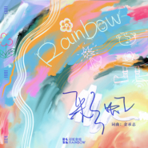 彩虹（十周年纪念版）](./albums/5022157471.md) | 国语 | StreetVoice, 西瓜山 | 2020年12月16日 | EP, 单曲 | 国语流行 Mandarin Pop |
| [ 路](./albums/5022179122.md) | 国语 | Go East Music Entertainment Consulting Limited | 2020年12月11日 | EP, 单曲 | 古典跨界 Classical Crossover |
| [ 我认识两个你](./albums/5021849546.md) | 国语 | StreetVoice, 西瓜山 | 2020年11月13日 | EP, 单曲 | 国语流行 Mandarin Pop |
| [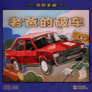 老爸的破车 - 现场版](./albums/5020797959.md) | 国语 | StreetVoice, 西瓜山 | 2020年06月21日 | 现场专辑 | 国语流行 Mandarin Pop, 合唱团 Choral |
| [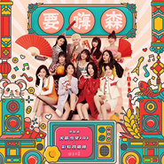 要嗨森](./albums/2105750766.md) | 国语 | 哇唧唧哇 | 2020年01月17日 | EP, 单曲 |  |
| [ 陪我去趟莫斯科](./albums/2105703933.md) | 国语 | 自在天浩 | 2020年01月10日 | 录音室专辑 | 国语流行 Mandarin Pop |
| [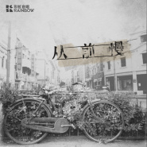 从前慢 - 现场版](./albums/2105599694.md) | 国语 | StreetVoice, 西瓜山 | 2019年12月21日 | 现场专辑 | 国语流行 Mandarin Pop |
| [ 亲亲我，我的小猫咪 - 现场版](./albums/2105529215.md) | 国语 | StreetVoice, 西瓜山 | 2019年12月06日 | 现场专辑 | 国语流行 Mandarin Pop |
| [ 塞伦盖蒂](./albums/2105450502.md) | 国语 | StreetVoice, 西瓜山 | 2019年11月26日 | EP, 单曲 | 国语流行 Mandarin Pop |
| [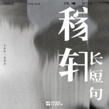 稼轩长短句 - 现场版](./albums/2105442995.md) | 国语 | StreetVoice, 西瓜山 | 2019年11月19日 | 现场专辑 | 国语流行 Mandarin Pop |
| [ 相遇](./albums/2105321857.md) | 国语 | StreetVoice, 西瓜山 | 2019年10月10日 | EP, 单曲 |  |
| [ 九月摇篮曲 - 现场版](./albums/2105233656.md) | 国语 | StreetVoice, 西瓜山 | 2019年09月25日 | 现场专辑 |  |
| [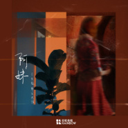 阿妹 - 现场版](./albums/2105167032.md) | 国语 | StreetVoice, 西瓜山 | 2019年09月05日 | 现场专辑 |  |
| [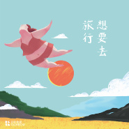 想要去旅行](./albums/2105059823.md) | 国语 | StreetVoice, 西瓜山 | 2019年08月21日 | EP, 单曲 |  |
| [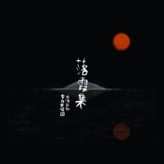 落霞集](./albums/2104962989.md) | 国语 | StreetVoice, 西瓜山 | 2019年06月30日 | EP, 单曲 | 国语流行 Mandarin Pop |
| [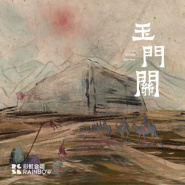 玉门关](./albums/2104870531.md) | 国语 | StreetVoice, 西瓜山 | 2019年05月21日 | EP, 单曲 | 国语流行 Mandarin Pop |
| [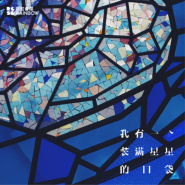 我有一个装满星星的口袋](./albums/2104840558.md) | 国语 | StreetVoice, 西瓜山 | 2019年05月06日 | EP, 单曲 | 国语流行 Mandarin Pop |
| [ 喝口水冷静一下](./albums/2104737311.md) | 国语 | StreetVoice, 西瓜山 | 2019年04月10日 | EP, 单曲 | 国语流行 Mandarin Pop |
| [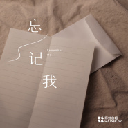 忘记我 - 现场版](./albums/2104732683.md) | 国语 | StreetVoice, 西瓜山 | 2019年04月01日 | 现场专辑 | 国语流行 Mandarin Pop |
| [ 来自外公的一封信 - 现场版](./albums/2104607895.md) | 国语 | StreetVoice, 西瓜山 | 2019年02月26日 | 现场专辑 | 国语流行 Mandarin Pop |
| [ 白马村游记](./albums/2104568582.md) | 国语 | StreetVoice, 西瓜山 | 2019年02月08日 | 录音室专辑 | 国语流行 Mandarin Pop |
| [ 绿叶菜里有什么 - 现场版](./albums/2104555845.md) | 国语 | StreetVoice, 西瓜山 | 2019年02月04日 | 现场专辑 | 国语流行 Mandarin Pop |
| [ 艺术就在你身边](./albums/2104255868.md) | 国语 | StreetVoice, 西瓜山 | 2018年11月23日 | EP, 单曲 | 国语流行 Mandarin Pop |
| [ 夏日安可](./albums/2103931593.md) | 国语 | 西瓜山, StreetVoice | 2018年08月20日 | 现场专辑 | 合唱团 Choral |
| [ 万能图书馆 剧集原声大碟](./albums/2103676053.md) | 纯音乐 | 西瓜山, StreetVoice | 2018年04月12日 | 原声带, 影视音乐 | 电视原声 Television Music |
| [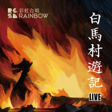 白马村游记 LIVE](./albums/2103650200.md) | 国语 | 西瓜山, StreetVoice | 2018年03月30日 | 现场专辑 | 人声合唱团 Vocal Group, 合唱团 Choral |
| [ 一家火锅店](./albums/2103604721.md) | 国语 | 西瓜山, StreetVoice | 2018年03月13日 | EP, 单曲 |  |
| [ 彩虹](./albums/2102974838.md) | 国语 | 西瓜山, StreetVoice | 2017年12月16日 | EP, 单曲 | 人声合唱团 Vocal Group |
| [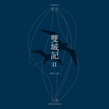 双城记 · II相泽直人部分](./albums/2102974824.md) | 日语 | 西瓜山, StreetVoice | 2017年12月16日 | 录音室专辑 | 人声合唱团 Vocal Group |
| [ 我要一桶礼物](./albums/2102972437.md) | 国语 | 西瓜山文化 | 2017年12月11日 | EP, 单曲 | 人声合唱团 Vocal Group |
| [ 水库](./albums/2102810522.md) | 国语 | 西瓜山, StreetVoice | 2017年08月08日 | EP, 单曲 | 人声合唱团 Vocal Group |
| [ 旅行者一号](./albums/2102810519.md) | 国语 | 西瓜山, StreetVoice | 2017年07月13日 | EP, 单曲 | 人声合唱团 Vocal Group |
| [ 告别时刻 - 现场版](./albums/2102772126.md) | 国语 | StreetVoice, 西瓜山 | 2017年06月16日 | EP, 单曲 | 合唱团 Choral |
| [ 魔都·魔都](./albums/2102757070.md) | 国语 | 独立发行 | 2017年06月01日 | EP, 单曲 | 合唱团 Choral |
| [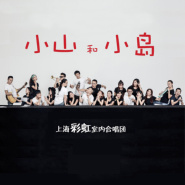 小山和小岛](./albums/2102748750.md) | 国语 | StreetVoice, 西瓜山 | 2017年05月16日 | EP, 单曲 | 人声合唱团 Vocal Group, 合唱团 Choral |
| [ 我喜欢](./albums/2102710806.md) | 国语 | 西瓜山, StreetVoice | 2017年03月12日 | EP, 单曲 |  |
| [ 向天再要500话](./albums/2102700122.md) | 国语 | 西瓜山文化 | 2017年02月24日 | EP, 单曲 |  |
| [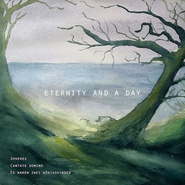 永恒与一日](./albums/2102693721.md) | 其他 | 独立发行 | 2017年02月15日 | 录音室专辑 | 合唱团 Choral, 古典音乐 Classical |
| [ 少年时代 - 现场版When I Was Young](./albums/2102684943.md) | 国语 | StreetVoice, 西瓜山 | 2017年01月24日 | 现场专辑 | 合唱团 Choral, 国语流行 Mandarin Pop |
| [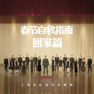 春节自救指南—回家篇](./albums/2102681923.md) | 国语 | 独立发行 | 2017年01月17日 | EP, 单曲 |  |
| [ 春节自救指南](./albums/2102681512.md) | 国语 | 西瓜山, StreetVoice | 2017年01月17日 | EP, 单曲 |  |
| [ 我有微能力](./albums/2102650866.md) | 国语 | 独立发行 | 2016年11月08日 | EP, 单曲 |  |
| [ 我就是这么诚实](./albums/2102641391.md) | 国语 | 独立发行 | 2016年10月30日 | EP, 单曲 |  |
| [ 「從天明到日暮」日文合唱作品集](./albums/2100389936.md) | 国语 | 独立发行 | 2016年09月09日 | 合集, 杂锦 |  |
| [ 捕获野生熊孩子 - 现场版](./albums/2100380686.md) | 国语 | StreetVoice, 西瓜山 | 2016年08月19日 | 现场专辑 |  |
| [ 感觉身体被掏空](./albums/2100372823.md) | 国语 | 西瓜山, StreetVoice | 2016年07月27日 | EP, 单曲 |  |
| [ 拥抱2016年6月@东艺现场](./albums/2100389942.md) | 国语 | 独立发行 | 2016年06月09日 | EP, 单曲 |  |
| [ 福禄寿喜](./albums/2100313064.md) | 国语 | 独立发行 | 2016年04月14日 | EP, 单曲 | 电视原声 Television Music, 人声合唱团 Vocal Group |
| [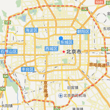 市歌 City Songs](./albums/2100389944.md) | 国语 | 独立发行 | 2016年04月10日 | EP, 单曲 |  |
| [ 躺在仲夏夜草坪上的拖拉机骑士](./albums/2100301220.md) | 国语 | 独立发行 | 2016年03月28日 | 录音室专辑 | 大乐队 Big Band, 合唱团 Choral, 国语流行 Mandarin Pop |
| [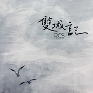 双城记](./albums/2100261054.md) | 国语 | 独立发行 | 2016年01月09日 | 现场专辑 | 合唱团 Choral |
| [ 泽雅集](./albums/2100261070.md) | 国语 | 独立发行 | 2016年01月09日 | 精选集 | 合唱团 Choral |
| [ 夏之歌日文作品专场 I (2015)](./albums/2100389948.md) | 国语 | 独立发行 | 2015年07月11日 | 合集, 杂锦 |  |

## 评论

|  |  |  |
| :-- | :-- | :-- |
|  [虾米用户](https://emumo.xiami.com/u/2781794) OK. I Will S... 2020-12-19 00:00 赞(1) 踩(0) | 
10岁快乐！
 |
|  [虾米用户](https://emumo.xiami.com/u/86348)  2020-12-16 12:33 赞(0) 踩(0) | 
保持安静 寿星许愿
 |
|  [虾米用户](https://emumo.xiami.com/u/7486037) 自己是自己的孩子 2020-12-16 11:07 赞(1) 踩(0) | 
今日明星夜 祝你生日快乐
 |
|  [虾米用户](https://emumo.xiami.com/u/14527722)  2020-12-16 10:44 赞(1) 踩(0) | 
改革春风吹满地，新的一年要争气
 |
|  [虾米用户](https://emumo.xiami.com/u/137006014) 我还没想好要写什么... 2020-12-16 10:23 赞(0) 踩(0) | 
喜欢你的音乐，也喜欢你的颜！会一直爱你的！
 |
|  [虾米用户](https://emumo.xiami.com/u/53718156) 盲目平淡喜欢一滴点波澜 2020-08-22 08:28 赞(0) 踩(0) | 
四年前！我的最爱啊！！！！！！
 |
|  [虾米用户](https://emumo.xiami.com/u/47494497) 李志、陈升，“虾米也没有... 2020-07-06 08:51 赞(0) 踩(0) | 
卡路里会上吗
 |
| ⇒ |  [虾米用户](https://emumo.xiami.com/u/426815601)  2020-11-17 09:16 赞(0) 踩(0) | 
炽热的我们里的歌应该都是腾讯版权吧
 |
|  [虾米用户](https://emumo.xiami.com/u/4369593) 爱这个美丽悲惨世界T_T 2020-05-27 20:56 赞(0) 踩(0) | 
我该怎么形容对你们的爱 
 |
|  [虾米用户](https://emumo.xiami.com/u/1565424)  2020-05-10 22:12 赞(0) 踩(0) | 
&amp;ldquo;整聋发聩&amp;rdquo;无极乐团。
 |
|  [虾米用户](https://emumo.xiami.com/u/97390914)  2020-05-09 19:01 赞(0) 踩(0) | 
&lt;[url=/u/3517390]@rabbit cat[/url] &gt;&lt;3517390&gt;
 |
|  [虾米用户](https://emumo.xiami.com/u/339952439) Living is Dy... 2020-04-05 18:22 赞(0) 踩(0) | 

 |
|  [虾米用户](https://emumo.xiami.com/u/304896641) 我以为…很好 2019-12-21 23:30 赞(1) 踩(0) | 
宝藏合唱团～偶尔很逗比很幽默，有时却又歌词温暖戳心，希望你们越来越好啊 
 |
|  [虾米用户](https://emumo.xiami.com/u/71478) 这里住着未在任何世界露脸... 2019-12-08 23:28 赞(0) 踩(0) | 
今天看完演出，虾米这里评论也太少了吧
 |
|  [虾米用户](https://emumo.xiami.com/u/29486832) 感谢虾米虾皮和虾仁 2019-11-18 21:33 赞(1) 踩(0) | 
孩子说她们要赶在高考前排合唱，选的曲目就是《夏天的梦是什么颜色的》。一听倾心，再听唏嘘…… 加油！
 |
|  [虾米用户](https://emumo.xiami.com/u/8337431) 以乐会友 2019-09-01 21:29 赞(0) 踩(0) | 
258
 |
|  [虾米用户](https://emumo.xiami.com/u/344018512) 我还没想好要写什么... 2019-08-14 18:54 赞(0) 踩(0) | 
有才有梗
 |
|  [虾米用户](https://emumo.xiami.com/u/276944698) 不要自我设限..... 2019-06-27 14:00 赞(1) 踩(0) | 
️
 |
|  [虾米用户](https://emumo.xiami.com/u/424624804) (•̩̩̩̩＿•̩̩̩̩... 2019-06-23 14:25 赞(0) 踩(0) | 
金承志这个疯子 
 |
|  [虾米用户](https://emumo.xiami.com/u/296789867) 气球 2019-05-09 07:31 赞(0) 踩(0) | 
真的很爱了 
 |
|  [虾米用户](https://emumo.xiami.com/u/178880074)  2019-05-01 09:18 赞(0) 踩(0) | 
我喜欢你 你应该也知道
 |
|  [虾米用户](https://emumo.xiami.com/u/10081975) weibo@winnin... 2019-04-23 10:39 赞(0) 踩(0) | 
就三个字，盼巡演
 |
|  [虾米用户](https://emumo.xiami.com/u/8070377) 爱雾瑞性维欧腐漏 2019-04-14 08:06 赞(2) 踩(0) | 
申请加入组织
 |
|  [虾米用户](https://emumo.xiami.com/u/216867) 无垠无涯的蓝 2019-04-13 20:02 赞(0) 踩(0) | 
没有演出信息吗
 |
|  [虾米用户](https://emumo.xiami.com/u/407709366) 我要向你们证明。我才是真... 2019-03-25 20:37 赞(0) 踩(0) | 
永远爱彩虹合唱团。
 |
|  [虾米用户](https://emumo.xiami.com/u/7508403)  2019-03-01 08:37 赞(1) 踩(0) | 
因为每日推荐曲里有《我喜欢》这首歌而来，在删除一溜傻歌傻曲的过程中一时下不了决心。因为它是上海的，就来看看，不料听了好几曲。 排位第一、二位的听了个开头就shut了，没笑过，chaos有点弥漫。 倒是第三第四第五顺耳很多。 排位第二的神曲不看歌词会以为贝多芬在唱高尔基家的海鸥……笑场滴不要 如此，排位第一的掏空曲改作咏叹调会装得更顺……你要的那种市侩的庄严感。。。 彩虹是平的……这是我对合唱团声音的感觉 金同学是有才的。
 |
|  [虾米用户](https://emumo.xiami.com/u/407709366) 我要向你们证明。我才是真... 2019-02-26 20:35 赞(0) 踩(0) | 
终于找到我喜欢听的歌曲了。彩虹合唱团真的很不错。我喜欢听你们的歌曲。真的很好听。我永远支持你们！彩虹合唱团。加油！
 |
|  [虾米用户](https://emumo.xiami.com/u/4227119) 嘿嘿 2019-02-26 02:20 赞(0) 踩(0) | 
好想听他们在台湾唱的祝福！
 |
|  [虾米用户](https://emumo.xiami.com/u/407709366) 我要向你们证明。我才是真... 2019-02-23 07:14 赞(0) 踩(0) | 
他们的歌曲我最喜欢听啦。
 |
|  [虾米用户](https://emumo.xiami.com/u/4220444) 热爱生活吧！因为你活着！ 2019-02-18 17:04 赞(0) 踩(0) | 
看了视频找到了这个
 |
|  [虾米用户](https://emumo.xiami.com/u/266348648) 爱好古典、粤语歌、日语老... 2019-02-17 15:05 赞(0) 踩(0) | 
非常希望能来武汉演出
 |
| ⇒ |  [虾米用户](https://emumo.xiami.com/u/904830) 白日梦蓝 2019-05-13 21:01 赞(0) 踩(0) | 
4.13已经来过啦
 |
| ⇒ |  [虾米用户](https://emumo.xiami.com/u/266348648) 爱好古典、粤语歌、日语老... 2019-05-13 22:28 赞(0) 踩(0) | 
<q><b>BlisS说：</b></q>
 |
|  [虾米用户](https://emumo.xiami.com/u/711973) 风雨同船，晴天便各自散了 2019-01-23 12:09 赞(0) 踩(0) | 
九月摇篮曲什么时候出
 |
|  [虾米用户](https://emumo.xiami.com/u/11979517) xj 2018-11-29 22:51 赞(0) 踩(0) | 
歌词好魔性……
 |
|  [虾米用户](https://emumo.xiami.com/u/18735656)  2018-11-18 01:02 赞(0) 踩(0) | 
太，好，听，了
 |
|  [虾米用户](https://emumo.xiami.com/u/34253719)   2018-10-12 15:53 赞(2) 踩(0) | 
66666
 |
|  [虾米用户](https://emumo.xiami.com/u/86271100) No history  ... 2018-09-30 16:10 赞(1) 踩(0) | 
怎么取消，不喜欢听了，还特么往我信箱里发消息？
 |
|  [虾米用户](https://emumo.xiami.com/u/305931416)  2018-09-26 15:27 赞(1) 踩(0) | 
很喜欢你们的《水库》，先抑后扬，最后听得非常洒脱。谢谢你们，期待有更好的作品！
 |
|  [虾米用户](https://emumo.xiami.com/u/79933416)  2018-09-25 15:00 赞(0) 踩(0) | 
彩虹合唱团，想买你们演唱的作品《祝福》不知怎么买到，谢谢！
 |
|  [虾米用户](https://emumo.xiami.com/u/79933416)  2018-09-25 15:00 赞(0) 踩(0) | 
彩虹合唱团，想买你们演唱的作品《祝福》不知怎么买到，谢谢！
 |
|  [虾米用户](https://emumo.xiami.com/u/71446596)  2018-09-22 12:15 赞(0) 踩(0) | 
怎么才能看到他们的现场呢
 |
|  [虾米用户](https://emumo.xiami.com/u/31248)  2018-09-02 11:11 赞(0) 踩(0) | 
能和大老师合作一个嘛？ 
 |
|  [虾米用户](https://emumo.xiami.com/u/867083) 我还没想好要写什么... 2018-08-23 10:47 赞(1) 踩(0) | 
期待《落霞集》
 |
|  [虾米用户](https://emumo.xiami.com/u/341903878) 红尘炼心 2018-08-20 21:48 赞(1) 踩(0) | 
请问贵团有没有考虑过音乐剧，众筹的话我砸锅卖铁
 |
| ⇒ |  [虾米用户](https://emumo.xiami.com/u/8491546)   2018-09-25 08:43 赞(0) 踩(0) | 
白马村游记第六首《西山雨》， 已经有像老舍《茶馆》一样众生相的现场表演。可以去看看MV呢哈哈
 |
| ⇒ |  [虾米用户](https://emumo.xiami.com/u/341903878) 红尘炼心 2018-10-15 07:21 赞(0) 踩(0) | 
<q><b>文说：</b></q>
 |
|  [虾米用户](https://emumo.xiami.com/u/250650982)  2018-08-20 20:49 赞(0) 踩(0) | 
好爱这个团  
 |
|  [虾米用户](https://emumo.xiami.com/u/104395674) 我还没想好要写什么... 2018-08-19 12:44 赞(0) 踩(0) | 
这是不是不撸帝上面，那个gay的合唱团
 |
| ⇒ |  [虾米用户](https://emumo.xiami.com/u/343890061) 准备整理整理歌了。 2018-10-15 13:08 赞(0) 踩(0) | 
不是
 |
|  [虾米用户](https://emumo.xiami.com/u/268255720) 我还没想好要写什么... 2018-08-11 19:58 赞(1) 踩(0) | 
呵呵
 |
|  [虾米用户](https://emumo.xiami.com/u/319780) 平凡的生活变得热气腾腾 2018-08-11 13:54 赞(2) 踩(0) | 
有趣的灵魂
 |
|  [虾米用户](https://emumo.xiami.com/u/2591642) 空有长河 2018-07-23 19:32 赞(3) 踩(0) | 
期待《落霞集》
 |
|  [虾米用户](https://emumo.xiami.com/u/6789129) 纽约大农村人 2018-07-20 11:09 赞(0) 踩(0) | 
简直全单循环播放。。。
 |
|  [虾米用户](https://emumo.xiami.com/u/355571845) 仙气☁︎ 2018-06-14 20:05 赞(1) 踩(0) | 
跑男来的举个爪子
 |
|  [虾米用户](https://emumo.xiami.com/u/2834324) 杂 2018-06-11 21:57 赞(0) 踩(0) | 
吃了一席的一记安利
 |
|  [虾米用户](https://emumo.xiami.com/u/256903747)  2018-06-08 03:08 赞(1) 踩(0) | 
2年前玩命说一首返场不算什么的热评看到现在越来越放飞自我的彩虹是什么心情&amp;hellip;&amp;hellip;合唱随便一个返场也是台下多少人排练和乐队配合，怎么可能是随便选的歌&amp;hellip;&amp;hellip;
 |
|  [虾米用户](https://emumo.xiami.com/u/343690072)  2018-05-11 17:58 赞(0) 踩(0) | 
我爱金承志！！！希望彩虹多开音乐会。
 |
|  [虾米用户](https://emumo.xiami.com/u/364480177)  2018-05-07 22:33 赞(0) 踩(0) | 
我喜欢呢？
 |
|  [虾米用户](https://emumo.xiami.com/u/172641238) 喜欢和你共处的时光、 2018-04-02 22:23 赞(16) 踩(0) | 
上海室内合唱团，怎么说呢，就是一本正经的唱着各种段子，然后还特好听
 |
|  [虾米用户](https://emumo.xiami.com/u/348784598)  2018-03-16 20:25 赞(0) 踩(0) | 
网易云彩虹的歌比较多
 |
|  [虾米用户](https://emumo.xiami.com/u/336579290)  2018-01-06 11:03 赞(0) 踩(0) | 
666
 |
|  [虾米用户](https://emumo.xiami.com/u/47166762) Darkness is ... 2017-12-30 15:49 赞(1) 踩(0) | 
太可爱了吧
 |
|  [虾米用户](https://emumo.xiami.com/u/17146554) weibo：@L1RRO... 2017-12-17 22:45 赞(1) 踩(0) | 
喜欢
 |
|  [虾米用户](https://emumo.xiami.com/u/276802782)   2017-12-16 08:20 赞(2) 踩(0) | 
生日快乐
 |
|  [虾米用户](https://emumo.xiami.com/u/238249791) 循规蹈矩症候群 2017-11-30 21:14 赞(3) 踩(0) | 
求你们上架 我喜欢
 |
|  [虾米用户](https://emumo.xiami.com/u/1368404) 我还没想好要写什么... 2017-11-16 20:12 赞(4) 踩(0) | 
就是传说中的一本正经在胡说八道
 |
|  [虾米用户](https://emumo.xiami.com/u/125874788) 我还没想好要写什么... 2017-10-30 21:20 赞(0) 踩(0) | 
英雄联盟曲子哪去了？
 |
|  [虾米用户](https://emumo.xiami.com/u/11663860)  2017-10-28 23:25 赞(0) 踩(0) | 
必须点赞！这么有创意的合唱团
 |
|  [虾米用户](https://emumo.xiami.com/u/5050538)   2017-10-28 00:43 赞(0) 踩(0) | 
最近喜欢他58秒95
 |
|  [虾米用户](https://emumo.xiami.com/u/325784033)  2017-10-17 11:26 赞(0) 踩(0) | 
我是你们的脑残粉
 |
|  [虾米用户](https://emumo.xiami.com/u/34593165) 我还没想好要写什么... 2017-10-15 00:54 赞(0) 踩(0) | 
真的好听
 |
|  [虾米用户](https://emumo.xiami.com/u/262867384)  2017-10-05 08:50 赞(0) 踩(0) | 
告别时刻真的好听。
 |
|  [虾米用户](https://emumo.xiami.com/u/202918708)  2017-08-18 14:20 赞(0) 踩(0) | 
喜欢你没道理
 |
|  [虾米用户](https://emumo.xiami.com/u/3749751) 白天是夜晚的仆从 2017-08-15 18:31 赞(0) 踩(0) | 
很喜欢类似他们和精气神这样的。
 |
|  [虾米用户](https://emumo.xiami.com/u/52516702)  2017-08-12 22:12 赞(0) 踩(0) | 
期待水库哈哈哈
 |
|  [虾米用户](https://emumo.xiami.com/u/281454456)  2017-08-12 20:17 赞(0) 踩(0) | 
94喜欢
 |
|  [虾米用户](https://emumo.xiami.com/u/298635831) 我不想写嘿嘿 2017-08-12 15:34 赞(0) 踩(0) | 
水库水库快上线恩
 |
|  [虾米用户](https://emumo.xiami.com/u/229490650) 就像他在游戏中所追求的排... 2017-07-29 15:43 赞(1) 踩(0) | 
一个非常奇怪似乎又有些不务正业的民间组织
 |
|  [虾米用户](https://emumo.xiami.com/u/180943752) 只愿为你守候，爱你TF。... 2017-07-02 12:55 赞(0) 踩(0) | 
一种感觉，黑社会性质的一首歌。奇奇怪怪的组织。
 |
|  [虾米用户](https://emumo.xiami.com/u/318337) 永远的天才 2017-06-29 11:02 赞(0) 踩(0) | 
电影之城什么时候有音频呢
 |
|  [虾米用户](https://emumo.xiami.com/u/272044987)  2017-06-28 15:05 赞(0) 踩(0) | 
动心动情
 |
|  [虾米用户](https://emumo.xiami.com/u/28961150) 暂无签名~ 2017-06-25 07:19 赞(0) 踩(0) | 
我喜欢
 |
|  [虾米用户](https://emumo.xiami.com/u/7379793) 夏季最棒了 2017-06-13 00:15 赞(0) 踩(0) | 
最近可有演出？
 |
|  [虾米用户](https://emumo.xiami.com/u/3652492)  2017-06-11 13:24 赞(1) 踩(0) | 
哪里可以听到团歌 彩虹，真的很好听
 |
|  [虾米用户](https://emumo.xiami.com/u/91110882) 音乐是水 文字是船 by... 2017-06-05 10:10 赞(1) 踩(0) | 
突然发现彩虹像是中国版Rising Star，Nodame的迷妹飘过
 |
|  [虾米用户](https://emumo.xiami.com/u/3055266) 喜欢纯粹音乐的我们又是注... 2017-06-05 09:29 赞(2) 踩(0) | 
真的非常非常喜欢这么一直能够代表上海特色的，高雅又不失调皮的新新交响乐团，非常棒！
 |
|  [虾米用户](https://emumo.xiami.com/u/25888293)   2017-06-04 21:47 赞(2) 踩(0) | 
怎么会没有那首《彩虹》
 |
|  [虾米用户](https://emumo.xiami.com/u/58293378) 仙女味的猪◡ູ̮̮̈  2017-06-04 17:30 赞(1) 踩(0) | 
真的很特别  高手在民间
 |
|  [虾米用户](https://emumo.xiami.com/u/3616)  2017-06-04 13:18 赞(0) 踩(0) | 
hahah\\\\\\\\神秘民间组织
 |
|  [虾米用户](https://emumo.xiami.com/u/49443446)  2017-06-03 15:41 赞(1) 踩(0) | 
我靠这个组合有点酷
 |
|  [虾米用户](https://emumo.xiami.com/u/9603547) 快要退出ACG领域了 2017-06-03 15:40 赞(0) 踩(0) | 
我还以为和东方Project有关
 |
| ⇒ |  [虾米用户](https://emumo.xiami.com/u/9539916) 桃李不言，下自成蹊。 2017-06-08 01:26 赞(0) 踩(0) | 
上海爱丽丝室内乐团
 |
|  [虾米用户](https://emumo.xiami.com/u/201391232) 最快的方法是先抱抱 2017-06-03 13:28 赞(1) 踩(0) | 

 |
|  [虾米用户](https://emumo.xiami.com/u/42931014)  2017-06-03 00:54 赞(1) 踩(0) | 
感覺很接地氣，喜歡。
 |
|  [虾米用户](https://emumo.xiami.com/u/108264720)   2017-06-02 12:11 赞(1) 踩(0) | 
没想到你们是这样的合唱团
 |
| ⇒ |  [虾米用户](https://emumo.xiami.com/u/257489716)  2017-06-02 16:17 赞(0) 踩(0) | 
llllllll鲍]l%lllllll%
 |
|  [虾米用户](https://emumo.xiami.com/u/52056952) 人生即是到來、相遇、陪伴... 2017-06-02 11:50 赞(0) 踩(0) | 

 |
|  [虾米用户](https://emumo.xiami.com/u/3817709) 电视柜音乐人 2017-05-22 01:47 赞(27) 踩(0) | 
怎么加入该组织？
 |
| ⇒ |  [虾米用户](https://emumo.xiami.com/u/180943752) 只愿为你守候，爱你TF。... 2017-07-02 12:57 赞(0) 踩(0) | 
呃，怎么可能加入的了？
 |
| ⇒ |  [虾米用户](https://emumo.xiami.com/u/44384518) なぜ私の動き決まられる!... 2018-08-21 13:22 赞(0) 踩(0) | 
原来貌似看到过招募，在他们公众号上，可以投简历，不过是好久以前看见了的
 |
|  [虾米用户](https://emumo.xiami.com/u/29215615) ≥﹏≤ 2017-05-21 00:34 赞(0) 踩(0) | 
合唱唱出不同的感受啊。。(/≧▽≦)/~┴┴
 |
|  [虾米用户](https://emumo.xiami.com/u/226165199)  2017-05-13 12:54 赞(0) 踩(0) | 
没有五月天的那首吗 
 |
|  [虾米用户](https://emumo.xiami.com/u/999506)  2017-04-27 21:45 赞(2) 踩(0) | 
原！来！在！虾！米！有！啊！！！
 |
|  [虾米用户](https://emumo.xiami.com/u/4222857)  2017-04-20 17:27 赞(1) 踩(0) | 
合唱团
 |
|  [虾米用户](https://emumo.xiami.com/u/17278781)  2017-04-07 11:15 赞(1) 踩(0) | 
心声
 |
|  [虾米用户](https://emumo.xiami.com/u/5069025) 故事重新开始。 2017-04-02 21:05 赞(1) 踩(0) | 
有趣
 |
|  [虾米用户](https://emumo.xiami.com/u/52853129) 最爱BIGBANG 2017-03-26 22:44 赞(4) 踩(0) | 
金承志写的歌总是那么搞笑，哈哈
 |
|  [虾米用户](https://emumo.xiami.com/u/4483) 聽歌，做夢，想念。 2017-03-15 08:53 赞(3) 踩(0) | 
我需要团歌～
 |
| ⇒ |  [虾米用户](https://emumo.xiami.com/u/279836809)  2017-04-04 18:04 赞(0) 踩(0) | 
这就是啊，
 |
|  [虾米用户](https://emumo.xiami.com/u/49058940) 孤岛 2017-03-13 05:02 赞(1) 踩(0) | 
奇怪 为什么和网易上的歌如此不同
 |
|  [虾米用户](https://emumo.xiami.com/u/91110882) 音乐是水 文字是船 by... 2017-03-06 08:37 赞(1) 踩(0) | 
彩虹，你们什么时候来的虾米的，没有一点防备，你们就这样出现在我的歌单里了？
 |
|  [虾米用户](https://emumo.xiami.com/u/3466281)  2017-03-04 13:40 赞(1) 踩(0) | 
当作合唱小品来欣赏
 |
|  [虾米用户](https://emumo.xiami.com/u/197279528)  2017-02-24 22:21 赞(0) 踩(0) | 
好棒
 |
|  [虾米用户](https://emumo.xiami.com/u/273559194)  2017-02-15 09:30 赞(0) 踩(0) | 
好听
 |
|  [虾米用户](https://emumo.xiami.com/u/5449843) 虾听听 2017-02-07 17:29 赞(2) 踩(0) | 
没觉得哪里搞笑，也没觉得哪里好听...
 |
| ⇒ |  [虾米用户](https://emumo.xiami.com/u/334895430) 我还没想好要写什么... 2018-11-02 21:32 赞(0) 踩(0) | 
不懂合唱，就别bibi
 |
|  [虾米用户](https://emumo.xiami.com/u/231528674)  2017-02-03 02:23 赞(1) 踩(0) | 
祝愈来愈好ε٩(๑&amp;gt; ₃ &amp;lt;)۶ з
 |
|  [虾米用户](https://emumo.xiami.com/u/230803304) 三观正又爱国的成都宝藏男... 2017-02-01 22:38 赞(0) 踩(0) | 
支持一下他们 他们也是不容易的 祝他们新年快乐
 |
|  [虾米用户](https://emumo.xiami.com/u/55076081) 将虾米头像弄成屁股照片的... 2017-01-29 00:24 赞(0) 踩(0) | 
还局限于听歌词的地步啊
 |
|  [虾米用户](https://emumo.xiami.com/u/45483446) 暂无签名~ 2017-01-28 23:46 赞(0) 踩(0) | 
好棒！对合唱开始很有兴趣啦
 |
|  [虾米用户](https://emumo.xiami.com/u/4869044) 朋友们再见啦：），祝你们... 2017-01-27 15:39 赞(3) 踩(0) | 
哗众取宠
 |
| ⇒ |  [虾米用户](https://emumo.xiami.com/u/228329508) 我们追逐光明，但眼前一片... 2017-03-18 17:46 赞(0) 踩(0) | 
同意
 |
|  [虾米用户](https://emumo.xiami.com/u/14367248) 怎样深的夜？来一桶威尔士... 2017-01-26 20:37 赞(0) 踩(0) | 
hhahaha
 |
|  [虾米用户](https://emumo.xiami.com/u/26216447) 谢谢你亲爱的 2017-01-25 22:44 赞(1) 踩(0) | 
带着爱的作品
 |
|  [虾米用户](https://emumo.xiami.com/u/68807)  2017-01-24 13:38 赞(0) 踩(0) | 
刚听了《外婆》，听哭了
 |
|  [虾米用户](https://emumo.xiami.com/u/117562328) Be better to... 2017-01-24 03:39 赞(0) 踩(0) | 
神秘民间组织哈哈哈哈哈哈 
 |
|  [虾米用户](https://emumo.xiami.com/u/32313785) 丧偶。 2017-01-20 13:45 赞(1) 踩(0) | 
团歌彩虹呢？
 |
|  [虾米用户](https://emumo.xiami.com/u/12221090) 逍遥于天地而心意自得 2017-01-19 17:34 赞(0) 踩(0) | 
赞
 |
|  [虾米用户](https://emumo.xiami.com/u/4047883) Hi~ 2017-01-18 20:43 赞(3) 踩(0) | 
感谢这个团带来的另一个可以告慰自己的美好安静的精神世界。想在虾米里找你们的团歌呀，找不到 
 |
|  [虾米用户](https://emumo.xiami.com/u/246214149)  2017-01-18 13:32 赞(1) 踩(0) | 
有意思极了。
 |
|  [虾米用户](https://emumo.xiami.com/u/341091) 偶爱我们呢~ 2017-01-18 11:27 赞(2) 踩(0) | 
业余音乐人不为了唱点自己喜欢的歌还能指望点什么开心？而且他们唱正经的歌也还不错
 |
|  [虾米用户](https://emumo.xiami.com/u/242730969)  2017-01-16 22:26 赞(3) 踩(0) | 
合唱真的炒鸡好听啊，这个团做的真的不错。艺术也不是只有严肃的一面，偶尔的嬉笑怒骂讨喜又可爱。
 |
|  [虾米用户](https://emumo.xiami.com/u/122688364) 生在愤坑，长在赤圈；挣脱 2017-01-06 15:12 赞(0) 踩(0) | 
7084
 |
|  [虾米用户](https://emumo.xiami.com/u/12757267) 一见虾米误终身 2016-12-28 18:47 赞(0) 踩(0) | 
 
 |
|  [虾米用户](https://emumo.xiami.com/u/50272650) 看完就想打自己 2016-12-22 00:53 赞(28) 踩(0) | 
只是歌词搞笑 其他的没有在搞笑
 |
|  [虾米用户](https://emumo.xiami.com/u/1895474) 再见 虾米 现在我不能像... 2016-12-01 07:07 赞(0) 踩(0) | 
感谢张士超
 |
|  [虾米用户](https://emumo.xiami.com/u/32558701) bo ku wa～虛菩提... 2016-10-16 08:36 赞(0) 踩(0) | 
今早上新闻了
 |
|  [虾米用户](https://emumo.xiami.com/u/7144481) 我还没想好要写什么... 2016-10-06 15:53 赞(8) 踩(0) | 
国内难得出现的优秀合唱团
 |
|  [虾米用户](https://emumo.xiami.com/u/15986466) 你长大了，学会不说话了。 2016-10-01 14:35 赞(3) 踩(0) | 
合唱界的段子手哈哈哈哈哈哈哈
 |
|  [虾米用户](https://emumo.xiami.com/u/7609471)  2016-09-28 16:22 赞(4) 踩(0) | 
这种一本正经的神经病合唱团真的是听得朕龙心大悦啊！！！
 |
|  [虾米用户](https://emumo.xiami.com/u/38511028)  2016-09-08 12:26 赞(3) 踩(0) | 
求团歌彩虹！ 
 |
|  [虾米用户](https://emumo.xiami.com/u/192318551) 我还没想好要写什么... 2016-09-02 22:50 赞(3) 踩(0) | 
求五月天的《擁抱》！歌唱巨好聽啊
 |
|  [虾米用户](https://emumo.xiami.com/u/85148548)  2016-08-30 22:17 赞(1) 踩(0) | 
666
 |
|  [虾米用户](https://emumo.xiami.com/u/8226204) ≡ 2016-08-29 10:02 赞(2) 踩(0) | 
想听合唱版拥抱_(:з」∠)_
 |
|  [虾米用户](https://emumo.xiami.com/u/45301432)  2016-08-22 10:51 赞(0) 踩(0) | 
有趣有趣真有趣，听的我脸上全是笑但又觉得真心好听。
 |
|  [虾米用户](https://emumo.xiami.com/u/34290493)   2016-08-21 23:00 赞(0) 踩(0) | 
又好听又好笑！
 |
|  [虾米用户](https://emumo.xiami.com/u/44206889) kms 2016-08-21 20:54 赞(0) 踩(0) | 
hhhh
 |
|  [虾米用户](https://emumo.xiami.com/u/168067836) 听见世界 2016-08-21 18:53 赞(3) 踩(0) | 
好好听，很专业，来源于生活，升华在合唱里。没有什么不好。大俗大雅。太高雅的普通人也听不懂，大家说好听，就是好作品。不比那个什么小鸡小鸡和伤不起好多了？
 |
|  [虾米用户](https://emumo.xiami.com/u/37289465) 切切切 2016-08-21 01:44 赞(1) 踩(0) | 
一帮长起来的熊孩子～
 |
|  [虾米用户](https://emumo.xiami.com/u/99625906)  2016-08-19 23:31 赞(0) 踩(0) | 
一本正经的胡扯八道
 |
|  [虾米用户](https://emumo.xiami.com/u/7225022) 听听歌拍拍照. 2016-08-19 12:29 赞(0) 踩(0) | 
没有彩虹
 |
|  [虾米用户](https://emumo.xiami.com/u/177144224)   2016-08-19 10:12 赞(2) 踩(0) | 
泽雅集超好听！信我！
 |
|  [虾米用户](https://emumo.xiami.com/u/1126943)  2016-08-17 12:14 赞(1) 踩(0) | 
消费级的娱乐 浪费社会资源 反映出中国人的无聊和闲 希望火了之后可以更有力的推出ni们真正想表达的作品 呵呵。。
 |
| ⇒ |  [虾米用户](https://emumo.xiami.com/u/207339718)  2016-11-25 04:10 赞(0) 踩(0) | 
现在就有啊，可以去听泽雅集，并且关注即将推出的落霞集
 |
| ⇒ |  [虾米用户](https://emumo.xiami.com/u/1126943)  2016-11-25 11:03 赞(0) 踩(0) | 
<q><b>tcayc2010说：</b></q>
 |
|  [虾米用户](https://emumo.xiami.com/u/1434121)  2016-08-14 00:36 赞(4) 踩(0) | 
其实 金承志是个正经音乐人。
 |
|  [虾米用户](https://emumo.xiami.com/u/72666568)  2016-08-05 20:59 赞(0) 踩(0) | 
笑哭了
 |
|  [虾米用户](https://emumo.xiami.com/u/188196406) 喜歡獨單 2016-08-05 16:51 赞(1) 踩(0) | 
毫无营养的歌词
 |
|  [虾米用户](https://emumo.xiami.com/u/2844718)  2016-08-05 13:18 赞(0) 踩(0) | 
就是喜欢
 |
|  [虾米用户](https://emumo.xiami.com/u/11859528) 总有一些事情值得奋斗 2016-08-04 23:25 赞(1) 踩(0) | 
神曲
 |
|  [虾米用户](https://emumo.xiami.com/u/24817130)  2016-08-03 14:23 赞(0) 踩(0) | 
你好搞笑
 |
|  [虾米用户](https://emumo.xiami.com/u/96182404) 微博气人博主 2016-08-02 21:48 赞(1) 踩(0) | 
怎么没有五月天的拥抱
 |
|  [虾米用户](https://emumo.xiami.com/u/13230048) 勇敢面对不可知的未来吧~ 2016-08-02 19:42 赞(1) 踩(0) | 
上海彩虹室内合唱团
 |
|  [虾米用户](https://emumo.xiami.com/u/1559338) What? 2016-08-02 09:33 赞(0) 踩(0) | 
团歌为啥没有 
 |
|  [虾米用户](https://emumo.xiami.com/u/155947) 一期一会 2016-08-02 07:46 赞(0) 踩(0) | 
金首指你好！
 |
|  [虾米用户](https://emumo.xiami.com/u/1504290)  2016-08-02 06:35 赞(0) 踩(0) | 
什么时候上传拥抱啊
 |
|  [虾米用户](https://emumo.xiami.com/u/14480478) Aimu-Lokid 2016-07-30 12:21 赞(0) 踩(0) | 
这边的彩虹的歌不多呢，合唱团自己原创的其他的也很好听～
 |
|  [虾米用户](https://emumo.xiami.com/u/2202110) 作梦中梦 悟身外身 2016-07-29 23:17 赞(1) 踩(0) | 
一本正经 
 |
|  [虾米用户](https://emumo.xiami.com/u/8252954)   2016-07-29 20:36 赞(1) 踩(0) | 
我爱你们爱你们！什么时候音乐会！我送钱去！！
 |
|  [虾米用户](https://emumo.xiami.com/u/43817902) 凶得狠 2016-07-29 16:49 赞(3) 踩(0) | 
如果你们来重庆演出，我保证买票！我把话撂这儿了，敢不敢来？
 |
|  [虾米用户](https://emumo.xiami.com/u/200126199)  2016-07-28 14:02 赞(2) 踩(0) | 
这个团有毒，如果连着视频一边看一边听，从此中毒便更加无解，唯有好好欣赏好好爱上方可解毒
 |
|  [虾米用户](https://emumo.xiami.com/u/4991340) Utilized  2016-07-28 13:35 赞(2) 踩(0) | 
答应我去听现场。 好听的不只张士超和感觉身体被掏空。  其他的也超级好听。  
 |
|  [虾米用户](https://emumo.xiami.com/u/41356503) 留不下，便让他走。 2016-07-28 11:43 赞(2) 踩(0) | 
快点巡演～
 |
|  [虾米用户](https://emumo.xiami.com/u/379141) 梦寐以求，是真爱和自由。 2016-07-28 11:02 赞(1) 踩(0) | 
张士超你昨天晚上到底把我家钥匙放哪里了！
 |
|  [虾米用户](https://emumo.xiami.com/u/9723179) Will be 2016-07-28 10:17 赞(2) 踩(0) | 
请告诉我报名参加的方式!!!
 |
|  [虾米用户](https://emumo.xiami.com/u/60939926) 1111 2016-07-28 08:49 赞(0) 踩(0) | 
我真的很喜欢这个团 唱的时候没有笑哈哈哈哈哈哈
 |
|  [虾米用户](https://emumo.xiami.com/u/8070377) 爱雾瑞性维欧腐漏 2016-07-28 01:04 赞(0) 踩(0) | 
89
 |
|  [虾米用户](https://emumo.xiami.com/u/1231812) 我还没想好要写什么... 2016-07-28 00:48 赞(0) 踩(0) | 
目测会火
 |
|  [虾米用户](https://emumo.xiami.com/u/8866457) 你從未與夜晚降臨。 2016-07-27 22:45 赞(0) 踩(0) | 
我顶！哈哈哈哈，这团好赞！
 |
|  [虾米用户](https://emumo.xiami.com/u/137334362) 我会跑起来 2016-07-27 19:48 赞(0) 踩(0) | 
鬼畜明星
 |
|  [虾米用户](https://emumo.xiami.com/u/248097)  2016-07-27 19:21 赞(0) 踩(0) | 
哪儿有演出信息呢？
 |
|  [虾米用户](https://emumo.xiami.com/u/45452251)  2016-07-27 18:35 赞(0) 踩(0) | 
啊啊啊这乐团设定太棒 
 |
|  [虾米用户](https://emumo.xiami.com/u/154388410) 机智 2016-07-27 16:46 赞(1) 踩(0) | 
好棒
 |
|  [虾米用户](https://emumo.xiami.com/u/6062459)  2016-07-27 14:39 赞(0) 踩(0) | 
找不到理由不熱愛
 |
|  [虾米用户](https://emumo.xiami.com/u/1717364) 突然喜欢喝青梅酒啊 2016-07-27 14:17 赞(0) 踩(0) | 
哈哈哈，有意思
 |
|  [虾米用户](https://emumo.xiami.com/u/185620721)  2016-07-27 11:27 赞(2) 踩(0) | 
人家是正经合唱团 
 |
|  [虾米用户](https://emumo.xiami.com/u/10890520) w\'s up! 2016-07-27 00:02 赞(3) 踩(0) | 
可以麻烦将拥抱的合唱版本上传吗？谢谢！❤️
 |
|  [虾米用户](https://emumo.xiami.com/u/80974378)  2016-07-09 15:30 赞(0) 踩(0) | 
彩虹超棒诶，每首歌都有喜欢，但是虾米木有拥抱，委屈脸つ﹏⊂
 |
|  [虾米用户](https://emumo.xiami.com/u/71127526) 无常逐一升起和熄灭，我对... 2016-07-04 09:16 赞(0) 踩(0) | 
想听彩虹！！
 |
|  [虾米用户](https://emumo.xiami.com/u/48276337) 22世纪不道德 2016-07-01 16:02 赞(0) 踩(0) | 
咻～
 |
|  [虾米用户](https://emumo.xiami.com/u/15516801) 暂无签名~ 2016-06-20 22:12 赞(1) 踩(0) | 
之前听过张士超 不过当时也没怎么记住这个团 上周日偶然机会去看了彩虹团的音乐会 就变成了迷妹一只 不管是什么歌曲都唱得好好听 听的时候都有点热泪盈眶 年轻有活力的团以后会继续关注呢
 |
|  [虾米用户](https://emumo.xiami.com/u/25616974) -以下内容需回复才可见- 2016-06-16 22:35 赞(2) 踩(0) | 
一个集技术与搞怪于一身的神秘民间组织
 |
|  [虾米用户](https://emumo.xiami.com/u/99666698) 造化隨順 風雅之誠 2016-06-14 23:45 赞(56) 踩(0) | 
我刚入驻了虾米音乐人，欢迎大家来我的个人主页，收听我的最新音乐
 |
| ⇒ |  [虾米用户](https://emumo.xiami.com/u/284703398) 就是爱听歌  2018-08-12 05:20 赞(0) 踩(0) | 
喜欢你们风格 很接地气嘛
 |
| ⇒ |  [虾米用户](https://emumo.xiami.com/u/79933416)  2018-09-25 15:02 赞(0) 踩(0) | 
你好彩虹合唱团，如何买到你们的合唱歌谱？特别喜欢你们唱的《祝福》！
 |
| ⇒ |  [虾米用户](https://emumo.xiami.com/u/79933416)  2018-09-25 15:11 赞(0) 踩(0) | 
我几乎每天听你们的新品，明天期盼你们的新歌，金承志指挥非常了不起！
 |
| ⇒ |  [虾米用户](https://emumo.xiami.com/u/10070082)  2018-11-16 14:15 赞(0) 踩(0) | 
怎么才能看到你们的演出哈？听了几首歌太有劲了！！超想看现场！ 
 |
|  [虾米用户](https://emumo.xiami.com/u/9743840) 愿余生醉溺于乐 2016-06-14 09:30 赞(0) 踩(0) | 
诚意满满。
 |
|  [虾米用户](https://emumo.xiami.com/u/9743840) 愿余生醉溺于乐 2016-06-11 09:29 赞(0) 踩(0) | 
很赞的合唱团
 |
|  [虾米用户](https://emumo.xiami.com/u/9743840) 愿余生醉溺于乐 2016-06-11 09:29 赞(0) 踩(0) | 
很赞的合唱团
 |
|  [虾米用户](https://emumo.xiami.com/u/36437914) WX：IXUS-- 2016-06-11 00:25 赞(0) 踩(0) | 
这个团有毒
 |
|  [虾米用户](https://emumo.xiami.com/u/5826855)  2016-06-07 22:57 赞(1) 踩(0) | 
团歌彩虹呢 
 |
|  [虾米用户](https://emumo.xiami.com/u/442865) one by one 2016-05-24 23:37 赞(0) 踩(0) | 
真诚
 |
|  [虾米用户](https://emumo.xiami.com/u/33526842) 乐手与人生 2016-05-14 03:41 赞(1) 踩(0) | 
大内密谈忠实听众观光团，请抱紧我！
 |
|  [虾米用户](https://emumo.xiami.com/u/42987134)  2016-04-24 00:13 赞(1) 踩(0) | 
想听彩虹 
 |
|  [虾米用户](https://emumo.xiami.com/u/10340126) 爵士乐好过正义 2016-04-15 08:31 赞(0) 踩(0) | 
既然不正经就玩到底吧！求搬北京市歌！
 |
|  [虾米用户](https://emumo.xiami.com/u/4758844)  2016-04-14 22:36 赞(0) 踩(0) | 
好听，喜欢
 |
|  [虾米用户](https://emumo.xiami.com/u/37905159)  2016-04-14 21:46 赞(0) 踩(0) | 
彩虹呢？为撒么彩虹？
 |
|  [虾米用户](https://emumo.xiami.com/u/45053056)  2016-04-13 10:18 赞(1) 踩(0) | 
事实证明，中国真的不缺人才，但好音乐就是发展不起来
 |
| ⇒ |  [虾米用户](https://emumo.xiami.com/u/6082125) Standing and... 2016-04-18 20:26 赞(0) 踩(0) | 
是啊 人才在框框里最后都被磨死了
 |
|  [虾米用户](https://emumo.xiami.com/u/8527949) it'Pop 2016-04-12 12:33 赞(1) 踩(0) | 
啊啊啊啊  五环
 |
|  [虾米用户](https://emumo.xiami.com/u/7829598)  2016-04-11 09:19 赞(0) 踩(0) | 
五环呢？
 |
|  [虾米用户](https://emumo.xiami.com/u/6232148) 在虾米坚持到最后一秒 2016-04-10 21:02 赞(1) 踩(0) | 
听了现场，心都要化了 
 |
|  [虾米用户](https://emumo.xiami.com/u/7784184)  2016-04-01 19:53 赞(0) 踩(0) | 
心悦诚服。
 |
|  [虾米用户](https://emumo.xiami.com/u/29681886)  2016-02-26 11:21 赞(0) 踩(0) | 
非常愉快的歌声
 |
|  [虾米用户](https://emumo.xiami.com/u/17806314) 以梦为马 以己为光 2016-02-24 17:15 赞(0) 踩(0) | 
_(:з」∠)_
 |
|  [虾米用户](https://emumo.xiami.com/u/606201)  2016-02-16 12:26 赞(1) 踩(0) | 
新古典民谣合唱团
 |
|  [虾米用户](https://emumo.xiami.com/u/2203566) 直到光芒将我带走 2016-02-15 18:34 赞(1) 踩(0) | 
『中国合唱作曲界相声一哥』『用吃奶的力气、炸观众一脸』
 |
|  [虾米用户](https://emumo.xiami.com/u/72802088) 这家伙很聪明什么也没留下... 2016-02-08 23:39 赞(11) 踩(0) | 
张士超只是他们的一首返场，不要凭这一首歌来评判他们好吗？你们都不听其他歌的？
 |
| ⇒ |  [虾米用户](https://emumo.xiami.com/u/284305860) 就如重新学做人，你比那过... 2020-02-02 01:21 赞(0) 踩(0) | 
确实是这首歌知道他们的，不过我最喜欢我有一个装满星星的口袋。
 |
|  [虾米用户](https://emumo.xiami.com/u/13075016)  ) (  2016-02-03 13:09 赞(58) 踩(0) | 
生活中，张士超是歌曲作者金承志的一个哥们，关系非常好。他们一起合租，还在上音读书，住到了五角场附近。  关于歌词内容，这是一件真实发生的糗事，当时金承志没带钥匙，结果找不到钥匙，给张士超打电话，他怎么也不接。这个曲子里的故事是源自生活，高于生活。但这最终是一个HappyEnding，张士超把钥匙给送回来了（后经张士超回忆是金承志自己打车去拿的钥匙，200多块钱）
 |
|  [虾米用户](https://emumo.xiami.com/u/99144762)   2016-01-31 13:32 赞(0) 踩(0) | 
哈哈哈哈哈哈
 |
|  [虾米用户](https://emumo.xiami.com/u/46256417) Peaceful Hea... 2016-01-31 09:09 赞(4) 踩(0) | 
彩虹呢 
 |
|  [虾米用户](https://emumo.xiami.com/u/5880168)   2016-01-30 10:08 赞(1) 踩(0) | 
一支有魔力的合唱团
 |
|  [虾米用户](https://emumo.xiami.com/u/85646192) 我还没想好要写什么... 2016-01-29 18:10 赞(3) 踩(0) | 
好想听团歌～彩虹呀，没有，泪
 |
|  [虾米用户](https://emumo.xiami.com/u/1570380)  2016-01-28 20:17 赞(1) 踩(0) | 
牛逼
 |
|  [虾米用户](https://emumo.xiami.com/u/4780500) 大概会搬去网易云 6mo... 2016-01-26 16:51 赞(2) 踩(0) | 
感谢张士超让我认识这个在用心做音乐的合唱团。
 |
|  [虾米用户](https://emumo.xiami.com/u/4039712)  2016-01-26 02:34 赞(0) 踩(0) | 
完完全全衝著【張士超】來的 別人都不好使
 |
|  [虾米用户](https://emumo.xiami.com/u/26453141)  2016-01-25 20:01 赞(7) 踩(0) | 
我第一眼还以为是上海爱丽丝幻乐团
 |
| ⇒ |  [虾米用户](https://emumo.xiami.com/u/41164388) 萌即是正义！！ 2016-03-03 03:49 赞(0) 踩(0) | 
看成上海爱丽丝幻乐团的你有多瞎www同好的路过~
 |
|  [虾米用户](https://emumo.xiami.com/u/50367270) 我太 2016-01-25 17:44 赞(0) 踩(0) | 
一本正经地搞笑
 |
|  [虾米用户](https://emumo.xiami.com/u/6784282)  2016-01-24 23:36 赞(1) 踩(0) | 
声音之美无限
 |
|  [虾米用户](https://emumo.xiami.com/u/1511706) Stillborn 2016-01-24 20:49 赞(1) 踩(0) | 
潸然泪下
 |
| ⇒ |  [虾米用户](https://emumo.xiami.com/u/2429410) 音乐是酒是茶，让人平静让... 2016-01-31 09:35 赞(0) 踩(0) | 
我听张世超真的哭了！不知懂你是不是？
 |
|  [虾米用户](https://emumo.xiami.com/u/3427121) 时光带走你，时光吞噬我。 2016-01-24 09:40 赞(0) 踩(0) | 
夕烧超级好听
 |
|  [虾米用户](https://emumo.xiami.com/u/6012897) 我还没想好要写什么... 2016-01-23 19:54 赞(0) 踩(0) | 
为什么不直接叫张士豪 
 |
|  [虾米用户](https://emumo.xiami.com/u/11643548)   2016-01-23 15:13 赞(1) 踩(0) | 
其他的歌也好棒
 |
|  [虾米用户](https://emumo.xiami.com/u/49922119) 古老的夜晚和远方的音乐是... 2016-01-23 11:32 赞(0) 踩(0) | 
很棒 
 |
|  [虾米用户](https://emumo.xiami.com/u/8265900)  2016-01-22 17:30 赞(2) 踩(0) | 
我也想参加。。。
 |
|  [虾米用户](https://emumo.xiami.com/u/43700627) 嗯 2016-01-22 17:14 赞(0) 踩(0) | 

 |
|  [虾米用户](https://emumo.xiami.com/u/1053410)  2016-01-22 17:06 赞(1) 踩(0) | 
魔性洗脑，一本正经地鬼畜了。
 |
|  [虾米用户](https://emumo.xiami.com/u/2326867) 耳朵太尖 2016-01-20 09:11 赞(106) 踩(0) | 
请不要只拿一首欢乐的返场来代表一个团
 |
|  [虾米用户](https://emumo.xiami.com/u/1270619)  2016-01-19 09:39 赞(0) 踩(0) | 
张士超
 |
|  [虾米用户](https://emumo.xiami.com/u/45424384) ：） 2016-01-18 22:09 赞(0) 踩(0) | 
厉害
 |
|  [虾米用户](https://emumo.xiami.com/u/9755013) やる気ないね 2016-01-18 21:02 赞(0) 踩(0) | 
不行太逗了2333
 |
|  [虾米用户](https://emumo.xiami.com/u/98660398)  2016-01-18 18:08 赞(1) 踩(0) | 
求加入
 |
|  [虾米用户](https://emumo.xiami.com/u/271546) 额哪有人看这个 2016-01-18 14:09 赞(0) 踩(0) | 
我那么有钱 一下配十把
 |
|  [虾米用户](https://emumo.xiami.com/u/92561556)  2016-01-18 10:58 赞(0) 踩(0) | 
来观光
 |
|  [虾米用户](https://emumo.xiami.com/u/26391343)  2016-01-18 10:35 赞(1) 踩(0) | 
：）     吓得我都方了~   可是张士超 你这个混蛋，你带着姑娘 去了闵行
 |
|  [虾米用户](https://emumo.xiami.com/u/1219018) 你好，我叫谢有君。估计大... 2016-01-18 01:02 赞(2) 踩(0) | 
我从来也不知道····原来合唱团也可以这样地表达音乐···我输了···输给了这个时代···
 |
|  [虾米用户](https://emumo.xiami.com/u/13951465)  2016-01-17 22:24 赞(0) 踩(0) | 
占坑～ 啦啦啦啦～
 |
|  [虾米用户](https://emumo.xiami.com/u/33514232) 喜欢来这里找我喜欢的 2016-01-17 17:28 赞(0) 踩(0) | 
希望有人认领一下太带感了
 |
|  [虾米用户](https://emumo.xiami.com/u/32615179) ♡꙰ 2016-01-17 13:52 赞(0) 踩(0) | 
期待神曲
 |
|  [虾米用户](https://emumo.xiami.com/u/42501190) G 2016-01-16 23:47 赞(0) 踩(0) | 
神奇！
 |
|  [虾米用户](https://emumo.xiami.com/u/275850)  2016-01-16 22:08 赞(249) 踩(0) | 
神秘民间组织
 |
| ⇒ |  [虾米用户](https://emumo.xiami.com/u/116017256)  2016-11-26 20:03 赞(0) 踩(0) | 
 
 |
| ⇒ |  [虾米用户](https://emumo.xiami.com/u/2418238) weibo: @尤米口 2017-01-08 11:41 赞(0) 踩(0) | 
哈哈哈哈哈哈哈哈
 |
| ⇒ |  [虾米用户](https://emumo.xiami.com/u/624806) 暂无签名~ 2018-01-25 11:27 赞(0) 踩(0) | 
233333333 精辟精辟
 |
|  [虾米用户](https://emumo.xiami.com/u/5520537)  2016-01-16 09:57 赞(0) 踩(0) | 
神曲占坑2333
 |
|  [虾米用户](https://emumo.xiami.com/u/15452208) 虾米是这几年唯一的听歌软... 2016-01-16 09:17 赞(22) 踩(0) | 
古典乡村另类实验西部说唱史诗新世纪进行曲 
 |
|  [虾米用户](https://emumo.xiami.com/u/74178032)   2016-01-16 05:31 赞(0) 踩(0) | 
多更新哦……期待更多接地气神作
 |
|  [虾米用户](https://emumo.xiami.com/u/20459753)  2016-01-16 00:16 赞(63) 踩(0) | 
被张士超吸引来了
 |
| ⇒ |  [虾米用户](https://emumo.xiami.com/u/116017256)  2016-11-26 20:03 赞(0) 踩(0) | 
izjiziSuuw
 |
|  [虾米用户](https://emumo.xiami.com/u/2981584) 我去  虾米又改版了 2016-01-16 00:01 赞(0) 踩(0) | 
没人来扒衣下~
 |
|  [虾米用户](https://emumo.xiami.com/u/80405) it's me~ 2016-01-15 21:28 赞(1) 踩(0) | 
彩虹厉害啊，有主页了，我们牧乐团啥时候也弄一个啊……
 |
|  [虾米用户](https://emumo.xiami.com/u/80405) it's me~ 2016-01-15 21:28 赞(2) 踩(0) | 
彩虹厉害啊，有主页了，我们牧乐团啥时候也弄一个啊……
 |
|  [虾米用户](https://emumo.xiami.com/u/360677)  2016-01-15 20:39 赞(0) 踩(0) | 
果然好听
 |
|  [虾米用户](https://emumo.xiami.com/u/10536186)  2016-01-15 17:23 赞(0) 踩(0) | 
233刚被同学安利了就在虾米上看到
 |
|  [虾米用户](https://emumo.xiami.com/u/12811367) 花不见叶，叶不见花 2016-01-15 16:34 赞(0) 踩(0) | 
不错……
 |
|  [虾米用户](https://emumo.xiami.com/u/7144481) 我还没想好要写什么... 2016-01-15 13:59 赞(0) 踩(0) | 
前来占坑
 |
|  [虾米用户](https://emumo.xiami.com/u/514049)  2016-01-15 01:05 赞(1) 踩(0) | 
这么神奇的合唱团啊
 |
|  [虾米用户](https://emumo.xiami.com/u/8565892) 不学无术不发愁，坑蒙拐骗... 2016-01-14 23:30 赞(0) 踩(0) | 
居然啥也没有。。。
 |
|  [虾米用户](https://emumo.xiami.com/u/51567885) Shining Holl... 2016-01-14 22:57 赞(1) 踩(0) | 
这么神奇的合唱团怎么能没有资料 
 |
