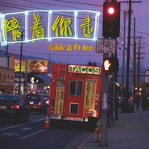

陪着你走Accompany You Go
============================

|  |  |
| :--: | :-- |
| [ 陪着你走Accompany You Go](https://emumo.xiami.com/album/2103471829) | **艺人**: [Gibb-Z](../index.md) **语种**: 国语 **唱片公司**: 独立发行 **发行时间**: 2017年08月10日 **专辑类别**: EP, 单曲 **专辑风格**:  **播放数**: 2362864 **收藏数**: 21 **评论数**: 3  |

## 简介

## 曲目

## 评论

|  |  |  |  |
| :-- | :-- | :-- | :-- |
|  [虾米用户](https://emumo.xiami.com/u/318782075)  2019-10-19 19:07 赞(0) 踩(0) | 
ice的声音太有魔力了，这个声音太适合唱这样慵懒的歌了
 |
|  [虾米用户](https://emumo.xiami.com/u/171641498) 醒来不如做梦 2018-10-08 18:00 赞(0) 踩(0) | 
nice
 |
|  [虾米用户](https://emumo.xiami.com/u/36729335) 拥有侥幸 2018-01-19 21:33 赞(0) 踩(0) | 
听着很开心
 |
