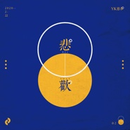
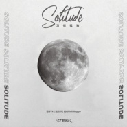
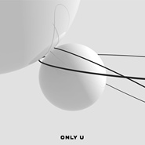
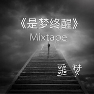

恶梦Yk
============================

|  |  |
| :--: | :-- |
| [ 恶梦Yk](https://i.xiami.com/em) | **播放数**: 1417981 **粉丝数**: 314 **评论数**: 19 **地区**: China 中国大陆 **风格**: 爵士说唱 Jazz Rap, 流行说唱 Pop Rap, 地下说唱 Underground Hip Hop, 陷阱说唱 Trap Rap  |

## 档案

新浪微博：@恶梦yk

## 专辑

| 名称 | 语种 | 唱片公司 | 发行时间 | 专辑类别 | 专辑风格 |
| :--: | :-- | :-- | :-- | :-- | :-- |
| [ 悲欢](./albums/2108275844.md) | 国语 | 太声文化 | 2020年04月02日 | EP, 单曲 | 流行说唱 Pop Rap |
| [ 飞机](./albums/2105729924.md) | 国语 | 太声文化 | 2020年01月15日 | EP, 单曲 | 国语流行 Mandarin Pop |
| [ 一分钟](./albums/2105536213.md) | 国语 | 太声文化 | 2019年10月17日 | EP, 单曲 | 国语流行 Mandarin Pop |
| [ 习惯孤独](./albums/2104893754.md) | 国语 | 咚吧嗒文化 | 2019年05月09日 | EP, 单曲 |  |
| [ Best](./albums/2104881284.md) | 国语 | 咚吧嗒文化 | 2019年05月09日 | EP, 单曲 |  |
| [ WAN AN](./albums/2103702900.md) | 国语 | 独立发行 | 2018年05月08日 | EP, 单曲 | 嘻哈 Hip-Hop, 流行说唱 Pop Rap |
| [ Only u](./albums/2103463487.md) | 国语 | 独立发行 | 2017年12月25日 | 录音室专辑 | 嘻哈 Hip-Hop, 流行说唱 Pop Rap |
| [ 你的说唱男友](./albums/2103485408.md) | 国语 | 独立发行 | 2017年10月27日 | 录音室专辑 | 嘻哈 Hip-Hop |
| [ Fuck Dat Bitch](./albums/2103485414.md) | 国语 | 独立发行 | 2017年02月20日 | 录音室专辑 | 嘻哈 Hip-Hop |
| [ 是梦终醒](./albums/2100267660.md) | 国语 | 独立发行 | 2015年12月12日 | EP, 单曲 | 流行说唱 Pop Rap |

## 评论

|  |  |  |  |
| :-- | :-- | :-- | :-- |
|  [虾米用户](https://emumo.xiami.com/u/814303) 龍凶 2020-04-30 23:01 赞(0) 踩(0) | 
好听
 |
|  [虾米用户](https://emumo.xiami.com/u/783451) 我还没想好要写什么... 2020-01-22 07:40 赞(0) 踩(0) | 
原创歌手在前期推广上可以考虑放出伴奏，便于传唱
 |
|  [虾米用户](https://emumo.xiami.com/u/314131644) 我还没想好要写什么... 2019-12-29 12:24 赞(0) 踩(0) | 
单曲循坏
 |
|  [虾米用户](https://emumo.xiami.com/u/12719802) lame 2019-05-14 11:33 赞(0) 踩(0) | 

 |
|  [虾米用户](https://emumo.xiami.com/u/188902054) born in 2002 2018-12-19 22:51 赞(2) 踩(0) | 
only u 真的秒了我
 |
|  [虾米用户](https://emumo.xiami.com/u/91372642) 不開心就不好看了 2018-11-17 15:58 赞(0) 踩(0) | 
x
 |
|  [虾米用户](https://emumo.xiami.com/u/34413494)   2018-07-10 02:10 赞(0) 踩(0) | 
diss tt的那首求
 |
|  [虾米用户](https://emumo.xiami.com/u/168869586) 2002 1003 2018-01-06 11:34 赞(0) 踩(0) | 
helloYK哥 
 |
|  [虾米用户](https://emumo.xiami.com/u/205380072)  2016-08-04 10:18 赞(0) 踩(0) | 
不错的 棒
 |
|  [虾米用户](https://emumo.xiami.com/u/101188842) 来自齿轮笑夜星的音游玩家 2016-05-08 20:58 赞(0) 踩(0) | 
封面不错
 |
|  [虾米用户](https://emumo.xiami.com/u/84345616)  2016-04-05 23:56 赞(0) 踩(0) | 
哈喽男神 
 |
|  [虾米用户](https://emumo.xiami.com/u/25996544)  2016-02-12 20:32 赞(0) 踩(0) | 
老兄  加油共同努力
 |
|  [虾米用户](https://emumo.xiami.com/u/11109302)  2016-02-05 11:00 赞(0) 踩(0) | 
 
 |
|  [虾米用户](https://emumo.xiami.com/u/86150504) G2190908 KG ... 2016-02-04 18:45 赞(1) 踩(0) | 
噩梦。噩梦。噩梦。 是梦终醒 MixTape  表达的都很真实。  希望一直坚持下去。    不要停。这是 R.N.S Peace。
 |
| ⇒ |  [虾米用户](https://emumo.xiami.com/u/91317482) 说唱音乐人 2016-02-05 02:57 赞(0) 踩(0) | 
感谢。
 |
| ⇒ |  [虾米用户](https://emumo.xiami.com/u/340882554)  2018-01-22 15:26 赞(0) 踩(0) | 
<q><b>恶梦Yk说：</b></q>
 |
| ⇒ |  [虾米用户](https://emumo.xiami.com/u/340882554)  2018-01-22 15:26 赞(0) 踩(0) | 
<q><b>恶梦Yk说：</b></q>
 |
|  [虾米用户](https://emumo.xiami.com/u/91317482) 说唱音乐人 2016-02-02 07:51 赞(0) 踩(0) | 
就它了!
 |
| ⇒ |  [虾米用户](https://emumo.xiami.com/u/26042715) Ace Forever 2016-02-14 01:45 赞(0) 踩(0) | 
哥,终于办了 
 |
