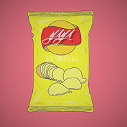

LOFTHESTAR
============================

|  |  |
| :--: | :-- |
| [ LOFTHESTAR](https://i.xiami.com/lofthestar) | **播放数**: 1983283 **粉丝数**: 318 **评论数**: 12 **地区**: China 中国大陆 **风格**: 嘻哈 Hip-Hop, 节奏布鲁斯 R&B  |

## 档案

来自青海的集Singer和Rapper于一身的23岁Hiphop“暖男”，拥有出色的声线和对节奏的把握能力，擅长Trapsoul和Melody Rap的音乐创作。 演出及合作联系经纪人Tel：18618457905

## 专辑

| 名称 | 语种 | 唱片公司 | 发行时间 | 专辑类别 | 专辑风格 |
| :--: | :-- | :-- | :-- | :-- | :-- |
| [ 带你去海边](./albums/2103807168.md) | 国语 | 独立发行 | 2018年07月13日 | EP, 单曲 | 回响贝斯 Dubstep, 流行说唱 Pop Rap |
| [ 暴风雨（刘思达remix）](./albums/2103753532.md) | 国语 | 独立发行 | 2018年06月01日 | EP, 单曲 | 嘻哈 Hip-Hop |
| [ LOFTHESTAR](./albums/2103688190.md) | 国语 | 独立发行 | 2018年04月04日 | EP, 单曲 | 嘻哈 Hip-Hop |
| [ YAYA](./albums/2103514944.md) | 国语 | 独立发行 | 2018年02月05日 | EP, 单曲 | 嘻哈 Hip-Hop |
| [ 什么都是你的](./albums/2102944197.md) | 国语 | 独立发行 | 2017年11月19日 | EP, 单曲 | 流行说唱 Pop Rap |
| [ 觉](./albums/2102944195.md) | 国语 | 独立发行 | 2017年11月19日 | EP, 单曲 | 陷阱说唱 Trap Rap |
| [ 我的女孩](./albums/2102755382.md) | 国语 | 独立发行 | 2017年05月28日 | EP, 单曲 | 嘻哈 Hip-Hop |
| [ 恋旧癖](./albums/2102712364.md) | 国语 | 独立发行 | 2017年03月14日 | EP, 单曲 | 嘻哈 Hip-Hop |
| [ One More](./albums/2102671984.md) | 国语 | 独立发行 | 2016年12月25日 | EP, 单曲 |  |
| [ 梦DREAM](./albums/2100315470.md) | 国语 | 独立发行 | 2016年04月17日 | EP, 单曲 | 流行说唱 Pop Rap |
| [ G.T.A.F.L.S](./albums/2100275690.md) | 国语 | 独立发行 | 2016年02月15日 | EP, 单曲 |  |

## 评论

|  |  |  |  |
| :-- | :-- | :-- | :-- |
|  [虾米用户](https://emumo.xiami.com/u/355647358)  2019-09-03 22:39 赞(0) 踩(0) | 
喜欢好听加油真的
 |
|  [虾米用户](https://emumo.xiami.com/u/50615503) Bakin' soda,... 2019-06-10 00:52 赞(0) 踩(0) | 
嘿嘿
 |
|  [虾米用户](https://emumo.xiami.com/u/328867160) 你一直都是我心中不可触碰... 2019-05-29 06:59 赞(0) 踩(0) | 
加油
 |
|  [虾米用户](https://emumo.xiami.com/u/219128193) 猜猜我的占有欲有多可怕_ 2019-03-25 19:53 赞(0) 踩(0) | 
你很好听
 |
|  [虾米用户](https://emumo.xiami.com/u/338136622) ·· ·-·· -·-- 2018-11-17 13:09 赞(0) 踩(0) | 
作品很好
 |
|  [虾米用户](https://emumo.xiami.com/u/49512286)  2017-08-23 21:15 赞(0) 踩(0) | 
好了。现在开始我是小粉丝。
 |
| ⇒ |  [虾米用户](https://emumo.xiami.com/u/34229996)  2017-11-05 13:57 赞(0) 踩(0) | 
歌都在网易云
 |
|  [虾米用户](https://emumo.xiami.com/u/73857918) 在黎明之前 2017-06-20 13:04 赞(0) 踩(0) | 
相册里为什么不放自拍啊
 |
|  [虾米用户](https://emumo.xiami.com/u/17205094) 真的很奇怪，没错了 2016-04-18 07:32 赞(0) 踩(0) | 
  
 |
|  [虾米用户](https://emumo.xiami.com/u/45450554) 先加再减后除再乘 2016-02-24 21:12 赞(0) 踩(0) | 
有感
 |
|  [虾米用户](https://emumo.xiami.com/u/39122639) 别跟我唧唧歪歪  2016-02-18 17:58 赞(0) 踩(0) | 

 |
|  [虾米用户](https://emumo.xiami.com/u/34229996)  2016-02-15 20:56 赞(0) 踩(0) | 
我刚入驻了虾米音乐人，欢迎大家来我的个人主页，收听我的最新音乐
 |
