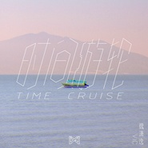
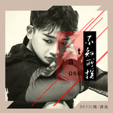
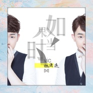
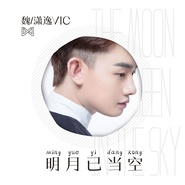
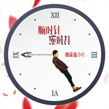

魏潇逸
============================

|  |  |
| :--: | :-- |
| [ 魏潇逸](https://i.xiami.com/weixiaoyi) | **播放数**: 1286881 **粉丝数**: 212 **评论数**: 13 **地区**: China 中国大陆 **风格**: 流行 Pop, 国语流行 Mandarin Pop  |

## 档案

魏  潇  逸，中国内地  实  力歌手。  因参加《偶滴歌神啊》一曲《他不懂》展  现实  力唱功，  谢  娜  为  之感  动  落泪而爆  红  网  络  。  毕业  于云南  艺术  学院，  读书  的  时  候魏  潇  逸就参加了《完美声音》的比  赛  ，一首《歌  剧  2  》展  现  出的  实  力唱功  给评  委留下了很深刻的印象，并受到  评  委高林生的青  睐  ，一路上披  荆斩  棘。  高林生也  给  予魏  潇  逸很高的  评  价，称他是个很有潜力的可造之材，是一个  丢  失了宝  剑  的  “  音  乐剑  客  ”  。

## 专辑

| 名称 | 语种 | 唱片公司 | 发行时间 | 专辑类别 | 专辑风格 |
| :--: | :-- | :-- | :-- | :-- | :-- |
| [ 永恒的时光](./albums/2103754893.md) | 国语 | 青春繁花 | 2018年06月22日 | EP, 单曲 | 国语流行 Mandarin Pop |
| [ 时间邮轮](./albums/2102810860.md) | 国语 | 看见音乐 (上海) | 2017年08月09日 | EP, 单曲 | 国语流行 Mandarin Pop |
| [ 时间游轮](./albums/2105988619.md) | 英语 | We See Music | 2017年08月09日 | EP, 单曲 | 欧美流行 Western Pop |
| [ 不知所措](./albums/2102739409.md) | 国语 | 看见音乐 (上海) | 2017年04月28日 | EP, 单曲 |  |
| [ 如果当时](./albums/2102707231.md) | 国语 | 看见音乐 (上海) | 2017年03月09日 | EP, 单曲 |  |
| [ 明月已当空](./albums/2102694985.md) | 国语 | 看见音乐 (上海) | 2017年02月17日 | EP, 单曲 | 国语流行 Mandarin Pop |
| [ 原谅](./albums/2102675577.md) | 国语 | 看见音乐 (上海) | 2017年01月05日 | EP, 单曲 | 国语流行 Mandarin Pop |
| [ 一光年](./albums/2102652809.md) | 国语 | 看见音乐 (上海) | 2016年11月14日 | EP, 单曲 |  |
| [ 顺时针逆时针](./albums/2102643561.md) | 国语 | 小恒天地 | 2016年11月02日 | EP, 单曲 |  |

## 评论

|  |  |  |  |
| :-- | :-- | :-- | :-- |
|  [虾米用户](https://emumo.xiami.com/u/427475895) 不去在意234567，因... 2019-11-08 12:28 赞(0) 踩(0) | 
为小逸的声音变成新粉，加油(ง •̀_•́)ง可惜虾米的歌不是很全。。。
 |
|  [虾米用户](https://emumo.xiami.com/u/402450227)  2018-08-23 11:44 赞(0) 踩(0) | 
小逸加油(ง &amp;bull;̀_&amp;bull;́)ง
 |
|  [虾米用户](https://emumo.xiami.com/u/261019234)  2017-10-25 07:53 赞(0) 踩(0) | 
挺好听的，听了同学的分享以后来听的
 |
|  [虾米用户](https://emumo.xiami.com/u/250652477)  2017-01-05 00:02 赞(0) 踩(0) | 
喜欢
 |
|  [虾米用户](https://emumo.xiami.com/u/241701222)  2016-12-20 14:14 赞(0) 踩(0) | 
喜欢喜欢加油  
 |
|  [虾米用户](https://emumo.xiami.com/u/214292431) 我是一只鹿饭，梅格妮，海... 2016-10-16 20:10 赞(0) 踩(0) | 
小柯南 
 |
|  [虾米用户](https://emumo.xiami.com/u/140232550)  2016-05-01 20:05 赞(0) 踩(0) | 

 |
|  [虾米用户](https://emumo.xiami.com/u/114864534)  2016-04-08 18:20 赞(0) 踩(0) | 
他的歌很好听
 |
|  [虾米用户](https://emumo.xiami.com/u/44828530)  2016-04-01 22:18 赞(0) 踩(0) | 
咋没有歌曲呢  
 |
|  [虾米用户](https://emumo.xiami.com/u/128149446)  2016-03-28 20:55 赞(1) 踩(0) | 
好喜欢你的声音
 |
|  [虾米用户](https://emumo.xiami.com/u/324600) 心怀理想，踏实践行！ 2016-03-04 20:38 赞(3) 踩(0) | 
声音非常好听
 |
|  [虾米用户](https://emumo.xiami.com/u/95943532)  2016-02-23 09:40 赞(0) 踩(0) | 

 |
|  [虾米用户](https://emumo.xiami.com/u/6824732)  2016-02-19 23:13 赞(3) 踩(0) | 
魏潇逸
 |
