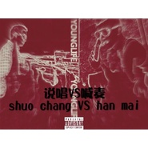

Younglife过滤点张雪飞ft刘雅倩丶polk
============================

|  |  |
| :--: | :-- |
| [ Younglife过滤点张雪飞ft刘雅倩丶polk](https://emumo.xiami.com/album/2102661965) | **艺人**: [张雪飞](../index.md) **语种**: 国语 **唱片公司**: YOUNGLIFE **发行时间**: 2016年12月09日 **专辑类别**: EP, 单曲 **专辑风格**: 粤语流行 Cantopop, 欧美流行 Western Pop **播放数**: 82215 **收藏数**: 20 **评论数**: 3  |

## 简介

 

ps：无论什么风格我们尊重版权 尊重原创！
 

ps：无论什么风格我们尊重版权 尊重原创！
 

ps：无论什么风格我们尊重版权 尊重原创！
 

这次分别用 高迪-《一人饮酒醉》高迪-《三生三世十里桃花》赵小磊-《昨日帝王篇》天佑-《曾经的王》三首经典另类喊麦歌词
 

从新编排flow 跟唱腔做成了一首pop音乐 说唱不等于喊麦 喊麦也不等于说唱 
 

希望大家理性听歌 代入感不要太强 
 

这算是喊麦与说唱的第一次pk！！！！
 

 
 

 
 

## 曲目

## 评论

|  |  |  |
| :-- | :-- | :-- |
|  [虾米用户](https://emumo.xiami.com/u/250588886)  2016-12-11 09:57 赞(0) 踩(0) | 

 |
|  [虾米用户](https://emumo.xiami.com/u/58194082)   2016-12-09 20:02 赞(0) 踩(0) | 
666哈哈
 |
|  [虾米用户](https://emumo.xiami.com/u/58194082)   2016-12-09 20:02 赞(0) 踩(0) | 
卧槽
 |
