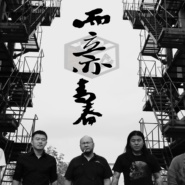

而立亦青春
============================

|  |  |
| :--: | :-- |
| [ 而立亦青春](https://emumo.xiami.com/album/2104743491) | **艺人**: [张雪飞](../index.md) **语种**: 国语 **唱片公司**: 太声文化 **发行时间**: 2019年04月05日 **专辑类别**: EP, 单曲 **专辑风格**: 国语流行 Mandarin Pop **播放数**: 1609 **收藏数**: 0 **评论数**: 0  |

## 简介

而立之年的人们夜深人静时  
或独自一人，或与三五好友把酒言欢  
言语中对自己的生活现状带着些许委屈  
总觉得自己比别人缺少了些什么  
可究竟委屈些什么？缺少了什么？谁也说不清楚  
想哭？也不知为何  
  
慢慢的，明白了  
那是对即将来临的中年生活和庞大责任的畏惧和不安  
那是对即将远去的青年生活和肆无忌惮的时光的不舍与无奈  
  
可时光既是如此，此时我们能做的  
  
回头看看少年时的青涩爱情  
校园里边边角角的欢乐时光  
  
回头看看那些为了天真的理想  
如洪水般涌向外面世界的朋友们和自己  
  
儿时那为你挡风遮雨的伟岸背影  
和慈爱目光  
而如今已经双鬓斑白且步履蹒跚  
  
每天为了生活琐碎而忙碌的自己  
我们无需委屈和落寞  
抬头 挺胸 青春便在抬头仰望的方向  
因为青春与年龄无关  
  
与曾经的纯真干杯  
窗外即使是黄昏  
心依然在清晨  
  
  
与我那些最牵挂的人干杯  
  
即使已喉咙嘶哑  
依然呐喊着年轻的摇滚   
而立亦青春

## 曲目

## 评论

