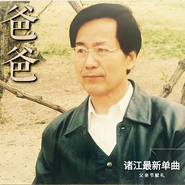

爸爸诸江最新单曲（为父亲节献礼）
============================

|  |  |
| :--: | :-- |
| [ 爸爸诸江最新单曲（为父亲节献礼）](https://emumo.xiami.com/album/2102766733) | **艺人**: [诸江](../index.md) **语种**: 国语 **唱片公司**: 独立发行 **发行时间**: 2017年06月16日 **专辑类别**: 录音室专辑 **专辑风格**: 流行 Pop, 国语流行 Mandarin Pop **播放数**: 3744 **收藏数**: 5 **评论数**: 4  |

## 简介

诸江，网络歌手，音乐人，音乐导师。《爸爸》是诸江倾情为父亲节所献，一字一句,都承载着无法丈量的爱!我们时常歌颂母亲，却总无法准确地形容出父爱的厚重。高尔基说：&amp;父爱是一部震撼心灵的巨著，读懂了它，你就读懂了整个人生！&amp;唱一首歌送给父亲，感谢父亲赐予我们生命…… 

## 曲目

## 评论

|  |  |  |
| :-- | :-- | :-- |
|  [虾米用户](https://emumo.xiami.com/u/424180502)  2019-07-18 06:53 赞(0) 踩(0) | 
好听好感动
 |
|  [虾米用户](https://emumo.xiami.com/u/423532510) 我还没想好要写什么... 2019-05-02 07:08 赞(0) 踩(0) | 

 |
|  [虾米用户](https://emumo.xiami.com/u/21114536)  2017-08-26 08:59 赞(0) 踩(0) | 
老师最有孝心
 |
|  [虾米用户](https://emumo.xiami.com/u/291439086)  2017-06-17 09:26 赞(0) 踩(0) | 
我喜欢听
 |
