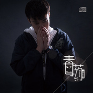

毒药
============================

|  |  |
| :--: | :-- |
| [ 毒药](https://emumo.xiami.com/album/2103826498) | **艺人**: [聂坤](../index.md) **语种**: 国语 **唱片公司**: 百纳娱乐 **发行时间**: 2018年07月19日 **专辑类别**: EP, 单曲 **专辑风格**: 国语流行 Mandarin Pop **播放数**: 904345 **收藏数**: 3 **评论数**: 2  |

## 简介

“爱是一种穿肠毒药，喝下去的人无处可逃”  
谁都心碎过，痛彻心扉过，疗伤时你爱听什么样的歌？放手后你有着怎样的姿态？  
时间带走你，但带不走的是回忆，以及治愈心灵的旋律。  
新锐歌手聂坤全新创作EP《毒药》，荡气回肠的旋律，直击灵魂的字句，陪你度过分手后漫漫长夜，微醺的雨夜，诉尽衷肠，让你彻底卸下伪装，不必故作坚强。 

## 曲目

## 评论

|  |  |  |  |
| :-- | :-- | :-- | :-- |
|  [虾米用户](https://emumo.xiami.com/u/36426544) 我还没想好要写什么... 2020-02-16 15:05 赞(0) 踩(0) | 
喜欢聂坤的声音～
 |
|  [虾米用户](https://emumo.xiami.com/u/36426544) 我还没想好要写什么... 2020-02-16 15:04 赞(0) 踩(0) | 
狼爸爸～加油！喜欢听你的电台～蛤蛤蛤蛤～直播～唱歌～都喜欢哦～
 |
