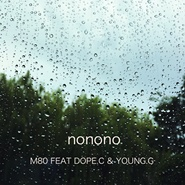

No-No-NoYoung G;M80;Dope C
============================

|  |  |
| :--: | :-- |
| [ No-No-NoYoung G;M80;Dope C](https://emumo.xiami.com/album/2100380203) | **艺人**: [Young Gee](../index.md) **语种**: 国语 **唱片公司**: 独立发行 **发行时间**: 2016年08月17日 **专辑类别**: EP, 单曲 **专辑风格**:  **播放数**: 8155 **收藏数**: 19 **评论数**: 2  |

## 简介

 No-No-No

## 曲目

## 评论

|  |  |  |
| :-- | :-- | :-- |
|  [虾米用户](https://emumo.xiami.com/u/35831550) 点击查看 2016-08-24 13:17 赞(0) 踩(0) | 
跟着迷幻的节奏，M80和young G说唱的反差感很喜欢
 |
|  [虾米用户](https://emumo.xiami.com/u/75260412) 唱点东西给你们听~~~ 2016-08-17 20:19 赞(1) 踩(0) | 
Feat M80、Dope C
 |
