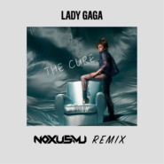

The Cure(NOXMU Bootleg)Lady Gaga
============================

|  |  |
| :--: | :-- |
| [ The Cure(NOXMU Bootleg)Lady Gaga](https://emumo.xiami.com/album/2102741195) | **艺人**: [NOXMU](../index.md) **语种**: 英语 **唱片公司**: 独立发行 **发行时间**: 2017年05月01日 **专辑类别**: EP, 单曲 **专辑风格**: 电音流行 Electropop **播放数**: 1011034 **收藏数**: 6 **评论数**: 4  |

## 简介

第一次remix  希望没毁歌哈哈  对于我来说是进步

## 曲目

## 评论

|  |  |  |  |
| :-- | :-- | :-- | :-- |
|  [虾米用户](https://emumo.xiami.com/u/422635423) 奇奇怪怪的世界ing 2020-04-13 14:24 赞(0) 踩(0) | 
很喜欢这种风格,适合做视频。
 |
|  [虾米用户](https://emumo.xiami.com/u/421522929)  2019-04-22 16:54 赞(1) 踩(0) | 
歌曲好听
 |
|  [虾米用户](https://emumo.xiami.com/u/150571194)   2017-05-02 00:34 赞(0) 踩(0) | 
俺来了(*^▽^*)
 |
| ⇒ |  [虾米用户](https://emumo.xiami.com/u/30333522) 我还没想好要写什么... 2017-05-02 00:34 赞(0) 踩(0) | 
✌
 |
