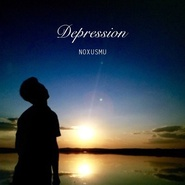

Depression
============================

|  |  |
| :--: | :-- |
| [ Depression](https://emumo.xiami.com/album/2102741214) | **艺人**: [NOXMU](../index.md) **语种**: 其他 **唱片公司**: 独立发行 **发行时间**: 2017年05月01日 **专辑类别**: EP, 单曲 **专辑风格**: 电子 Electronic, 氛围音乐 Ambient **播放数**: 649 **收藏数**: 0 **评论数**: 5  |

## 简介

我会走出来的 谢谢音乐和家人朋友的陪伴

## 曲目

## 评论

|  |  |  |  |
| :-- | :-- | :-- | :-- |
|  [虾米用户](https://emumo.xiami.com/u/304718839)  2017-06-18 19:34 赞(1) 踩(0) | 
好听
 |
|  [虾米用户](https://emumo.xiami.com/u/606043)  2017-06-15 10:41 赞(0) 踩(0) | 
好听！！！让所有陷入depression的人看到了希望！
 |
| ⇒ |  [虾米用户](https://emumo.xiami.com/u/30333522) 我还没想好要写什么... 2017-06-15 11:16 赞(0) 踩(0) | 
对我现在已经走出来了！
 |
|  [虾米用户](https://emumo.xiami.com/u/150571194)   2017-05-02 00:33 赞(0) 踩(0) | 
俺来了(*^▽^*)
 |
| ⇒ |  [虾米用户](https://emumo.xiami.com/u/30333522) 我还没想好要写什么... 2017-05-02 00:34 赞(0) 踩(0) | 
晚上好
 |
