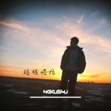

格根塔拉
============================

|  |  |
| :--: | :-- |
| [ 格根塔拉](https://emumo.xiami.com/album/2102814500) | **艺人**: [NOXMU](../index.md) **语种**: 其他 **唱片公司**: 独立发行 **发行时间**: 2017年08月08日 **专辑类别**: EP, 单曲 **专辑风格**: 独立电子乐 Indietronica, 浩室舞曲 House **播放数**: 1007 **收藏数**: 1 **评论数**: 1  |

## 简介

 p.p1 {margin: 0.0px 0.0px 0.0px 0.0px; line-height: 22.0px; font: 15.0px 'Helvetica Neue'} 
 

我的新歌《格根塔拉》做了一首比较民族的house ，正好今天也是内蒙古大庆的日子，好久没发新歌了，因为一直在创作修改，希望大家喜欢和分享
 

 

## 曲目

## 评论

|  |  |  |
| :-- | :-- | :-- |
|  [虾米用户](https://emumo.xiami.com/u/606043)  2017-08-15 20:50 赞(0) 踩(0) | 
顶起！！！
 |
