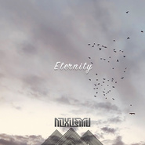

Eternity
============================

|  |  |
| :--: | :-- |
| [ Eternity](https://emumo.xiami.com/album/2102868069) | **艺人**: [NOXMU](../index.md) **语种**: 其他 **唱片公司**: 独立发行 **发行时间**: 2017年10月05日 **专辑类别**: EP, 单曲 **专辑风格**: 独立电子乐 Indietronica, 出神舞曲 Trance **播放数**: 815 **收藏数**: 2 **评论数**: 4  |

## 简介

尝试不同的音乐风格，做音乐就是我情感的宣泄。

## 曲目

## 评论

|  |  |  |  |
| :-- | :-- | :-- | :-- |
|  [虾米用户](https://emumo.xiami.com/u/606043)  2017-10-06 01:10 赞(0) 踩(0) | 
让它为你带来快乐！
 |
| ⇒ |  [虾米用户](https://emumo.xiami.com/u/277452891) 音乐人 2017-10-06 08:49 赞(0) 踩(0) | 
快乐
 |
|  [虾米用户](https://emumo.xiami.com/u/606043)  2017-10-06 01:09 赞(0) 踩(0) | 
这快乐得，我今晚不会做恶梦了！！
 |
|  [虾米用户](https://emumo.xiami.com/u/606043)  2017-10-06 01:08 赞(0) 踩(0) | 
快乐的源泉！！！
 |
