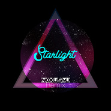

Starlight(NOXMU Bootleg)
============================

|  |  |
| :--: | :-- |
| [ Starlight(NOXMU Bootleg)](https://emumo.xiami.com/album/2103495335) | **艺人**: [NOXMU](../index.md) **语种**: 英语 **唱片公司**: 独立发行 **发行时间**: 2018年01月20日 **专辑类别**: EP, 单曲 **专辑风格**: 回响贝斯 Dubstep **播放数**: 851 **收藏数**: 1 **评论数**: 2  |

## 简介

 试着学习回响贝斯的编曲，冒着风险碰了大神大菠萝他们的作品，希望大家喜欢。

## 曲目

## 评论

|  |  |  |  |
| :-- | :-- | :-- | :-- |
|  [虾米用户](https://emumo.xiami.com/u/606043)  2018-01-20 00:12 赞(1) 踩(0) | 
好棒!!
 |
| ⇒ |  [虾米用户](https://emumo.xiami.com/u/30333522) 我还没想好要写什么... 2018-01-20 00:13 赞(0) 踩(0) | 
哈哈谢谢支持，才发现这上面歌名写错了
 |
