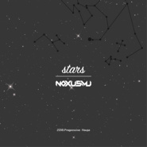

Stars
============================

|  |  |
| :--: | :-- |
| [ Stars](https://emumo.xiami.com/album/2103755216) | **艺人**: [NOXMU](../index.md) **语种**: 其他 **唱片公司**: 独立发行 **发行时间**: 2018年06月19日 **专辑类别**: EP, 单曲 **专辑风格**: 前卫浩室 Progressive House **播放数**: 1527 **收藏数**: 4 **评论数**: 1  |

## 简介

 只要有空就做音乐，是我最好的放松过程，这次的作品非常欢快和我之前的风格差别很大，这首Progressive House完成的很快，混音部分不好但明显比之前的作品好很多。

## 曲目

## 评论

|  |  |  |  |
| :-- | :-- | :-- | :-- |
|  [虾米用户](https://emumo.xiami.com/u/606043)  2018-06-30 13:45 赞(1) 踩(0) | 
好棒！！！
 |
