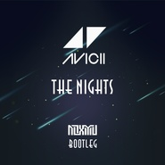

The Nights(NOXMU Bootleg)
============================

|  |  |
| :--: | :-- |
| [ The Nights(NOXMU Bootleg)](https://emumo.xiami.com/album/2104493184) | **艺人**: [NOXMU](../index.md) **语种**: 英语 **唱片公司**:  **发行时间**: 2019年01月17日 **专辑类别**: EP, 单曲 **专辑风格**: 浩室舞曲 House, 独立电子乐 Indietronica **播放数**: 567692 **收藏数**: 8 **评论数**: 5  |

## 简介

如果Avicii还在的话一定又会有更棒的作品吧，听他的作品每次都会感动。我改编加入了民族乐器，不过能力不够混音太差

## 曲目

## 评论

|  |  |  |  |
| :-- | :-- | :-- | :-- |
|  [虾米用户](https://emumo.xiami.com/u/418553087) 粑粑 2020-06-29 22:32 赞(0) 踩(0) | 
咯叫旅途基金健康快乐
 |
|  [虾米用户](https://emumo.xiami.com/u/403469495) 生命在于韵动～～ 2019-10-28 20:46 赞(5) 踩(0) | 

 |
|  [虾米用户](https://emumo.xiami.com/u/409375270) 我从宇宙来，归宇宙中去。 2019-01-25 20:41 赞(1) 踩(0) | 
加油
 |
|  [虾米用户](https://emumo.xiami.com/u/303913544) 无 2019-01-17 23:27 赞(1) 踩(0) | 
加油
 |
|  [虾米用户](https://emumo.xiami.com/u/606043)  2019-01-17 22:57 赞(1) 踩(0) | 
棒！！！
 |
