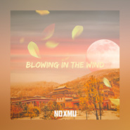

Blowing in the Wind
============================

|  |  |
| :--: | :-- |
| [ Blowing in the Wind](https://emumo.xiami.com/album/2105474867) | **艺人**: [NOXMU](../index.md) **语种**: 纯音乐 **唱片公司**:  **发行时间**: 2019年11月22日 **专辑类别**: EP, 单曲 **专辑风格**: 弛放 Chillout **播放数**: 1871 **收藏数**: 3 **评论数**: 6  |

## 简介

最近发生了很多事,也许一些人和物都会随着时间慢慢消失,但你们在我心中留下的回忆令人难忘.在失落的情绪下做出了这首作品.风格是chillstep

## 曲目

## 评论

|  |  |  |
| :-- | :-- | :-- |
|  [虾米用户](https://emumo.xiami.com/u/203419560)  2020-03-10 16:19 赞(1) 踩(0) | 
看世界车水马龙，享人生潮起潮落
 |
|  [虾米用户](https://emumo.xiami.com/u/403469495) 生命在于韵动～～ 2019-11-22 15:40 赞(9) 踩(0) | 
好
 |
|  [虾米用户](https://emumo.xiami.com/u/8279085) 欣然开门，门外没人。 2019-11-22 10:55 赞(0) 踩(0) | 
别具一格。
 |
|  [虾米用户](https://emumo.xiami.com/u/325205625)  2019-11-22 06:11 赞(6) 踩(0) | 
，
 |
|  [虾米用户](https://emumo.xiami.com/u/330900828) 高舉一面五星紅旗在蝦米！ 2019-11-22 05:02 赞(2) 踩(0) | 

 |
|  [虾米用户](https://emumo.xiami.com/u/31531934) 恋の道に近道はない 2019-11-22 01:37 赞(2) 踩(0) | 
get
 |
