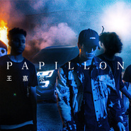

Papillon巴比龙
============================

|  |  |
| :--: | :-- |
| [ Papillon巴比龙](https://emumo.xiami.com/album/2102820458) | **艺人**: [王嘉尔](../index.md) **语种**: 英语 **唱片公司**: 看见音乐 (上海) **发行时间**: 2017年08月26日 **专辑类别**: EP, 单曲 **专辑风格**: 嘻哈 Hip-Hop, 流行说唱 Pop Rap, 电子舞曲 EDM / Electronic Dance Music **播放数**: 17116366 **收藏数**: 1207 **评论数**: 150  |

## 简介

一场与自己的 “博弈”  
  
——2017 王嘉尔全新单曲《Papillon》音乐企划  
  
歌名 《PAPILLON》  
  
曲 Jackson Wang, boytoy  
  
词 Jackson Wang  
  
编 Jackson Wang, boytoy  
  
监 Jackson Wang  
  
  
一次前卫的音乐宣言  
  
一场无所畏惧的冒险  
  
打破世俗捆绑与万千阻拦  
  
冲出重围，燃烧旧的自己  
  
挑战真正的自我  
  
  
  
【Who is JACKSON WANG？】  
  
“被大众'误会'的综艺咖，与自己的一场博弈”  
  
无论是哪一面的王嘉尔，都是最真实的他。你只看到他在综艺中他幽默风趣，却不知他对音乐的执着有多认真。你只知他是体育冠军，却不知他也曾与自己博弈过多次。他，变幻无形。他，令人惊喜不断。  
  
从只身前往异乡追梦到开启多面人生，《Papillon》不仅仅是一首单曲，更是王嘉尔此刻想要传达的一种态度。虽然夺得双冠，有着精致的外貌，以横溢的才华在综艺界大放异彩，但王嘉尔“不安于现状”。他认为，不论是在哪个阶段，只要有梦想都应该追求，哪怕失败！只要曾经努力过就不会后悔。王嘉尔正在用无限可能的创造力，来书写他的多面人生。  
  
  
【JACKSON WANG=积累 X 爆发】  
  
“灵感源于瞬间爆发，创作则需时间累积”  
  
从最开始灵感的瞬间迸发，到一次次推翻，最终再还是回到原点。在创作《Papillon》整首歌 Melody之后，王嘉尔便很快就有了写词的灵感，在工作的闲暇之余就将歌曲的 Chorus 部分完成。之后几番纠结，却还是选用了“最具有灵魂”的初版。王嘉尔说，“即兴创作时的音乐，它灵魂的感觉是无论修改多少次 也达不到的效果”。  
  
在这个 EDM 时代中，很多音乐制作人都用套用的板子不断放上各种节奏和音色，用燥裂的鼓点让人 迅速变燃。而《Papillon》，是 EDM 盛行时期的一首走心之作。虽然王嘉尔是首次担任音乐制作人，但 10 年的创作及演唱经验上，也让他在选择节奏和音色的过程中，更知道哪个才是自己最想要的感觉。  
  
“不需要任何标签，做最独特的王嘉尔“  
  
《Papillon》是一首融合了大量嘻哈元素的歌曲。在伴奏的乐器上，王嘉尔采用了节奏强烈的鼓点，与他独特的唱法相结合，听起来非常 powerful。作为目前华语音乐市场上为数不多的嘻哈歌手，王嘉尔在唱法上大胆的尝试，也赋予了这首歌独特的个人色彩。迷幻冷酷的嘻哈曲风，搭配着充满挑战的歌词，在王嘉尔极其张力的音色中释放出了年轻人那股该有的狂野性。  
  
很多人为了让自己的音乐听起来更酷更潮，在歌曲里会融入各种不同的音色。而《Papillon》的特别 之处在于它很随性利落，没有过多的的复杂，这种简单恰到好处。对于王嘉尔而言，创造一首好的音乐比“听起来很酷”有意义，合适与对味也比追求潮流更为重要。他就是他，不迎合市场，最独特的 JACKSON WANG！  
  
【Papillon=勇气 X 创造】  
  
《Papillon》——勇气和创造。王嘉尔用音乐诠释，荆棘彼岸，就是理想。  
  
“Designer &amp; Creativity”  
  
每个人，都应该要勇于创造，要勇于尝试不同的东西。 这条路上可以接受失败，但不允许逃避失败。  
  
王嘉尔向来都率性认真，于他而言，音乐像是衣服，只有自己才知道自己想要的是什么。他认为现在的每一次尝试，都是自己成长的见证。用音乐记录自己的成长。Creativity，以年轻人的视角看世界，思维碰撞 的火花一点即燃。所以这一次，他成为了自己的 Designer。  
  
“前进 or 后退”  
  
当遇到具有挑战性的事情后，我们心里时常会有两种声音，前进 or 后退。那个想要前进强大的自己， 总被心里另一个弱小的自己所牵引。王嘉尔的选择，很显然他是前者，他想要：烧掉负能量的自己，展示 全新的自己。想要打破这个循规蹈矩的人生规则，正像歌词中写的那样，“Ain't nobody give a XXXX 'bout a rule that's what I do”。《Papillon》是一次极具意义性的打破规则，王嘉尔用创造无限可能的音乐精神，为我们带来了一次最前沿的嘻哈音乐。  
  
打破规则，冲破枷锁，在路上迎接全新的自我！——王嘉尔

## 曲目

## 评论

|  |  |  |  |
| :-- | :-- | :-- | :-- |
|  [虾米用户](https://emumo.xiami.com/u/79469558)  2020-08-17 16:25 赞(0) 踩(0) | 
嘎嘎好棒
 |
|  [虾米用户](https://emumo.xiami.com/u/54433927)  2020-04-05 12:09 赞(0) 踩(0) | 
太好听了
 |
|  [虾米用户](https://emumo.xiami.com/u/343267699) zhandong 2020-02-16 20:53 赞(0) 踩(0) | 
我(｡･㉨･｡)ﾉ♡ 爱你么么哒
 |
|  [虾米用户](https://emumo.xiami.com/u/266643229)  2019-11-23 16:23 赞(0) 踩(0) | 
太好听了
 |
|  [虾米用户](https://emumo.xiami.com/u/199206478) ☀️ 2019-07-10 08:06 赞(0) 踩(0) | 
疯狂打call  Jackson❤️❤️❤️
 |
|  [虾米用户](https://emumo.xiami.com/u/350064172) 我就要这样 2019-06-07 17:40 赞(0) 踩(0) | 
超喜欢嘎嘎嘻嘻嘻
 |
|  [虾米用户](https://emumo.xiami.com/u/23244533) 高山有崖，林木有枝。 2019-06-06 21:25 赞(0) 踩(0) | 
天然女
 |
|  [虾米用户](https://emumo.xiami.com/u/407369100) we all like ... 2019-05-25 11:57 赞(0) 踩(0) | 
很有感呦
 |
|  [虾米用户](https://emumo.xiami.com/u/117859514)  2019-03-25 21:36 赞(0) 踩(0) | 
jbinkxxVgza  
 |
|  [虾米用户](https://emumo.xiami.com/u/288254679) 什么是签名 2019-03-24 17:33 赞(0) 踩(0) | 
差
 |
|  [虾米用户](https://emumo.xiami.com/u/13994454) 我还没想好要写什么... 2018-11-29 14:20 赞(0) 踩(0) | 
POP/STARSK/DA; Madison Beer; Jaira Burns; League of Legends 这个英雄联盟的商业曲和这个有些像啊~！！！~流行曲还是这些套路啊~~
 |
|  [虾米用户](https://emumo.xiami.com/u/199432847) the dream pl... 2018-11-18 13:15 赞(0) 踩(0) | 
牛皮
 |
|  [虾米用户](https://emumo.xiami.com/u/374938257)  2018-11-14 10:14 赞(0) 踩(0) | 
超好听❤️
 |
|  [虾米用户](https://emumo.xiami.com/u/282946425)  2018-11-01 22:07 赞(0) 踩(0) | 
初次听这首歌真的很惊艳，但是不觉得和Suicide Squad专辑的Purple Lamborghini有点相似么，还是只有我觉得？
 |
|  [虾米用户](https://emumo.xiami.com/u/266145737) EXO 2018-08-18 17:05 赞(0) 踩(0) | 
还行
 |
|  [虾米用户](https://emumo.xiami.com/u/334543001)  2018-08-14 16:39 赞(0) 踩(0) | 
棒
 |
|  [虾米用户](https://emumo.xiami.com/u/378255094)  2018-07-11 10:59 赞(0) 踩(0) | 
嘉嘉棒棒棒
 |
|  [虾米用户](https://emumo.xiami.com/u/252667006)  2018-06-27 13:09 赞(0) 踩(0) | 
嘎嘎的第一首歌，真的很震撼，小烟嗓真的很性感，很有冲击性，和平时综艺的表现真的很有反差萌，看到了另一个王嘉尔，做音乐的王嘉尔，真的超级好听了，很有激情，可以单曲循环一整天那种，醒脑神曲
 |
|  [虾米用户](https://emumo.xiami.com/u/6351945) … … 2018-06-17 11:09 赞(0) 踩(0) | 
  
 |
|  [虾米用户](https://emumo.xiami.com/u/338911576)  2018-06-17 10:37 赞(0) 踩(0) | 
初心巴比龙~爱你啊王嘉尔
 |
|  [虾米用户](https://emumo.xiami.com/u/10012028)  2018-06-12 16:31 赞(0) 踩(0) | 
真好听
 |
|  [虾米用户](https://emumo.xiami.com/u/50511762)   2018-06-10 01:32 赞(0) 踩(0) | 
真的很棒啊！各种节目中被表演曲目，合作曲目，难道不足以证明吗？
 |
|  [虾米用户](https://emumo.xiami.com/u/74926218)   2018-06-07 02:36 赞(0) 踩(0) | 
这rap，堪比欧美歌手
 |
|  [虾米用户](https://emumo.xiami.com/u/346760668) 善良 2018-05-26 12:22 赞(0) 踩(0) | 
王嘉尔啊
 |
|  [虾米用户](https://emumo.xiami.com/u/347640183)  2018-05-26 01:38 赞(0) 踩(0) | 
无论是歌词还是旋律都很吸引人，很励志的一首歌~
 |
|  [虾米用户](https://emumo.xiami.com/u/350324581)  2018-05-15 22:41 赞(0) 踩(0) | 
节奏特别好，听了很容易上瘾
 |
|  [虾米用户](https://emumo.xiami.com/u/243187466)  2018-04-30 20:53 赞(0) 踩(0) | 
(｡･&amp;forall;･)ﾉﾞ嗨起来
 |
|  [虾米用户](https://emumo.xiami.com/u/347986570)  2018-04-22 11:05 赞(0) 踩(0) | 
我喜欢
 |
|  [虾米用户](https://emumo.xiami.com/u/332685636) 这家伙很聪明什么也没留下... 2018-04-20 16:43 赞(0) 踩(0) | 
你有Jacky哦，所以别怕❤️
 |
|  [虾米用户](https://emumo.xiami.com/u/257654868) no xo no lif... 2018-04-07 17:34 赞(0) 踩(0) | 
真的好听
 |
|  [虾米用户](https://emumo.xiami.com/u/34255118) 围脖：ArtistDIA... 2018-03-29 18:46 赞(2) 踩(0) | 
帅炸了！！刚知道这首歌是王嘉尔唱的！优秀！！！！！！！！
 |
|  [虾米用户](https://emumo.xiami.com/u/268701784)  2018-03-04 21:05 赞(1) 踩(0) | 
烟嗓
 |
|  [虾米用户](https://emumo.xiami.com/u/258815791)   2018-02-27 19:08 赞(0) 踩(0) | 
很洗脑，好听炸
 |
|  [虾米用户](https://emumo.xiami.com/u/283401097)  2018-01-26 14:52 赞(23) 踩(0) | 
简直了我第一次听以为是外国人feat........没想到都是他自己的声音......我迷妹上身了
 |
|  [虾米用户](https://emumo.xiami.com/u/333414015) 我还没想好要写什么... 2018-01-06 22:28 赞(0) 踩(0) | 
for hyh
 |
|  [虾米用户](https://emumo.xiami.com/u/332228494)  2018-01-04 22:36 赞(5) 踩(0) | 
辣鸡，还嘻哈呢！看看人家厉害的，就那几句歌词重复 谁不会啊。我说句公道话他不会唱歌只是帅罢了
 |
| ⇒ |  [虾米用户](https://emumo.xiami.com/u/272638677) 少时XO请红到宇宙爆炸～... 2018-02-02 19:56 赞(0) 踩(0) | 
这么有勇气，我相信你最会了٩( '&amp;omega;' )و
 |
|  [虾米用户](https://emumo.xiami.com/u/245432119)   2018-01-03 11:00 赞(1) 踩(0) | 
帅气！real 酷盖
 |
|  [虾米用户](https://emumo.xiami.com/u/337089442) 我还没想好要写什么... 2017-12-31 00:15 赞(0) 踩(0) | 
..一开始听还以为是外国人唱的
 |
|  [虾米用户](https://emumo.xiami.com/u/329021905)  2017-12-23 18:16 赞(0) 踩(0) | 
棒棒  
 |
|  [虾米用户](https://emumo.xiami.com/u/340176204)  2017-12-16 14:28 赞(0) 踩(0) | 
马上转粉
 |
|  [虾米用户](https://emumo.xiami.com/u/50059316)   2017-12-11 06:40 赞(1) 踩(0) | 
打call ~
 |
|  [虾米用户](https://emumo.xiami.com/u/46546447)  2017-12-10 09:26 赞(0) 踩(0) | 
HOT
 |
|  [虾米用户](https://emumo.xiami.com/u/219654109)  2017-12-01 22:02 赞(0) 踩(0) | 
是酷盖本人了喜欢嘉嘉
 |
|  [虾米用户](https://emumo.xiami.com/u/332016169) 只有jekki 只有金在... 2017-11-30 23:10 赞(0) 踩(0) | 
永远最棒的王嘉尔
 |
|  [虾米用户](https://emumo.xiami.com/u/16598649) 暂无签名~ 2017-11-30 11:04 赞(0) 踩(0) | 
酷的
 |
|  [虾米用户](https://emumo.xiami.com/u/337541158)  2017-11-27 18:32 赞(1) 踩(0) | 
王式嘻哈黑泡！向全世界宣告这是我王嘉尔的音乐
 |
|  [虾米用户](https://emumo.xiami.com/u/240879782)  2017-11-25 18:07 赞(0) 踩(0) | 
爱嘉嘉
 |
|  [虾米用户](https://emumo.xiami.com/u/201906147) 最幸运的事情就是遇上你呀 2017-11-17 20:10 赞(0) 踩(0) | 
超级好听
 |
|  [虾米用户](https://emumo.xiami.com/u/299797305)  2017-11-17 01:53 赞(0) 踩(0) | 
好听好听好听！永远支持你！嘎嘎小哥哥~
 |
|  [虾米用户](https://emumo.xiami.com/u/211100747) 函数不回归绝不改签名 2017-11-14 12:11 赞(1) 踩(0) | 
鸟宝宝永远爱你啊嘎嘎 嗓音是那么独特的你在一众rap男声里辨识度超高 
 |
|  [虾米用户](https://emumo.xiami.com/u/279062978) _像疯子般泰然地追星的少... 2017-11-08 11:23 赞(0) 踩(0) | 
很好呀嘎嘎加油
 |
|  [虾米用户](https://emumo.xiami.com/u/2058207)  2017-10-24 12:23 赞(0) 踩(0) | 
编曲一股钱味~很有诚意了
 |
|  [虾米用户](https://emumo.xiami.com/u/217439426) 迎风长肉的苦逼胖纸。矛盾... 2017-10-23 09:26 赞(0) 踩(0) | 
王嘉尔的全新面貌
 |
|  [虾米用户](https://emumo.xiami.com/u/331048906)  2017-10-21 02:24 赞(0) 踩(0) | 
很好听！！
 |
|  [虾米用户](https://emumo.xiami.com/u/286432608) 你你你瞅啥 2017-10-10 20:07 赞(4) 踩(0) | 
我的脚趾在跳舞
 |
|  [虾米用户](https://emumo.xiami.com/u/222077252)  2017-10-06 11:27 赞(0) 踩(0) | 
嘉尔超赞，做你喜欢做的，做你想做的，鸟宝支持你
 |
|  [虾米用户](https://emumo.xiami.com/u/32608822) 我是如此的鲜嫩多汁 2017-09-19 21:39 赞(0) 踩(0) | 
帅气
 |
|  [虾米用户](https://emumo.xiami.com/u/322949252) 绝望的时候就去吃吃喝喝睡... 2017-09-19 12:26 赞(0) 踩(0) | 
很好听，节奏感超好的
 |
|  [虾米用户](https://emumo.xiami.com/u/325644934) I GOT 7 2017-09-18 21:40 赞(0) 踩(0) | 
嘉尔棒棒哒，鸟宝宝永远爱你奥
 |
|  [虾米用户](https://emumo.xiami.com/u/325533169)  2017-09-17 19:08 赞(0) 踩(0) | 
666
 |
|  [虾米用户](https://emumo.xiami.com/u/17146554) weibo：@L1RRO... 2017-09-12 20:32 赞(0) 踩(0) | 
///
 |
|  [虾米用户](https://emumo.xiami.com/u/324051884)  2017-09-08 22:53 赞(2) 踩(0) | 
I love Jackson
 |
|  [虾米用户](https://emumo.xiami.com/u/224803604)  2017-09-08 12:49 赞(2) 踩(0) | 
这是嘎嘎自己的努力，让我们鸟宝宝骄傲的屋里嘎怀挺，满分不怕你骄傲(&amp;bull;̀&amp;omega;&amp;bull;́)✨
 |
|  [虾米用户](https://emumo.xiami.com/u/231594717)   2017-09-07 22:23 赞(3) 踩(0) | 
听完一次感觉好快，结果看了时间也不短啊，嘎嘎的歌洗脑
 |
|  [虾米用户](https://emumo.xiami.com/u/284549354)  2017-09-07 18:14 赞(1) 踩(0) | 
你就是做音乐超认真的王酷盖啊
 |
|  [虾米用户](https://emumo.xiami.com/u/281189523)  2017-09-06 16:39 赞(1) 踩(0) | 
难听
 |
| ⇒ |  [虾米用户](https://emumo.xiami.com/u/332224800) 我......是十二❤️ 2017-12-01 18:38 赞(0) 踩(0) | 
难听就别听，别在这里瞎讲
 |
|  [虾米用户](https://emumo.xiami.com/u/133192696)  2017-09-05 22:04 赞(0) 踩(0) | 
曲真的很有feel ,歌词也满满的真诚。而且嘎嘎嗓音真的好听到爆灯！！！支持嘎嘎，说好的成为全世界著名的音乐人，我信你一定会成功的！！！
 |
|  [虾米用户](https://emumo.xiami.com/u/102133446) 音乐不是消耗品 2017-09-04 21:30 赞(0) 踩(0) | 
神曲
 |
|  [虾米用户](https://emumo.xiami.com/u/18770955)  2017-09-04 12:45 赞(0) 踩(0) | 
为嘉嘉疯狂打call(ﾉﾟ▽ﾟ)ﾉ
 |
|  [虾米用户](https://emumo.xiami.com/u/98145394) 由我主宰 2017-09-03 10:09 赞(1) 踩(0) | 

 |
|  [虾米用户](https://emumo.xiami.com/u/288912766) 啦啦啦啦啦啦啦啦～～ 2017-09-03 09:16 赞(1) 踩(0) | 
好听  加油啊！  
 |
|  [虾米用户](https://emumo.xiami.com/u/54572507) 时而得体，时而dirty... 2017-09-03 00:21 赞(1) 踩(0) | 
加油嘉尔
 |
|  [虾米用户](https://emumo.xiami.com/u/247642881)  2017-09-02 23:43 赞(1) 踩(0) | 
好听
 |
|  [虾米用户](https://emumo.xiami.com/u/281925747) 在等待着... 2017-09-01 02:31 赞(1) 踩(0) | 
唱得...sorry...恕我不会欣赏了
 |
|  [虾米用户](https://emumo.xiami.com/u/211321956)  2017-09-01 02:21 赞(1) 踩(0) | 
diamond
 |
|  [虾米用户](https://emumo.xiami.com/u/267296778)  2017-08-31 07:24 赞(1) 踩(0) | 
狂炫酷霸拽
 |
|  [虾米用户](https://emumo.xiami.com/u/188078809) 2018  { 欧气爆棚... 2017-08-31 01:05 赞(1) 踩(0) | 
第一张专辑，个人王嘉尔   
 |
|  [虾米用户](https://emumo.xiami.com/u/20493741)  2017-08-30 14:02 赞(1) 踩(0) | 
第一张个人专辑，看到了不一样的王嘉尔
 |
|  [虾米用户](https://emumo.xiami.com/u/309476503)  2017-08-30 12:54 赞(1) 踩(0) | 
很王嘉尔！很黑泡！看见了嘉尔对音乐的认真，mv超燃
 |
|  [虾米用户](https://emumo.xiami.com/u/309476503)  2017-08-30 12:53 赞(1) 踩(0) | 
mv很燃～
 |
|  [虾米用户](https://emumo.xiami.com/u/309476503)  2017-08-30 12:52 赞(1) 踩(0) | 
好听很酷
 |
|  [虾米用户](https://emumo.xiami.com/u/307413650)  2017-08-30 12:50 赞(2) 踩(0) | 
表白我你男人
 |
|  [虾米用户](https://emumo.xiami.com/u/238237302) WOLO 2017-08-30 10:39 赞(2) 踩(0) | 
希望有更多更多样的中国hiphop！王嘉尔很棒！期待更多作品！
 |
|  [虾米用户](https://emumo.xiami.com/u/288586023)  骑上单车去北极 2017-08-30 00:01 赞(48) 踩(0) | 
比吴亦凡的rap强多了，至少英文听起来很地道，节奏感很强！
 |
| ⇒ |  [虾米用户](https://emumo.xiami.com/u/236840564) 我还没想好要写什么... 2017-10-07 21:44 赞(0) 踩(0) | 
请不要为王嘉尔招黑，谢谢
 |
| ⇒ |  [虾米用户](https://emumo.xiami.com/u/211100747) 函数不回归绝不改签名 2017-11-14 12:10 赞(0) 踩(0) | 
提我凡给我凡出场费了么 
 |
| ⇒ |  [虾米用户](https://emumo.xiami.com/u/259200540)   2017-11-19 02:48 赞(0) 踩(0) | 
实话
 |
| ⇒ |  [虾米用户](https://emumo.xiami.com/u/280442987) 伯贤，无论以后怎样，我还... 2019-05-09 15:51 赞(0) 踩(0) | 
每个人有不同的风格，你听不懂吴亦凡的就不要乱说，而且，吴亦凡也是外国人，他是加拿大人，是他英语不地道，那您的英语是有多地道，你这是在给王嘉尔招黑，你用意如此之深，真是细思极恐  
 |
| ⇒ |  [虾米用户](https://emumo.xiami.com/u/288588321) 喜欢不过边伯贤 2019-12-28 19:13 赞(0) 踩(0) | 
<q><b>hyun云云说：</b></q>
 |
| ⇒ |  [虾米用户](https://emumo.xiami.com/u/44042071)  2020-03-23 10:16 赞(0) 踩(0) | 
<q><b>云澍-温凉说：</b></q>
 |
| ⇒ |  [虾米用户](https://emumo.xiami.com/u/44042071)  2020-03-23 10:19 赞(0) 踩(0) | 
<q><b>云澍-温凉说：</b></q>
 |
| ⇒ |  [虾米用户](https://emumo.xiami.com/u/44042071)  2020-03-23 10:31 赞(0) 踩(0) | 
<q><b>云澍-温凉说：</b></q>
 |
|  [虾米用户](https://emumo.xiami.com/u/234362960) 热爱学习 2017-08-29 22:57 赞(2) 踩(0) | 
加油嘎嘎，这歌很好听！
 |
|  [虾米用户](https://emumo.xiami.com/u/321236126)  2017-08-29 22:02 赞(2) 踩(0) | 
超级喜欢   很强的个人风格和hip-hop底蕴   大爱
 |
|  [虾米用户](https://emumo.xiami.com/u/6652575) mbz2006 2017-08-29 21:58 赞(1) 踩(0) | 
ok
 |
|  [虾米用户](https://emumo.xiami.com/u/234154972)  2017-08-29 19:04 赞(1) 踩(0) | 
很好听 很洗脑 很新潮 很用心
 |
|  [虾米用户](https://emumo.xiami.com/u/302124523)  2017-08-29 18:02 赞(2) 踩(0) | 
还不错啊
 |
|  [虾米用户](https://emumo.xiami.com/u/313205838) 音樂是我的業餘愛好，我很... 2017-08-29 17:54 赞(2) 踩(0) | 
很好听，喜欢这种风格的歌曲。
 |
|  [虾米用户](https://emumo.xiami.com/u/318493177)  2017-08-29 16:58 赞(1) 踩(0) | 
非常有态度的一首歌❤️燃到爆炸
 |
|  [虾米用户](https://emumo.xiami.com/u/272116322)  2017-08-29 15:57 赞(0) 踩(0) | 
不错哟,很好听 
 |
|  [虾米用户](https://emumo.xiami.com/u/305336428)  2017-08-29 14:45 赞(0) 踩(0) | 
嘉尔真的很爱过
 |
|  [虾米用户](https://emumo.xiami.com/u/2303625)  2017-08-29 14:29 赞(0) 踩(0) | 

 |
|  [虾米用户](https://emumo.xiami.com/u/250872760) 念念不忘，必有回响 2017-08-29 13:55 赞(1) 踩(0) | 
Jackson 很会走国际路线的
 |
|  [虾米用户](https://emumo.xiami.com/u/322226352)  2017-08-29 13:30 赞(1) 踩(0) | 
表白嘎嘎，很有嘎的风格。
 |
|  [虾米用户](https://emumo.xiami.com/u/213402412) （ ’ - ’ * ) 2017-08-29 12:27 赞(0) 踩(0) | 
表白嘎嘎 
 |
|  [虾米用户](https://emumo.xiami.com/u/313630016)  2017-08-29 11:40 赞(1) 踩(0) | 
嘎嘎你这全英文让我这个英文白痴怎么学这首歌&amp;hellip;&amp;hellip;
 |
|  [虾米用户](https://emumo.xiami.com/u/104063482) 她們甚至很怪很怪 2017-08-29 11:30 赞(0) 踩(0) | 
听了听了
 |
|  [虾米用户](https://emumo.xiami.com/u/297546711)  2017-08-29 11:30 赞(0) 踩(0) | 
杰森太帅了吧！！
 |
|  [虾米用户](https://emumo.xiami.com/u/124889382) 我还没想好要写什么... 2017-08-29 10:53 赞(0) 踩(0) | 
好听！音乐越来越成熟了
 |
|  [虾米用户](https://emumo.xiami.com/u/244972603)  2017-08-29 09:51 赞(0) 踩(0) | 
嘎嘎，加油～
 |
|  [虾米用户](https://emumo.xiami.com/u/283744285) 努力做自己的自己 2017-08-29 09:13 赞(1) 踩(0) | 
能看出嘉尔在一点点进步，加油⛽️
 |
|  [虾米用户](https://emumo.xiami.com/u/8244559)  2017-08-29 09:10 赞(1) 踩(0) | 
******
 |
| ⇒ |  [虾米用户](https://emumo.xiami.com/u/318771422)  2017-08-29 10:12 赞(0) 踩(0) | 
不喜欢就不要听不要看，但请不要恶意诋毁他人好吗？你不喜欢没人强迫你看，为什么要中伤别人。不要说我袒护谁，只是看不惯你的行为，你说人家蠢但人家可以上跑男，但你连蠢都没机会表现，还不如人家，
 |
| ⇒ |  [虾米用户](https://emumo.xiami.com/u/8244559)  2017-08-29 10:37 赞(0) 踩(0) | 
<q><b>缘深分浅2018说：</b></q>
 |
| ⇒ |  [虾米用户](https://emumo.xiami.com/u/313630016)  2017-08-29 11:41 赞(0) 踩(0) | 
请问怎么举报&amp;hellip;&amp;hellip;能举报么&amp;hellip;&amp;hellip;&amp;hellip;
 |
| ⇒ |  [虾米用户](https://emumo.xiami.com/u/51497242) YOU CAN (NOT... 2017-08-29 14:08 赞(0) 踩(0) | 
只是路过。不过还是想说你这种人真的在哪都会惹人厌的
 |
| ⇒ |  [虾米用户](https://emumo.xiami.com/u/12400501)   2017-08-29 14:09 赞(0) 踩(0) | 
说别人蠢也没见得你有多聪明，你觉得别人蠢，指不定别人还觉得你傻呢，你不喜欢这个人呢，可以客气点批评，开口闭口这货那货，就很没教养了，将心比心，你要被人说是个蠢货你怎么想，做人呢，说话做事三思而行，积点口德比较好 
 |
| ⇒ |  [虾米用户](https://emumo.xiami.com/u/56327652) I get better... 2017-08-29 22:51 赞(0) 踩(0) | 
<q><b>Neverever说：</b></q>
 |
| ⇒ |  [虾米用户](https://emumo.xiami.com/u/36925373) 嬷嬷！ 2017-09-05 00:36 赞(0) 踩(0) | 
郑大世你好
 |
| ⇒ |  [虾米用户](https://emumo.xiami.com/u/303100384) 每次心情低落就听歌啊 2017-09-06 08:03 赞(0) 踩(0) | 
很可笑啊，说别人脑残粉之前先看看自己是什么货色，无脑黑
 |
|  [虾米用户](https://emumo.xiami.com/u/321954653) GOT7！MIC！ 2017-08-29 09:09 赞(3) 踩(0) | 
很棒的音乐人王嘉尔     
 |
| ⇒ |  [虾米用户](https://emumo.xiami.com/u/318771422)  2017-08-29 10:12 赞(0) 踩(0) | 
很棒！！！
 |
|  [虾米用户](https://emumo.xiami.com/u/293524795) jacky 2017-08-29 08:07 赞(1) 踩(0) | 
王嘉尔是最棒的❤️
 |
|  [虾米用户](https://emumo.xiami.com/u/258714828)  2017-08-29 01:41 赞(1) 踩(0) | 
年轻和自由，你会好的。
 |
|  [虾米用户](https://emumo.xiami.com/u/199313159) 希望你能记得我太难过的时... 2017-08-29 01:27 赞(2) 踩(0) | 
王嘉尔加油！
 |
|  [虾米用户](https://emumo.xiami.com/u/318952949)  2017-08-29 00:11 赞(3) 踩(0) | 
目测会火
 |
|  [虾米用户](https://emumo.xiami.com/u/21912052)   2017-08-29 00:01 赞(4) 踩(0) | 
Jackson最棒！！！papillon大发！！！
 |
|  [虾米用户](https://emumo.xiami.com/u/272638677) 少时XO请红到宇宙爆炸～... 2017-08-28 17:59 赞(27) 踩(0) | 
～(￣▽￣～)~王嘉尔红到宇宙爆炸
 |
|  [虾米用户](https://emumo.xiami.com/u/210517377) 我还没想好要写什么... 2017-08-28 16:53 赞(2) 踩(0) | 
王嘉尔呀～炒鸡棒呢♡好想亲一下唱这首歌的人呐  
 |
|  [虾米用户](https://emumo.xiami.com/u/205654366) 关于林允儿和王嘉尔 2017-08-28 15:34 赞(3) 踩(0) | 
王嘉尔是最棒的 
 |
|  [虾米用户](https://emumo.xiami.com/u/303100384) 每次心情低落就听歌啊 2017-08-28 14:25 赞(63) 踩(0) | 
表白嘉尔，papillon是法语蝴蝶的意思王嘉尔微博截取:我的第一首单曲 &amp;#39;Papillon&amp;#39;，灵感是来自于我之前看过一部非常难忘的电影，而想表达的意思是希望我们可以勇敢的去追求梦想，而不要被限制住，成功不成功，做了才知道，自己努力了 不后悔就好
 |
|  [虾米用户](https://emumo.xiami.com/u/19122308) 疲倦。 2017-08-28 13:59 赞(4) 踩(0) | 
请大家多多支持我们嘎嘎的solo单曲 目前已经在各大榜单取得了非常棒的成绩 这是一支很用心很有态度的歌曲！！     
 |
|  [虾米用户](https://emumo.xiami.com/u/233740528)  2017-08-28 11:05 赞(3) 踩(0) | 
前排打卡
 |
|  [虾米用户](https://emumo.xiami.com/u/255587216) EXOL+ARMY+IG... 2017-08-28 11:00 赞(2) 踩(0) | 
嘎嘎超棒
 |
|  [虾米用户](https://emumo.xiami.com/u/271066030)  2017-08-28 10:44 赞(3) 踩(0) | 
王嘉尔发布的歌真好听
 |
|  [虾米用户](https://emumo.xiami.com/u/9496560)  2017-08-28 10:24 赞(4) 踩(0) | 
我去 路转粉！太好听了&amp;hellip;&amp;hellip; 
 |
|  [虾米用户](https://emumo.xiami.com/u/317012920)  2017-08-28 10:23 赞(2) 踩(0) | 
终于出来了
 |
|  [虾米用户](https://emumo.xiami.com/u/270275681)   2017-08-28 10:16 赞(1) 踩(0) | 
AMAZING!!! like LIT
 |
|  [虾米用户](https://emumo.xiami.com/u/272602854) 勋鹿 2017-08-28 10:13 赞(2) 踩(0) | 
好听
 |
|  [虾米用户](https://emumo.xiami.com/u/293524795) jacky 2017-08-28 10:11 赞(1) 踩(0) | 
开启新时代的最棒的王嘉尔❤️
 |
|  [虾米用户](https://emumo.xiami.com/u/294236531)   2017-08-28 10:09 赞(1) 踩(0) | 
  
 |
|  [虾米用户](https://emumo.xiami.com/u/263185079)  2017-08-28 10:08 赞(1) 踩(0) | 
好听，
 |
|  [虾米用户](https://emumo.xiami.com/u/293524795) jacky 2017-08-28 10:08 赞(1) 踩(0) | 
开启新时代的王❤️
 |
|  [虾米用户](https://emumo.xiami.com/u/12400501)   2017-08-27 20:34 赞(1) 踩(0) | 
虾米又没有版权吗？心塞 
 |
| ⇒ |  [虾米用户](https://emumo.xiami.com/u/12400501)   2017-08-29 14:10 赞(0) 踩(0) | 
终于来了 
 |
|  [虾米用户](https://emumo.xiami.com/u/239342804) EXO，SHINee，h... 2017-08-27 11:37 赞(1) 踩(0) | 
为什么就虾米听不了
 |
|  [虾米用户](https://emumo.xiami.com/u/129300654)  2017-08-26 22:48 赞(1) 踩(0) | 
快发呀快发呀
 |
|  [虾米用户](https://emumo.xiami.com/u/142252630) 现在是你 礼物也是你 7... 2017-08-26 20:03 赞(1) 踩(0) | 
嘉嘉啊你知道吗 这么多年过去啦 你从来都没让我们失望过 
 |
|  [虾米用户](https://emumo.xiami.com/u/307192783)  2017-08-26 11:17 赞(2) 踩(0) | 
喜欢
 |
