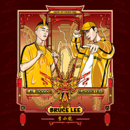

Bruce Lee 李小龙
============================

|  |  |
| :--: | :-- |
| [ Bruce Lee 李小龙](https://emumo.xiami.com/album/2103809508) | **艺人**: [王嘉尔](../index.md) **语种**: 英语 **唱片公司**: 独立发行 **发行时间**: 2018年07月15日 **专辑类别**: EP, 单曲 **专辑风格**: 流行说唱 Pop Rap **播放数**: 9921 **收藏数**: 103 **评论数**: 14  |

## 简介

2018年的夏天，重磅单曲《Bruce Lee 李小龙》横空出世，来自于RED8红八的Al Rocco和Team Wang的王嘉尔携手为大家打响了2018夏季的第一响炮。  
此首歌曲完美诠释了新的中国嘻哈潮流，Al Rocco和王嘉尔很自豪的展现出了融合了中国文化的嘻哈文化。  
由Fader One制作的《Bruce Lee 李小龙》表达了中国人通过自身强大的音乐力量和功夫精神来创建东西方之间的桥梁，并向世界展示了真正的中国力量，让世界知道，我们的出现，是为了打破那些刻板印象，迎接新世界的到来。  
  
Brought to you by Red 8 and Team Wang, Al Rocco and Jackson Wang teams up for a new 2018 summer banger “Bruce Lee 李小龙”. Representing the new Chinese Hip-Hop wave, Rocco and Jackson are proud to bring the Chinese culture back to the basics. Produced by Fader One, “Bruce Lee 李小龙” expresses the strength of the Chinese people through the power of music and kung fu to bridge the gap between east and west presenting to the world that we are strong and we are here to break stereotypes for a new unified world.

## 曲目

## 评论

|  |  |  |  |
| :-- | :-- | :-- | :-- |
|  [虾米用户](https://emumo.xiami.com/u/350066414) 我还没想好要写什么... 2018-08-24 12:10 赞(1) 踩(0) | 
凉凉
 |
|  [虾米用户](https://emumo.xiami.com/u/89070656)   2018-08-10 00:40 赞(4) 踩(0) | 
还不能听啊？都等了个把月了&amp;hellip;&amp;hellip;
 |
|  [虾米用户](https://emumo.xiami.com/u/1967227) ǝnbısnɯ 2018-08-03 08:23 赞(1) 踩(0) | 
竟然没有版权！
 |
|  [虾米用户](https://emumo.xiami.com/u/49640493) 网易云SAINTDONT... 2018-07-26 23:51 赞(1) 踩(0) | 
3
 |
|  [虾米用户](https://emumo.xiami.com/u/242752953)  2018-07-23 15:00 赞(1) 踩(0) | 
不久之后就会免费的了
 |
|  [虾米用户](https://emumo.xiami.com/u/243119323)  2018-07-20 16:10 赞(1) 踩(0) | 
什么时候发出来
 |
|  [虾米用户](https://emumo.xiami.com/u/275182504) to the world 2018-07-18 09:00 赞(2) 踩(0) | 
版权在哪里
 |
| ⇒ |  [虾米用户](https://emumo.xiami.com/u/14800315)  2018-08-07 22:40 赞(0) 踩(0) | 
网易
 |
|  [虾米用户](https://emumo.xiami.com/u/259411204) 虾米，等到会员到期，我就... 2018-07-17 18:23 赞(2) 踩(0) | 
只能微博上听了&amp;hellip;&amp;hellip;
 |
|  [虾米用户](https://emumo.xiami.com/u/2355861) 做只狐狸 2018-07-17 15:40 赞(2) 踩(0) | 
两位男神合体之作，撑你地。
 |
|  [虾米用户](https://emumo.xiami.com/u/99586286) 歌单停滞在2017 2018-07-16 22:33 赞(2) 踩(0) | 
嘻嘻嘻嘻又要去隔壁了
 |
|  [虾米用户](https://emumo.xiami.com/u/262594469)  2018-07-16 21:31 赞(4) 踩(0) | 
表白我嘎
 |
|  [虾米用户](https://emumo.xiami.com/u/121090032) 藏起来 2018-07-16 12:34 赞(3) 踩(0) | 
#
 |
|  [虾米用户](https://emumo.xiami.com/u/202327052)  2018-07-16 12:20 赞(2) 踩(0) | 
支持新歌！嘎嘎
 |
