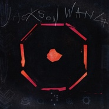

MIRRORS镜子
============================

|  |  |
| :--: | :-- |
| [ MIRRORS镜子](https://emumo.xiami.com/album/2105365755) | **艺人**: [王嘉尔](../index.md) **语种**: 英语 **唱片公司**: TEAM WANG **发行时间**: 2019年10月25日 **专辑类别**: 录音室专辑 **专辑风格**:  **播放数**: 24629 **收藏数**: 119 **评论数**: 15  |

## 简介

◤强力舞台狙击手◢王嘉尔Jackson Wang，   
一路热血奋战，WE STILL GOT TO DO IT !   
他是强力续航「燃」的燃料，   
是永不停止STAY HUNGRY的状态，   
是「尽100分去做」的旺盛生命力！   
  
辗转中、美、韩国际顶尖制作，   
8首歌，8面「镜子」，   
分别映射当代人群不同阶段的情感状态。   
既是拼搏向上的MIRROR，   
也是迷失寻找的MIRROR，   
更是关于王嘉尔自己的MIRROR。   
  
对镜审视，笃定前行，   
拥抱未知冒险。   
无畏前路，击碎结界，   
掌握无限可能的人生主导权！   
  
王嘉尔Jackson Wang首张数字专辑，   
镜像开启！   
  
【WHAT IS THE MIRROR?】   
8首歌，8面「镜子」，更是8个完全懂你内心隐秘情绪的「soulmate」。纠结、痛苦、努力、自信、积极、激情……每一首都照出了你在不同人生阶段内心的真实想法，折射了你不同的心路历程，解读了你心中想说却不知如何表达的情绪。体会内心，才可以走出瓶颈期，烧掉负能量！有王嘉尔陪你一起，不怕！   
  
【WHAT'S THE FEATURE ?】   
东方元素宣扬中国传统文化。本张数字专辑不仅邀请到亚洲兄弟RICH BRIAN强力助阵，还在音乐中展现了中国传统特色的笛声、红色折扇等，以东方特色为歌曲增添精致质感。   
国际顶级制作打造超高水准音乐。新世代配方的声音制作工艺与国际化阵容，加以Alternative、Pop、Trap元素，翻玩实验新音乐。   
强强联手还原最真实内心世界。本张数字专辑中有来自北美最具影响力的客座嘉宾Goldlink，在《BAD BACK》中与王嘉尔再一次碰撞出化学反应，两人截然不同的flow在Boytoy的笛声中交相辉映。王嘉尔做东的这首《BAD BACK》从亚洲的角度出发，尝试了一次与Goldlink那首《Rumble》不同的中西联璧。王嘉尔与作曲家兼好友Boytoy再度携手，表达当代人群在不同阶段的隐秘内心情绪。此前，曾合作《Papillon》《Dawn of us》《Okay》的他们早已默契十足。   
  
【HOW DOES THE MIRROR BRING US TOGETHER？】   
王嘉尔作为吸收多元文化的国际化艺人，融合中国传统文化背景与国际顶级歌曲制作工艺。将每一个听到这首歌的我们，我们的故事，我们的情感，我们的内心连在一起   
  
——Jackson's music bring us together！

## 曲目

## 评论

|  |  |  |  |
| :-- | :-- | :-- | :-- |
|  [虾米用户](https://emumo.xiami.com/u/436681968)  2020-06-04 15:34 赞(0) 踩(0) | 
特别好听
 |
|  [虾米用户](https://emumo.xiami.com/u/34786966) Cream Sherry 2020-05-05 10:35 赞(0) 踩(0) | 
最最最有冲劲的音乐人啊
 |
|  [虾米用户](https://emumo.xiami.com/u/77314124)  2020-04-18 14:35 赞(0) 踩(0) | 
版权在哪里
 |
|  [虾米用户](https://emumo.xiami.com/u/299931782) 遇见谁都没有那么重要，重... 2020-02-22 16:19 赞(1) 踩(0) | 
快毕业了，努力赚钱要买老王更多的专辑。 
 |
|  [虾米用户](https://emumo.xiami.com/u/17407974)  2020-02-19 08:55 赞(0) 踩(0) | 
3000很好听，鉴定完毕   
 |
|  [虾米用户](https://emumo.xiami.com/u/431235084)  2020-01-11 21:22 赞(0) 踩(0) | 
超级优秀
 |
|  [虾米用户](https://emumo.xiami.com/u/95913114) 我还没想好要写什么... 2020-01-10 08:37 赞(0) 踩(0) | 
给钱也行，麻烦赶紧谈谈，拿到版权，好嘛 
 |
|  [虾米用户](https://emumo.xiami.com/u/288592025) 我还没想好要写什么... 2019-12-15 00:26 赞(0) 踩(0) | 
啥时候能听啊，花钱也行
 |
| ⇒ |  [虾米用户](https://emumo.xiami.com/u/299931782) 遇见谁都没有那么重要，重... 2020-01-29 19:24 赞(0) 踩(0) | 
网易云 
 |
|  [虾米用户](https://emumo.xiami.com/u/8532912)  2019-11-30 16:51 赞(0) 踩(0) | 
好想在虾米里听呀～
 |
|  [虾米用户](https://emumo.xiami.com/u/367917322)  2019-11-29 01:36 赞(0) 踩(0) | 
很期待可以聽你的歌在這裡  
 |
|  [虾米用户](https://emumo.xiami.com/u/405688262)  2019-11-20 09:41 赞(0) 踩(0) | 
Awesome
 |
|  [虾米用户](https://emumo.xiami.com/u/143742718) Let it come!... 2019-10-25 12:33 赞(0) 踩(0) | 
Jackson Wang蓄势待发
 |
|  [虾米用户](https://emumo.xiami.com/u/292852088)  2019-10-22 16:35 赞(1) 踩(0) | 
会不会有音源
 |
| ⇒ |  [虾米用户](https://emumo.xiami.com/u/33914721)   2019-10-25 08:55 赞(0) 踩(0) | 
想在网易给钱了
 |
