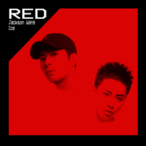

Red
============================

|  |  |
| :--: | :-- |
| [ Red](https://emumo.xiami.com/album/2105846938) | **艺人**: [王嘉尔](../index.md) **语种**: 国语 **唱片公司**: TEAM WANG, seven Gurus **发行时间**: 2019年01月14日 **专辑类别**: EP, 单曲 **专辑风格**:  **播放数**: 63458 **收藏数**: 8 **评论数**: 1  |

## 简介

《Red》由来自Team Wang的王嘉尔和SevenGurus的ICE共同完成词曲创作。完美演绎融合了中国文化和说唱文化。不追逐当下流行热点，以自己的想法和感官为第一出发点，坚持自己的音乐理念，每一次创作都有自己独特的味道。融合了中国文化元素，歌词和曲调无不散发着作为黄皮肤中国人的骄傲，让人热血沸腾。  
“Red” is a song by Jackson Wang and ICE from SevenGurus. This work is a fantastic combination of Hiphop and Chinese culture. The distinguished Chinese elements in lyrics and tune stand out in China’s Hiphop music, expressing the unique understanding of modern youngsters’ attitude.

## 曲目

## 评论

|  |  |  |  |
| :-- | :-- | :-- | :-- |
|  [虾米用户](https://emumo.xiami.com/u/15421593)  2020-06-20 07:54 赞(0) 踩(0) | 
好听，最棒的嘎嘎！
 |
