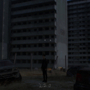

一个人
============================

|  |  |
| :--: | :-- |
| [ 一个人](https://emumo.xiami.com/album/5022620453) | **艺人**: [王嘉尔](../index.md) **语种**: 国语 **唱片公司**: RYCE MUSIC GROUP 白米范文化传播有限公司 **发行时间**: 2021年01月30日 **专辑类别**: EP, 单曲 **专辑风格**: 嘻哈 Hip-Hop **播放数**: 21809 **收藏数**: 24 **评论数**: 12  |

## 简介

<strong>为自我呐喊</strong> <strong>为信念而活</strong>

<strong>直观内心最炙热的初衷坚持</strong>

<strong>最真实深刻的坚强独白</strong>

 

<strong>Jackson王嘉尔</strong>

<strong>最新中文创作单曲《一个人》</strong>

 

<strong>面对困顿的顽强固执</strong> <strong>超越输赢的自我意识</strong>

<strong>走过失败</strong> <strong>跨过伤害</strong>

<strong>原来的我</strong> <strong>还是我</strong>

<strong>就算一个人</strong> <strong>还要继续走</strong>

 

<strong>1.30 全球同步上架</strong>

 

继2020年底Jackson王嘉尔与JJ林俊杰强强联手创作中文单曲《過》，以音乐书写遗憾。2021推出中文系列第二首创作单曲《一个人》，从自我出发，以无惧挑战的强韧信念，炙热初衷，成就今日的“王嘉尔”。

新歌《一个人》由王嘉尔作词作曲，并参与编曲与制作，打破形象揭开真实内心世界。编曲上，Hip-hop/R&amp;B曲风层次堆叠，在王嘉尔独特烟嗓的诠释下，让坦然无畏的精神有了情感加温，再以电吉他拉扯内心的困顿挣扎，这是一个人的王嘉尔，透过音乐展现强大的坚实意念。

透过歌曲，王嘉尔想传达：“路，没人可以代替我们走。有很多时候会迷路、孤独，各种因素会阻止我们前进，但不能半途而废。我们很爱一件事时会不断挑战不断冲，各种的折磨，过程会很辛苦。因为世上没容易的事，但是我们的爱对我们来说，大于了一切，也因此这样，这些疼、伤、苦、恨、冤各种的折磨慢慢变习惯了。”从音乐作品展现的信念气场，是一路走来始终坚持的王嘉尔，能接受失败看淡疼痛，让自己的创作更加饱满充实，愈显成熟也充满力度。

<strong>亲自打造设计《一个人》MV</strong>

<strong>走进时间放大记忆</strong> <strong>微观自我的精准视觉镜头语言</strong>

 

《一个人》MV由王嘉尔亲自执导，从剧本创意、音乐性到视觉风格掌控纯熟。简单的故事线，以最直接的方式让观众感受『一个人』的王嘉尔。一镜到底的MV里是王嘉尔人生这一条路经历过的东西，其实每一个场景、每一个细节、背景的一些元素都浓缩了“王嘉尔”每个重要阶段。

透过《一个人》MV希望让观众遇见也预见最真实的“王嘉尔”。一路坚持下来是因为这是他最爱的事，对一件事的梦想、热情和爱大于了一切，并且每一次的难题都让他变得更坚强。这不单单一个人面对挫折失败的愈挫愈勇，也是王嘉尔的《一个人》从一而终的信念和生活态度。

## 曲目

## 评论

|  |  |  |  |
| :-- | :-- | :-- | :-- |
|  [虾米用户](https://emumo.xiami.com/u/215594260) 一只隐藏的xback(▭... 2021-02-01 14:18 赞(0) 踩(0) | 
嘉尔 你永远不会再是一个人了❤️
 |
|  [虾米用户](https://emumo.xiami.com/u/36934588)  2021-02-01 12:24 赞(0) 踩(0) | 
一个人，26终于终于一个人了，挺好
 |
|  [虾米用户](https://emumo.xiami.com/u/344174224)  2021-02-01 09:35 赞(0) 踩(0) | 
For Jackson, For got7
 |
|  [虾米用户](https://emumo.xiami.com/u/203590612) 我还没想好要写什么... 2021-01-31 20:36 赞(2) 踩(0) | 
虾米还在更新新歌还有人在听新歌那就不是还有我一个人在虾米you can walk again…
 |
|  [虾米用户](https://emumo.xiami.com/u/1945907) Miss 2021-01-31 15:54 赞(0) 踩(0) | 
喜欢嘉尔的嗓音，认真做音乐的态度，还有一直求新求变的突破精神，全平台发歌，谢谢还记得虾米～
 |
|  [虾米用户](https://emumo.xiami.com/u/1945907) Miss 2021-01-31 15:48 赞(0) 踩(0) | 
编曲和嗓音好喜欢～有几句歌词挺打动我～
 |
|  [虾米用户](https://emumo.xiami.com/u/266334421)  2021-01-30 15:33 赞(0) 踩(0) | 
支持你
 |
|  [虾米用户](https://emumo.xiami.com/u/192812819)  2021-01-30 13:01 赞(0) 踩(0) | 
好听 很好听
 |
|  [虾米用户](https://emumo.xiami.com/u/4794779) 闭上眼睛。 2021-01-30 12:29 赞(1) 踩(0) | 
宝贝，愿你每天都快乐。
 |
|  [虾米用户](https://emumo.xiami.com/u/330867774) 我还没想好要写什么... 2021-01-30 12:11 赞(1) 踩(0) | 
TEAM WANGLET'S  MAKE HISTORY难过的路 都要自己走过来 没人能替我们走❤️
 |
|  [虾米用户](https://emumo.xiami.com/u/148457570) 天天动听 ！虾米加油。 2021-01-30 12:05 赞(5) 踩(0) | 
怎么都不像要停服的样子 
 |
| ⇒ |  [虾米用户](https://emumo.xiami.com/u/13526500) Comment ça v... 2021-01-31 12:37 赞(0) 踩(0) | 
是啊woc 
 |
