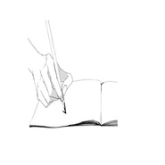
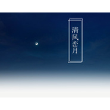

海猫
============================

|  |  |
| :--: | :-- |
| [ 海猫](https://i.xiami.com/qingan) | **播放数**: 1066308 **粉丝数**: 290 **评论数**: 13 **地区**: China 中国大陆 **风格**: 轻音乐 Easy Listening, 新世纪音乐 New Age, 键盘音乐 Keyboard, 独奏 Recital  |

## 档案

## 专辑

| 名称 | 语种 | 唱片公司 | 发行时间 | 专辑类别 | 专辑风格 |
| :--: | :-- | :-- | :-- | :-- | :-- |
| [ 落叶纷飞](./albums/2104794434.md) | 国语 |  | 2019年04月21日 | 录音室专辑 | 器乐独奏 Solo Instrumental, 轻音乐 Easy Listening, 新世纪音乐 New Age |
| [ 清风峦月](./albums/2100335172.md) | 国语 | 独立发行 | 2016年05月12日 | 录音室专辑 | 器乐独奏 Solo Instrumental |

## 评论

|  |  |  |  |
| :-- | :-- | :-- | :-- |
|  [虾米用户](https://emumo.xiami.com/u/3583995) 一個人的戰爭 2020-06-28 22:41 赞(1) 踩(0) | 
.
 |
|  [虾米用户](https://emumo.xiami.com/u/434152246) 聪明少一些大智慧多一些，... 2020-02-05 06:59 赞(1) 踩(0) | 

 |
|  [虾米用户](https://emumo.xiami.com/u/173276890)   2020-01-08 22:37 赞(1) 踩(0) | 
还会有新专辑吗
 |
|  [虾米用户](https://emumo.xiami.com/u/10537792)  2019-10-18 05:46 赞(1) 踩(0) | 
✨
 |
|  [虾米用户](https://emumo.xiami.com/u/337185561) 离别倒计时。无妨。 2019-08-29 00:29 赞(1) 踩(0) | 
你真的很棒。。。应该是很温柔的人呢
 |
|  [虾米用户](https://emumo.xiami.com/u/404793153)  2019-05-14 02:49 赞(1) 踩(0) | 
海猫的轻音乐真的都太美了，这么动听的音乐为什么没有红？
 |
|  [虾米用户](https://emumo.xiami.com/u/406106335) 恶魔的契约 2018-12-13 00:53 赞(1) 踩(0) | 
      
 |
|  [虾米用户](https://emumo.xiami.com/u/337725860) 摆脱他人的期待，成长为真... 2018-01-16 20:01 赞(1) 踩(0) | 
意外听到你的音乐，是那种缓缓道来，走进人心的音乐，每一首歌都是一个故事，给我很大力量。喜欢。感谢。
 |
|  [虾米用户](https://emumo.xiami.com/u/8865162) Freedom 2017-11-27 18:52 赞(1) 踩(0) | 
简简单单就是你
 |
|  [虾米用户](https://emumo.xiami.com/u/201391232) 最快的方法是先抱抱 2017-07-13 22:13 赞(1) 踩(0) | 
很喜歡海貓的音樂
 |
|  [虾米用户](https://emumo.xiami.com/u/99390312) 新世纪音乐 2017-07-07 19:52 赞(3) 踩(0) | 
特别想认识你
 |
|  [虾米用户](https://emumo.xiami.com/u/24164898)  2016-05-12 14:51 赞(3) 踩(0) | 
太喜欢啦~~   很舒服的音乐  大神啊~
 |
|  [虾米用户](https://emumo.xiami.com/u/24164898)  2016-05-12 14:50 赞(3) 踩(0) | 
很有大师风范，他的音乐能让人心静下来
 |
