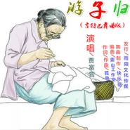

贾富营
============================

|  |  |
| :--: | :-- |
| [ 贾富营](https://i.xiami.com/jwan155) | **播放数**: 9942775 **粉丝数**: 320 **评论数**: 21 **地区**: China 中国大陆 **风格**: 国语流行 Mandarin Pop  |

## 档案

贾富营、网络当红华语流行男歌手、词曲、唱作音乐人、1971年出生在河北省廊坊市大城县、现居住在河北省保定市，民族：汉族：华语流行男歌手：曾参加多次国内歌曲比赛，获得多个奖项，代表作品《孤独的等待》、《需要你陪》《爱你的人泪在流》、《想起妈妈泪如雨》《如今的你去了哪里》等、基本资料，中文名：贾富营：生日：1971-03-03，代表作品：《需要你陪》别名：熊哥，国籍：中国，星座：双鱼：民族：汉族：出生地：河北省廊坊市大城县，经纪公司：上海雨陌文化传媒。 
基本资料 
中文名：贾富营；生日：1971-03-03、代表作品：《需要你陪》、别名：熊哥、国籍：中国；出生地：河北省廊坊市大城县、经纪公司：雨陌文化传媒。

## 专辑

| 名称 | 语种 | 唱片公司 | 发行时间 | 专辑类别 | 专辑风格 |
| :--: | :-- | :-- | :-- | :-- | :-- |
| [ 告诉自己不要再哭](./albums/2105057184.md) | 国语 | 雨陌文化 | 2019年08月05日 | 录音室专辑 | 国语流行 Mandarin Pop |
| [ 不再为爱情伤心落泪](./albums/2104846143.md) | 国语 | 雨陌文化 | 2019年05月07日 | EP, 单曲 |  |
| [ 我把思念寄在月亮上](./albums/2104821692.md) | 国语 |  | 2019年04月27日 | 录音室专辑 | 国语流行 Mandarin Pop |
| [ 我把思念寄在月亮上（对唱版）](./albums/2104765419.md) | 国语 |  | 2019年04月11日 | 录音室专辑 | 国语流行 Mandarin Pop |
| [ 缘聚](./albums/2104765175.md) | 国语 |  | 2019年04月11日 | 录音室专辑 | 国语流行 Mandarin Pop |
| [ 爱怎么这样没有道理](./albums/2104765393.md) | 国语 |  | 2019年04月11日 | 录音室专辑 | 国语流行 Mandarin Pop |
| [ 泪为谁滴（对唱版）](./albums/2104737092.md) | 国语 | 独立发行 | 2019年04月02日 | EP, 单曲 | 国语流行 Mandarin Pop |
| [ 爱的歌谣](./albums/2104737087.md) | 国语 | 独立发行 | 2019年04月02日 | EP, 单曲 | 国语流行 Mandarin Pop |
| [ 我把思念寄在月亮上（对唱版）](./albums/2104726935.md) | 国语 | 雨陌文化 | 2019年03月26日 | EP, 单曲 | 国语流行 Mandarin Pop |
| [ 爱怎么这样没道理（对唱版）](./albums/2104726914.md) | 国语 | 雨陌文化 | 2019年03月26日 | EP, 单曲 | 国语流行 Mandarin Pop |
| [ 不再为爱情伤心落泪](./albums/2104638862.md) | 国语 |  | 2019年02月27日 | 录音室专辑 | 国语流行 Mandarin Pop |
| [ 守望星光](./albums/2104525667.md) | 国语 |  | 2019年01月23日 | 录音室专辑 | 国语流行 Mandarin Pop |
| [ 爱不用表白](./albums/2104399853.md) | 国语 | 雨陌文化 | 2018年12月21日 | 录音室专辑 | 国语流行 Mandarin Pop |
| [ 年夜酒（对唱版)](./albums/2104380055.md) | 国语 | 雨陌文化 | 2018年12月15日 | 录音室专辑 | 国语流行 Mandarin Pop |
| [ 我的傻丫头](./albums/2104362752.md) | 国语 | 雨陌文化 | 2018年12月10日 | 录音室专辑 | 国语流行 Mandarin Pop |
| [ 年夜酒](./albums/2104289650.md) | 国语 |  | 2018年11月27日 | 录音室专辑 | 国语流行 Mandarin Pop |
| [ 今晚不流昨夜的泪](./albums/2104199190.md) | 国语 | 雨陌文化 | 2018年11月11日 | 录音室专辑 | 国语流行 Mandarin Pop |
| [ 亲爱的你到底在哪里](./albums/2104044311.md) | 国语 | 雨陌文化 | 2018年09月21日 | 录音室专辑 | 国语流行 Mandarin Pop |
| [ 你是一汪多情的水（对唱版)](./albums/2104018741.md) | 国语 | 雨陌文化 | 2018年09月12日 | 录音室专辑 | 国语流行 Mandarin Pop |
| [ 你是一汪多情的水](./albums/2104011205.md) | 国语 | 雨陌文化 | 2018年09月10日 | 录音室专辑 | 国语流行 Mandarin Pop |
| [ 一生陪伴你（对唱版)](./albums/2103982128.md) | 国语 | 雨陌文化 | 2018年09月05日 | 录音室专辑 | 国语流行 Mandarin Pop |
| [ 北方的雪南方的雨（对唱版)](./albums/2103965991.md) | 国语 | 雨陌文化 | 2018年09月02日 | 录音室专辑 | 国语流行 Mandarin Pop |
| [ 北方的雪南方的雨](./albums/2103922627.md) | 国语 | 雨陌文化 | 2018年08月13日 | 录音室专辑 | 国语流行 Mandarin Pop |
| [ 为爱哭过一千次](./albums/2103922622.md) | 国语 | 雨陌文化 | 2018年08月13日 | 录音室专辑 | 国语流行 Mandarin Pop |
| [ 一生陪伴你](./albums/2103902244.md) | 国语 | 雨陌文化 | 2018年08月07日 | 录音室专辑 | 国语流行 Mandarin Pop |
| [ 美丽的唐山我的家](./albums/2103901897.md) | 国语 | 雨陌文化 | 2018年08月07日 | 录音室专辑 | 国语流行 Mandarin Pop |
| [ 你就是那负心人 (对唱版)](./albums/2103901894.md) | 国语 | 雨陌文化 | 2018年08月06日 | 录音室专辑 | 国语流行 Mandarin Pop |
| [ 只在乎你的温度](./albums/2103771199.md) | 国语 | 雨陌文化 | 2018年06月30日 | 录音室专辑 | 国语流行 Mandarin Pop |
| [ 你就是那负心人](./albums/2103716362.md) | 国语 | 雨陌文化 | 2018年05月22日 | 录音室专辑 | 国语流行 Mandarin Pop |
| [ 钱钱钱](./albums/2103702481.md) | 国语 | 雨陌文化 | 2018年05月05日 | 录音室专辑 | 国语流行 Mandarin Pop |
| [ 爱我就别伤害我](./albums/2103689089.md) | 国语 | 雨陌文化 | 2018年04月18日 | 录音室专辑 | 国语流行 Mandarin Pop |
| [ 你是我最好的兄弟](./albums/2103674828.md) | 国语 | 雨陌文化 | 2018年04月09日 | 录音室专辑 | 国语流行 Mandarin Pop |
| [ 最美的缘分遇到你](./albums/2103649343.md) | 国语 | 雨陌文化 | 2018年03月28日 | 录音室专辑 | 国语流行 Mandarin Pop |
| [ 如今的你去了哪里](./albums/2103498054.md) | 国语 | 雨陌文化 | 2018年01月22日 | 录音室专辑 | 国语流行 Mandarin Pop |
| [ 姥爷抱一抱](./albums/2103488673.md) | 国语 | 雨陌文化 | 2018年01月12日 | 录音室专辑 | 儿歌 Nursery Rhyme |
| [ 笨丫笨仔（对唱版)](./albums/2103467756.md) | 国语 | 雨陌文化 | 2018年01月04日 | 录音室专辑 | 国语流行 Mandarin Pop |
| [ 笨丫和笨仔](./albums/2103466369.md) | 国语 | 雨陌文化 | 2018年01月02日 | 录音室专辑 | 国语流行 Mandarin Pop |
| [ 想起妈妈泪如雨](./albums/2103463962.md) | 国语 | 雨陌文化 | 2017年12月27日 | 录音室专辑 | 国语流行 Mandarin Pop |
| [ 情路已断](./albums/2102975472.md) | 国语 | 雨陌文化 | 2017年12月15日 | 录音室专辑 | 国语流行 Mandarin Pop |
| [ 今夜的我又要去何方（杨丽萍舞曲版）](./albums/2102914686.md) | 国语 | 雨陌文化 | 2017年11月07日 | 录音室专辑 | 国语流行 Mandarin Pop |
| [ 今夜的我又要去何方](./albums/2102905848.md) | 国语 | 雨陌文化 | 2017年11月05日 | 录音室专辑 | 国语流行 Mandarin Pop |
| [ 我的大城我的家](./albums/2102877781.md) | 国语 | 雨陌文化 | 2017年10月22日 | EP, 单曲 | 国语流行 Mandarin Pop |
| [ 痴情的牵挂](./albums/2102870585.md) | 国语 | 雨陌文化 | 2017年10月11日 | EP, 单曲 | 国语流行 Mandarin Pop |
| [ 爱你的人泪在流（DJ版)](./albums/2102864759.md) | 国语 | 雨陌文化 | 2017年09月27日 | 录音室专辑 | 国语流行 Mandarin Pop |
| [ 我爱的姑娘嫁给我](./albums/2102864120.md) | 国语 | 雨陌文化 | 2017年09月26日 | 录音室专辑 | 国语流行 Mandarin Pop |
| [ 爱你的人泪在流](./albums/2102860529.md) | 国语 | 雨陌文化 | 2017年09月20日 | 录音室专辑 | 国语流行 Mandarin Pop |
| [ 错过就错过](./albums/2102811000.md) | 国语 | 雨陌文化 | 2017年08月08日 | 录音室专辑 | 国语流行 Mandarin Pop |
| [ 柔情的牢](./albums/2102809197.md) | 国语 | 雨陌文化 | 2017年08月05日 | 录音室专辑 | 国语流行 Mandarin Pop |
| [ 爸的胸口妈的手](./albums/2102804717.md) | 国语 | 雨陌文化 | 2017年07月28日 | 录音室专辑 | 国语流行 Mandarin Pop |
| [ 新婚曲](./albums/2102799814.md) | 国语 | 雨陌文化 | 2017年07月20日 | 录音室专辑 | 国语流行 Mandarin Pop |
| [ 相遇的结局(对唱版)](./albums/2102798589.md) | 国语 | 雨陌文化 | 2017年07月18日 | 录音室专辑 | 国语流行 Mandarin Pop |
| [ 到底爱还是不爱](./albums/2102798584.md) | 国语 | 雨陌文化 | 2017年07月18日 | 录音室专辑 | 国语流行 Mandarin Pop |
| [ 孤独的等待](./albums/2102779075.md) | 国语 | 雨陌文化 | 2017年07月07日 | 录音室专辑 | 国语流行 Mandarin Pop |
| [ 金钱的魔力](./albums/2102770121.md) | 国语 | 雨陌文化 | 2017年06月21日 | 录音室专辑 | 国语流行 Mandarin Pop |
| [ 我错过了缘分就错过了你](./albums/2102759720.md) | 国语 | 雨陌文化 | 2017年06月05日 | 录音室专辑 | 国语流行 Mandarin Pop |
| [ 我要去南疆](./albums/2102758026.md) | 国语 | 雨陌文化 | 2017年06月02日 | 录音室专辑 | 国语流行 Mandarin Pop |
| [ 人生不能没有爱](./albums/2102748868.md) | 国语 | 雨陌文化 | 2017年05月16日 | 录音室专辑 | 国语流行 Mandarin Pop |
| [ 有你的日子好幸福](./albums/2102748885.md) | 国语 | 雨陌文化 | 2017年05月16日 | 录音室专辑 | 国语流行 Mandarin Pop |
| [ 相欠的拥抱（广场舞曲版）](./albums/2102734031.md) | 国语 | 雨陌文化 | 2017年04月18日 | 录音室专辑 | 国语流行 Mandarin Pop |
| [ 相欠的拥抱](./albums/2102734026.md) | 国语 | 雨陌文化 | 2017年04月18日 | 录音室专辑 | 国语流行 Mandarin Pop |
| [ 贾富营《笑看尘世有尘埃》DJ舞曲](./albums/2102729556.md) | 国语 | 雨陌文化 | 2017年04月10日 | EP, 单曲 | 国语流行 Mandarin Pop |
| [ 贾富营《男人有了钱你就变了坏》吉特巴舞曲版](./albums/2102723656.md) | 国语 | 雨陌文化 | 2017年03月29日 | EP, 单曲 | 国语流行 Mandarin Pop |
| [ 贾富营《男人有了钱你就变了坏》发行版](./albums/2102722261.md) | 国语 | 雨陌文化 | 2017年03月27日 | EP, 单曲 | 国语流行 Mandarin Pop |
| [ 贾富营《男人有了钱你就变了坏》DJ版](./albums/2102722271.md) | 国语 | 雨陌文化 | 2017年03月27日 | EP, 单曲 | 国语流行 Mandarin Pop |
| [ 贾富营《男人有了钱你就变了坏》快四舞曲版](./albums/2102722268.md) | 国语 | 雨陌文化 | 2017年03月27日 | EP, 单曲 | 国语流行 Mandarin Pop |
| [ 贾富营《男人有了钱你就变了坏》火爆舞曲版](./albums/2102722549.md) | 国语 | 雨陌文化 | 2017年03月27日 | EP, 单曲 | 国语流行 Mandarin Pop |
| [ 贾富营（爱的悲哀）摇并舞曲版](./albums/2102695212.md) | 国语 | 雨陌文化 | 2017年02月17日 | EP, 单曲 |  |
| [ 贾富营（草原香姑娘）舞曲版](./albums/2102681385.md) | 国语 | 雨陌文化 | 2017年01月16日 | EP, 单曲 | 国语流行 Mandarin Pop |
| [ 贾富营/望海高歌（过年话）劲爆舞曲版](./albums/2102679821.md) | 国语 | 雨陌文化 | 2017年01月13日 | EP, 单曲 | 国语流行 Mandarin Pop |
| [ 贾富营（游子归）吉特巴舞曲版](./albums/2102679914.md) | 国语 | 雨陌文化 | 2017年01月13日 | EP, 单曲 | 国语流行 Mandarin Pop |
| [ 贾富营/望海高歌（过年话）舞曲版](./albums/2102679806.md) | 国语 | 雨陌文化 | 2017年01月13日 | EP, 单曲 | 国语流行 Mandarin Pop |
| [ 贾富营（相遇一个你））广场舞曲版](./albums/2102678854.md) | 国语 | 雨陌文化 | 2017年01月11日 | EP, 单曲 | 国语流行 Mandarin Pop |
| [ 贾富营（相遇一个你）发行版](./albums/2102678853.md) | 国语 | 雨陌文化 | 2017年01月11日 | EP, 单曲 | 国语流行 Mandarin Pop |
| [ 贾富营＆望海高歌（过年话）广场舞曲版](./albums/2102678515.md) | 国语 | 雨陌文化 | 2017年01月10日 | EP, 单曲 | 国语流行 Mandarin Pop |
| [ 贾富营/望海高歌（过年话）吉特巴舞曲版](./albums/2102678532.md) | 国语 | 雨陌文化 | 2017年01月10日 | EP, 单曲 | 国语流行 Mandarin Pop |
| [ 贾富营＆望海高歌（过年话）恰恰舞曲版](./albums/2102678521.md) | 国语 | 雨陌文化 | 2017年01月10日 | EP, 单曲 | 国语流行 Mandarin Pop |
| [ 贾富营＆望海高歌（过年话）DJ版](./albums/2102678537.md) | 国语 | 雨陌文化 | 2017年01月10日 | EP, 单曲 | 国语流行 Mandarin Pop |
| [ 贾富营＆望海高歌（过年话）火爆舞曲版](./albums/2102678510.md) | 国语 | 雨陌文化 | 2017年01月10日 | EP, 单曲 | 国语流行 Mandarin Pop |
| [ 贾富营＆望海高歌（过年话）舞曲版](./albums/2102678527.md) | 国语 | 雨陌文化 | 2017年01月10日 | EP, 单曲 | 国语流行 Mandarin Pop |
| [ 贾富营＆望海高歌（一声兄弟一生情意）DJ舞曲版](./albums/2102674891.md) | 国语 | 雨陌文化 | 2017年01月08日 | EP, 单曲 | 国语流行 Mandarin Pop |
| [ 贾富营＆望海高歌（过年话）发行版](./albums/2102677351.md) | 国语 | 雨陌文化 | 2017年01月07日 | EP, 单曲 | 国语流行 Mandarin Pop |
| [ 贾富营（游子归）KTV发行版](./albums/2102677132.md) | 国语 | 雨陌文化 | 2017年01月06日 | EP, 单曲 | 国语流行 Mandarin Pop |
| [ 贾富营（游子归）火爆舞曲版](./albums/2102675884.md) | 国语 | 雨陌文化 | 2017年01月04日 | EP, 单曲 | 国语流行 Mandarin Pop |
| [ 贾富营＆望海高歌（一声兄弟一生情意）广场舞曲版](./albums/2102674888.md) | 国语 | 雨陌文化 | 2017年01月02日 | EP, 单曲 | 国语流行 Mandarin Pop |
| [ 贾富营（游子归）DJ舞曲版](./albums/2102674919.md) | 国语 | 雨陌文化 | 2017年01月02日 | EP, 单曲 | 国语流行 Mandarin Pop |
| [ 贾富营（我是性情中人）广场舞曲版](./albums/2102674765.md) | 国语 | 雨陌文化 | 2017年01月01日 | EP, 单曲 | 国语流行 Mandarin Pop |
| [ 贾富营（真的无法原谅你）DJ版](./albums/2102674565.md) | 国语 | 雨陌文化 | 2016年12月31日 | EP, 单曲 | 国语流行 Mandarin Pop |
| [ 贾富营（游子归）广场舞曲版](./albums/2102674479.md) | 国语 | 雨陌文化 | 2016年12月30日 | EP, 单曲 | 国语流行 Mandarin Pop |
| [ 真的无法原谅你（广场舞曲版）](./albums/2102673625.md) | 国语 | 雨陌文化 | 2016年12月28日 | EP, 单曲 |  |
| [ 贾富营（爱的悲哀）广场舞曲版](./albums/2102671359.md) | 国语 | 雨陌文化 | 2016年12月23日 | EP, 单曲 | 国语流行 Mandarin Pop |
| [ 贾富营（我想去草原）广场舞曲版](./albums/2100372570.md) | 国语 | 雨陌文化 | 2016年12月22日 | EP, 单曲 |  |
| [ 贾富营（爱的悲哀）KTV发行版](./albums/2102670907.md) | 国语 | 雨陌文化 | 2016年12月22日 | EP, 单曲 | 国语流行 Mandarin Pop |
| [ 爱的悲哀（舞曲版）](./albums/2102670908.md) | 国语 | 雨陌文化 | 2016年12月22日 | EP, 单曲 | 国语流行 Mandarin Pop |
| [ 男人真的累](./albums/2103609904.md) | 国语 | 酝星文化 | 2016年12月19日 | EP, 单曲 |  |
| [ 红陌（今年大吉）dj舞曲版](./albums/2102664335.md) | 国语 | 雨陌文化 | 2016年12月15日 | EP, 单曲 | 国语流行 Mandarin Pop |
| [ 红陌（今年大吉）广场舞曲版](./albums/2102664334.md) | 国语 | 雨陌文化 | 2016年12月15日 | EP, 单曲 | 浩室舞曲 House |
| [ 贾富营（男人真的累）KTV发行版](./albums/2102664337.md) | 国语 | 雨陌文化 | 2016年12月15日 | EP, 单曲 | 国语流行 Mandarin Pop |
| [ 贾富营（紫藤花开）广场舞曲版](./albums/2102661276.md) | 国语 | 雨陌文化 | 2016年12月08日 | EP, 单曲 |  |
| [ 贾富营（梦离别）广场舞曲版](./albums/2102660609.md) | 国语 | 雨陌文化 | 2016年12月07日 | EP, 单曲 |  |
| [ 贾富营/望海高歌（今年大吉）快四舞曲版](./albums/2102660799.md) | 国语 | 雨陌文化 | 2016年12月07日 | 录音室专辑 |  |
| [ 贾富营/烟雨红颜（我是歌者）对唱版](./albums/2102660601.md) | 国语 | 雨陌文化 | 2016年12月07日 | EP, 单曲 |  |
| [ 贾富营（你真的是我的爱）舞曲版](./albums/2102660797.md) | 国语 | 雨陌文化 | 2016年12月07日 | EP, 单曲 |  |
| [ 贾富营（一切都是我的错）广场舞曲版](./albums/2102659580.md) | 国语 | 雨陌文化 | 2016年12月05日 | EP, 单曲 |  |
| [ 贾富营（男人真的累）快四舞曲版](./albums/2102659578.md) | 国语 | 雨陌文化 | 2016年12月05日 | EP, 单曲 |  |
| [ 贾富营（需要你陪）广场舞曲版](./albums/2102659577.md) | 国语 | 雨陌文化 | 2016年12月05日 | EP, 单曲 |  |
| [ 贾富营（一切都是我的错）发行版](./albums/2102659333.md) | 国语 | 雨陌文化 | 2016年12月04日 | EP, 单曲 |  |
| [ 贾富营（一切都是我的错）舞曲版](./albums/2102659331.md) | 国语 | 雨陌文化 | 2016年12月04日 | EP, 单曲 |  |
| [ 红陌（草原香姑娘）广场舞曲版](./albums/2102659140.md) | 国语 | 雨陌文化 | 2016年12月03日 | EP, 单曲 |  |
| [ 贾富营（男人真的累）广场舞曲版](./albums/2102659139.md) | 国语 | 雨陌文化 | 2016年12月03日 | EP, 单曲 |  |
| [ 贾富营（男人真的累）ＤＪ舞曲版](./albums/2102659069.md) | 国语 | 雨陌文化 | 2016年12月02日 | EP, 单曲 |  |
| [ 贾富营（男人真的累）火爆舞曲版](./albums/2102659092.md) | 国语 | 雨陌文化 | 2016年12月02日 | EP, 单曲 |  |
| [ 贾富营（草原情话）广场舞曲版](./albums/2102658662.md) | 国语 | 雨陌文化 | 2016年12月01日 | EP, 单曲 |  |
| [ 贾富营/望海高歌（今年大吉）劲爆舞曲版](./albums/2102658647.md) | 国语 | 雨陌文化 | 2016年12月01日 | EP, 单曲 |  |
| [ 贾富营/望海高歌（今年大吉）快四舞曲版](./albums/2102658649.md) | 国语 | 雨陌文化 | 2016年12月01日 | EP, 单曲 |  |
| [ 贾富营（笑看尘世有尘埃）舞曲版](./albums/2102658586.md) | 国语 | 雨陌文化 | 2016年12月01日 | EP, 单曲 |  |
| [ 贾富营/望海高歌（今年大吉）舞曲版](./albums/2102658219.md) | 国语 | 雨陌文化 | 2016年11月30日 | EP, 单曲 |  |
| [ 贾富营/望海高歌（今年大吉）广场舞版](./albums/2102657424.md) | 国语 | 雨陌文化 | 2016年11月29日 | EP, 单曲 |  |
| [ 贾富营（无眠的夜里）广场舞版](./albums/2102657405.md) | 国语 | 雨陌文化 | 2016年11月29日 | EP, 单曲 |  |
| [ 贾富营/望海高歌（我是歌者）广场舞版](./albums/2102657399.md) | 国语 | 雨陌文化 | 2016年11月29日 | EP, 单曲 |  |
| [ 贾富营/望海高歌（今年大吉）吉特巴舞曲版](./albums/2102657415.md) | 国语 | 雨陌文化 | 2016年11月29日 | EP, 单曲 |  |
| [ 贾富营/望海高歌（今年大吉）中四舞曲版](./albums/2102657396.md) | 国语 | 雨陌文化 | 2016年11月29日 | EP, 单曲 |  |
| [ 贾富营/望海高歌（今年大吉）DJ版](./albums/2102656731.md) | 国语 | 雨陌文化 | 2016年11月25日 | EP, 单曲 |  |
| [ 贾富营/望海高歌-今年大吉（发行版）](./albums/2102656729.md) | 国语 | 雨陌文化 | 2016年11月25日 | EP, 单曲 |  |
| [ 我是歌者（舞曲版）](./albums/2102655204.md) | 国语 | 雨陌文化 | 2016年11月21日 | EP, 单曲 |  |
| [ 相遇的结局（舞曲发行版）](./albums/2102651363.md) | 国语 | 雨陌文化 | 2016年11月10日 | EP, 单曲 |  |
| [ 草原情话（舞曲版）](./albums/2102643948.md) | 国语 | 雨陌文化 | 2016年11月04日 | EP, 单曲 |  |
| [ 我要闯天涯（吉特巴舞曲版）](./albums/2102643958.md) | 国语 | 雨陌文化 | 2016年11月04日 | EP, 单曲 |  |
| [ 我要闯天涯（伦巴舞曲版）](./albums/2102643955.md) | 国语 | 雨陌文化 | 2016年11月04日 | EP, 单曲 |  |
| [ 草原香姑娘（快四舞曲版）](./albums/2102643942.md) | 国语 | 雨陌文化 | 2016年11月03日 | EP, 单曲 |  |
| [ 我是歌者（发行版）](./albums/2102643336.md) | 国语 | 雨陌文化 | 2016年11月02日 | EP, 单曲 |  |
| [ 需要你陪（舞曲版）](./albums/2102640740.md) | 国语 | 雨陌文化 | 2016年10月29日 | EP, 单曲 |  |
| [ 草原情话（吉特巴舞曲版）](./albums/2102414166.md) | 国语 | 雨陌文化 | 2016年10月27日 | EP, 单曲 |  |
| [ 你真的是我的爱（三步踩舞曲）](./albums/2102414358.md) | 粤语 | 雨陌文化 | 2016年10月27日 | EP, 单曲 | 粤语流行 Cantopop |
| [ 我要闯天涯（舞曲版）](./albums/2102414295.md) | 国语 | 雨陌文化 | 2016年10月27日 | EP, 单曲 |  |
| [ 你真的是我的爱（舞曲版）](./albums/2102414200.md) | 国语 | 雨陌文化 | 2016年10月27日 | EP, 单曲 |  |
| [ 我要闯天涯（吉特巴舞曲版）](./albums/2102414179.md) | 国语 | 雨陌文化 | 2016年10月27日 | EP, 单曲 |  |
| [ 我想去草原](./albums/2102413457.md) | 国语 | 雨陌文化 | 2016年10月26日 | EP, 单曲 |  |
| [ 草原情话（舞曲版）](./albums/2102412684.md) | 国语 | 雨陌文化 | 2016年10月25日 | EP, 单曲 |  |
| [ 草原香姑娘（吉特巴舞曲版）](./albums/2102411937.md) | 国语 | 雨陌文化 | 2016年10月24日 | EP, 单曲 |  |
| [ 真的无法原谅你（舞曲版）](./albums/2102411965.md) | 国语 | 雨陌文化 | 2016年10月24日 | EP, 单曲 |  |
| [ 我要闯天涯](./albums/2102411914.md) | 国语 | 雨陌文化 | 2016年10月24日 | EP, 单曲 |  |
| [ 一声兄弟一生情意（舞曲版）](./albums/2102411928.md) | 国语 | 雨陌文化 | 2016年10月24日 | EP, 单曲 |  |
| [ 草原情话（伴奏）](./albums/2102411440.md) | 国语 | 雨陌文化 | 2016年10月23日 | EP, 单曲 |  |
| [ 草原香姑娘（舞曲版）](./albums/2102410857.md) | 国语 | 雨陌文化 | 2016年10月22日 | EP, 单曲 |  |
| [ 草原香姑娘（dj版）](./albums/2102409868.md) | 国语 | 雨陌文化 | 2016年10月20日 | EP, 单曲 |  |
| [ 你真的是我的爱](./albums/2102409844.md) | 国语 | 雨陌文化 | 2016年10月20日 | EP, 单曲 |  |
| [ 紫藤花开（舞曲版）](./albums/2102409860.md) | 国语 | 雨陌文化 | 2016年10月20日 | EP, 单曲 |  |
| [ 草原香姑娘](./albums/2102409853.md) | 国语 | 雨陌文化 | 2016年10月20日 | EP, 单曲 |  |
| [ 紫藤花开](./albums/2100376385.md) | 国语 | 雨陌文化 | 2016年07月29日 | EP, 单曲 |  |
| [ 无眠的夜里（发行版）](./albums/2100368748.md) | 国语 | 雨陌文化 | 2016年07月15日 | EP, 单曲 |  |
| [ 别把我看透](./albums/2100365685.md) | 国语 | 雨陌文化 | 2016年06月25日 | EP, 单曲 |  |
| [ 一声兄弟一生情意](./albums/2100365682.md) | 国语 | 雨陌文化 | 2016年06月20日 | EP, 单曲 |  |
| [ 我是性情中人](./albums/2100348578.md) | 国语 | 雨陌文化 | 2016年05月25日 | EP, 单曲 |  |
| [ 相遇的结局](./albums/2100348572.md) | 国语 | 雨陌文化 | 2016年05月19日 | EP, 单曲 |  |
| [ 需要你陪](./albums/2100348577.md) | 国语 | 雨陌文化 | 2016年05月09日 | EP, 单曲 |  |
| [ 梦离别](./albums/2100348568.md) | 国语 | 雨陌文化 | 2016年02月02日 | EP, 单曲 |  |
| [ 笑看尘世有尘埃](./albums/2100348562.md) | 国语 | 雨陌文化 | 2016年01月29日 | EP, 单曲 |  |

## 评论

|  |  |  |  |
| :-- | :-- | :-- | :-- |
|  [虾米用户](https://emumo.xiami.com/u/351319667) 感恩在此相遇！ 2020-04-30 20:25 赞(0) 踩(0) | 
好听！
 |
|  [虾米用户](https://emumo.xiami.com/u/358104299) 悲观的唯心存在现实解构虚... 2019-04-23 22:28 赞(1) 踩(0) | 
10756
 |
|  [虾米用户](https://emumo.xiami.com/u/293692544) 你敢给我说话吗？我咬你 2019-01-30 17:10 赞(3) 踩(0) | 
好听
 |
|  [虾米用户](https://emumo.xiami.com/u/352961863)  2019-01-18 22:59 赞(3) 踩(0) | 
唱的真好听，棒棒哒
 |
|  [虾米用户](https://emumo.xiami.com/u/334896664)  2019-01-15 01:47 赞(2) 踩(0) | 
一直都喜欢你的歌
 |
|  [虾米用户](https://emumo.xiami.com/u/325374787)  2018-12-11 09:02 赞(1) 踩(0) | 
   
 |
|  [虾米用户](https://emumo.xiami.com/u/375527468)  2018-10-30 19:41 赞(3) 踩(0) | 
唱的太好了
 |
|  [虾米用户](https://emumo.xiami.com/u/293692544) 你敢给我说话吗？我咬你 2018-10-03 18:17 赞(2) 踩(0) | 
好听
 |
|  [虾米用户](https://emumo.xiami.com/u/293692544) 你敢给我说话吗？我咬你 2018-09-10 05:20 赞(1) 踩(0) | 
好听
 |
|  [虾米用户](https://emumo.xiami.com/u/307263445)  2018-07-22 16:21 赞(3) 踩(0) | 
你的歌很好听，附有磁性的男人的声音，音域宽广磅礴大气，高亢嘹亮，
 |
|  [虾米用户](https://emumo.xiami.com/u/293692544) 你敢给我说话吗？我咬你 2018-06-26 16:51 赞(2) 踩(0) | 
好听
 |
|  [虾米用户](https://emumo.xiami.com/u/271169707) 找个爱人的啊 2018-02-12 08:24 赞(3) 踩(0) | 
好听你好棒哒
 |
|  [虾米用户](https://emumo.xiami.com/u/332963177)  2017-11-16 14:21 赞(4) 踩(0) | 
唱出了蒙古味了！赞 
 |
|  [虾米用户](https://emumo.xiami.com/u/274127353)  2017-03-22 03:44 赞(3) 踩(0) | 
棒棒歌声不错额！
 |
|  [虾米用户](https://emumo.xiami.com/u/173207278) 内地华语男歌手、代表作品... 2016-07-27 12:34 赞(6) 踩(0) | 
我刚入驻了虾米音乐人，欢迎大家来我的个人主页，收听我的最新音乐
 |
| ⇒ |  [虾米用户](https://emumo.xiami.com/u/38918617) 你相信我，我相信你 2017-01-05 17:11 赞(0) 踩(0) | 
您好，游子吟这张EP 为什么给虾米的和给其他播放器的不一样 曲目少了 时长也不对 ~~还有大哥您的专辑 歌曲命名方式不太规范嗄 ~~
 |
| ⇒ |  [虾米用户](https://emumo.xiami.com/u/273743482) 爱我的为我而死，我爱的却... 2017-02-16 17:10 赞(0) 踩(0) | 
你好，初次见面，请多多关照
 |
|  [虾米用户](https://emumo.xiami.com/u/77390820)  2016-07-16 11:19 赞(2) 踩(0) | 
今年流行的帅哥，唱的真不赖！
 |
|  [虾米用户](https://emumo.xiami.com/u/77390820)  2016-07-16 11:17 赞(2) 踩(0) | 
正淘宝呢，忽然发现有个帅男，挤过来看看，哦，唱的几首歌真棒！
 |
|  [虾米用户](https://emumo.xiami.com/u/153629444) 上海雨陌文化传媒有限公司 2016-06-01 13:45 赞(4) 踩(0) | 
就是喜欢
 |
| ⇒ |  [虾米用户](https://emumo.xiami.com/u/274127353)  2017-03-22 03:45 赞(0) 踩(0) | 
歌声棒棒哒
 |
