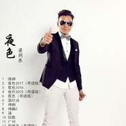

夜色精选2017精选专辑
============================

|  |  |
| :--: | :-- |
| [ 夜色精选2017精选专辑](https://emumo.xiami.com/album/2102659653) | **艺人**: [梁剑东](../index.md) **语种**: 国语 **唱片公司**: 三吉世盛 **发行时间**: 2016年12月05日 **专辑类别**: 录音室专辑 **专辑风格**: 粤语流行 Cantopop, 电音流行 Electropop, 流行舞曲 Dance-Pop **播放数**: 897439 **收藏数**: 59 **评论数**: 2  |

## 简介

梁剑东2017最新专辑精选《夜色》，共收录12首歌曲。 

## 曲目

## 评论

|  |  |  |  |
| :-- | :-- | :-- | :-- |
|  [虾米用户](https://emumo.xiami.com/u/211689116)   2018-05-15 00:31 赞(0) 踩(0) | 
加油，相信自己，勇往向前，，  
 |
|  [虾米用户](https://emumo.xiami.com/u/238994789) 代表作《夜色》 2016-12-13 18:59 赞(5) 踩(0) | 
内容已删除
 |
| ⇒ |  [虾米用户](https://emumo.xiami.com/u/284193010)  2017-04-10 21:46 赞(0) 踩(0) | 
支持
 |
