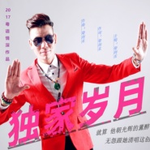

独家岁月
============================

|  |  |
| :--: | :-- |
| [ 独家岁月](https://emumo.xiami.com/album/2102734886) | **艺人**: [梁剑东](../index.md) **语种**: 粤语 **唱片公司**: 独立发行 **发行时间**: 2017年04月19日 **专辑类别**: EP, 单曲 **专辑风格**: 粤语流行 Cantopop, 流行摇滚 Pop Rock **播放数**: 5656 **收藏数**: 2 **评论数**: 0  |

## 简介

 独家岁月，是歌手梁剑东2017年5月份的一首最新力作。人生数数几十载，在起起落落的岁月里能有一位真正陪伴自己患难与共，谈笑风生，风雨同舟，无怨无悔，不抛不弃的痴心知己的确是不容易！歌曲充满故事画面，富有弹性，惹人寻味，发人深省；人只要学识回味，感激和珍惜，就会发现原来那个一直朝思暮想，梦寐以求的理想良伴其实一直常在。而简单真实的小幸福情感，亦正正是仅属于两个人独有的珍贵的独家岁月。 

## 曲目

## 评论

|  |  |  |  |
| :-- | :-- | :-- | :-- |
