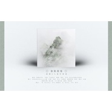

春秋侠客
============================

|  |  |
| :--: | :-- |
| [ 春秋侠客](https://emumo.xiami.com/album/2102821453) | **艺人**: [双笙](../index.md) **语种**: 国语 **唱片公司**: 独立发行 **发行时间**: 2017年06月22日 **专辑类别**: EP, 单曲 **专辑风格**: 古风 GuFeng Music **播放数**: 83784 **收藏数**: 92 **评论数**: 2  |

## 简介

春秋侠客 策划：清情&amp;祁言 作曲：万劫皆空 编曲：简吟 作词：祁言&amp;南岐&amp;冉语优 歌手：双笙&amp;易言&amp;Assen捷 后期：死神 美工：伶婼画 剧情：凉盏 pv/剧后：阎小爱 曲绘：徐再思 配音： 我：轩ZONE 少年：斑马 NPC：雅策君 女：纪川久

## 曲目

## 评论

|  |  |  |
| :-- | :-- | :-- |
|  [虾米用户](https://emumo.xiami.com/u/340235621)  2017-12-24 13:19 赞(1) 踩(0) | 
挺好听的，尤其是我双笙的  
 |
|  [虾米用户](https://emumo.xiami.com/u/49303904)  2017-09-16 18:41 赞(2) 踩(0) | 
这首真的有感觉
 |
