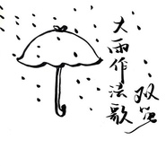

大雨作法歌
============================

|  |  |
| :--: | :-- |
| [ 大雨作法歌](https://emumo.xiami.com/album/2105158090) | **艺人**: [双笙](../index.md) **语种**: 国语 **唱片公司**: 润方铭鼎 **发行时间**: 2019年08月01日 **专辑类别**: EP, 单曲 **专辑风格**:  **播放数**: 194 **收藏数**: 2 **评论数**: 0  |

## 简介

这首歌是在梅雨季前兆时，某个大雨倾盆的课上写完的。当时风和雨刮得窗砰砰响，教室里放歌都听不清，天也阴沉沉的，我其实很喜欢这种天气的，但一想到这种天气要出门，还不能不管不顾地淋雨，喜欢就变成郁闷了。这首歌想做出旋律歌词比较幼稚，编曲比较歌剧的反差感。和喵剩的合作一直很顺利，完全是我想要的效果，后期幺唠也是老手，很快就收了尾。写得随意图个开心，记录心情，赶在梅雨季的尾巴（已经过了）发出来~

## 曲目

## 评论

