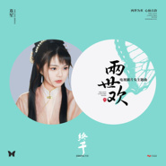

终于
============================

|  |  |
| :--: | :-- |
| [ 终于](https://emumo.xiami.com/album/2106081403) | **艺人**: [双笙](../index.md) **语种**: 国语 **唱片公司**: 听见时代 **发行时间**: 2020年02月21日 **专辑类别**: EP, 单曲 **专辑风格**: 国语流行 Mandarin Pop **播放数**: 573661 **收藏数**: 31 **评论数**: 5  |

## 简介

<strong>舍我两世之欢 赴你一生之约</strong>  
<strong>执手相望 此生不负</strong>  
<strong>终于在今夕遇见你</strong>  
<strong>终于等待几世的缘起</strong>  
  
  
  
<strong>双笙</strong>  
<strong>《终于》【电视剧《两世欢》片头主题曲】</strong>  
  
由听见时代专属定制的“两世为欢·心仙古韵”《两世欢》影视原声带，今日释出片头主题曲《终于》。  
  
《终于》由张赢填词、罗锟谱曲，顾潇予担任制作人，人气歌手双笙演唱。朗朗上口的旋律不失古风气韵、歌词唯美诗意搭配着双笙独特雅致的声线，将经历“两世”的缠绵爱情述出，演绎了一段即使记忆被抹去，爱也不会随之消逝的注定缘分。  
  
《两世欢》影视原声带以「两世为欢·心仙古韵」为主题，由听见时代制作，特邀六位实力新生代歌手组成新鲜的演唱阵容，共同打造走心又好听的古风歌曲。原声带后续曲目及配乐将陆续上线，敬请期待。  
  
《两世欢》是北京爱奇艺科技有限公司出品的古装甜蜜爱情剧，由余翠华执导，于朦胧、陈钰琪领衔主演，张思帆、马月等主演。讲述了出身将门的原家大小姐风眠晚与贵公子景辞经历重重困难，仍不改初心，互相守护成长的甜蜜爱情故事。  
  
 

## 曲目

## 评论

|  |  |  |  |
| :-- | :-- | :-- | :-- |
|  [虾米用户](https://emumo.xiami.com/u/328281550)  2020-11-01 12:13 赞(0) 踩(0) | 
(✪▽✪)好听！！！
 |
|  [虾米用户](https://emumo.xiami.com/u/428011561)  2020-05-08 02:46 赞(0) 踩(0) | 
我给你满分
 |
|  [虾米用户](https://emumo.xiami.com/u/437021562) 我应是泸沽烟水里的过客 2020-04-05 11:59 赞(1) 踩(0) | 
好听好听！！
 |
|  [虾米用户](https://emumo.xiami.com/u/309362847) EXO  金泰妍 郑秀妍... 2020-03-09 12:37 赞(2) 踩(0) | 
很喜欢双笙的声音，真的敲好听
 |
|  [虾米用户](https://emumo.xiami.com/u/405265249)  2020-02-25 21:10 赞(1) 踩(0) | 
很好听
 |
