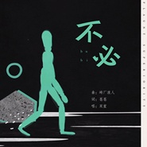

双笙
============================

|  |  |
| :--: | :-- |
| [ 双笙](https://i.xiami.com/voicesheng) | **播放数**: 126282447 **粉丝数**: 85319 **评论数**: 1560 **地区**: China 中国大陆 **风格**: 国语流行 Mandarin Pop, 中国风 China-Wave, 古风 GuFeng Music  |

## 档案

双笙，新声代女歌手、音乐人。2000年5月13日出生于重庆市开州区  。32岁的陈杰一度对一笔百万级别的投资犹豫不决。对方是重庆一家文化基金，看重的是陈杰的文化传媒公司签约的16岁女歌手双笙 (微博：双笙子；微信公众号：笙音，ID：VOICESHENG)。 
双笙是公司旗下唯一的艺人，用了不到一年的时间，她就在互联网上积累下了近100万粉丝。日本知名网站niconico是中国Bilibili站的原型，双笙在上面发布的《采茶纪》、《月出》等四首古风歌曲，不到两周时间里被点击了25000多次，平均每天有2000个日本网友在niconico上面听双笙唱歌。 
日本年轻人形容她是“最具大唐感的中国女声”，“听完之后前所未有地想学汉语”。 
今年5月21日的日榜歌单中，双笙演唱的原创歌曲《月出》成了唯一上榜的中文歌。她的声音甚至被拿来和初音作比较。初音是日本知名虚拟歌手，在喜欢二次元的年轻人群中有着不可撼动的地位。 
小档案 
艺名： 
国籍：中国 
出生地：重庆市开州区 
生日：2000年5月13日 
职业：歌手 
代表作：《都市惊奇夜》、《采茶纪》、《终身误》、《行香子》 
从艺历程 
2015年4月，双笙在一款音乐App上发布了自己翻唱的古风音乐《故梦》，从而获得了一定的关注度；同年，推出个人原创单曲《采茶纪》 
2016年4月，为网游《龙之谷》演唱的插曲《查尔德》正式上线；5月13日，发行专辑《笙声不息》；同年，与易言、樊棋、南久合作翻唱歌曲《九九八十一》(Bilibili2016年拜年祭歌曲) 
2017年3月，为电视剧《红楼梦》青春版演唱的推广曲《终身误》正式上线；4月，与歌手慕寒合作，为网游《新倩女幽魂》六周年资料片“紫禁风云”演唱了倩女串烧歌曲《倩音流年》 ；同月，发布了为漫画《笑傲江湖》原创的东方不败同人歌曲《不立传-东方不败》；9月，为手游《诛仙》演唱歌曲《玲珑问》 
2018年1月13日，推出原创单曲《少女净妖师》；同月，与GAI合作演唱《都市惊奇夜》 。1月25日，为手游《楚留香》演唱的宣传曲《马步谣》正式上线。3月24日，推出个人单曲《司南歌》。8月24日，为电影《阴阳诀之祭情》演唱的主题曲《阴阳诀》正式上线 。12月5日，推出个人原创单曲《谢芳菲》 
2019年2月26日，发行单曲《单向箭头》；5月13日，重制单曲《行香子》 ；7月19日，发行《宸汐缘》电视剧插曲《鸟语林》 ；9月2日为动画片《西行纪之集结篇》演唱的片尾曲《再见悟空》上线；9月20日发行《我所手植的第一捧春》 ；9月26日发布为电影《罗小黑战记》演唱的印象曲《容身之所》 ；10月4日发布单曲《循》；10月11日发布单曲《不成诗》 。10月30日发布为PS4游戏《大圣归来》演唱的主题曲《如是传说》；11月13日发布手游《天涯明月刀》丐帮门派主题曲《一壶春秋》；12月1日发行电视剧《鳄鱼与牙签鸟》插曲《空中花园》；12月24日发行电视剧《大明风华》插曲《生世守护》；12月31日发行个人专辑《荆棘》，收录六首原创作品 
2020年1月，在“5sing2019年度盛典”中，荣获“年度最佳女性音乐人”。1月1日，发布原创单曲《热岛症》；1月14日，发布为网络剧《小女上房揭瓦》演唱的片头曲《烦恼别找我》 
2020年01月23日，双笙与闫东炜合作演唱歌曲《千囍与手抄卷》发行上线 
荣誉记录 
2020-1 
“5sing2019年度盛典”年度最佳女性音乐人 (获奖) 
2019-4-20 
“少年中国”国风音乐节暨“青年人最喜爱的国风音乐”颁奖典礼“歌唱人奖” (获奖) 
2018-11-3 
“国风极乐夜”国风音乐人最受欢迎女歌手 (获奖)

## 专辑

| 名称 | 语种 | 唱片公司 | 发行时间 | 专辑类别 | 专辑风格 |
| :--: | :-- | :-- | :-- | :-- | :-- |
| [ 月逃](./albums/5020850304.md) | 国语 | 独立发行 | 2020年06月06日 | EP, 单曲 |  |
| [ 凡尘跋语](./albums/5020612896.md) | 国语 | 独立发行 | 2020年05月13日 | EP, 单曲 | 流行 Pop |
| [ 月夜](./albums/5020618627.md) | 国语 | 新律文化 | 2020年05月10日 | EP, 单曲 |  |
| [ 桃夭](./albums/2106080475.md) | 国语 | 青春繁花 | 2020年04月15日 | 原声带, 影视音乐 | 原声 Soundtrack |
| [ 终于](./albums/2106081403.md) | 国语 | 听见时代 | 2020年02月21日 | EP, 单曲 | 国语流行 Mandarin Pop |
| [ 不必](./albums/2106090110.md) | 国语 | 润方铭鼎 | 2020年02月20日 | EP, 单曲 | 流行 Pop |
| [ 小女上房揭瓦 影视剧原声带](./albums/2105690500.md) | 国语 | 卓颜巍声 | 2020年01月14日 | 原声带, 影视音乐 |  |
| [ 热岛症Urban Hot Island](./albums/2106059305.md) | 国语 | 独立发行 | 2020年01月01日 | EP, 单曲 |  |
| [ 一壶春秋](./albums/2106059278.md) | 国语 | 腾讯 | 2019年11月13日 | EP, 单曲 | 原声 Soundtrack |
| [ 大雨作法歌](./albums/2105158090.md) | 国语 | 润方铭鼎 | 2019年08月01日 | EP, 单曲 |  |
| [ 啸天引【人声本家】](./albums/2105158088.md) | 国语 |  | 2019年07月30日 | EP, 单曲 |  |
| [ 鸟语林](./albums/2105158085.md) | 国语 | 希瓜音乐 | 2019年07月19日 | 原声带, 影视音乐 |  |
| [ 生死一舞的爱语（Cover 星尘）](./albums/2105158083.md) | 国语 |  | 2019年07月16日 | EP, 单曲 |  |
| [ 忆戏 京师名伶](./albums/2105158080.md) | 国语 | 润方铭鼎 | 2019年07月05日 | EP, 单曲 |  |
| [ 我的一个道姑朋友](./albums/2105158075.md) | 国语 | NEGIA纳吉音 | 2019年05月25日 | EP, 单曲 | 流行 Pop |
| [ 日月一如法](./albums/2105158068.md) | 国语 |  | 2019年05月24日 | EP, 单曲 |  |
| [ 祈愿](./albums/2105158056.md) | 国语 | 润方铭鼎 | 2019年05月23日 | EP, 单曲 |  |
| [ Wish You](./albums/2105158066.md) | 国语 |  | 2019年05月16日 | EP, 单曲 |  |
| [ 行香子（重制版）](./albums/2105158059.md) | 国语 |  | 2019年05月12日 | EP, 单曲 |  |
| [ 寻](./albums/2104808500.md) | 国语 | 润方铭鼎 | 2019年04月23日 | EP, 单曲 | 国语流行 Mandarin Pop |
| [ 云中帆](./albums/2105158057.md) | 国语 | 润方铭鼎 | 2019年04月23日 | EP, 单曲 |  |
| [ 上里与手抄卷](./albums/2103885414.md) | 国语 | HIFIVE | 2018年07月27日 | EP, 单曲 | 古风 GuFeng Music |
| [ 都市惊奇夜](./albums/2103489735.md) | 国语 | 火谷网络 | 2018年01月15日 | EP, 单曲 |  |
| [ 那一天从梦中醒来](./albums/2103465909.md) | 国语 | 独立发行 | 2017年12月28日 | EP, 单曲 |  |
| [ 时一现耳三千岁](./albums/2102961216.md) | 国语 | 独立发行 | 2017年11月25日 | EP, 单曲 | 古风 GuFeng Music |
| [ 白石溪](./albums/2102905788.md) | 国语 | 独立发行 | 2017年11月04日 | EP, 单曲 | 中国风 China-Wave |
| [ 不立传-记东方不败](./albums/2102905787.md) | 国语 | 独立发行 | 2017年10月29日 | EP, 单曲 |  |
| [ 扬州姑娘](./albums/2102884152.md) | 国语 | 独立发行 | 2017年10月26日 | EP, 单曲 | 中国风 China-Wave |
| [ 飞行安全颂](./albums/2102864426.md) | 国语 | 航旅纵横 | 2017年09月27日 | EP, 单曲 |  |
| [ 玲珑问诛仙手游同人](./albums/2102864425.md) | 国语 | 独立发行 | 2017年09月18日 | EP, 单曲 | 古风 GuFeng Music |
| [ 仙侠世界 2](./albums/2102857349.md) | 国语 | 次元文化 | 2017年09月15日 | EP, 单曲 | 中国风 China-Wave, 古风 GuFeng Music |
| [ 女孩你为何踮脚尖](./albums/2102856838.md) | 国语 | 独立发行 | 2017年09月09日 | EP, 单曲 |  |
| [ 羽人夜歌](./albums/2102856840.md) | 国语 | 独立发行 | 2017年09月05日 | EP, 单曲 |  |
| [ 纯白](./albums/2102817869.md) | 国语 | HIFIVE | 2017年08月22日 | EP, 单曲 |  |
| [ 神武醉相思](./albums/2102821452.md) | 国语 | 独立发行 | 2017年07月23日 | EP, 单曲 | 中国风 China-Wave |
| [ 春秋侠客](./albums/2102821453.md) | 国语 | 独立发行 | 2017年06月22日 | EP, 单曲 | 古风 GuFeng Music |
| [ 千梦](./albums/2102821457.md) | 国语 | 独立发行 | 2017年06月16日 | EP, 单曲 | 古风 GuFeng Music |
| [ 达拉崩吧](./albums/2102768139.md) | 国语 | 独立发行 | 2017年06月01日 | EP, 单曲 |  |
| [ 逐梦令](./albums/2102821459.md) | 国语 | 独立发行 | 2017年05月20日 | EP, 单曲 |  |
| [ 心做し](./albums/2102821460.md) | 日语 | 独立发行 | 2017年05月13日 | EP, 单曲 | 日本流行 J-Pop |
| [ 终身误青春版《红楼梦》推广曲](./albums/2102704846.md) | 国语 | 世相科技文化 | 2017年03月04日 | EP, 单曲 | 古风 GuFeng Music |
| [ 镜花水月](./albums/2102701157.md) | 国语 | 独立发行 | 2017年02月24日 | 录音室专辑 | 流行 Pop, 中国风 China-Wave |
| [ 问剑江湖问剑江湖-双笙](./albums/2102692970.md) | 国语 | 独立发行 | 2017年02月14日 | 录音室专辑 | 古风 GuFeng Music |
| [ 天涯过客天涯过客（cover：周杰伦）](./albums/2102692973.md) | 国语 | 独立发行 | 2017年02月11日 | 录音室专辑 | 国语流行 Mandarin Pop |
| [ 轩辕剑赋](./albums/2102821462.md) | 国语 | 独立发行 | 2017年02月08日 | EP, 单曲 |  |
| [ 外婆桥](./albums/2102821463.md) | 国语 | 独立发行 | 2017年01月11日 | EP, 单曲 |  |
| [ 葬花吟](./albums/2102665739.md) | 国语 | 世相科技文化 | 2016年12月17日 | EP, 单曲 |  |
| [ MY OWN LIFE](./albums/2102821465.md) | 国语 | 独立发行 | 2016年12月13日 | EP, 单曲 |  |
| [ 单翼飞翔【原创】单翼飞翔](./albums/2102664570.md) | 国语 | 独立发行 | 2016年12月11日 | 录音室专辑 | 浩室舞曲 House, 国语流行 Mandarin Pop |
| [ 冰心明](./albums/2102821466.md) | 国语 | 独立发行 | 2016年11月27日 | EP, 单曲 |  |
| [ 巷](./albums/2102821467.md) | 国语 | 独立发行 | 2016年11月11日 | EP, 单曲 | 国语流行 Mandarin Pop, 中国风 China-Wave |
| [ 离歌](./albums/2102821468.md) | 国语 | 独立发行 | 2016年11月05日 | EP, 单曲 | 中国风 China-Wave |
| [ 丹青客丹青客（翻唱）](./albums/2102664569.md) | 国语 | 独立发行 | 2016年08月28日 | 录音室专辑 | 古风 GuFeng Music, 中国风 China-Wave |
| [ 寒衫浮梦寒衫浮梦-原版](./albums/2100385037.md) | 国语 | 世相科技文化 | 2016年08月15日 | EP, 单曲 |  |
| [ 大鱼](./albums/2102664529.md) | 国语 | 独立发行 | 2016年06月15日 | 录音室专辑 | 浩室舞曲 House |
| [ 笙声不息](./albums/2102730119.md) | 国语 | 独立发行 | 2016年05月13日 | 合集, 杂锦 | 国语流行 Mandarin Pop |
| [ 笙音未止](./albums/2100349100.md) | 国语 | 独立发行 | 2016年05月04日 | EP, 单曲 | 古风 GuFeng Music, 中国风 China-Wave |

## 评论

|  |  |  |  |
| :-- | :-- | :-- | :-- |
|  [虾米用户](https://emumo.xiami.com/u/441141693)  2021-01-01 20:55 赞(1) 踩(0) | 
双笙的嗓音很独特，歌也挺好听的
 |
|  [虾米用户](https://emumo.xiami.com/u/432613383)  2020-12-25 18:07 赞(0) 踩(0) | 
威武
 |
|  [虾米用户](https://emumo.xiami.com/u/261966982) 孤舟蓑笠翁，独钓寒江雪。 2020-12-21 11:05 赞(0) 踩(0) | 
才20岁，厉害了小妹妹 
 |
|  [虾米用户](https://emumo.xiami.com/u/79828270)  2020-12-03 20:10 赞(1) 踩(0) | 
歌曲质量之差让人发指
 |
| ⇒ |  [虾米用户](https://emumo.xiami.com/u/337794365) 曹操 2020-12-29 16:27 赞(0) 踩(0) | 
对，声音没感情，难听死了
 |
|  [虾米用户](https://emumo.xiami.com/u/434194423)  2020-10-24 05:32 赞(0) 踩(0) | 
  
 |
|  [虾米用户](https://emumo.xiami.com/u/168418482)  2020-10-16 03:09 赞(1) 踩(0) | 
换封面了唉
 |
|  [虾米用户](https://emumo.xiami.com/u/444483118)  2020-08-27 10:38 赞(0) 踩(0) | 
怎么没有千年之恋
 |
| ⇒ |  [虾米用户](https://emumo.xiami.com/u/421367274) 真相有多锋利，精心编制的... 2020-09-14 06:49 赞(0) 踩(0) | 
可能虾米没出吧&amp;hellip;
 |
|  [虾米用户](https://emumo.xiami.com/u/444663092) 我还没想好要写什么... 2020-08-23 14:26 赞(0) 踩(0) | 
赞 
 |
|  [虾米用户](https://emumo.xiami.com/u/94363312) 我还没想好要写什么... 2020-08-17 13:52 赞(0) 踩(0) | 
你唱的真好听。
 |
|  [虾米用户](https://emumo.xiami.com/u/440320278)  2020-08-11 19:14 赞(0) 踩(0) | 
@双笙    我超喜欢你的！加油吖！！！
 |
|  [虾米用户](https://emumo.xiami.com/u/431789331)  2020-07-31 16:33 赞(0) 踩(0) | 
双笙的声音能把普通的歌唱的不普通，希望好声音能配上更好的词曲
 |
|  [虾米用户](https://emumo.xiami.com/u/443830142)  2020-07-18 10:07 赞(0) 踩(0) | 
好好听啊 
 |
|  [虾米用户](https://emumo.xiami.com/u/442958295) 我还没想好要写什么...... 2020-07-10 20:54 赞(2) 踩(0) | 
双笙英文歌也不错啊
 |
|  [虾米用户](https://emumo.xiami.com/u/345839987) 枯燥的生活，只有歌曲来舒... 2020-06-18 22:44 赞(1) 踩(0) | 
音色很好！让我有点焕然一新的感觉 
 |
|  [虾米用户](https://emumo.xiami.com/u/345839987) 枯燥的生活，只有歌曲来舒... 2020-06-18 22:43 赞(1) 踩(0) | 
不错！不错！不错 
 |
|  [虾米用户](https://emumo.xiami.com/u/409127559) 这家伙很聪明什么也没留下... 2020-06-04 18:26 赞(0) 踩(0) | 
可以的：）
 |
|  [虾米用户](https://emumo.xiami.com/u/429732797) *面对懒惰的你充满了决心 2020-05-21 17:17 赞(3) 踩(0) | 
有种哭着笑的感觉心疼
 |
| ⇒ |  [虾米用户](https://emumo.xiami.com/u/431925728) 再见了各位，希望在虾米下... 2020-07-26 07:44 赞(0) 踩(0) | 

 |
|  [虾米用户](https://emumo.xiami.com/u/442610511) 二营长where  is... 2020-05-17 17:59 赞(2) 踩(0) | 
一直都在玩酷狗，来了虾米才知道有多香
 |
| ⇒ |  [虾米用户](https://emumo.xiami.com/u/426860494)  2020-06-15 23:49 赞(0) 踩(0) | 
有多香（好奇）
 |
| ⇒ |  [虾米用户](https://emumo.xiami.com/u/431925728) 再见了各位，希望在虾米下... 2020-07-26 07:44 赞(0) 踩(0) | 
<q><b>梦说：</b></q>
 |
|  [虾米用户](https://emumo.xiami.com/u/442656221) 我还没想好要写什么... 2020-05-04 21:30 赞(2) 踩(0) | 
唱的确实好听
 |
|  [虾米用户](https://emumo.xiami.com/u/358104299) 悲观的唯心存在现实解构虚... 2020-04-25 02:47 赞(0) 踩(0) | 
40653
 |
|  [虾米用户](https://emumo.xiami.com/u/120705970)  2020-04-23 07:57 赞(2) 踩(0) | 
这嗓音 出尘又脱俗
 |
| ⇒ |  [虾米用户](https://emumo.xiami.com/u/305293400) 我是巨蟹座 2020-05-11 08:46 赞(0) 踩(0) | 
赞同
 |
|  [虾米用户](https://emumo.xiami.com/u/50124385) 人生若只如初见，何事秋风... 2020-04-17 22:42 赞(1) 踩(0) | 
好喜欢呀！
 |
|  [虾米用户](https://emumo.xiami.com/u/440921673)  2020-04-05 19:03 赞(1) 踩(0) | 
超喜欢双笙的啊啊啊！但我学校超多人黑她
 |
|  [虾米用户](https://emumo.xiami.com/u/356493000) Spotify见 2020-03-29 23:25 赞(2) 踩(0) | 
评论区已被零零后攻陷
 |
|  [虾米用户](https://emumo.xiami.com/u/439988109)  2020-03-22 16:07 赞(9) 踩(0) | 
入坑了。。走不了了 
 |
|  [虾米用户](https://emumo.xiami.com/u/401553089) 三生三世，十里桃花；春风... 2020-03-20 23:11 赞(4) 踩(0) | 
童话镇mv有，如果有随身听格式就更好了！好期待！
 |
|  [虾米用户](https://emumo.xiami.com/u/440975484) 怎么说呢 2020-03-19 11:50 赞(4) 踩(0) | 
歌好听
 |
|  [虾米用户](https://emumo.xiami.com/u/441397897)  2020-03-18 08:32 赞(2) 踩(0) | 
我非常喜你的歌
 |
|  [虾米用户](https://emumo.xiami.com/u/441463956)  2020-03-17 13:15 赞(1) 踩(0) | 
因为《我的一个道姑朋友》喜欢上双笙。她的声音具有一种独特的磁力，让人忍不住听一遍又一遍。因为信仰是EXO，我听的全部都是韩文歌。但因为双笙爱上了中文/古风。之后去听了双笙其他的歌，但总觉得声音与道姑里有所不同，这便是双笙的特色。百变，在音乐里随机应变，根据歌词与旋律投入纯粹干净的情感，这十分难能可贵。日本对双笙&amp;ldquo;最具大唐感&amp;rdquo;的声音评价，便是那种磁力，其境界是可以用心体会出来的。将整个人带入双笙的音乐中，就会好像真正回到古代一样，身临其境。悲即是悲，欢即是欢，只会有真实的简单的情感。她的气息像真正在耳边，让人不仅沉浸其中，且如临极乐世界。可以说，双笙在古风音乐上的造诣，就要近乎完美！
 |
|  [虾米用户](https://emumo.xiami.com/u/314723352) 我还没想好要写什么... 2020-02-27 12:25 赞(4) 踩(0) | 
双笙是我唯一收藏的虾米音乐人，真的非常棒！加油！
 |
|  [虾米用户](https://emumo.xiami.com/u/356478311)  2020-02-25 14:54 赞(0) 踩(0) | 
@微  音
 |
|  [虾米用户](https://emumo.xiami.com/u/352991607) 牛逼 2020-02-08 09:53 赞(0) 踩(0) | 
1500
 |
|  [虾米用户](https://emumo.xiami.com/u/439928297) 有道友吗？ 2020-01-28 20:36 赞(1) 踩(0) | 
听歌后入圈
 |
|  [虾米用户](https://emumo.xiami.com/u/410077879) 。 2020-01-26 19:49 赞(2) 踩(0) | 
抖音黑化小学生是不是就是从这里来的？
 |
|  [虾米用户](https://emumo.xiami.com/u/422806709) 星光不负赶路人  时光不... 2020-01-25 16:28 赞(4) 踩(0) | 
我的梦想就是当歌手 但是我的父母 老师 都说我没有天赋 可是我一直都在坚持 可是我父母却觉得在浪费钱 于是我就无法在学唱歌了 但是当我听到你唱的时候 我决定 我也要像你唱的一样好听 加油 你后面有我们 不管到什么时候都不要害怕 我们会永远在你身后 帮你 加油
 |
|  [虾米用户](https://emumo.xiami.com/u/356558174) 陌上花开，可缓缓归矣。 2020-01-20 07:40 赞(1) 踩(0) | 
好多双笙的歌在虾米听不了了  
 |
|  [虾米用户](https://emumo.xiami.com/u/410077879) 。 2020-01-09 20:28 赞(1) 踩(0) | 
00后？
 |
|  [虾米用户](https://emumo.xiami.com/u/379548156)  2020-01-01 12:06 赞(3) 踩(0) | 
听她的歌想在脑内看了一场戏，戏的主角可以换成你喜欢的任何人，自己的脑海里我们自己就是神，是导演
 |
|  [虾米用户](https://emumo.xiami.com/u/430289523)  2019-12-30 01:02 赞(2) 踩(0) | 
加油，小可爱
 |
|  [虾米用户](https://emumo.xiami.com/u/432596272) 3年花笙米了哈！ 2019-12-27 12:40 赞(3) 踩(0) | 
啊啊啊，笙，有一些歌没授权
 |
|  [虾米用户](https://emumo.xiami.com/u/48379032) 最后警告，谢绝野蛮人，，... 2019-12-21 20:19 赞(3) 踩(0) | 
32岁陈杰喜欢，，，
 |
| ⇒ |  [虾米用户](https://emumo.xiami.com/u/410077879) 。 2020-01-29 23:14 赞(0) 踩(0) | 
说不定还，，，
 |
|  [虾米用户](https://emumo.xiami.com/u/8192902)   2019-12-05 16:21 赞(2) 踩(0) | 
这不能怪陈杰、市场经济、投资需谨慎！
 |
|  [虾米用户](https://emumo.xiami.com/u/293692544) 你敢给我说话吗？我咬你 2019-11-28 09:16 赞(3) 踩(0) | 
好听
 |
|  [虾米用户](https://emumo.xiami.com/u/431230977)  给时间一点时间让过去过... 2019-11-25 22:15 赞(3) 踩(0) | 
一直都很喜欢听古风版的歌。现在还是喜欢。
 |
|  [虾米用户](https://emumo.xiami.com/u/19724561) 质本洁来还洁去 2019-11-20 11:44 赞(3) 踩(0) | 
唱唱抒情还可以，江湖的，唱不出江湖的那种纷纭浩渺，荡气回肠。
 |
|  [虾米用户](https://emumo.xiami.com/u/370781680)  2019-11-11 12:13 赞(3) 踩(0) | 
大爱双笙
 |
|  [虾米用户](https://emumo.xiami.com/u/431587285)  2019-11-09 15:15 赞(6) 踩(0) | 
喜欢双笙的歌     点赞！！！！！
 |
|  [虾米用户](https://emumo.xiami.com/u/431259763) 我还没想好要写什么... 2019-11-08 22:02 赞(4) 踩(0) | 
有种哭着笑的感觉心疼
 |
|  [虾米用户](https://emumo.xiami.com/u/431259763) 我还没想好要写什么... 2019-11-08 22:01 赞(4) 踩(0) | 
我之前是只喜欢古风歌曲和用欢乐的曲调唱的歌双笙的歌把两者结合起来太爱了啊
 |
|  [虾米用户](https://emumo.xiami.com/u/431375595)  2019-11-05 11:48 赞(1) 踩(0) | 
说真的 不好听
 |
| ⇒ |  [虾米用户](https://emumo.xiami.com/u/422806709) 星光不负赶路人  时光不... 2020-01-25 16:19 赞(0) 踩(0) | 
那你能唱的好听 在说别人之前还请你看看自己
 |
| ⇒ |  [虾米用户](https://emumo.xiami.com/u/410077879) 。 2020-01-26 19:50 赞(0) 踩(0) | 
<q><b>鹿眸说：</b></q>
 |
|  [虾米用户](https://emumo.xiami.com/u/333697954) Mr.worldwide 2019-10-24 09:16 赞(2) 踩(0) | 
我就在这里啊
 |
|  [虾米用户](https://emumo.xiami.com/u/207366580)  2019-10-13 15:06 赞(3) 踩(0) | 
第一次尝试听这种风格的音乐，真的还不错，
 |
|  [虾米用户](https://emumo.xiami.com/u/423338420)  2019-09-15 20:28 赞(2) 踩(0) | 
你为游戏大圣归来唱的歌叫什么，在地铁广告看到的。
 |
|  [虾米用户](https://emumo.xiami.com/u/133657432)  2019-09-15 13:58 赞(2) 踩(0) | 
好纯的声音
 |
|  [虾米用户](https://emumo.xiami.com/u/11751010) 感謝 人生無常 這回事。 2019-09-07 07:31 赞(3) 踩(0) | 
只聽歌，別看照片
 |
|  [虾米用户](https://emumo.xiami.com/u/317791478) “芬芳的玫瑰带着星系的浪... 2019-08-30 13:36 赞(2) 踩(0) | 

 |
|  [虾米用户](https://emumo.xiami.com/u/427390816) 可爱的猪猪女孩～ 2019-08-28 15:41 赞(2) 踩(0) | 
我喜欢听她的歌，喜欢的点个赞
 |
|  [虾米用户](https://emumo.xiami.com/u/351438760) 某个喜欢日语的神经质一枚... 2019-08-24 16:38 赞(1) 踩(0) | 
你有没有发现？在其他平台看的她，好像胖了那么一丢丢。
 |
| ⇒ |  [虾米用户](https://emumo.xiami.com/u/360090978) 签名什么的，最麻烦了Ծ‸... 2019-08-25 14:39 赞(0) 踩(0) | 
祢豆子？？
 |
| ⇒ |  [虾米用户](https://emumo.xiami.com/u/351438760) 某个喜欢日语的神经质一枚... 2019-08-25 17:16 赞(0) 踩(0) | 
<q><b>村草李铁锤说：</b></q>
 |
|  [虾米用户](https://emumo.xiami.com/u/351296917) 要写什么捏～～ 2019-08-24 08:51 赞(1) 踩(0) | 
喜欢你的声音哦 - -
 |
|  [虾米用户](https://emumo.xiami.com/u/409843116) 喜欢互关；可以关注一下我... 2019-08-21 23:28 赞(2) 踩(0) | 
喜欢双笙，孤岛特别好听
 |
|  [虾米用户](https://emumo.xiami.com/u/428714406)  2019-08-20 07:01 赞(1) 踩(0) | 
双笙你唱太好听了
 |
|  [虾米用户](https://emumo.xiami.com/u/426842751)  2019-08-19 14:49 赞(2) 踩(0) | 
******
 |
| ⇒ |  [虾米用户](https://emumo.xiami.com/u/422806709) 星光不负赶路人  时光不... 2020-01-25 16:20 赞(0) 踩(0) | 
那你能唱的好听？
 |
| ⇒ |  [虾米用户](https://emumo.xiami.com/u/435267792)  2020-01-25 17:04 赞(0) 踩(0) | 
<q><b>鹿眸说：</b></q>
 |
| ⇒ |  [虾米用户](https://emumo.xiami.com/u/410077879) 。 2020-01-26 19:50 赞(0) 踩(0) | 
<q><b>鹿眸说：</b></q>
 |
| ⇒ |  [虾米用户](https://emumo.xiami.com/u/422806709) 星光不负赶路人  时光不... 2020-01-27 06:01 赞(0) 踩(0) | 
<q><b>忘了名字说：</b></q>
 |
| ⇒ |  [虾米用户](https://emumo.xiami.com/u/410077879) 。 2020-01-27 23:43 赞(0) 踩(0) | 
<q><b>鹿眸说：</b></q>
 |
| ⇒ |  [虾米用户](https://emumo.xiami.com/u/422806709) 星光不负赶路人  时光不... 2020-01-28 08:46 赞(0) 踩(0) | 
<q><b>忘了名字说：</b></q>
 |
| ⇒ |  [虾米用户](https://emumo.xiami.com/u/410077879) 。 2020-01-28 14:16 赞(0) 踩(0) | 
<q><b>鹿眸说：</b></q>
 |
| ⇒ |  [虾米用户](https://emumo.xiami.com/u/422806709) 星光不负赶路人  时光不... 2020-01-29 15:30 赞(0) 踩(0) | 
<q><b>忘了名字说：</b></q>
 |
| ⇒ |  [虾米用户](https://emumo.xiami.com/u/410077879) 。 2020-01-29 20:12 赞(0) 踩(0) | 
<q><b>鹿眸说：</b></q>
 |
| ⇒ |  [虾米用户](https://emumo.xiami.com/u/422806709) 星光不负赶路人  时光不... 2020-01-30 07:08 赞(0) 踩(0) | 
<q><b>忘了名字说：</b></q>
 |
| ⇒ |  [虾米用户](https://emumo.xiami.com/u/410077879) 。 2020-01-30 20:04 赞(0) 踩(0) | 
<q><b>鹿眸说：</b></q>
 |
| ⇒ |  [虾米用户](https://emumo.xiami.com/u/422806709) 星光不负赶路人  时光不... 2020-02-01 13:13 赞(0) 踩(0) | 
<q><b>忘了名字说：</b></q>
 |
| ⇒ |  [虾米用户](https://emumo.xiami.com/u/410077879) 。 2020-02-02 02:50 赞(0) 踩(0) | 
<q><b>鹿眸说：</b></q>
 |
| ⇒ |  [虾米用户](https://emumo.xiami.com/u/422806709) 星光不负赶路人  时光不... 2020-02-02 15:53 赞(0) 踩(0) | 
<q><b>忘了名字说：</b></q>
 |
| ⇒ |  [虾米用户](https://emumo.xiami.com/u/410077879) 。 2020-02-02 21:03 赞(0) 踩(0) | 
<q><b>鹿眸说：</b></q>
 |
| ⇒ |  [虾米用户](https://emumo.xiami.com/u/422806709) 星光不负赶路人  时光不... 2020-02-03 11:05 赞(0) 踩(0) | 
<q><b>忘了名字说：</b></q>
 |
| ⇒ |  [虾米用户](https://emumo.xiami.com/u/410077879) 。 2020-02-12 00:50 赞(0) 踩(0) | 
<q><b>鹿眸说：</b></q>
 |
| ⇒ |  [虾米用户](https://emumo.xiami.com/u/422806709) 星光不负赶路人  时光不... 2020-02-13 11:26 赞(0) 踩(0) | 
<q><b>忘了名字说：</b></q>
 |
| ⇒ |  [虾米用户](https://emumo.xiami.com/u/356478311)  2020-02-25 14:55 赞(0) 踩(0) | 
<q><b>忘了名字说：</b></q>
 |
| ⇒ |  [虾米用户](https://emumo.xiami.com/u/356478311)  2020-02-25 14:56 赞(0) 踩(0) | 
<q><b>忘了名字说：</b></q>
 |
| ⇒ |  [虾米用户](https://emumo.xiami.com/u/356478311)  2020-02-25 15:02 赞(0) 踩(0) | 
<a href="http://emumo.xiami.com/u/1026162" target="_blank" rel="nofollow" name_card="1026162">@Sin </a><a href="http://emumo.xiami.com/u/350459934" target="_blank" rel="nofollow" name_card="350459934">@慕田 </a>
 |
|  [虾米用户](https://emumo.xiami.com/u/419486383) 三月风景，无君不晴。三千... 2019-08-10 10:27 赞(14) 踩(0) | 
原创是不可能原创的，这辈子不可能原创的。写好歌又不会写，就是翻那些火的，才能维持的了粉丝这样子，不标原唱感觉像原创一样，抢别人好歌的感觉比单向行香好多了！圈里个个都是人才，脾气又很好，我超喜欢欺负人的！真是的，我标不标原唱关您什么事儿
 |
| ⇒ |  [虾米用户](https://emumo.xiami.com/u/379392597) dying 2019-09-19 21:49 赞(0) 踩(0) | 
你好像喜欢本兮哦
 |
| ⇒ |  [虾米用户](https://emumo.xiami.com/u/429982330) 我还没想好要写什么... 2019-09-20 16:49 赞(0) 踩(0) | 
哈哈哈哈
 |
| ⇒ |  [虾米用户](https://emumo.xiami.com/u/429982330) 我还没想好要写什么... 2019-09-20 16:51 赞(0) 踩(0) | 
<q><b>烺烺是咸鱼画手求约稿‼️说：</b></q>
 |
| ⇒ |  [虾米用户](https://emumo.xiami.com/u/379392597) dying 2019-09-21 10:17 赞(0) 踩(0) | 
<q><b>如卿晚花间说：</b></q>
 |
| ⇒ |  [虾米用户](https://emumo.xiami.com/u/379392597) dying 2019-09-21 10:17 赞(0) 踩(0) | 
<q><b>如卿晚花间说：</b></q>
 |
| ⇒ |  [虾米用户](https://emumo.xiami.com/u/379392597) dying 2019-09-21 10:18 赞(0) 踩(0) | 
<q><b>如卿晚花间说：</b></q>
 |
| ⇒ |  [虾米用户](https://emumo.xiami.com/u/410077879) 。 2020-01-26 19:51 赞(0) 踩(0) | 
<q><b>烺烺是咸鱼画手求约稿‼️说：</b></q>
 |
| ⇒ |  [虾米用户](https://emumo.xiami.com/u/379392597) dying 2020-01-31 10:45 赞(0) 踩(0) | 
<q><b>忘了名字说：</b></q>
 |
|  [虾米用户](https://emumo.xiami.com/u/426568672) 我还没想好要写什么... 2019-08-03 19:31 赞(2) 踩(0) | 
超喜欢双笙的歌
 |
|  [虾米用户](https://emumo.xiami.com/u/427355322) 到头来   只不过是空欢... 2019-07-26 16:21 赞(2) 踩(0) | 
非常喜欢听古风的音乐
 |
|  [虾米用户](https://emumo.xiami.com/u/419486383) 三月风景，无君不晴。三千... 2019-07-26 13:13 赞(3) 踩(0) | 
双笙声音超好听笙笙无敌是古风圈大佬没错啦盗用什么的也全不怪她图又不一定都是她自己找来的嘛狗黑粉离她远点行不
 |
| ⇒ |  [虾米用户](https://emumo.xiami.com/u/407287080)  2020-02-04 20:30 赞(0) 踩(0) | 
你这是在招黑
 |
| ⇒ |  [虾米用户](https://emumo.xiami.com/u/376175592) 无 2020-02-12 00:43 赞(0) 踩(0) | 
用一句话来形容，这不就是彩虹屁嘛。
 |
| ⇒ |  [虾米用户](https://emumo.xiami.com/u/439865779) 陪你走完了这一段路，我也... 2020-03-08 13:09 赞(0) 踩(0) | 
这不是彩虹屁，这是高级黑
 |
|  [虾米用户](https://emumo.xiami.com/u/312345240)  2019-07-15 13:24 赞(2) 踩(0) | 
问自己为什么喜欢双笙  。因为她嗓音很好，唱歌很入迷，全把自己投入了。悲就是悲，畅就是畅，不掺杂任何小情绪。 选了这条路就沿着走到黑吧！为各位加油 
 |
|  [虾米用户](https://emumo.xiami.com/u/426669652) 再见虾米。 2019-07-11 23:12 赞(1) 踩(0) | 
随机播放抽到《故梦》，听一遍就爱上了！从此沉溺在双笙的歌声及古风圈里无法自拔
 |
|  [虾米用户](https://emumo.xiami.com/u/426669652) 再见虾米。 2019-07-11 23:06 赞(0) 踩(0) | 
等等……16岁？！？我是新粉
 |
|  [虾米用户](https://emumo.xiami.com/u/426919730)  2019-07-09 22:37 赞(0) 踩(0) | 
声音有特色但不适合古风歌，完全没有韵味，求你放过古风歌吧
 |
|  [虾米用户](https://emumo.xiami.com/u/332439907) 不要用这种眼神看我，我是... 2019-07-08 21:10 赞(1) 踩(0) | 
双笙的歌超好听！
 |
|  [虾米用户](https://emumo.xiami.com/u/332439907) 不要用这种眼神看我，我是... 2019-07-08 21:10 赞(0) 踩(0) | 
总结一下
 |
|  [虾米用户](https://emumo.xiami.com/u/332439907) 不要用这种眼神看我，我是... 2019-07-08 21:09 赞(0) 踩(0) | 
呃......看了看你们的评论，字......好多
 |
|  [虾米用户](https://emumo.xiami.com/u/352011595)  2019-07-04 12:17 赞(2) 踩(0) | 
从双笙开始听古风的说
 |
|  [虾米用户](https://emumo.xiami.com/u/47433805)  2019-07-01 20:18 赞(0) 踩(0) | 
棒棒哒
 |
|  [虾米用户](https://emumo.xiami.com/u/426500541)  2019-06-25 16:17 赞(3) 踩(0) | 
抄袭狗再见
 |
| ⇒ |  [虾米用户](https://emumo.xiami.com/u/426669652) 再见虾米。 2019-07-11 23:07 赞(0) 踩(0) | 
曲和词又不是双笙自己作的……她只负责唱……关她啥事
 |
|  [虾米用户](https://emumo.xiami.com/u/426097185)  2019-06-16 12:21 赞(0) 踩(0) | 
双笙是我妹妹
 |
|  [虾米用户](https://emumo.xiami.com/u/425700064)   2019-06-10 22:31 赞(2) 踩(0) | 
姐姐应该长的十分漂亮吧？
 |
|  [虾米用户](https://emumo.xiami.com/u/415521330) 你一开口我就想笑 我一笑... 2019-06-01 20:52 赞(3) 踩(0) | 
今天是2019.6.1儿童节快乐哈！今年流行汉服 都知道的。但我就无语了 汉服是古风 是五千年历史 是一门艺术。现在大街都是汉服 你们在干嘛啊！小孩也穿(当然我不是讽刺)但他们那些家长们 你们考虑真正喜欢汉服的人了吗？你们这是对古风的侮辱 19年是耻辱 你们现在看着好看就穿 流行就穿 那明年呢 还会有很多个明年 你们直接撒手扔在衣柜里？然后穿上你们所谓流行的衣服      每一件汉服都有一个灵魂 它是用来被呵护的 不是被糟蹋的 好不好看你们都穿 哦自己以为好看了但在真正懂汉服的眼中你们都是沙雕  
 |
| ⇒ |  [虾米用户](https://emumo.xiami.com/u/254997214) 霁月难逢 2019-07-23 17:30 赞(0) 踩(0) | 
首先没有吵架的意思。但我觉得您说话未免有些偏激了。对古风的侮辱，用词是不是有点重？汉服文化的确需要珍惜，但不是固步自封。对于新人怎么说也要怀一点友好的态度哈，否则将来由何人传承？大家都是这么成长起来的嘛。您说的赶潮的现象当然是有的，但不能一棒子打死哦。(๑• . •๑)
 |
| ⇒ |  [虾米用户](https://emumo.xiami.com/u/415521330) 你一开口我就想笑 我一笑... 2019-07-27 11:26 赞(0) 踩(0) | 
<q><b>hyun说：</b></q>
 |
|  [虾米用户](https://emumo.xiami.com/u/416036461)  2019-05-30 22:43 赞(1) 踩(0) | 
姐姐好漂亮
 |
|  [虾米用户](https://emumo.xiami.com/u/15008144)  2019-05-25 16:17 赞(0) 踩(0) | 
      
 |
| ⇒ |  [虾米用户](https://emumo.xiami.com/u/97099656)  2019-06-12 20:27 赞(0) 踩(0) | 
分爽+廾
 |
|  [虾米用户](https://emumo.xiami.com/u/314992609)  2019-05-05 23:56 赞(6) 踩(0) | 
我想听双笙唱的童话镇，谁知道哪个平台可以听吗
 |
|  [虾米用户](https://emumo.xiami.com/u/372720992)  2019-04-10 19:59 赞(1) 踩(0) | 
为什么你的歌声和我们班的一个同学唱得特别像
 |
|  [虾米用户](https://emumo.xiami.com/u/420260950) 路曼曼其修远兮，吾将上下... 2019-04-07 10:57 赞(11) 踩(0) | 
为什么喜欢双笙？因为她的声音干净纯粹，喜就是喜，悲就是悲，不会掺杂其余不相干的情感，宛如深山中一汪清泉，澄澈地不染一丝凡尘，这是一种极致的纯真，亦是世人一直所追寻的初心。
 |
|  [虾米用户](https://emumo.xiami.com/u/359003204) 愿所有的微风安定，所有月... 2019-04-05 22:04 赞(3) 踩(0) | 
迷上笙儿姐姐后还以为爱上笙儿姐了。现在才 知道更多的是极致的崇拜，着迷，引以目标……
 |
|  [虾米用户](https://emumo.xiami.com/u/419486383) 三月风景，无君不晴。三千... 2019-04-05 17:02 赞(4) 踩(0) | 
看到简介最后一段有点难受，这么引战的，搞得我对初音好感度都下降了
 |
|  [虾米用户](https://emumo.xiami.com/u/406808381) 我狂，我骄傲。我狂，我有... 2019-03-31 21:01 赞(8) 踩(0) | 
她的歌真的好感人。她的故梦让我眼泪滑落；她的我的一个道姑朋友让我心生感慨；她的大鱼让我痛哭；她的……………
 |
|  [虾米用户](https://emumo.xiami.com/u/263919030) 哒哒哒←_←路过 2019-03-22 21:41 赞(1) 踩(0) | 
双笙我最喜欢的是《我的一个道姑朋友》
 |
|  [虾米用户](https://emumo.xiami.com/u/355593001)  2019-03-22 05:04 赞(0) 踩(0) | 
来了
 |
|  [虾米用户](https://emumo.xiami.com/u/421578416) 超喜欢双笙 2019-03-21 15:52 赞(0) 踩(0) | 
双笙，真的很喜欢你。
 |
|  [虾米用户](https://emumo.xiami.com/u/410421844)  2019-03-15 18:05 赞(0) 踩(0) | 
正太音
 |
|  [虾米用户](https://emumo.xiami.com/u/334722730)  2019-03-07 20:46 赞(2) 踩(0) | 
比洛天依好听太多了  
 |
| ⇒ |  [虾米用户](https://emumo.xiami.com/u/404207500)  2019-03-21 15:26 赞(0) 踩(0) | 
洛天依和双笙本来就不是一个世界的，洛天依是虚拟二次元，懂？
 |
|  [虾米用户](https://emumo.xiami.com/u/334722730)  2019-03-07 20:44 赞(1) 踩(0) | 
太好听了！
 |
|  [虾米用户](https://emumo.xiami.com/u/406505525)  2019-03-05 18:42 赞(3) 踩(0) | 
嘿嘿，这主意咋这么好那
 |
|  [虾米用户](https://emumo.xiami.com/u/406505525)  2019-03-05 18:39 赞(3) 踩(0) | 
双笙等我长大了，我让我的孩子也喜欢你的歌，让他喜欢上你的声音，喜欢听你唱歌
 |
|  [虾米用户](https://emumo.xiami.com/u/350844788)   2019-03-04 20:25 赞(1) 踩(0) | 
双笙，重新定义了天籁女音
 |
|  [虾米用户](https://emumo.xiami.com/u/406017373) 我之前的名字叫做草莓人生 2019-03-02 22:31 赞(0) 踩(0) | 
纯洁
 |
|  [虾米用户](https://emumo.xiami.com/u/418817756)  2019-03-02 20:18 赞(0) 踩(0) | 
从听歌开始，就一直用的QQ音乐，前阵子QQ音乐里面所有双笙的歌都听不了了，就，，，，果断地卸了QQ音乐，下载注册了虾米音乐    
 |
|  [虾米用户](https://emumo.xiami.com/u/333564189) 我若成佛，天下无魔，我若... 2019-03-02 17:58 赞(0) 踩(0) | 
最喜欢双笙了
 |
|  [虾米用户](https://emumo.xiami.com/u/301263591) 世界太暗，人心太黑，爱情... 2019-02-23 19:33 赞(4) 踩(0) | 
hi，有同道之人吗，（网瘾少女，暗黑系，主要得喜欢笙儿）私信我，交个朋友吧 
 |
| ⇒ |  [虾米用户](https://emumo.xiami.com/u/333564189) 我若成佛，天下无魔，我若... 2019-03-02 17:59 赞(0) 踩(0) | 
我喜欢，交朋友吗？
 |
|  [虾米用户](https://emumo.xiami.com/u/301263591) 世界太暗，人心太黑，爱情... 2019-02-23 19:22 赞(66) 踩(0) | 
∩∩（´･ω･）＿|　⊃／(＿＿_／ └-(＿＿＿_／￣￣￣￣￣￣￣算了反正没有1 楼⊂⌒／ヽ-、＿_／⊂_/＿＿＿＿ ／￣￣￣￣￣￣￣万一能上热评那∩∩（´･ω･）＿|　⊃／(＿＿_／ └-(＿＿＿_／￣￣￣￣￣￣￣算了反正没人点赞⊂⌒／ヽ-、＿_／⊂_/＿＿＿＿ ／￣￣￣￣￣￣￣不，应该有好心人赞的∩∩（´･ω･）＿|　⊃／(＿＿_／ └-(＿＿＿_／
 |
|  [虾米用户](https://emumo.xiami.com/u/301263591) 世界太暗，人心太黑，爱情... 2019-02-23 19:14 赞(8) 踩(0) | 
我给你的备注是十二朋友是十二画恋人是十二画爱人是十二画所以，十二的名字，叫做难忘。后来想想，原来放手也是十二画。我想我还是给你备注十一吧朋友差一点恋人差一点爱人差一点所以，十一的名字叫遗憾。真正喜欢过的人又怎能说忘就忘呢我还是很喜欢你 ，像风走了八千里，不问归期。像雨洒落在热带与极地，不远万里。后来才发现并不是所有的喜欢都会有结果，有些人能遇见已经是难能可贵。
 |
|  [虾米用户](https://emumo.xiami.com/u/406808381) 我狂，我骄傲。我狂，我有... 2019-02-18 03:21 赞(1) 踩(0) | 
不好听？不存在
 |
|  [虾米用户](https://emumo.xiami.com/u/401901808) 好听英文歌at我万分感谢 2019-02-16 14:39 赞(1) 踩(0) | 
我是听天命风流中毒的 但是一开始还不喜欢，后来越听越好听了！敲爱你！祝你越来火，若果我是做电影的，我绝对会把你的歌设为电影主题曲的！加油↖(^ω^)↗
 |
|  [虾米用户](https://emumo.xiami.com/u/419253951)  2019-02-16 02:01 赞(1) 踩(0) | 
为你打call
 |
|  [虾米用户](https://emumo.xiami.com/u/283046669)  2019-02-12 13:54 赞(1) 踩(0) | 
     
 |
|  [虾米用户](https://emumo.xiami.com/u/351255874)  2019-02-11 14:36 赞(14) 踩(0) | 
双笙的《我有一个道姑朋友》是我听过最好听的翻唱，不知为什么虾米找不到了。唉，不知道哪里还能遇见。 
 |
| ⇒ |  [虾米用户](https://emumo.xiami.com/u/406596680) 甜甜的可乐 2019-04-23 17:55 赞(0) 踩(0) | 
侵权了呀肯定听不了
 |
| ⇒ |  [虾米用户](https://emumo.xiami.com/u/351255874)  2019-05-04 14:04 赞(0) 踩(0) | 
<q><b>冰阔落说：</b></q>
 |
| ⇒ |  [虾米用户](https://emumo.xiami.com/u/419486383) 三月风景，无君不晴。三千... 2019-07-31 13:50 赞(0) 踩(0) | 
<q><b>岁月如故说：</b></q>
 |
|  [虾米用户](https://emumo.xiami.com/u/357189492)  2019-02-05 20:18 赞(3) 踩(0) | 
迷上了这个声音  这个小调调
 |
|  [虾米用户](https://emumo.xiami.com/u/415674773)  2019-02-05 05:02 赞(3) 踩(0) | 
双笙520
 |
|  [虾米用户](https://emumo.xiami.com/u/342586341)  2019-02-03 19:43 赞(1) 踩(0) | 
最近都没有新歌吗？
 |
|  [虾米用户](https://emumo.xiami.com/u/353053422)  2019-02-03 11:25 赞(1) 踩(0) | 
      
 |
|  [虾米用户](https://emumo.xiami.com/u/336781084) (๑´∀`๑) 2019-01-31 23:34 赞(2) 踩(0) | 
请问虾米上现在没有 我的一个道姑朋友 这首歌了嘛？我的歌单里没了……
 |
| ⇒ |  [虾米用户](https://emumo.xiami.com/u/355596609) 小朋友你又看我来啦！ 2019-02-03 11:13 赞(0) 踩(0) | 
虾米还没争到那首歌的版权，我也很是遗憾呐 
 |
| ⇒ |  [虾米用户](https://emumo.xiami.com/u/336781084) (๑´∀`๑) 2019-02-04 00:10 赞(0) 踩(0) | 
<q><b>妮妮说：</b></q>
 |
| ⇒ |  [虾米用户](https://emumo.xiami.com/u/357189492)  2019-02-05 20:17 赞(0) 踩(0) | 
找爱听4G这个软件   里面有有   专门去下载听这歌的
 |
| ⇒ |  [虾米用户](https://emumo.xiami.com/u/336781084) (๑´∀`๑) 2019-02-06 00:21 赞(0) 踩(0) | 
<q><b>我爱淡忘雅说：</b></q>
 |
| ⇒ |  [虾米用户](https://emumo.xiami.com/u/405283643)  2019-03-25 20:25 赞(0) 踩(0) | 
有的啊
 |
| ⇒ |  [虾米用户](https://emumo.xiami.com/u/336781084) (๑´∀`๑) 2019-03-25 20:26 赞(0) 踩(0) | 
<q><b>萝卜大人说：</b></q>
 |
|  [虾米用户](https://emumo.xiami.com/u/413586263) 明人不说暗话：我想当你的... 2019-01-29 16:19 赞(0) 踩(0) | 

 |
|  [虾米用户](https://emumo.xiami.com/u/317791478) “芬芳的玫瑰带着星系的浪... 2019-01-26 19:17 赞(0) 踩(0) | 
❤
 |
| ⇒ |  [虾米用户](https://emumo.xiami.com/u/416087653)  2019-02-02 20:40 赞(0) 踩(0) | 
没有。虾米没有
 |
|  [虾米用户](https://emumo.xiami.com/u/317791478) “芬芳的玫瑰带着星系的浪... 2019-01-26 17:24 赞(0) 踩(0) | 

 |
|  [虾米用户](https://emumo.xiami.com/u/317791478) “芬芳的玫瑰带着星系的浪... 2019-01-24 16:53 赞(0) 踩(0) | 
❤
 |
|  [虾米用户](https://emumo.xiami.com/u/352140387)  2019-01-24 12:55 赞(2) 踩(0) | 
因为《九九八十一》入的坑
 |
| ⇒ |  [虾米用户](https://emumo.xiami.com/u/357189492)  2019-02-05 20:17 赞(0) 踩(0) | 
我听的小棋童
 |
|  [虾米用户](https://emumo.xiami.com/u/412840657)  2019-01-24 11:22 赞(1) 踩(0) | 
喜欢
 |
|  [虾米用户](https://emumo.xiami.com/u/412840657)  2019-01-24 11:21 赞(1) 踩(0) | 
   
 |
|  [虾米用户](https://emumo.xiami.com/u/412057623)  2019-01-23 19:02 赞(1) 踩(0) | 
我是他的超级迷！
 |
|  [虾米用户](https://emumo.xiami.com/u/317791478) “芬芳的玫瑰带着星系的浪... 2019-01-23 11:55 赞(1) 踩(0) | 

 |
|  [虾米用户](https://emumo.xiami.com/u/317791478) “芬芳的玫瑰带着星系的浪... 2019-01-23 11:49 赞(1) 踩(0) | 

 |
|  [虾米用户](https://emumo.xiami.com/u/378699437)  2019-01-23 03:47 赞(2) 踩(0) | 
不小心点了播放，瞬间就被这种幼稚中带点熟的声音迷住了，喜欢她的声音
 |
|  [虾米用户](https://emumo.xiami.com/u/347001464)  2019-01-23 03:04 赞(1) 踩(0) | 
超喜欢双笙的声音，感觉永远听不腻。
 |
|  [虾米用户](https://emumo.xiami.com/u/317791478) “芬芳的玫瑰带着星系的浪... 2019-01-22 18:12 赞(0) 踩(0) | 
❤
 |
|  [虾米用户](https://emumo.xiami.com/u/412742473)  2019-01-22 11:43 赞(0) 踩(0) | 
666大仙
 |
|  [虾米用户](https://emumo.xiami.com/u/317791478) “芬芳的玫瑰带着星系的浪... 2019-01-21 21:06 赞(0) 踩(0) | 
❤
 |
|  [虾米用户](https://emumo.xiami.com/u/345587401) 你我皆沦 2019-01-20 20:31 赞(2) 踩(0) | 
喜欢双笙
 |
|  [虾米用户](https://emumo.xiami.com/u/412664105) 真的会善良 2019-01-20 12:34 赞(1) 踩(0) | 
❤
 |
|  [虾米用户](https://emumo.xiami.com/u/359766700)  2019-01-19 23:20 赞(0) 踩(0) | 
得过且过，别奢求了，最后，只会大声痛哭
 |
|  [虾米用户](https://emumo.xiami.com/u/359766700)  2019-01-19 23:20 赞(1) 踩(0) | 
而你撑伞拥我入怀中，一字一句誓言多慎重，你眼中有柔情千种，如陌陌春风，冰雪也消融。消融的不是他冰冷的心，而是你的热情，他眼中的柔情，却不是给你的。世上最伤人的不是你爱他，而是你爱上一个永远都捂不化的心。最终，伤人伤己
 |
|  [虾米用户](https://emumo.xiami.com/u/359766700)  2019-01-19 23:16 赞(1) 踩(0) | 
双笙，祝愿你星途顺利，努力，别被任何人改变，不然，你只会面目全非，变得自己都不认识自己了。
 |
|  [虾米用户](https://emumo.xiami.com/u/412543399)  2019-01-18 22:50 赞(0) 踩(0) | 
千言万语只道一句:加油！！！
 |
|  [虾米用户](https://emumo.xiami.com/u/47262914) 我舍不得。 2019-01-13 12:18 赞(0) 踩(0) | 
❤
 |
|  [虾米用户](https://emumo.xiami.com/u/405297075)  2019-01-09 22:15 赞(1) 踩(0) | 
只有我觉得在座的各位全是弟弟么
 |
| ⇒ |  [虾米用户](https://emumo.xiami.com/u/425677869)  2019-06-08 10:20 赞(0) 踩(0) | 
不，我觉得你是弟弟
 |
|  [虾米用户](https://emumo.xiami.com/u/266233480) 我还没想好要写什么... 2019-01-09 19:02 赞(2) 踩(0) | 
呜呜呜我的一个道姑朋友什么时候回来呀
 |
|  [虾米用户](https://emumo.xiami.com/u/253640908)  2019-01-09 09:39 赞(0) 踩(0) | 
好听
 |
|  [虾米用户](https://emumo.xiami.com/u/277661070)  2019-01-09 05:45 赞(0) 踩(0) | 
emmmmm为什么我这里全部都听不了了
 |
|  [虾米用户](https://emumo.xiami.com/u/23438639) 借用一下九公主做头像 2019-01-07 19:58 赞(1) 踩(0) | 
喜欢双笙的嗓音
 |
|  [虾米用户](https://emumo.xiami.com/u/412036091)  2019-01-07 17:38 赞(1) 踩(0) | 
笙声不息
 |
|  [虾米用户](https://emumo.xiami.com/u/403245142)  2019-01-06 23:47 赞(1) 踩(0) | 
很喜欢双笙
 |
|  [虾米用户](https://emumo.xiami.com/u/411752924) 我们还是朋友吗 2019-01-03 09:59 赞(1) 踩(0) | 
爱你我的双笙  
 |
|  [虾米用户](https://emumo.xiami.com/u/337733481) 再见。 2019-01-02 23:13 赞(0) 踩(0) | 
我一直以为双笙是两个人
 |
|  [虾米用户](https://emumo.xiami.com/u/408923062)  2019-01-01 20:11 赞(1) 踩(0) | 
喜欢，好听 
 |
|  [虾米用户](https://emumo.xiami.com/u/411623027) 喜欢洋洋。 2019-01-01 15:36 赞(3) 踩(0) | 
为什么双笙的歌在虾米音乐都这么冷呢？我想了一天。我终于知道了：虾米音乐上的歌都十分冷。直白的说，就是太少了的人下载使用虾米音乐了。一些别的音乐软件，比如酷狗音乐，QQ音乐，网易云音乐之类的，双笙的歌评论都是999+的。甚至有一首歌，心做，酷狗音乐上评论是99w加的。我看到虾米音乐上双笙的歌怎么冷，心里有一点难过，怎么可以这么少人在虾米音乐知道双笙呢？但是，我又觉得这样也挺好。因为我觉得，双笙的歌很冷，我听的时候有些小幸福，感觉双笙属于我了(⊙o⊙)哇！额(⊙o⊙)…内心纠结…-………可能是太爱双笙了吧嘻嘻O(∩_∩)O哈哈~
 |
|  [虾米用户](https://emumo.xiami.com/u/411623027) 喜欢洋洋。 2019-01-01 15:30 赞(1) 踩(0) | 
大爱双笙。！
 |
|  [虾米用户](https://emumo.xiami.com/u/411623027) 喜欢洋洋。 2019-01-01 15:30 赞(1) 踩(0) | 
双笙
 |
|  [虾米用户](https://emumo.xiami.com/u/411623027) 喜欢洋洋。 2019-01-01 15:30 赞(1) 踩(0) | 
双笙
 |
| ⇒ |  [虾米用户](https://emumo.xiami.com/u/412103383)  2019-01-09 13:04 赞(0) 踩(0) | 
有没有双笙唱的 我的一个道姑朋友 这首歌
 |
| ⇒ |  [虾米用户](https://emumo.xiami.com/u/266233480) 我还没想好要写什么... 2019-01-09 19:02 赞(0) 踩(0) | 
<q><b>温柔霖°说：</b></q>
 |
|  [虾米用户](https://emumo.xiami.com/u/411560838) 我就是我 2018-12-31 19:08 赞(1) 踩(0) | 
双笙生日：2000年5月13
 |
| ⇒ |  [虾米用户](https://emumo.xiami.com/u/426669652) 再见虾米。 2019-07-11 23:13 赞(0) 踩(0) | 
19岁？！
 |
|  [虾米用户](https://emumo.xiami.com/u/411560838) 我就是我 2018-12-31 19:03 赞(0) 踩(0) | 
小棋童   
 |
|  [虾米用户](https://emumo.xiami.com/u/411560838) 我就是我 2018-12-31 19:01 赞(0) 踩(0) | 
双笙出新歌吧       
 |
|  [虾米用户](https://emumo.xiami.com/u/411560838) 我就是我 2018-12-31 19:01 赞(0) 踩(0) | 
双笙出新歌吧       
 |
|  [虾米用户](https://emumo.xiami.com/u/350904654) 金木研^-.-^好喜欢你... 2018-12-31 11:11 赞(1) 踩(0) | 
Love you,@双笙
 |
|  [虾米用户](https://emumo.xiami.com/u/401332646)  2018-12-30 18:43 赞(1) 踩(0) | 
喜欢双笙
 |
| ⇒ |  [虾米用户](https://emumo.xiami.com/u/411540471)  2018-12-31 13:36 赞(0) 踩(0) | 
嗯
 |
|  [虾米用户](https://emumo.xiami.com/u/266233480) 我还没想好要写什么... 2018-12-30 09:40 赞(2) 踩(0) | 
我的一个道姑朋友消失了？
 |
|  [虾米用户](https://emumo.xiami.com/u/355596609) 小朋友你又看我来啦！ 2018-12-29 19:54 赞(1) 踩(0) | 
大爱双笙♥
 |
|  [虾米用户](https://emumo.xiami.com/u/350844788)   2018-12-26 19:52 赞(1) 踩(0) | 
二笙
 |
|  [虾米用户](https://emumo.xiami.com/u/320296299)  2018-12-24 19:57 赞(2) 踩(0) | 
不当黑粉只当真爱粉^_^
 |
|  [虾米用户](https://emumo.xiami.com/u/375846040)  2018-12-23 11:54 赞(4) 踩(0) | 
前边一直在QQ音乐上听双笙的歌，不过有些歌突然就没版权了，都没下载，听不了很难受，现在发现虾米上都有，好高兴，全部先下载下来，免得又没版权。  支持笙笙。期待每一首新歌！  
 |
|  [虾米用户](https://emumo.xiami.com/u/375846040)  2018-12-23 11:51 赞(3) 踩(0) | 
古风最喜欢双笙，有没有同感的？
 |
|  [虾米用户](https://emumo.xiami.com/u/411077092)  2018-12-23 10:02 赞(0) 踩(0) | 
  
 |
|  [虾米用户](https://emumo.xiami.com/u/411048663)  2018-12-22 15:32 赞(0) 踩(0) | 
 
 |
|  [虾米用户](https://emumo.xiami.com/u/353530976)  2018-12-22 11:58 赞(0) 踩(0) | 
毫无抵抗力！
 |
|  [虾米用户](https://emumo.xiami.com/u/280966237)  2018-12-21 19:24 赞(1) 踩(0) | 
现在搜不到我的一个道姑朋友这首歌 
 |
|  [虾米用户](https://emumo.xiami.com/u/338271376) (=￣ω￣=)喵了个咪 2018-12-21 18:06 赞(1) 踩(0) | 
嗯，不知道说什么，反正挺感动的
 |
|  [虾米用户](https://emumo.xiami.com/u/405096338) 我很喜欢范丞丞 2018-12-19 04:51 赞(0) 踩(0) | 
哇se，什么都听不起来了
 |
|  [虾米用户](https://emumo.xiami.com/u/359766700)  2018-12-16 23:15 赞(67) 踩(0) | 
呵呵，人家唱歌好听，粉丝?没素质，那些讨厌双笙的人，并不是讨厌双笙，而是讨厌双笙的粉丝。既然喜欢双笙，就好好当粉丝，别黑自己的偶像。你们以为歌手好当?累，痛，还可能被别的歌手的粉丝黑。这就是你们爱她的方式?呵呵，有时候，默默祝福也是一种爱不是吗?
 |
| ⇒ |  [虾米用户](https://emumo.xiami.com/u/411623027) 喜欢洋洋。 2019-01-01 15:37 赞(0) 踩(0) | 
嗯嗯。
 |
| ⇒ |  [虾米用户](https://emumo.xiami.com/u/379984350) 来自成都的白羊座软妹子✺... 2019-01-16 09:26 赞(0) 踩(0) | 
对呀。ｸﾞｯ!(๑•̀ㅂ•́)و✧
 |
| ⇒ |  [虾米用户](https://emumo.xiami.com/u/350081216)  2019-01-30 16:58 赞(0) 踩(0) | 
有道理
 |
| ⇒ |  [虾米用户](https://emumo.xiami.com/u/341669352) 莫听穿林打叶声，何妨吟啸... 2019-03-23 17:06 赞(0) 踩(0) | 
太对了！
 |
| ⇒ |  [虾米用户](https://emumo.xiami.com/u/411304111) 岁月如歌，你低吟浅唱，我... 2019-06-22 21:03 赞(0) 踩(0) | 
说得好 
 |
| ⇒ |  [虾米用户](https://emumo.xiami.com/u/352011595)  2019-07-04 12:18 赞(0) 踩(0) | 
双笙加油
 |
|  [虾米用户](https://emumo.xiami.com/u/410564568)  2018-12-16 09:52 赞(0) 踩(0) | 
永远爱你！
 |
|  [虾米用户](https://emumo.xiami.com/u/353223260) 知道你遥不可及但还是忍不... 2018-12-15 09:15 赞(3) 踩(0) | 
支持双笙♥
 |
|  [虾米用户](https://emumo.xiami.com/u/400944366) 每个人都有自己选择的不归... 2018-12-09 20:50 赞(3) 踩(0) | 
双笙，我们永远爱你！
 |
|  [虾米用户](https://emumo.xiami.com/u/350944732) 薛洋不是垃圾，他很好 2018-12-04 23:50 赞(13) 踩(0) | 
《心做し》好喜欢
 |
| ⇒ |  [虾米用户](https://emumo.xiami.com/u/283012407) bbbbbbbbh 2018-12-15 21:46 赞(0) 踩(0) | 
啊啊啊xq
 |
|  [虾米用户](https://emumo.xiami.com/u/409836852)  2018-12-03 00:28 赞(2) 踩(0) | 
唯爱双笙
 |
|  [虾米用户](https://emumo.xiami.com/u/360090978) 签名什么的，最麻烦了Ծ‸... 2018-12-02 01:08 赞(92) 踩(0) | 
很喜欢双笙的嗓音呀，干净，纯粹！
 |
|  [虾米用户](https://emumo.xiami.com/u/409718194)  2018-12-01 12:10 赞(4) 踩(0) | 
爱双笙
 |
|  [虾米用户](https://emumo.xiami.com/u/408764850)  2018-11-30 23:31 赞(1) 踩(0) | 
很不错，加油
 |
|  [虾米用户](https://emumo.xiami.com/u/374940858) 我想好要写什么了…… 2018-11-28 18:22 赞(1) 踩(0) | 
双笙的歌曲太好听了吧！  
 |
|  [虾米用户](https://emumo.xiami.com/u/409432530) 再见虾米～ 2018-11-28 13:05 赞(3) 踩(0) | 
非常古风的味道!
 |
|  [虾米用户](https://emumo.xiami.com/u/409491497) 我虽然单身，但我胖若两人... 2018-11-27 23:38 赞(4) 踩(0) | 
小幸运就喜欢双笙的版本嘻嘻嘻嘻嘻
 |
|  [虾米用户](https://emumo.xiami.com/u/336287710) 输入签名… 2018-11-25 12:42 赞(2) 踩(0) | 
一番星
 |
| ⇒ |  [虾米用户](https://emumo.xiami.com/u/256005842)  2018-11-30 22:47 赞(0) 踩(0) | 
我知道是翻唱的，可是还是很好听
 |
|  [虾米用户](https://emumo.xiami.com/u/376665586) 我喜欢双笙 2018-11-24 12:37 赞(1) 踩(0) | 
爱你
 |
|  [虾米用户](https://emumo.xiami.com/u/345453019)  2018-11-19 18:46 赞(4) 踩(0) | 
加油↖(^ω^)↗。我是听《少年不用刀》才知道，居然有这么特别的好声音。
 |
|  [虾米用户](https://emumo.xiami.com/u/408806451) 愿你喜～ 2018-11-16 21:00 赞(2) 踩(0) | 
很喜欢双笙啊！！
 |
|  [虾米用户](https://emumo.xiami.com/u/408784506)  2018-11-16 19:56 赞(1) 踩(0) | 
我是铁粉
 |
|  [虾米用户](https://emumo.xiami.com/u/348792242) 我就是爱粘着她 2018-11-16 17:03 赞(2) 踩(0) | 
加油(ง •̀_•́)ง，谢谢你， 
 |
|  [虾米用户](https://emumo.xiami.com/u/404263136) 往事凋零 爱恨随意 2018-11-11 09:31 赞(3) 踩(0) | 
祝大家光棍节快乐！
 |
|  [虾米用户](https://emumo.xiami.com/u/404263136) 往事凋零 爱恨随意 2018-11-11 09:30 赞(13) 踩(0) | 
我觉得意境最深的是《心做し》这首歌我特别能融入情绪，唱、听这首歌就像是在叙述一个故事，给人的感觉特别微妙，每当听到《心做し》，我就会不由自主的哭起来，故事很感人，撕声的时候感觉太棒，让人感觉双笙她已经把这首歌当成她的故事来讲述给听众听。推荐大家听一听《心做し》
 |
|  [虾米用户](https://emumo.xiami.com/u/345518484)  2018-11-10 22:22 赞(2) 踩(0) | 
 
 |
|  [虾米用户](https://emumo.xiami.com/u/357428751)  2018-11-10 18:45 赞(4) 踩(0) | 
我爱的人，叫甘夏露，大家动动手指点个赞鸭，让全世界人都知道鸭
 |
|  [虾米用户](https://emumo.xiami.com/u/407059157)  2018-11-09 14:53 赞(3) 踩(0) | 
然而我找不到春水积木
 |
|  [虾米用户](https://emumo.xiami.com/u/329031695)  2018-11-08 10:35 赞(2) 踩(0) | 
如果歌词没那么长，可能会更火
 |
|  [虾米用户](https://emumo.xiami.com/u/349647515)  2018-11-05 21:10 赞(2) 踩(0) | 
我爱你，即使我不知道你是谁
 |
|  [虾米用户](https://emumo.xiami.com/u/330625993) “我想 只是想 奔向自己... 2018-11-04 13:56 赞(4) 踩(0) | 
诶，为什么我的一个道姑朋友没有了呢
 |
|  [虾米用户](https://emumo.xiami.com/u/260216815) 曲声入梦来 2018-11-03 19:12 赞(6) 踩(0) | 
道姑没了   
 |
|  [虾米用户](https://emumo.xiami.com/u/333271604) 平僖 2018-11-02 08:46 赞(2) 踩(0) | 
1234由我打破，本來不想的，後來又一想反正都會有的……
 |
|  [虾米用户](https://emumo.xiami.com/u/378165706) 我来吃你啦 2018-10-31 16:15 赞(8) 踩(0) | 
双笙的歌唱出了少年的味道，没有杂质
 |
|  [虾米用户](https://emumo.xiami.com/u/406361814)  2018-10-27 17:47 赞(2) 踩(0) | 
                         
 |
|  [虾米用户](https://emumo.xiami.com/u/407103290) 绵延的城市应有尽有，可唯... 2018-10-27 14:20 赞(17) 踩(0) | 
今天我生日，追双笙姐姐快要3年啦，祝她越来越好
 |
|  [虾米用户](https://emumo.xiami.com/u/406964690)  2018-10-26 12:43 赞(2) 踩(0) | 
超喜欢双笙
 |
|  [虾米用户](https://emumo.xiami.com/u/295390554) 少时SeventeenE... 2018-10-23 09:34 赞(2) 踩(0) | 
不是说她唱功有多好，是声音好好听 
 |
| ⇒ |  [虾米用户](https://emumo.xiami.com/u/210553821) 我还没想好要写什么... 2018-10-26 20:15 赞(0) 踩(0) | 
什么意思啊意思是双笙唱功不好吗
 |
|  [虾米用户](https://emumo.xiami.com/u/325647829)  2018-10-20 01:40 赞(3) 踩(0) | 
不错都认识最新的 不过好多都没版权 几天之后估计好多就不能听了
 |
|  [虾米用户](https://emumo.xiami.com/u/292521751) 一个*&*的人 2018-10-18 11:00 赞(1) 踩(0) | 
莫得小丑的品格啊……有很多歌都莫得啊……不过有四重罪孽跟九九八十一就够了！
 |
| ⇒ |  [虾米用户](https://emumo.xiami.com/u/330625993) “我想 只是想 奔向自己... 2018-11-04 13:59 赞(0) 踩(0) | 
你头像是我看过的一个漫画的女主诶
 |
|  [虾米用户](https://emumo.xiami.com/u/256005842)  2018-10-17 12:31 赞(1) 踩(0) | 
书桃？
 |
|  [虾米用户](https://emumo.xiami.com/u/378165706) 我来吃你啦 2018-10-16 16:20 赞(4) 踩(0) | 
没有哪一位古风歌手的声音比双笙姐姐好听   
 |
|  [虾米用户](https://emumo.xiami.com/u/43379638)  2018-10-14 23:54 赞(6) 踩(0) | 
声音太好听了吧，我终于有喜欢的国人歌手了
 |
|  [虾米用户](https://emumo.xiami.com/u/335739413)  2018-10-14 23:26 赞(1) 踩(0) | 
双笙声音真好听，虽然歌词神马的不咋滴但你永远是我的男神！
 |
| ⇒ |  [虾米用户](https://emumo.xiami.com/u/406579881) 人间不值得 2018-10-22 20:14 赞(0) 踩(0) | 
双笙是女孩，她不写词谢谢，原创或者翻唱的多古风，你说这种歌词不好，那我不知道说什么好了……
 |
| ⇒ |  [虾米用户](https://emumo.xiami.com/u/366306142)  2018-12-01 14:51 赞(0) 踩(0) | 
双笙是女孩
 |
| ⇒ |  [虾米用户](https://emumo.xiami.com/u/406378936)  2018-12-16 15:39 赞(0) 踩(0) | 
不应该是女神吗？
 |
|  [虾米用户](https://emumo.xiami.com/u/379241658)  2018-10-13 21:03 赞(3) 踩(0) | 
古风圈的确一直不太承认双笙。
 |
| ⇒ |  [虾米用户](https://emumo.xiami.com/u/406001855)  2018-10-13 21:55 赞(0) 踩(0) | 
请问怎样叫做承认？古风圈又是怎样一个圈？有标准定义吗？听过几首歌就觉得自己很能了吗？
 |
| ⇒ |  [虾米用户](https://emumo.xiami.com/u/406001855)  2018-10-13 22:02 赞(0) 踩(0) | 
一口一个古风圈，听过几首国风曲子还真把自己当回事了。怎样算承认，有标准定义吗？是不是村里通网后来诋毁别人，就算得到承认啊？好吧，我承认你是个傻狍子。
 |
|  [虾米用户](https://emumo.xiami.com/u/280864742) (｡･ω･｡)ﾉ♡ 2018-10-12 22:33 赞(2) 踩(0) | 
嗷？恕我无知但是双笙是日本的？中文辣么好。。。大爱双笙
 |
| ⇒ |  [虾米用户](https://emumo.xiami.com/u/330625993) “我想 只是想 奔向自己... 2018-11-04 14:01 赞(0) 踩(0) | 
不好意思，双笙是中国的
 |
| ⇒ |  [虾米用户](https://emumo.xiami.com/u/366306142)  2018-12-02 08:57 赞(0) 踩(0) | 
双笙是中国的
 |
| ⇒ |  [虾米用户](https://emumo.xiami.com/u/280864742) (｡･ω･｡)ﾉ♡ 2018-12-08 13:17 赞(0) 踩(0) | 
<q><b>艾札克·佛斯特yu说：</b></q>
 |
| ⇒ |  [虾米用户](https://emumo.xiami.com/u/330625993) “我想 只是想 奔向自己... 2018-12-08 13:36 赞(0) 踩(0) | 
<q><b>我是谁说：</b></q>
 |
| ⇒ |  [虾米用户](https://emumo.xiami.com/u/426669652) 再见虾米。 2019-07-11 23:23 赞(0) 踩(0) | 
双笙是中国的啊……简介那里只是说她被很多日本网友赞赏，并没有说她是日本的……
 |
|  [虾米用户](https://emumo.xiami.com/u/405883807)  2018-10-11 20:33 赞(3) 踩(0) | 
《我的一个道姑朋友》这首歌，在所有翻唱里，小双是唱的最有韵味和意境的，每当听这首歌的时候小双的声音响起，脑海中就会有一伞一雨一红颜，一马一人一江湖的画面闪现，问世间情为何物，只叫人生死相许！小双赋予了这首歌灵魂与生命！
 |
| ⇒ |  [虾米用户](https://emumo.xiami.com/u/403155245)  2018-10-21 06:49 赞(0) 踩(0) | 
是啊！
 |
|  [虾米用户](https://emumo.xiami.com/u/377069518)  2018-10-09 03:11 赞(1) 踩(0) | 
双笙我喜欢你
 |
|  [虾米用户](https://emumo.xiami.com/u/402910770) 我很爱先森 2018-10-08 12:44 赞(1) 踩(0) | 
加油，我很喜欢你的哦！  
 |
|  [虾米用户](https://emumo.xiami.com/u/405354946) 路过 2018-10-07 13:36 赞(3) 踩(0) | 
加油，你会越来越好 
 |
|  [虾米用户](https://emumo.xiami.com/u/404160869)  2018-10-06 11:30 赞(3) 踩(0) | 
加油
 |
|  [虾米用户](https://emumo.xiami.com/u/52721209)  2018-10-05 11:19 赞(2) 踩(0) | 
 
 |
|  [虾米用户](https://emumo.xiami.com/u/335608239)  2018-10-02 22:38 赞(9) 踩(0) | 
虽说是翻唱的，但依然很好听，双笙姐棒棒哒，我永远支持你，希望你继续加油！！！！
 |
|  [虾米用户](https://emumo.xiami.com/u/335608239)  2018-10-02 22:35 赞(4) 踩(0) | 
谢谢双笙姐，将我领入了中国古风音乐的世界。我是听着采茶纪喜欢上的。谢谢同学的推荐。
 |
|  [虾米用户](https://emumo.xiami.com/u/313456778) 该主页用来记录自己想记录... 2018-10-02 19:46 赞(2) 踩(0) | 
突然发现我听双笙的歌四年了
 |
|  [虾米用户](https://emumo.xiami.com/u/303579661)  2018-10-01 18:33 赞(6) 踩(0) | 
双笙的声音带感。
 |
|  [虾米用户](https://emumo.xiami.com/u/404370125)  2018-09-29 18:44 赞(2) 踩(0) | 
支持支持
 |
|  [虾米用户](https://emumo.xiami.com/u/403839198)  2018-09-26 09:33 赞(1) 踩(0) | 
中国的啊？   
 |
| ⇒ |  [虾米用户](https://emumo.xiami.com/u/316312698)  2018-10-02 13:47 赞(0) 踩(0) | 
你以为呢
 |
| ⇒ |  [虾米用户](https://emumo.xiami.com/u/426669652) 再见虾米。 2019-07-11 23:22 赞(0) 踩(0) | 
额 不然呢？你以为是哪里的啊
 |
|  [虾米用户](https://emumo.xiami.com/u/116616604) 我还没想好要写什么... 2018-09-23 11:47 赞(1) 踩(0) | 
声音好但没啥唱功
 |
|  [虾米用户](https://emumo.xiami.com/u/319226727)   2018-09-22 21:05 赞(35) 踩(0) | 
声控啊！毫无抵抗力
 |
|  [虾米用户](https://emumo.xiami.com/u/303567139) 音乐不分国界 2018-09-22 11:58 赞(1) 踩(0) | 
喜欢
 |
|  [虾米用户](https://emumo.xiami.com/u/377530167)  2018-09-22 07:41 赞(1) 踩(0) | 
6666
 |
|  [虾米用户](https://emumo.xiami.com/u/6534740)   2018-09-21 17:01 赞(0) 踩(0) | 
为什么没有灵秀。。。
 |
|  [虾米用户](https://emumo.xiami.com/u/401964125)  2018-09-16 21:11 赞(49) 踩(0) | 
祝你火遍全球
 |
|  [虾米用户](https://emumo.xiami.com/u/355652561) 愿来生，晓天晓地晓星尘。 2018-09-16 19:57 赞(6) 踩(0) | 
可惜了那一些脑残粉，让我对双笙毫无好感
 |
| ⇒ |  [虾米用户](https://emumo.xiami.com/u/355590816)  2018-09-18 21:36 赞(0) 踩(0) | 
仔细
 |
| ⇒ |  [虾米用户](https://emumo.xiami.com/u/350844788)   2019-03-04 20:32 赞(0) 踩(0) | 
粉丝也包括黑粉啊，双笙是真的不错，声音，待人，都很好
 |
|  [虾米用户](https://emumo.xiami.com/u/337200850)  2018-09-14 18:43 赞(4) 踩(0) | 
超喜欢双笙
 |
|  [虾米用户](https://emumo.xiami.com/u/375498592)  2018-09-05 19:18 赞(3) 踩(0) | 
大家好，我是双笙。祝大家新年快乐，多出玄晶，多出挂件。嘿嘿嘿---十二绅士
 |
| ⇒ |  [虾米用户](https://emumo.xiami.com/u/355596609) 小朋友你又看我来啦！ 2018-09-15 09:04 赞(0) 踩(0) | 
你是双笙？
 |
| ⇒ |  [虾米用户](https://emumo.xiami.com/u/375498592)  2018-09-21 02:34 赞(0) 踩(0) | 
后面加个粉丝
 |
|  [虾米用户](https://emumo.xiami.com/u/250927557)  2018-09-04 20:43 赞(6) 踩(0) | 
翻唱不标注原作？还进专辑？？这瓜吃的&amp;hellip;&amp;hellip;
 |
|  [虾米用户](https://emumo.xiami.com/u/403356990) 永遠的五迷 2018-09-02 23:45 赞(0) 踩(0) | 
  
 |
|  [虾米用户](https://emumo.xiami.com/u/333129703)   2018-08-28 14:30 赞(8) 踩(0) | 
说没有原创的麻烦下个网易云好吗，编辑没有写是不是原创是双笙的锅？网易云了的每首歌是清清楚楚的写了是不是原创的，就算没有云村微博总上吧？指路双笙子不谢。最后警告一遍，双笙是会翻唱，但看不到她的原创是你自己眼瞎，别再到处瞎BB说她只会翻唱，要瞎扯也请先拿出证据来，不然怎么被怼死的都不知道。再抓着好几年前翻唱的歌不放有意思吗。
 |
|  [虾米用户](https://emumo.xiami.com/u/375132198) 情头自己用(눈_눈) 2018-08-25 18:02 赞(8) 踩(0) | 
明明一直是翻唱别人的歌曲，自己没有一首创作，翻唱还不表明作者。真不明白是怎么想的，是好听，但注意版权啊！
 |
| ⇒ |  [虾米用户](https://emumo.xiami.com/u/350013867)  2018-10-02 09:22 赞(0) 踩(0) | 
逗比
 |
| ⇒ |  [虾米用户](https://emumo.xiami.com/u/375132198) 情头自己用(눈_눈) 2018-10-19 18:46 赞(0) 踩(0) | 
<q><b>天马行空说：</b></q>
 |
|  [虾米用户](https://emumo.xiami.com/u/294666556)  2018-08-24 22:35 赞(7) 踩(0) | 
ss基本都是翻唱，没啥创新，还需努力呀
 |
|  [虾米用户](https://emumo.xiami.com/u/355596609) 小朋友你又看我来啦！ 2018-08-24 17:44 赞(9) 踩(0) | 
表白双笙让我有第一位歌手偶像
 |
|  [虾米用户](https://emumo.xiami.com/u/375660185) 我还没想好要写什么... 2018-08-23 14:56 赞(0) 踩(0) | 
？
 |
|  [虾米用户](https://emumo.xiami.com/u/401625163)  2018-08-21 12:19 赞(28) 踩(0) | 
我最喜欢你唱的心做  
 |
| ⇒ |  [虾米用户](https://emumo.xiami.com/u/402557593)  2018-08-25 19:18 赞(0) 踩(0) | 
我也是，最喜欢这个了！！！第一次听还哭了，然后还单曲循环了2000多遍
 |
|  [虾米用户](https://emumo.xiami.com/u/401625163)  2018-08-21 12:18 赞(7) 踩(0) | 
你是我的女神！ 
 |
|  [虾米用户](https://emumo.xiami.com/u/49053560)  2018-08-20 15:43 赞(3) 踩(0) | 
虾米没有举报功能？直接去应用商店差评
 |
|  [虾米用户](https://emumo.xiami.com/u/317070246) 偏爱黄老板 2018-08-20 12:14 赞(7) 踩(0) | 
古风圈没有这个人，请归到翻唱圈去，谢谢！
 |
|  [虾米用户](https://emumo.xiami.com/u/401841872)  2018-08-19 12:49 赞(4) 踩(0) | 
双笙加油！我们会一直支持你的！
 |
|  [虾米用户](https://emumo.xiami.com/u/376989890)  2018-08-18 03:36 赞(3) 踩(0) | 
好羡慕你
 |
|  [虾米用户](https://emumo.xiami.com/u/262237613) ll 2018-08-17 23:41 赞(3) 踩(0) | 
声音太好听了
 |
|  [虾米用户](https://emumo.xiami.com/u/257622951) 会唱歌的人都很美！ 2018-08-16 18:02 赞(4) 踩(0) | 
古风还是你的最吸引我 
 |
|  [虾米用户](https://emumo.xiami.com/u/401644243)  2018-08-15 07:54 赞(2) 踩(0) | 
《我的一个道姑朋友》：动情，画面感强烈，声临其境，可圈可点，略有不足。
 |
|  [虾米用户](https://emumo.xiami.com/u/344517462)   2018-08-12 09:21 赞(1) 踩(0) | 
我
 |
|  [虾米用户](https://emumo.xiami.com/u/400338179) 我还没想好要写什么... 2018-08-07 07:50 赞(2) 踩(0) | 
❤️
 |
|  [虾米用户](https://emumo.xiami.com/u/272573026)  2018-08-04 23:09 赞(7) 踩(0) | 
******
 |
|  [虾米用户](https://emumo.xiami.com/u/352124642)  2018-08-04 19:39 赞(17) 踩(0) | 
我也是因为《我的一个道姑朋友》喜欢双苼的
 |
| ⇒ |  [虾米用户](https://emumo.xiami.com/u/355596609) 小朋友你又看我来啦！ 2018-08-19 19:04 赞(0) 踩(0) | 
我也是
 |
|  [虾米用户](https://emumo.xiami.com/u/353944585)  2018-07-30 21:22 赞(8) 踩(0) | 
爱丽表示双笙的声音很好听
 |
| ⇒ |  [虾米用户](https://emumo.xiami.com/u/340873094) Kkkkkkkkp 2018-09-21 20:18 赞(0) 踩(0) | 
emmmm，不要表明属性吧，有点招黑啊
 |
|  [虾米用户](https://emumo.xiami.com/u/252567602) 这家伙很聪明什么也没留下... 2018-07-29 02:08 赞(3) 踩(0) | 
好听好听，同意请多支持她哦！
 |
|  [虾米用户](https://emumo.xiami.com/u/379836630)  2018-07-28 12:04 赞(4) 踩(0) | 
谢谢你！你的歌，太棒了！
 |
|  [虾米用户](https://emumo.xiami.com/u/249850832) 我古犹存，心向五月。 2018-07-25 19:02 赞(4) 踩(0) | 
所以说，为什么没有新歌 还要从网易云下到虾米来听 
 |
|  [虾米用户](https://emumo.xiami.com/u/379568065)  2018-07-24 15:10 赞(2) 踩(0) | 
超级喜欢听你的歌
 |
|  [虾米用户](https://emumo.xiami.com/u/355596609) 小朋友你又看我来啦！ 2018-07-21 19:20 赞(166) 踩(0) | 
你们发现没？双笙每首歌都是古风型，而正是我喜欢的风格
 |
| ⇒ |  [虾米用户](https://emumo.xiami.com/u/108525466) 多多用功 别发脾气 好好... 2018-07-26 22:40 赞(0) 踩(0) | 
其实双笙还有一些翻唱的歌不是古风，感觉双笙还是偏流行一些
 |
| ⇒ |  [虾米用户](https://emumo.xiami.com/u/408688816)  2018-11-15 12:10 赞(0) 踩(0) | 
你不爱喂喂喂吗
 |
| ⇒ |  [虾米用户](https://emumo.xiami.com/u/300423124)  2018-12-02 21:37 赞(0) 踩(0) | 
你这不废话吗，她主唱的是古风的
 |
| ⇒ |  [虾米用户](https://emumo.xiami.com/u/355596609) 小朋友你又看我来啦！ 2018-12-08 19:40 赞(0) 踩(0) | 
<q><b>未知生物说：</b></q>
 |
| ⇒ |  [虾米用户](https://emumo.xiami.com/u/355596609) 小朋友你又看我来啦！ 2018-12-08 19:41 赞(0) 踩(0) | 
<q><b>皮皮虾之主说：</b></q>
 |
| ⇒ |  [虾米用户](https://emumo.xiami.com/u/300423124)  2018-12-14 22:06 赞(0) 踩(0) | 
<q><b>妮妮说：</b></q>
 |
| ⇒ |  [虾米用户](https://emumo.xiami.com/u/297834417) pu 2018-12-30 16:04 赞(0) 踩(0) | 
并不。流行和鬼畜也有。
 |
| ⇒ |  [虾米用户](https://emumo.xiami.com/u/419486383) 三月风景，无君不晴。三千... 2019-07-31 13:42 赞(0) 踩(0) | 
你这不废话，她主混就是古风圈
 |
| ⇒ |  [虾米用户](https://emumo.xiami.com/u/355596609) 小朋友你又看我来啦！ 2020-01-12 18:37 赞(0) 踩(0) | 
<q><b>草莓味の泠霜说：</b></q>
 |
|  [虾米用户](https://emumo.xiami.com/u/254951359) Flower Shado... 2018-07-20 00:38 赞(8) 踩(0) | 
双笙VIOCESHENG爱死你的嗓音了
 |
|  [虾米用户](https://emumo.xiami.com/u/378550918)  2018-07-19 21:46 赞(0) 踩(0) | 
嗯嗯是的
 |
|  [虾米用户](https://emumo.xiami.com/u/258581306) 开心，快乐就好， 2018-07-19 11:29 赞(6) 踩(0) | 
唱的好听，很喜欢听这位小姐姐唱的歌 
 |
|  [虾米用户](https://emumo.xiami.com/u/321996762) 这个世界很烦，还好你很可... 2018-07-15 08:44 赞(6) 踩(0) | 
莫名的就是喜欢双笙的声音 
 |
|  [虾米用户](https://emumo.xiami.com/u/314589567) 吹圆号的大叔 2018-07-14 16:46 赞(3) 踩(0) | 
这个姑娘的声音有魔力  很喜欢
 |
|  [虾米用户](https://emumo.xiami.com/u/357231360)  2018-07-11 09:19 赞(3) 踩(0) | 
最喜欢双笙了！你的歌真的很好听&amp;hearts;
 |
|  [虾米用户](https://emumo.xiami.com/u/337498291)  2018-07-05 16:17 赞(3) 踩(0) | 
因为故梦喜欢你，希望你越来越来越好
 |
|  [虾米用户](https://emumo.xiami.com/u/353325493) 嗯 2018-06-30 13:53 赞(2) 踩(0) | 
双笙是我好朋友介绍给我的、迷上了......
 |
| ⇒ |  [虾米用户](https://emumo.xiami.com/u/337498291)  2018-07-05 16:17 赞(0) 踩(0) | 
我也是
 |
|  [虾米用户](https://emumo.xiami.com/u/139422308)   2018-06-26 20:49 赞(20) 踩(0) | 
音色有特点也无法掩盖唱功。。。。。。
 |
|  [虾米用户](https://emumo.xiami.com/u/372422848)  2018-06-22 21:55 赞(4) 踩(0) | 
排名：1.竹枝词，2.千梦，3.故梦。余多有暇不成熟 
 |
|  [虾米用户](https://emumo.xiami.com/u/352840510) 喜识. 2018-06-18 20:40 赞(4) 踩(0) | 
分享艺人 双笙 艺人主页：<a href="https://www.xiami.com/artist/2100026901?_uxid=4A6EE696253D77F7EB0AB5DCC83E725B" target="_blank" rel="nofollow noreferrer noopener">https://www.xiami.com/artist/2100026901?_uxid=4A6EE696253D77F7EB0AB5DCC83E725B</a> (分享自@虾米音乐)
 |
|  [虾米用户](https://emumo.xiami.com/u/375332364)  2018-06-16 08:54 赞(6) 踩(0) | 
我喜欢双笙，给我发一下照片
 |
|  [虾米用户](https://emumo.xiami.com/u/198889895) 我还没想好要写什么... 2018-06-15 00:29 赞(1) 踩(0) | 
いつもいい歌をする ありがとう
 |
|  [虾米用户](https://emumo.xiami.com/u/375404706)  2018-06-12 05:34 赞(3) 踩(0) | 
还有你的《大鱼》每次我听了汗毛后回竖起来像猫受到惊吓尾巴上的猫全都竖起来那样 你能给我个释吗 
 |
|  [虾米用户](https://emumo.xiami.com/u/337738102)  2018-06-11 23:22 赞(0) 踩(0) | 
爱你
 |
| ⇒ |  [虾米用户](https://emumo.xiami.com/u/362400133)  2018-06-16 11:19 赞(0) 踩(0) | 
0
 |
|  [虾米用户](https://emumo.xiami.com/u/297623937) 二十，在平凡之路上不断努... 2018-06-10 22:40 赞(4) 踩(0) | 
歌就是给人唱的，听得人有权利听到更多的不同的好的音乐，但是你们说到侵权？好吧！不纯在的！好吧！歌好听！个人理解～
 |
|  [虾米用户](https://emumo.xiami.com/u/355596609) 小朋友你又看我来啦！ 2018-06-10 12:47 赞(75) 踩(0) | 
内容已删除
 |
| ⇒ |  [虾米用户](https://emumo.xiami.com/u/375366757) 男孩一生没有青春 2018-06-11 19:54 赞(0) 踩(0) | 
我
 |
| ⇒ |  [虾米用户](https://emumo.xiami.com/u/324772748) 00后的女生，嘻嘻嘻嘻嘻 2018-06-26 14:25 赞(0) 踩(0) | 
我      
 |
| ⇒ |  [虾米用户](https://emumo.xiami.com/u/245962057)  2018-06-27 17:20 赞(0) 踩(0) | 
照片
 |
| ⇒ |  [虾米用户](https://emumo.xiami.com/u/353325493) 嗯 2018-07-03 02:30 赞(0) 踩(0) | 
就冲你的用户名，点个赞！笑死我了
 |
| ⇒ |  [虾米用户](https://emumo.xiami.com/u/355596609) 小朋友你又看我来啦！ 2018-07-03 06:41 赞(0) 踩(0) | 
<q><b>慕夏凉花说：</b></q>
 |
| ⇒ |  [虾米用户](https://emumo.xiami.com/u/10381105) 樱花草 2018-08-23 22:09 赞(0) 踩(0) | 
姐，给个QQ
 |
| ⇒ |  [虾米用户](https://emumo.xiami.com/u/355596609) 小朋友你又看我来啦！ 2018-08-24 08:36 赞(0) 踩(0) | 
<q><b>觉说：</b></q>
 |
| ⇒ |  [虾米用户](https://emumo.xiami.com/u/376491340)  2018-08-27 18:37 赞(0) 踩(0) | 
哥求照片
 |
| ⇒ |  [虾米用户](https://emumo.xiami.com/u/349285673) 我曾那样偷偷地喜欢过你又... 2018-09-09 09:11 赞(0) 踩(0) | 
真的吗？私发
 |
| ⇒ |  [虾米用户](https://emumo.xiami.com/u/355596609) 小朋友你又看我来啦！ 2018-09-10 05:59 赞(0) 踩(0) | 
<q><b>王志刚说：</b></q>
 |
| ⇒ |  [虾米用户](https://emumo.xiami.com/u/404631119) “生活原本沉闷，但跑起来... 2018-09-22 14:48 赞(0) 踩(0) | 
微博上都有吧
 |
| ⇒ |  [虾米用户](https://emumo.xiami.com/u/355596609) 小朋友你又看我来啦！ 2018-09-22 16:00 赞(0) 踩(0) | 
<q><b>stranding说：</b></q>
 |
| ⇒ |  [虾米用户](https://emumo.xiami.com/u/327361438)  2018-10-01 10:17 赞(0) 踩(0) | 
有异议、预约了国泰医院治疗牛皮癣y
 |
| ⇒ |  [虾米用户](https://emumo.xiami.com/u/355596609) 小朋友你又看我来啦！ 2018-10-17 20:57 赞(0) 踩(0) | 
<q><b>Alex L.说：</b></q>
 |
| ⇒ |  [虾米用户](https://emumo.xiami.com/u/335836146)  2018-11-01 02:39 赞(0) 踩(0) | 
真的吗  好像看看
 |
| ⇒ |  [虾米用户](https://emumo.xiami.com/u/301263591) 世界太暗，人心太黑，爱情... 2019-02-23 19:13 赞(0) 踩(0) | 
我要我要
 |
| ⇒ |  [虾米用户](https://emumo.xiami.com/u/424052725)  2019-05-03 01:08 赞(0) 踩(0) | 
微博经常更照片好吗
 |
|  [虾米用户](https://emumo.xiami.com/u/317384414)   2018-06-09 15:07 赞(4) 踩(0) | 
真的喜欢双笙的声音，支持！
 |
|  [虾米用户](https://emumo.xiami.com/u/305506644) 我还没想好要写什么... 2018-06-09 14:56 赞(2) 踩(0) | 
现在很少在虾米发歌了   
 |
|  [虾米用户](https://emumo.xiami.com/u/375032430)  2018-06-08 18:23 赞(1) 踩(0) | 
永远支持你
 |
|  [虾米用户](https://emumo.xiami.com/u/332436572)  2018-06-04 23:15 赞(4) 踩(0) | 
明明听过许多人的琴师 还是双笙的最为感动
 |
|  [虾米用户](https://emumo.xiami.com/u/374665120)  2018-06-04 22:59 赞(1) 踩(0) | 
声音好听，喜欢
 |
|  [虾米用户](https://emumo.xiami.com/u/212407061) 一身富贵，简单快乐 2018-06-04 00:09 赞(4) 踩(0) | 
入了几年古风圈，还是只喜欢双笙排骨妖言君
 |
|  [虾米用户](https://emumo.xiami.com/u/47134819) 听歌看书 2018-06-03 22:07 赞(2) 踩(0) | 
厉害！小姐姐加油
 |
|  [虾米用户](https://emumo.xiami.com/u/373989931)  2018-05-31 20:26 赞(2) 踩(0) | 
双笙双笙
 |
|  [虾米用户](https://emumo.xiami.com/u/355727793) 双喜临门，笙声不息 2018-05-30 20:55 赞(1) 踩(0) | 

 |
|  [虾米用户](https://emumo.xiami.com/u/289118446) 兜兜转转跌跌撞撞，回首处... 2018-05-27 14:31 赞(11) 踩(0) | 
一首故梦循环了许多遍，因为二笙入古风
 |
|  [虾米用户](https://emumo.xiami.com/u/298890688)  2018-05-26 17:04 赞(1) 踩(0) | 
爱你哦
 |
| ⇒ |  [虾米用户](https://emumo.xiami.com/u/355727793) 双喜临门，笙声不息 2018-05-30 20:55 赞(0) 踩(0) | 
呵呵
 |
| ⇒ |  [虾米用户](https://emumo.xiami.com/u/371418813)  2018-05-31 13:57 赞(0) 踩(0) | 
he
 |
|  [虾米用户](https://emumo.xiami.com/u/372159021)  2018-05-25 21:52 赞(2) 踩(0) | 
太棒了   
 |
|  [虾米用户](https://emumo.xiami.com/u/318239084) 这辈子是不可能上王者的，... 2018-05-25 19:08 赞(4) 踩(0) | 
一笙所爱  小心心
 |
|  [虾米用户](https://emumo.xiami.com/u/326555047)  2018-05-25 18:27 赞(52) 踩(0) | 
入古风圈是为了笙而入的，后来发现这个圈子不仅是为了笙，我自己也彻底陷进去了。感觉很适合我的性格
 |
|  [虾米用户](https://emumo.xiami.com/u/314807558)  2018-05-22 21:16 赞(4) 踩(0) | 
别人的16岁。
 |
|  [虾米用户](https://emumo.xiami.com/u/356084084) 走了请别在回头。 2018-05-21 22:12 赞(0) 踩(0) | 
爱你优
 |
|  [虾米用户](https://emumo.xiami.com/u/353386763) 小黑你快回来！ 2018-05-21 22:10 赞(0) 踩(0) | 
加油！
 |
|  [虾米用户](https://emumo.xiami.com/u/370252696) 我还没想好要写什么... 2018-05-21 21:48 赞(2) 踩(0) | 
因为她我逛遍了各大音乐软件。我确实喜欢她
 |
|  [虾米用户](https://emumo.xiami.com/u/21933551)  2018-05-21 18:09 赞(3) 踩(0) | 
我是由双笙的一首小棋童来的，循环听了一周，然后听竹枝词，又循环一周，然后是琴师，，，，，，耳朵不孤单了
 |
|  [虾米用户](https://emumo.xiami.com/u/341549444)  2018-05-21 12:37 赞(1) 踩(0) | 
双笙加油＾０＾~
 |
|  [虾米用户](https://emumo.xiami.com/u/284308625) 沉迷于金智妮的嗓音与魅力 2018-05-21 10:37 赞(3) 踩(0) | 
一首故梦让我认识了双笙，也让我爱上了古风
 |
|  [虾米用户](https://emumo.xiami.com/u/332009945) 喵喵喵？ 2018-05-20 17:37 赞(2) 踩(0) | 
声音好好听哇(/&amp;omega;＼)
 |
|  [虾米用户](https://emumo.xiami.com/u/305420266)  2018-05-19 15:57 赞(22) 踩(0) | 
我打一百包辣条，双笙一定不会回我消息的！
 |
| ⇒ |  [虾米用户](https://emumo.xiami.com/u/344149003)  2018-07-29 20:59 赞(0) 踩(0) | 
如果她回你了，那你这一百包辣条给谁呢？
 |
| ⇒ |  [虾米用户](https://emumo.xiami.com/u/305420266)  2018-08-05 02:11 赞(0) 踩(0) | 
<q><b>快乐老兵说：</b></q>
 |
| ⇒ |  [虾米用户](https://emumo.xiami.com/u/431925728) 再见了各位，希望在虾米下... 2020-07-26 07:43 赞(0) 踩(0) | 
一百包太少了，所以她才不回
 |
|  [虾米用户](https://emumo.xiami.com/u/355185200) 明明我已经撑着伞等你了但... 2018-05-19 01:28 赞(7) 踩(0) | 
我本来是v家初音粉，风格和双笙的古风很大分别，但是我依然很喜欢很感叹双笙的嗓子和声音，干净清晰咬字清楚，带着年轻的声音，双笙继续加油吧~
 |
|  [虾米用户](https://emumo.xiami.com/u/365219136)  2018-05-14 18:59 赞(0) 踩(0) | 
好好听    
 |
|  [虾米用户](https://emumo.xiami.com/u/366550331)  2018-05-13 09:27 赞(2) 踩(0) | 
永远支持你   
 |
|  [虾米用户](https://emumo.xiami.com/u/365942633)  2018-05-11 19:03 赞(1) 踩(0) | 
喜欢喜欢
 |
|  [虾米用户](https://emumo.xiami.com/u/325491294)  2018-05-11 18:10 赞(1) 踩(0) | 
0K
 |
|  [虾米用户](https://emumo.xiami.com/u/46353240)  2018-05-10 17:26 赞(3) 踩(0) | 
喜欢双笙的声音，b站认识你的哦
 |
|  [虾米用户](https://emumo.xiami.com/u/23323345)  2018-05-09 21:49 赞(1) 踩(0) | 
确实好听！
 |
|  [虾米用户](https://emumo.xiami.com/u/357674040)  2018-05-09 07:05 赞(1) 踩(0) | 

 |
|  [虾米用户](https://emumo.xiami.com/u/359643301) 佩佩奇，乔乔治 2018-05-05 00:51 赞(1) 踩(0) | 
好听 
 |
|  [虾米用户](https://emumo.xiami.com/u/284308625) 沉迷于金智妮的嗓音与魅力 2018-05-02 20:08 赞(1) 踩(0) | 
一首故梦把我带入了古风圈
 |
|  [虾米用户](https://emumo.xiami.com/u/333129703)   2018-05-01 13:07 赞(64) 踩(0) | 
其实双笙根本就不是什么签约歌手，虾米是随便在度娘上抄的吧，双笙一直都只是一个古风圈的音乐人。双笙现在已经上大学了 在成都，要是真正想了解双笙就去微/博看看吧（双笙子）或是（网）（易）（云）上去找双笙吧，双笙在那才是真人 是有极高的可信度的，我希望一些真正在虾米喜欢上了双笙 喜欢上了古风的小可爱不要被误导了，还有一些在虾米上现实没有发的专辑在wang yi 都是有音源的 我知道这样对虾米不太好，可这的确是现状。
 |
| ⇒ |  [虾米用户](https://emumo.xiami.com/u/305506644) 我还没想好要写什么... 2018-06-09 15:02 赞(0) 踩(0) | 
那百度为什么要这样写呢
 |
| ⇒ |  [虾米用户](https://emumo.xiami.com/u/305506644) 我还没想好要写什么... 2018-06-09 15:03 赞(0) 踩(0) | 
还有，这里不和谐网易云三个字，你把虾米想成什么了
 |
| ⇒ |  [虾米用户](https://emumo.xiami.com/u/375404706)  2018-06-12 05:41 赞(0) 踩(0) | 
谁知道呢
 |
| ⇒ |  [虾米用户](https://emumo.xiami.com/u/375404706)  2018-06-12 05:41 赞(0) 踩(0) | 
我没微博，也没网易云
 |
| ⇒ |  [虾米用户](https://emumo.xiami.com/u/333129703)   2018-06-14 13:40 赞(0) 踩(0) | 
<q><b>凡人说：</b></q>
 |
| ⇒ |  [虾米用户](https://emumo.xiami.com/u/333129703)   2018-06-14 13:42 赞(0) 踩(0) | 
<q><b>凡人说：</b></q>
 |
| ⇒ |  [虾米用户](https://emumo.xiami.com/u/333129703)   2018-06-14 13:44 赞(0) 踩(0) | 
<q><b>凉凉秋风＆化着殇～说：</b></q>
 |
| ⇒ |  [虾米用户](https://emumo.xiami.com/u/375404706)  2018-06-15 05:20 赞(0) 踩(0) | 
QQ音乐里多
 |
| ⇒ |  [虾米用户](https://emumo.xiami.com/u/357773449) 不知刀剑如何错，不辨痴心... 2018-09-03 00:45 赞(0) 踩(0) | 
双笙是谁并不是最重要的，重要的是她在告诉我们&amp;ldquo;我们是谁？&amp;rdquo;从梦回大唐的声音里，找到未来得及附进匆匆当下的魂。喜欢一首歌，可以让你走得远，但是要到终点的人是自己。总之，喜欢双笙，更应喜欢这个喜欢双笙后的自己。
 |
|  [虾米用户](https://emumo.xiami.com/u/347272694)  2018-05-01 10:18 赞(1) 踩(0) | 
love
 |
|  [虾米用户](https://emumo.xiami.com/u/353074945)  2018-04-30 14:54 赞(1) 踩(0) | 
我会一直支持你
 |
|  [虾米用户](https://emumo.xiami.com/u/353074945)  2018-04-30 14:53 赞(0) 踩(0) | 
我爱双生
 |
|  [虾米用户](https://emumo.xiami.com/u/361745296)  2018-04-30 14:06 赞(0) 踩(0) | 
2笙，愿好！
 |
|  [虾米用户](https://emumo.xiami.com/u/357097297)  2018-04-29 20:08 赞(0) 踩(0) | 
好听
 |
|  [虾米用户](https://emumo.xiami.com/u/361745296)  2018-04-29 17:13 赞(0) 踩(0) | 
2笙，愿好！
 |
|  [虾米用户](https://emumo.xiami.com/u/333129703)   2018-04-29 14:24 赞(2) 踩(0) | 
怎么说呢 一枚爱丽歌单里全是茶蛋，而听了一首故梦却无法自拔的沦陷在她的声音里了，以前总觉得 古风和韩圈是两个截然不同的世界，现在却爱着两个圈子，仿佛是如鱼得水
 |
|  [虾米用户](https://emumo.xiami.com/u/357947199) 一曲肝肠断，天涯何处觅知... 2018-04-29 13:29 赞(0) 踩(0) | 

 |
|  [虾米用户](https://emumo.xiami.com/u/336875934)  2018-04-26 00:00 赞(0) 踩(0) | 
小孩音
 |
|  [虾米用户](https://emumo.xiami.com/u/277805946) 决战平安京    萤草 2018-04-23 23:31 赞(2) 踩(0) | 
双笙，加油(ง &amp;bull;̀_&amp;bull;́)ง，我永远支持你！
 |
|  [虾米用户](https://emumo.xiami.com/u/358911530)  2018-04-22 12:19 赞(2) 踩(0) | 
声音好美！   
 |
|  [虾米用户](https://emumo.xiami.com/u/314968210) 妈妈，我喜欢那个吹笛的，... 2018-04-21 21:41 赞(2) 踩(0) | 
双笙大大的声音百听不厌，好好听呀，大大的每首歌曲我都听了呢。大大请继续加油哦社会社会･&amp;omega;･｀
 |
|  [虾米用户](https://emumo.xiami.com/u/332219313)  2018-04-21 11:57 赞(0) 踩(0) | 

 |
|  [虾米用户](https://emumo.xiami.com/u/354709658) 。。。。。 2018-04-19 20:18 赞(1) 踩(0) | 
啊啊啊啊啊，好听
 |
|  [虾米用户](https://emumo.xiami.com/u/354709658) 。。。。。 2018-04-19 20:17 赞(1) 踩(0) | 
好。。。
 |
|  [虾米用户](https://emumo.xiami.com/u/300020977) 微信号bw1478529... 2018-04-19 07:58 赞(2) 踩(0) | 
看完艺人介绍感觉好牛比的感觉
 |
|  [虾米用户](https://emumo.xiami.com/u/349284070)  2018-04-17 08:36 赞(0) 踩(0) | 
为什么没有灵秀这首歌，虾米差评
 |
|  [虾米用户](https://emumo.xiami.com/u/348584502)  2018-04-16 18:55 赞(0) 踩(0) | 
支持你！
 |
|  [虾米用户](https://emumo.xiami.com/u/34719156) ~ 2018-04-16 06:13 赞(0) 踩(0) | 
我❤️她
 |
|  [虾米用户](https://emumo.xiami.com/u/293170619) 人生就是一个起起落落落落... 2018-04-16 05:17 赞(3) 踩(0) | 
不管她的歌评论有多少，好听就是好听。没听到的只能说是耳朵的损失了
 |
|  [虾米用户](https://emumo.xiami.com/u/76067776)  听自己爱听的音乐，做自... 2018-04-15 19:19 赞(1) 踩(0) | 
一直喜欢这个声音，仅此而已。望君共勉
 |
|  [虾米用户](https://emumo.xiami.com/u/358297954)  2018-04-15 10:04 赞(1) 踩(0) | 
  
 |
|  [虾米用户](https://emumo.xiami.com/u/358297954)  2018-04-15 10:03 赞(0) 踩(0) | 
双笙，加油
 |
|  [虾米用户](https://emumo.xiami.com/u/37780731) 山中 真尋萌え萌え+_+ 2018-04-14 20:05 赞(0) 踩(0) | 
发现双笙的声音和RITA挺像的~我都很喜欢٩۹(๑&amp;bull;̀&amp;omega;&amp;bull;́&amp;nbsp;๑)۶
 |
|  [虾米用户](https://emumo.xiami.com/u/345780319) 笙笙踏歌 2018-04-13 21:51 赞(2) 踩(0) | 
好听好听好听好听好听好听好听好听好听好听好听好听好听好听好听好听
 |
|  [虾米用户](https://emumo.xiami.com/u/357732337)  2018-04-12 18:48 赞(0) 踩(0) | 
歌很好听             
 |
|  [虾米用户](https://emumo.xiami.com/u/347318874)  2018-04-12 00:19 赞(2) 踩(0) | 
我喜欢你唱出来的宋词，比如苏轼的《水调歌头》。 
 |
|  [虾米用户](https://emumo.xiami.com/u/357730411) 陌上人如玉，公子世无双。 2018-04-11 19:57 赞(2) 踩(0) | 
天哪双笙的歌好好听！！！从今以后我就是花笙米啦！
 |
|  [虾米用户](https://emumo.xiami.com/u/337384899)  2018-04-10 07:38 赞(0) 踩(0) | 
世间流行的网红椎子蛇精病脸,PS脸与二笙无缘啊,健康向上很好!
 |
|  [虾米用户](https://emumo.xiami.com/u/352280108)  2018-04-09 02:17 赞(0) 踩(0) | 
被双笙的风缘圈粉了
 |
|  [虾米用户](https://emumo.xiami.com/u/311599409)  2018-04-08 00:34 赞(3) 踩(0) | 
秀了啊，你没听过《都市惊奇夜》嘛？那个封面的女生就是她
 |
|  [虾米用户](https://emumo.xiami.com/u/345772138) 一个人没有必要为同一个人... 2018-04-06 14:45 赞(1) 踩(0) | 
呃，我在写小说的时候，最喜欢听这首歌了！
 |
|  [虾米用户](https://emumo.xiami.com/u/356951558) 不是不在乎 而是太在乎 2018-04-06 14:03 赞(2) 踩(0) | 
二笙加油，为你打call
 |
|  [虾米用户](https://emumo.xiami.com/u/325540425)  2018-04-05 23:43 赞(11) 踩(0) | 
2笙只想做好自己，希望2笙大红后不要在&amp;ldquo;大染缸&amp;rdquo;中找不到自己了！真心希望你好的真爱粉。
 |
|  [虾米用户](https://emumo.xiami.com/u/325540425)  2018-04-05 23:30 赞(2) 踩(0) | 
2笙为你打call            
 |
|  [虾米用户](https://emumo.xiami.com/u/337868026) 本命推柿子  idol推... 2018-04-05 22:57 赞(6) 踩(0) | 
最开始喜欢上双笙的是在回声上当时东京喰种刚刚播，空间有人分享OP的翻唱混音什么的很好听就下载了回声然后就看到了双笙的故梦，很好听啊，然后就入了古风的坑当时还安利给同学但是她too foolish了，真的，只要不是大火的，知道的人不是很多的就是不喜欢结果后来双笙古风什么火了，她还把她的歌给我听相当很厉害，几年前我给你听过的你说一般般还行，现在你反安利的功力很强 
 |
|  [虾米用户](https://emumo.xiami.com/u/38632826) Mg ＋2nSo4＝Mg... 2018-04-05 19:19 赞(1) 踩(0) | 
双笙小姐姐加油...emm 感觉自己的嗓子被人咬过 
 |
|  [虾米用户](https://emumo.xiami.com/u/270675689)  2018-04-04 19:30 赞(1) 踩(0) | 
为何你不秀出自己的照片
 |
| ⇒ |  [虾米用户](https://emumo.xiami.com/u/251766830) 心比过去更加遥远 2018-04-06 13:59 赞(0) 踩(0) | 
傻笙儿微博上有发自己照片的啊
 |
|  [虾米用户](https://emumo.xiami.com/u/356847893) 与君初相识，犹如故人归 2018-04-04 18:42 赞(0) 踩(0) | 
好听！
 |
|  [虾米用户](https://emumo.xiami.com/u/356845333)  2018-04-04 18:16 赞(0) 踩(0) | 
耳朵要怀孕了！！
 |
|  [虾米用户](https://emumo.xiami.com/u/356686017) 期望越多，失望越大。 2018-04-04 08:46 赞(0) 踩(0) | 
声音真的像我一个小学同学&amp;hellip;cy
 |
|  [虾米用户](https://emumo.xiami.com/u/24425369)  2018-04-03 13:53 赞(1) 踩(0) | 
能不能把&amp;ldquo;倩音流年&amp;rdquo;里那首加快版的&amp;ldquo;丹青客&amp;rdquo;单独弄一个版本出来，不要合唱(目前和双笙合作过的男声其实都撑不住的)。还有里面的&amp;ldquo;莫问归处&amp;rdquo;，&amp;ldquo;十世镜&amp;rdquo;，&amp;ldquo;不老梦&amp;rdquo;都可以拿出来单唱啊，和其他人比如银临的味道不同啊。
 |
| ⇒ |  [虾米用户](https://emumo.xiami.com/u/311599409)  2018-04-08 00:37 赞(0) 踩(0) | 
人家怎么唱都好听，你不要合唱的，别人不会因你要求来做事情
 |
| ⇒ |  [虾米用户](https://emumo.xiami.com/u/24425369)  2018-04-09 21:00 赞(0) 踩(0) | 
<q><b>艾柠说：</b></q>
 |
|  [虾米用户](https://emumo.xiami.com/u/352567910)  2018-04-02 19:17 赞(0) 踩(0) | 
啊啊啊啊双双。。。笙
 |
|  [虾米用户](https://emumo.xiami.com/u/356623225)  2018-04-02 18:41 赞(0) 踩(0) | 
呵呵呵呵呵
 |
|  [虾米用户](https://emumo.xiami.com/u/356623225)  2018-04-02 18:41 赞(0) 踩(0) | 
呵呵
 |
|  [虾米用户](https://emumo.xiami.com/u/345516326)  2018-04-02 00:19 赞(2) 踩(0) | 
你是无意穿堂风，偏偏孤倨引山洪我是垂眉摆渡翁，独独缄言偏爱侬你似辛香醉人酒，三分意乱七分愁我是碗中涩口药，良多苦少愿妳懂
 |
|  [虾米用户](https://emumo.xiami.com/u/349944904)  2018-04-01 23:41 赞(1) 踩(0) | 
姑娘，你何止漂亮，又何止沧桑
 |
|  [虾米用户](https://emumo.xiami.com/u/356455059)  2018-04-01 14:32 赞(0) 踩(0) | 
永元爱你  
 |
|  [虾米用户](https://emumo.xiami.com/u/351570286) 未来啊 2018-04-01 09:39 赞(0) 踩(0) | 
双笙，我，那个，嗯，就这样吧脸红
 |
|  [虾米用户](https://emumo.xiami.com/u/351985910) 最美的时候，是遇到了你。 2018-04-01 09:02 赞(0) 踩(0) | 
好听极了
 |
|  [虾米用户](https://emumo.xiami.com/u/351985910) 最美的时候，是遇到了你。 2018-04-01 08:40 赞(0) 踩(0) | 
最喜欢双笙了 
 |
|  [虾米用户](https://emumo.xiami.com/u/352865852) 爱情是垃圾 2018-04-01 08:30 赞(0) 踩(0) | 
不错好听   
 |
|  [虾米用户](https://emumo.xiami.com/u/353020779) 孙嘉锴 2018-03-30 20:55 赞(0) 踩(0) | 
好听
 |
|  [虾米用户](https://emumo.xiami.com/u/353944478)  2018-03-27 21:23 赞(0) 踩(0) | 
好好听，被粉了!!!
 |
|  [虾米用户](https://emumo.xiami.com/u/346450510)  2018-03-27 18:50 赞(0) 踩(0) | 
终于等到你
 |
|  [虾米用户](https://emumo.xiami.com/u/350793569)  2018-03-27 01:57 赞(0) 踩(0) | 
6666
 |
|  [虾米用户](https://emumo.xiami.com/u/355635089)  2018-03-25 13:37 赞(0) 踩(0) | 
好听
 |
|  [虾米用户](https://emumo.xiami.com/u/329125405)  2018-03-25 09:21 赞(3) 踩(0) | 
太爱双笙了，一出新歌就去听，同意点赞
 |
|  [虾米用户](https://emumo.xiami.com/u/355552007)  2018-03-24 20:26 赞(0) 踩(0) | 
声音迷人嘤嘤嘤
 |
|  [虾米用户](https://emumo.xiami.com/u/315082801)  2018-03-21 20:31 赞(0) 踩(0) | 
声音好听，独特的声线
 |
|  [虾米用户](https://emumo.xiami.com/u/345780319) 笙笙踏歌 2018-03-19 22:27 赞(0) 踩(0) | 
赞同
 |
|  [虾米用户](https://emumo.xiami.com/u/354527582)  2018-03-18 22:56 赞(0) 踩(0) | 
太好听了
 |
|  [虾米用户](https://emumo.xiami.com/u/354807283) 花生米 2018-03-18 12:31 赞(0) 踩(0) | 
自从我听了笙宝的《小幸运》就深深的迷上了她的声音。  
 |
|  [虾米用户](https://emumo.xiami.com/u/354824939) 【后悔】 2018-03-18 11:10 赞(0) 踩(0) | 
喜欢双笙，双笙，棒。(&amp;cap;_&amp;cap;)
 |
|  [虾米用户](https://emumo.xiami.com/u/331111338) 来世愿做帐中妖 2018-03-18 10:18 赞(1) 踩(0) | 
声音跟干净，很好听
 |
|  [虾米用户](https://emumo.xiami.com/u/354608959)  2018-03-17 22:28 赞(0) 踩(0) | 
很喜欢  
 |
|  [虾米用户](https://emumo.xiami.com/u/354608959)  2018-03-17 22:28 赞(0) 踩(0) | 
好好听
 |
|  [虾米用户](https://emumo.xiami.com/u/335946336)  2018-03-17 19:08 赞(0) 踩(0) | 
非常好听优其是月出，支持你。
 |
|  [虾米用户](https://emumo.xiami.com/u/347836935) 我们一直都在练习微笑，终... 2018-03-17 13:30 赞(6) 踩(0) | 
我听的你的第一首歌就是《霜雪千年》我就着了迷，后来我开始搜索你，然后听你的每一首歌，真的很动人，有时很伤感，让我想起悲欢离合的种种往事。你的每一首歌都古色古香，韵味盈盈。加油，支持你☺
 |
|  [虾米用户](https://emumo.xiami.com/u/277644785) 我还在原地，你飞向天际. 2018-03-14 08:11 赞(0) 踩(0) | 
笙笙不息
 |
|  [虾米用户](https://emumo.xiami.com/u/351086801)  2018-03-13 22:32 赞(0) 踩(0) | 
有回忆的感觉
 |
|  [虾米用户](https://emumo.xiami.com/u/328242986)  2018-03-12 19:16 赞(1) 踩(0) | 
刚好900，纪念
 |
|  [虾米用户](https://emumo.xiami.com/u/19942005)  2018-03-12 13:33 赞(2) 踩(0) | 
声音双笙磁透略带沙哑
 |
|  [虾米用户](https://emumo.xiami.com/u/334400333) 带着我飞吧 2018-03-12 12:53 赞(3) 踩(0) | 
喜欢喜欢，就随便听了几首都很喜欢  
 |
|  [虾米用户](https://emumo.xiami.com/u/328475331) 我想静静 2018-03-07 23:11 赞(0) 踩(0) | 
emmmmm  
 |
|  [虾米用户](https://emumo.xiami.com/u/353386763) 小黑你快回来！ 2018-03-05 21:51 赞(1) 踩(0) | 
好听
 |
|  [虾米用户](https://emumo.xiami.com/u/325027650)  2018-03-05 14:07 赞(1) 踩(0) | 
女神
 |
|  [虾米用户](https://emumo.xiami.com/u/286705224)  2018-03-03 16:29 赞(2) 踩(0) | 
这是我第一个喜欢的歌手
 |
|  [虾米用户](https://emumo.xiami.com/u/286705224)  2018-03-03 16:27 赞(3) 踩(0) | 
古风不是故梦
 |
|  [虾米用户](https://emumo.xiami.com/u/286705224)  2018-03-03 16:23 赞(0) 踩(0) | 
我基本最开始听的是故梦，后来我才发现我喜欢的还是故梦  
 |
|  [虾米用户](https://emumo.xiami.com/u/305586580) 浮生若梦     浮生未... 2018-03-02 18:29 赞(1) 踩(0) | 
双笙姐姐你也关注我吧。你唱的《单翼飞翔2》好好听
 |
|  [虾米用户](https://emumo.xiami.com/u/318950873)   2018-03-02 12:28 赞(1) 踩(0) | 
中文歌基本上都是双笙的歌ヘ(￣&amp;omega;￣ヘ)
 |
| ⇒ |  [虾米用户](https://emumo.xiami.com/u/350328031) 梦里梦见他梦她 2018-03-03 09:11 赞(0) 踩(0) | 
英文呢
 |
|  [虾米用户](https://emumo.xiami.com/u/349925469)  2018-03-02 09:45 赞(1) 踩(0) | 
炒鸡喜欢古风 
 |
|  [虾米用户](https://emumo.xiami.com/u/352865852) 爱情是垃圾 2018-03-02 09:31 赞(0) 踩(0) | 
好听   
 |
|  [虾米用户](https://emumo.xiami.com/u/309735682)  2018-03-01 19:29 赞(0) 踩(0) | 
女神大大！我爱你       
 |
|  [虾米用户](https://emumo.xiami.com/u/328168190)  2018-03-01 15:24 赞(1) 踩(0) | 
十八岁的双笙，声音干净纯净
 |
|  [虾米用户](https://emumo.xiami.com/u/325129527) 梨花雨落夏微凉 2018-03-01 08:39 赞(0) 踩(0) | 
哈咯，滴滴，打卡！
 |
|  [虾米用户](https://emumo.xiami.com/u/16852456) 理想是御用配乐师(/ω＼... 2018-03-01 00:45 赞(0) 踩(0) | 
很纯粹(/&amp;omega;＼)的声音
 |
|  [虾米用户](https://emumo.xiami.com/u/349293896)  2018-02-28 17:16 赞(0) 踩(0) | 
女神大大的歌炒鸡好听   
 |
|  [虾米用户](https://emumo.xiami.com/u/349293896)  2018-02-28 17:15 赞(0) 踩(0) | 
女神大大棒棒哒
 |
|  [虾米用户](https://emumo.xiami.com/u/351086801)  2018-02-28 13:23 赞(1) 踩(0) | 
好听
 |
|  [虾米用户](https://emumo.xiami.com/u/346268930) 听，是享受 2018-02-28 11:59 赞(1) 踩(0) | 
每天为笙姐打calI！加油，加油，我们挺你！么么哒！
 |
|  [虾米用户](https://emumo.xiami.com/u/352637157)  2018-02-28 11:13 赞(0) 踩(0) | 
超爱笙宝
 |
|  [虾米用户](https://emumo.xiami.com/u/352584447)  2018-02-27 23:07 赞(0) 踩(0) | 
喜欢双笙 
 |
|  [虾米用户](https://emumo.xiami.com/u/280864742) (｡･ω･｡)ﾉ♡ 2018-02-27 22:55 赞(3) 踩(0) | 
二笙的歌我觉得有几首很好听，但有的歌声音有点...太做作了...其实用自己原音唱的很好听，不必改的啊 
 |
| ⇒ |  [虾米用户](https://emumo.xiami.com/u/322094373)  2018-03-01 12:33 赞(0) 踩(0) | 
呵呵
 |
| ⇒ |  [虾米用户](https://emumo.xiami.com/u/280864742) (｡･ω･｡)ﾉ♡ 2018-03-01 17:57 赞(0) 踩(0) | 
<q><b>水晶～沫雪说：</b></q>
 |
| ⇒ |  [虾米用户](https://emumo.xiami.com/u/41813559)  2018-03-05 10:02 赞(0) 踩(0) | 
用中性词不就可以避免一场交战了嘛233333比如说，把&amp;ldquo;太做作了&amp;rdquo;改成&amp;ldquo;显得很刻意&amp;rdquo;，看起来不就好一点了嘛，毕竟做作一词太过尖锐，哪怕是提意见，喜爱她的人一时也接受不了，人之常情啦 
 |
|  [虾米用户](https://emumo.xiami.com/u/352000254)  2018-02-26 21:38 赞(2) 踩(0) | 
最喜欢采茶纪了，每天都要听的！其他歌也炒鸡稀饭哒！
 |
|  [虾米用户](https://emumo.xiami.com/u/352157706) 111122223333... 2018-02-25 19:50 赞(0) 踩(0) | 
666666666
 |
|  [虾米用户](https://emumo.xiami.com/u/352166953)  2018-02-24 21:30 赞(0) 踩(0) | 
声音十分有个性
 |
|  [虾米用户](https://emumo.xiami.com/u/349593253) 12狼仔EXO永不散♥～... 2018-02-24 20:40 赞(0) 踩(0) | 
声音棒棒哒！
 |
|  [虾米用户](https://emumo.xiami.com/u/285151239) EXO IS 9 2018-02-24 19:43 赞(1) 踩(0) | 
喜欢小姐姐的歌 
 |
|  [虾米用户](https://emumo.xiami.com/u/337244824) 叹人间真男女难为知己，愿... 2018-02-24 11:54 赞(0) 踩(0) | 
听着感覺沉入了其中
 |
|  [虾米用户](https://emumo.xiami.com/u/130912200) 喜欢你占八分自尊留两分，... 2018-02-24 09:49 赞(0) 踩(0) | 
 
 |
|  [虾米用户](https://emumo.xiami.com/u/311133376)  与君长决  . 2018-02-24 04:22 赞(515) 踩(0) | 
因为《我的一个道姑朋友》喜欢上双笙。她的声音具有一种独特的磁力，让人忍不住听一遍又一遍。因为信仰是EXO，我听的全部都是韩文歌。但因为双笙爱上了中文/古风。之后去听了双笙其他的歌，但总觉得声音与道姑里有所不同，这便是双笙的特色。百变，在音乐里随机应变，根据歌词与旋律投入纯粹干净的情感，这十分难能可贵。日本对双笙&amp;ldquo;最具大唐感&amp;rdquo;的声音评价，便是那种磁力，其境界是可以用心体会出来的。将整个人带入双笙的音乐中，就会好像真正回到古代一样，身临其境。悲即是悲，欢即是欢，只会有真实的简单的情感。她的气息像真正在耳边，让人不仅沉浸其中，且如临极乐世界。可以说，双笙在古风音乐上的造诣，就要近乎完美！
 |
| ⇒ |  [虾米用户](https://emumo.xiami.com/u/236882565) 我知道有三个人离开了我的... 2018-03-03 21:39 赞(0) 踩(0) | 
同样啊
 |
| ⇒ |  [虾米用户](https://emumo.xiami.com/u/300776114)  2018-03-19 20:35 赞(0) 踩(0) | 
亲故啊
 |
| ⇒ |  [虾米用户](https://emumo.xiami.com/u/323547793)  2018-03-22 22:33 赞(0) 踩(0) | 
同爱丽，同一首歌圈 
 |
| ⇒ |  [虾米用户](https://emumo.xiami.com/u/311133376)  与君长决  . 2018-03-23 18:28 赞(0) 踩(0) | 
<q><b>Suxun〔守护〕说：</b></q>
 |
| ⇒ |  [虾米用户](https://emumo.xiami.com/u/271810113) 等风来. 2018-03-25 19:02 赞(0) 踩(0) | 
同感同感 我也是行星饭
 |
| ⇒ |  [虾米用户](https://emumo.xiami.com/u/343127433) 钟意边伯贤.朴灿烈. 2018-03-30 23:43 赞(0) 踩(0) | 
...听双笙的歌也看到家人了...
 |
| ⇒ |  [虾米用户](https://emumo.xiami.com/u/274923067) 我肥来了！ 2018-04-12 21:44 赞(0) 踩(0) | 
因为朋友疯狂安利，来听的，没想到一发不可收拾。
 |
| ⇒ |  [虾米用户](https://emumo.xiami.com/u/305539217)  2018-04-18 08:26 赞(0) 踩(0) | 
我也是啊！！！！
 |
| ⇒ |  [虾米用户](https://emumo.xiami.com/u/298897446) 九锥盛世❤ 2018-04-22 21:40 赞(0) 踩(0) | 
同爱丽，哈哈哈哈开心
 |
| ⇒ |  [虾米用户](https://emumo.xiami.com/u/227770710) 二次元的白溪 2018-04-25 22:33 赞(0) 踩(0) | 
我是故梦入坑的啊！！！随便表白EXO❤❤❤
 |
| ⇒ |  [虾米用户](https://emumo.xiami.com/u/347209251) ୧⌓̈⃝୨ Chanso... 2018-04-26 22:44 赞(0) 踩(0) | 
<q><b>阿爸亲女儿白溪说：</b></q>
 |
| ⇒ |  [虾米用户](https://emumo.xiami.com/u/362112442)  2018-04-30 18:47 赞(0) 踩(0) | 
爱丽啊！
 |
| ⇒ |  [虾米用户](https://emumo.xiami.com/u/296274323) EXO 2018-04-30 20:14 赞(0) 踩(0) | 
同为爱丽，也喜欢exo(〃'▽'〃)
 |
| ⇒ |  [虾米用户](https://emumo.xiami.com/u/227770710) 二次元的白溪 2018-05-05 14:53 赞(0) 踩(0) | 
<q><b>real_ksଲ.说：</b></q>
 |
| ⇒ |  [虾米用户](https://emumo.xiami.com/u/276594932) No pain,no g... 2018-05-09 22:25 赞(0) 踩(0) | 
家人呐~因长安忆喜欢二笙~
 |
| ⇒ |  [虾米用户](https://emumo.xiami.com/u/290621115)  2018-05-10 15:57 赞(0) 踩(0) | 
家人啊啊啊啊啊啊
 |
| ⇒ |  [虾米用户](https://emumo.xiami.com/u/311801495)  2018-05-10 22:54 赞(0) 踩(0) | 
我也是呢！
 |
| ⇒ |  [虾米用户](https://emumo.xiami.com/u/187924637)  2018-06-05 17:36 赞(0) 踩(0) | 
我也爱exo,但古风歌的话更喜欢李玉刚的 
 |
| ⇒ |  [虾米用户](https://emumo.xiami.com/u/236973198) 想喝肥宅快乐冰脑阔 2018-06-08 21:21 赞(0) 踩(0) | 
可以说是一样了
 |
| ⇒ |  [虾米用户](https://emumo.xiami.com/u/358131885)  2018-06-18 13:05 赞(0) 踩(0) | 
我也喜欢EXO
 |
| ⇒ |  [虾米用户](https://emumo.xiami.com/u/374667630) 你好吗 2018-06-29 22:28 赞(0) 踩(0) | 
我也是这首歌喜欢上的
 |
| ⇒ |  [虾米用户](https://emumo.xiami.com/u/379207076) 努力生活 2018-07-21 11:24 赞(0) 踩(0) | 
爱丽万岁
 |
| ⇒ |  [虾米用户](https://emumo.xiami.com/u/251495558)  2018-08-01 10:57 赞(0) 踩(0) | 
<q><b>说：</b></q>
 |
| ⇒ |  [虾米用户](https://emumo.xiami.com/u/241385909) 喜欢都暻秀 2018-08-24 10:49 赞(0) 踩(0) | 
家人啊
 |
| ⇒ |  [虾米用户](https://emumo.xiami.com/u/298322363) EXO is 9 2018-08-25 16:02 赞(0) 踩(0) | 
内，虾米多爱丽
 |
| ⇒ |  [虾米用户](https://emumo.xiami.com/u/332879502) 过程只是过程，没那么重要 2018-09-14 23:08 赞(0) 踩(0) | 
<q><b>说：</b></q>
 |
| ⇒ |  [虾米用户](https://emumo.xiami.com/u/350837807)  2018-11-06 12:36 赞(0) 踩(0) | 
爱丽你好
 |
| ⇒ |  [虾米用户](https://emumo.xiami.com/u/257881808) 竭尽所能，尽己所能！ 2018-11-13 00:03 赞(0) 踩(0) | 
爱丽(⑉°з°)-♡
 |
| ⇒ |  [虾米用户](https://emumo.xiami.com/u/349255414) 日边清梦断，镜里朱颜改 2018-11-26 13:01 赞(0) 踩(0) | 
我也是唉
 |
| ⇒ |  [虾米用户](https://emumo.xiami.com/u/429149362) 白白185，灿烈身下受 2019-08-27 15:51 赞(0) 踩(0) | 
爱丽家人好~
 |
| ⇒ |  [虾米用户](https://emumo.xiami.com/u/435180213) 爱丽  天长地九  女神... 2020-01-06 07:41 赞(0) 踩(0) | 
找到组织！
 |
|  [虾米用户](https://emumo.xiami.com/u/351985910) 最美的时候，是遇到了你。 2018-02-23 18:50 赞(0) 踩(0) | 
无法用语言表达，超好听 
 |
|  [虾米用户](https://emumo.xiami.com/u/329097282)  2018-02-23 17:28 赞(0) 踩(0) | 
  
 |
|  [虾米用户](https://emumo.xiami.com/u/351915829)  2018-02-23 12:35 赞(0) 踩(0) | 
好听
 |
|  [虾米用户](https://emumo.xiami.com/u/303686189) 我还没想好要写什么... 2018-02-22 20:29 赞(1) 踩(0) | 
特别的声音，很好听   
 |
|  [虾米用户](https://emumo.xiami.com/u/350724425) 山有木兮木有枝，心悦君兮... 2018-02-22 15:09 赞(0) 踩(0) | 
仙气十足 ，好听
 |
|  [虾米用户](https://emumo.xiami.com/u/333049699) 爱你 2018-02-22 09:17 赞(0) 踩(0) | 
 
 |
|  [虾米用户](https://emumo.xiami.com/u/345795809)   2018-02-22 00:31 赞(0) 踩(0) | 
 
 |
|  [虾米用户](https://emumo.xiami.com/u/317002565)  2018-02-21 10:23 赞(0) 踩(0) | 
  
 |
|  [虾米用户](https://emumo.xiami.com/u/332063252)  2018-02-20 22:52 赞(0) 踩(0) | 
Love you forever!                
 |
|  [虾米用户](https://emumo.xiami.com/u/308681182) QQ:307552652... 2018-02-20 21:46 赞(0) 踩(0) | 
超喜欢双笙这个调调
 |
|  [虾米用户](https://emumo.xiami.com/u/317687340) 阴阳师 2018-02-20 18:42 赞(4) 踩(0) | 
倾我双笙双世，为我双笙不爱！
 |
|  [虾米用户](https://emumo.xiami.com/u/7288640) 风行水上，涣。 2018-02-18 23:59 赞(3) 踩(0) | 
略带沙哑中的恬澈，独一无二。
 |
|  [虾米用户](https://emumo.xiami.com/u/350829522) 用微笑面对每一天 2018-02-17 19:40 赞(2) 踩(0) | 
你唱的歌好好听
 |
|  [虾米用户](https://emumo.xiami.com/u/243542563)  2018-02-17 16:47 赞(1) 踩(0) | 
我爱双笙
 |
|  [虾米用户](https://emumo.xiami.com/u/332257673) 我还没想好要写什么... 2018-02-16 21:22 赞(3) 踩(0) | 
喜欢双笙，如果有双笙的粉丝群请把我拉进去哈 
 |
|  [虾米用户](https://emumo.xiami.com/u/350804101)  2018-02-16 01:05 赞(1) 踩(0) | 
超喜欢
 |
|  [虾米用户](https://emumo.xiami.com/u/350469187)  2018-02-15 17:15 赞(1) 踩(0) | 
怎么没有《京城妖奇谈》啊
 |
|  [虾米用户](https://emumo.xiami.com/u/322201318)  2018-02-15 13:03 赞(1) 踩(0) | 
别问为什么，就是喜欢听
 |
|  [虾米用户](https://emumo.xiami.com/u/349895844)  2018-02-12 14:46 赞(2) 踩(0) | 
喜欢双笙 
 |
|  [虾米用户](https://emumo.xiami.com/u/322272331)  2018-02-08 20:25 赞(75) 踩(0) | 
喜欢古风歌曲，所以喜欢双笙没办法喽
 |
| ⇒ |  [虾米用户](https://emumo.xiami.com/u/341868504) 樱落满城尤是如     ... 2018-02-10 11:35 赞(0) 踩(0) | 
一样
 |
| ⇒ |  [虾米用户](https://emumo.xiami.com/u/359265240)  2018-04-22 09:39 赞(0) 踩(0) | 
一样
 |
|  [虾米用户](https://emumo.xiami.com/u/347932336)  2018-02-08 17:05 赞(2) 踩(0) | 
最爱双筌
 |
| ⇒ |  [虾米用户](https://emumo.xiami.com/u/317687340) 阴阳师 2018-02-20 18:40 赞(0) 踩(0) | 
看得出来
 |
| ⇒ |  [虾米用户](https://emumo.xiami.com/u/280160009) 一个人 2018-02-21 19:31 赞(0) 踩(0) | 
头像
 |
|  [虾米用户](https://emumo.xiami.com/u/315692382)  2018-02-08 16:33 赞(1) 踩(0) | 
浊世中的清流，支持你
 |
|  [虾米用户](https://emumo.xiami.com/u/315200330)   2018-02-08 11:52 赞(1) 踩(0) | 
花笙米永远爱你
 |
|  [虾米用户](https://emumo.xiami.com/u/342557448) 用我三生烟火灿烂，换你一... 2018-02-07 19:04 赞(2) 踩(0) | 
《我的一个道姑朋友》像一个伤感的故事，从相遇，相知，相恋，最后的分手，喜宴离别。还侧重的表达出了道姑的感受。开头过程和结尾，和完美。最后表示出-如一场梦一般。  
 |
|  [虾米用户](https://emumo.xiami.com/u/342557448) 用我三生烟火灿烂，换你一... 2018-02-07 18:37 赞(1) 踩(0) | 
好喜欢！
 |
|  [虾米用户](https://emumo.xiami.com/u/347789355) 劳资的人你不配去动 2018-02-07 12:08 赞(4) 踩(0) | 
大爱双笙
 |
|  [虾米用户](https://emumo.xiami.com/u/347713865) 月落子规啼，飞絮衔双去。 2018-02-07 11:32 赞(2) 踩(0) | 
大爱二笙
 |
| ⇒ |  [虾米用户](https://emumo.xiami.com/u/280160009) 一个人 2018-02-21 19:32 赞(0) 踩(0) | 
大爱二笙都搞出来了。你是黑粉吗？
 |
|  [虾米用户](https://emumo.xiami.com/u/325517880)  2018-02-06 22:44 赞(2) 踩(0) | 
第一个喜欢的歌手
 |
|  [虾米用户](https://emumo.xiami.com/u/347697223) 我还没想好要写什么... 2018-02-06 15:30 赞(3) 踩(0) | 
心心给你
 |
|  [虾米用户](https://emumo.xiami.com/u/334479868) 坚強的小露珠 2018-02-06 10:37 赞(2) 踩(0) | 
大爱双笙
 |
|  [虾米用户](https://emumo.xiami.com/u/334479868) 坚強的小露珠 2018-02-06 10:36 赞(2) 踩(0) | 
好听   
 |
|  [虾米用户](https://emumo.xiami.com/u/347841501)  2018-02-05 20:53 赞(1) 踩(0) | 
大爱
 |
|  [虾米用户](https://emumo.xiami.com/u/344593532)  2018-02-05 15:18 赞(2) 踩(0) | 
江湖歌曲使我如入其中，赞。
 |
|  [虾米用户](https://emumo.xiami.com/u/344593532)  2018-02-05 15:16 赞(2) 踩(0) | 
顶，好听
 |
|  [虾米用户](https://emumo.xiami.com/u/270675689)  2018-02-05 13:37 赞(2) 踩(0) | 
我是你的粉丝迷
 |
|  [虾米用户](https://emumo.xiami.com/u/344348520) 铲屎官，嘤嘤嘤(ฅω 2018-02-04 20:30 赞(3) 踩(0) | 
好像看看你张啥样
 |
|  [虾米用户](https://emumo.xiami.com/u/245640451)  2018-02-03 21:58 赞(2) 踩(0) | 
表白二笙
 |
|  [虾米用户](https://emumo.xiami.com/u/318325384)  2018-02-03 14:23 赞(2) 踩(0) | 
好听 
 |
|  [虾米用户](https://emumo.xiami.com/u/270713276)  2018-02-02 22:49 赞(2) 踩(0) | 
好听，轻灵如空谷之音 
 |
|  [虾米用户](https://emumo.xiami.com/u/338214876)  2018-02-02 18:33 赞(1) 踩(0) | 
   
 |
|  [虾米用户](https://emumo.xiami.com/u/347168450)  2018-02-02 07:49 赞(2) 踩(0) | 
真的好好听，
 |
|  [虾米用户](https://emumo.xiami.com/u/331920217) 2019高考胜利！！ 2018-01-31 23:33 赞(21) 踩(0) | 
我们一起高考吧，你算我的考友了
 |
| ⇒ |  [虾米用户](https://emumo.xiami.com/u/347352975) 未来的我是最好的我，现在... 2018-02-02 12:56 赞(0) 踩(0) | 
我也高考
 |
| ⇒ |  [虾米用户](https://emumo.xiami.com/u/331920217) 2019高考胜利！！ 2018-02-02 13:28 赞(0) 踩(0) | 
<q><b>鱼头说：</b></q>
 |
| ⇒ |  [虾米用户](https://emumo.xiami.com/u/264714481)  2018-02-04 12:33 赞(0) 踩(0) | 
加油↖(^&amp;omega;^)↗
 |
| ⇒ |  [虾米用户](https://emumo.xiami.com/u/305506644) 我还没想好要写什么... 2018-02-19 12:42 赞(0) 踩(0) | 
我也是
 |
|  [虾米用户](https://emumo.xiami.com/u/346529061)  2018-01-30 14:46 赞(3) 踩(0) | 
喜欢双笙，就是喜欢，听了许多人的古风歌，听国了各种声音，还是最喜欢双笙的古风歌，还是最喜欢双笙的声音
 |
|  [虾米用户](https://emumo.xiami.com/u/346562298)  2018-01-29 14:59 赞(1) 踩(0) | 
好听的无话说 
 |
|  [虾米用户](https://emumo.xiami.com/u/111386498)  2018-01-28 23:41 赞(2) 踩(0) | 
 好听
 |
|  [虾米用户](https://emumo.xiami.com/u/111386498)  2018-01-28 23:41 赞(2) 踩(0) | 

 |
|  [虾米用户](https://emumo.xiami.com/u/301122772) 氤氲 2018-01-28 23:17 赞(3) 踩(0) | 
双笙大大加油！！
 |
|  [虾米用户](https://emumo.xiami.com/u/329688738)  2018-01-27 10:34 赞(1) 踩(0) | 
我喜欢你
 |
|  [虾米用户](https://emumo.xiami.com/u/332257673) 我还没想好要写什么... 2018-01-25 16:32 赞(2) 踩(0) | 
包起我家笙开局第一，毕竟咱们开的A车 
 |
|  [虾米用户](https://emumo.xiami.com/u/338391784)  2018-01-23 22:35 赞(3) 踩(0) | 
双笙你真的太棒了！
 |
| ⇒ |  [虾米用户](https://emumo.xiami.com/u/338416527) Justin Biebe... 2018-01-25 13:16 赞(0) 踩(0) | 
戳爷
 |
| ⇒ |  [虾米用户](https://emumo.xiami.com/u/338391784)  2018-01-25 13:29 赞(0) 踩(0) | 
<q><b>落北说：</b></q>
 |
|  [虾米用户](https://emumo.xiami.com/u/290535858)  2018-01-23 20:10 赞(6) 踩(0) | 
双笙歌觉得好听的都点赞，来吧 
 |
|  [虾米用户](https://emumo.xiami.com/u/309680388) 喜欢我家崽崽❤ 2018-01-22 18:35 赞(0) 踩(0) | 
双笙的声音很纯粹，有种古风感
 |
|  [虾米用户](https://emumo.xiami.com/u/345795809)   2018-01-21 19:42 赞(0) 踩(0) | 
好听，感觉听的很有感觉
 |
|  [虾米用户](https://emumo.xiami.com/u/296594463)  2018-01-21 07:55 赞(0) 踩(0) | 

 |
|  [虾米用户](https://emumo.xiami.com/u/345642651)  2018-01-20 20:00 赞(0) 踩(0) | 
双笙我爱你
 |
|  [虾米用户](https://emumo.xiami.com/u/264396332)  2018-01-19 21:02 赞(14) 踩(0) | 
她的声音是有故事的，很纯粹很干净，让人听起来耳目一新
 |
|  [虾米用户](https://emumo.xiami.com/u/344781537)  2018-01-19 21:02 赞(0) 踩(0) | 
多大年龄啊？
 |
| ⇒ |  [虾米用户](https://emumo.xiami.com/u/315200330)   2018-02-08 11:50 赞(0) 踩(0) | 
00年出生的
 |
|  [虾米用户](https://emumo.xiami.com/u/343116895) 我花开时百花杀。 2018-01-19 01:09 赞(4) 踩(0) | 
古风有我笙得以霓虹
 |
|  [虾米用户](https://emumo.xiami.com/u/289118446) 兜兜转转跌跌撞撞，回首处... 2018-01-18 00:29 赞(9) 踩(0) | 
二笙这嗓音，我跪了，太酥了好听啊。有时攻，有时悲伤，有时调皮，有时深沉。再次为我二笙打call
 |
|  [虾米用户](https://emumo.xiami.com/u/308369747)  2018-01-18 00:17 赞(0) 踩(0) | 
不是为啥 爱双笙无法自拔
 |
|  [虾米用户](https://emumo.xiami.com/u/327701756)  2018-01-17 22:17 赞(0) 踩(0) | 
好听到不要不要我
 |
|  [虾米用户](https://emumo.xiami.com/u/339477245)  2018-01-17 18:43 赞(0) 踩(0) | 
最爱双笙
 |
|  [虾米用户](https://emumo.xiami.com/u/292143821)  2018-01-17 18:00 赞(0) 踩(0) | 
太好听
 |
|  [虾米用户](https://emumo.xiami.com/u/337092377)  2018-01-17 01:17 赞(0) 踩(0) | 
喜欢你---双笙
 |
| ⇒ |  [虾米用户](https://emumo.xiami.com/u/342105603)  2018-01-17 12:33 赞(0) 踩(0) | 
我喜欢我点赞      
 |
|  [虾米用户](https://emumo.xiami.com/u/343013660)  2018-01-16 22:55 赞(0) 踩(0) | 
双笙
 |
|  [虾米用户](https://emumo.xiami.com/u/344643188) 本人是一只很萌很萌的小猫... 2018-01-13 22:26 赞(1) 踩(0) | 
喜欢双笙   
 |
|  [虾米用户](https://emumo.xiami.com/u/344483498)  2018-01-13 21:56 赞(2) 踩(0) | 
好好听           
 |
|  [虾米用户](https://emumo.xiami.com/u/318570131)  2018-01-13 16:44 赞(0) 踩(0) | 

 |
|  [虾米用户](https://emumo.xiami.com/u/318570131)  2018-01-13 16:44 赞(0) 踩(0) | 
喜欢
 |
|  [虾米用户](https://emumo.xiami.com/u/318570131)  2018-01-13 16:43 赞(0) 踩(0) | 
伤感我双笙
 |
|  [虾米用户](https://emumo.xiami.com/u/344511951)  2018-01-13 07:58 赞(2) 踩(0) | 
就是喜欢你，不要问我什么理由
 |
|  [虾米用户](https://emumo.xiami.com/u/344511951)  2018-01-13 07:55 赞(1) 踩(0) | 
就是喜欢
 |
|  [虾米用户](https://emumo.xiami.com/u/341512949) 今生不悔入茶蛋，来世还做... 2018-01-12 11:17 赞(30) 踩(0) | 
喜欢双笙，她的歌基本上都是古风的，超级喜欢古风歌曲
 |
| ⇒ |  [虾米用户](https://emumo.xiami.com/u/344695853)  2018-01-16 18:07 赞(0) 踩(0) | 
我也是
 |
|  [虾米用户](https://emumo.xiami.com/u/322689040) 静守时光，以待流年 2018-01-10 20:07 赞(0) 踩(0) | 
双笙棒棒哒    
 |
|  [虾米用户](https://emumo.xiami.com/u/310101090)  2018-01-10 19:27 赞(1) 踩(0) | 
双笙本人怎么样
 |
| ⇒ |  [虾米用户](https://emumo.xiami.com/u/315200330)   2018-02-08 11:51 赞(0) 踩(0) | 
点开封面
 |
|  [虾米用户](https://emumo.xiami.com/u/342557448) 用我三生烟火灿烂，换你一... 2018-01-10 13:47 赞(0) 踩(0) | 
很好听！
 |
|  [虾米用户](https://emumo.xiami.com/u/342557448) 用我三生烟火灿烂，换你一... 2018-01-10 13:47 赞(0) 踩(0) | 
棒
 |
|  [虾米用户](https://emumo.xiami.com/u/264470085) 春花秋月何时了，一枝红杏... 2018-01-10 00:54 赞(3) 踩(0) | 
月仙子笙女神，多曲美妙月歌
 |
|  [虾米用户](https://emumo.xiami.com/u/338373644) 宇宙的另一方面是宇宙！！ 2018-01-09 18:53 赞(0) 踩(0) | 
好听！
 |
|  [虾米用户](https://emumo.xiami.com/u/277914084) 青松碎云蹁跹，饮风共醉月... 2018-01-08 03:10 赞(1) 踩(0) | 
喜欢の双笙美妙的旋律！ 
 |
|  [虾米用户](https://emumo.xiami.com/u/343620880)   2018-01-07 14:11 赞(0) 踩(0) | 
好听
 |
|  [虾米用户](https://emumo.xiami.com/u/248017239)  2018-01-06 16:19 赞(8) 踩(0) | 
双笙唱什么都好听                             
 |
|  [虾米用户](https://emumo.xiami.com/u/248017239)  2018-01-06 16:17 赞(2) 踩(0) | 
九九八十一很好      
 |
|  [虾米用户](https://emumo.xiami.com/u/333731497) 除了公子的美色不接受任何... 2018-01-06 11:05 赞(0) 踩(0) | 
双笙的声音纯粹悦耳.喜欢
 |
|  [虾米用户](https://emumo.xiami.com/u/343368772)  2018-01-06 06:44 赞(0) 踩(0) | 
好好听   
 |
|  [虾米用户](https://emumo.xiami.com/u/217316634) Hello~ 2018-01-05 22:09 赞(0) 踩(0) | 
大爱双笙  
 |
|  [虾米用户](https://emumo.xiami.com/u/34140373)  2018-01-03 23:16 赞(0) 踩(0) | 
好干净的声音，听着超舒服
 |
|  [虾米用户](https://emumo.xiami.com/u/4400366) 再也不见 2018-01-02 05:29 赞(0) 踩(0) | 
囍
 |
|  [虾米用户](https://emumo.xiami.com/u/320444579) 快乐大本营初见金茶蛋，惊... 2018-01-01 19:57 赞(2) 踩(0) | 
呜哇！双笙真的漂亮丫
 |
|  [虾米用户](https://emumo.xiami.com/u/342571335)  2018-01-01 18:04 赞(0) 踩(0) | 
我很喜欢你的歌
 |
|  [虾米用户](https://emumo.xiami.com/u/342571335)  2018-01-01 18:04 赞(0) 踩(0) | 
双笙好棒！
 |
|  [虾米用户](https://emumo.xiami.com/u/342571335)  2018-01-01 18:02 赞(0) 踩(0) | 
  
 |
|  [虾米用户](https://emumo.xiami.com/u/283317951) 天雨粟 鬼夜鬼 思念漫太... 2018-01-01 08:55 赞(1) 踩(0) | 
我的一个道姑朋友
 |
|  [虾米用户](https://emumo.xiami.com/u/342397750) 音乐，我爱你LOVE Y... 2017-12-31 20:31 赞(2) 踩(0) | 
双笙的歌真好听
 |
|  [虾米用户](https://emumo.xiami.com/u/323823506)  2017-12-31 07:44 赞(1) 踩(0) | 
支持
 |
|  [虾米用户](https://emumo.xiami.com/u/327666265)  2017-12-30 18:46 赞(0) 踩(0) | 
特来虾米支持笙笙 
 |
|  [虾米用户](https://emumo.xiami.com/u/342159864)  2017-12-30 15:49 赞(0) 踩(0) | 
我最喜欢双笙了，
 |
|  [虾米用户](https://emumo.xiami.com/u/320437634) 缱绻  宛转  悠扬  ... 2017-12-24 19:18 赞(1) 踩(0) | 
祝双笙和双笙的粉丝长乐未央
 |
|  [虾米用户](https://emumo.xiami.com/u/312425072)  2017-12-23 20:38 赞(4) 踩(0) | 
双笙姐姐，加油！我们永远支持您！
 |
|  [虾米用户](https://emumo.xiami.com/u/332111182) 兵荒马乱的小青春，念念不... 2017-12-22 22:00 赞(4) 踩(0) | 
祝你每天开心❤，创作更多的歌曲
 |
|  [虾米用户](https://emumo.xiami.com/u/283132546)  2017-12-22 19:46 赞(3) 踩(0) | 
好听
 |
|  [虾米用户](https://emumo.xiami.com/u/324306720) 我是属于黑夜的颜色，天生... 2017-12-22 19:14 赞(1) 踩(0) | 
   
 |
|  [虾米用户](https://emumo.xiami.com/u/262865182) 伴着梦想入睡，带着目标醒... 2017-12-21 21:36 赞(2) 踩(0) | 
双笙的歌太好听了
 |
|  [虾米用户](https://emumo.xiami.com/u/340535091) 随缘互粉 2017-12-19 22:13 赞(4) 踩(0) | 
故梦背景：她是空有贵族名头的京城第一美人；她是出淤泥而不染，愿得一心人，白首不相离的当红戏子，大家族的束缚，家国洪流的巨变，他救不了爱情，救不了根深蒂固的逆流，更救不了自己
 |
|  [虾米用户](https://emumo.xiami.com/u/327828011)  2017-12-17 22:13 赞(0) 踩(0) | 
喜欢笙
 |
|  [虾米用户](https://emumo.xiami.com/u/338278849) 我爱歌  ……  只是因... 2017-12-17 16:10 赞(0) 踩(0) | 
很好听 
 |
|  [虾米用户](https://emumo.xiami.com/u/331920217) 2019高考胜利！！ 2017-12-15 22:47 赞(2) 踩(0) | 
头像盗用。。。。
 |
|  [虾米用户](https://emumo.xiami.com/u/211202108) Only Irene 2017-12-15 18:54 赞(1) 踩(0) | 
声音太好听了
 |
|  [虾米用户](https://emumo.xiami.com/u/330776387)  2017-12-15 17:03 赞(1) 踩(0) | 
女神加油
 |
|  [虾米用户](https://emumo.xiami.com/u/184895285)   2017-12-14 20:51 赞(1) 踩(0) | 
好
 |
|  [虾米用户](https://emumo.xiami.com/u/209216892) 万里挑一 2017-12-13 19:22 赞(2) 踩(0) | 
女神加油
 |
|  [虾米用户](https://emumo.xiami.com/u/331278342)  2017-12-10 14:39 赞(3) 踩(0) | 
双笙人长得好看，声音也好听，大大的赞
 |
|  [虾米用户](https://emumo.xiami.com/u/304366838) 原谅我这一生不羁放纵爱自... 2017-12-10 13:19 赞(0) 踩(0) | 
声音有点像洛天依
 |
|  [虾米用户](https://emumo.xiami.com/u/313699473) 我还没想好要写什么... 2017-12-10 00:01 赞(3) 踩(0) | 
超迷声音
 |
|  [虾米用户](https://emumo.xiami.com/u/338777265) 初中的感情算什么？屁都不... 2017-12-09 15:57 赞(4) 踩(0) | 
好听爱上你了呢
 |
|  [虾米用户](https://emumo.xiami.com/u/337211578)  2017-12-07 23:07 赞(0) 踩(0) | 
好听
 |
|  [虾米用户](https://emumo.xiami.com/u/215504238)   2017-12-04 22:22 赞(0) 踩(0) | 
我喜欢你 ，是我独家的记忆 
 |
|  [虾米用户](https://emumo.xiami.com/u/269336902)   2017-12-04 12:32 赞(1) 踩(0) | 
我喜欢你 
 |
|  [虾米用户](https://emumo.xiami.com/u/338493185)  2017-12-03 22:54 赞(0) 踩(0) | 
好听
 |
|  [虾米用户](https://emumo.xiami.com/u/337305719)  2017-12-03 21:45 赞(6) 踩(0) | 
偶然间发现你的歌，试听了一下就迷上了，已经无法自拔
 |
|  [虾米用户](https://emumo.xiami.com/u/332196238) ๑乛◡乛๑ 磨人的小妖精 2017-12-02 22:51 赞(3) 踩(0) | 
双笙，支持你，加油！唱出好作品^_^
 |
| ⇒ |  [虾米用户](https://emumo.xiami.com/u/329820630)  2018-01-05 17:18 赞(0) 踩(0) | 
我也支持^o^
 |
|  [虾米用户](https://emumo.xiami.com/u/15234321)  2017-12-01 22:11 赞(6) 踩(0) | 
声音是好声音，词不都是好词。魏晋玄之又玄，宋词韵成气生，现在则要接地气。而这里大部分歌三边不靠，可惜了。
 |
|  [虾米用户](https://emumo.xiami.com/u/309695159) 爱，不将就。 2017-11-29 19:01 赞(4) 踩(0) | 
l ve  y u  双笙
 |
|  [虾米用户](https://emumo.xiami.com/u/41813559)  2017-11-29 00:27 赞(4) 踩(0) | 
布娃娃系列第三作的驭风少年一直都没上线啊，明明前两作都有了 是在这边上架有什么限制吗？其实收费也完全可以啊，只求上架，真的等了好久了orz
 |
|  [虾米用户](https://emumo.xiami.com/u/269336902)   2017-11-27 20:49 赞(1) 踩(0) | 
好听
 |
|  [虾米用户](https://emumo.xiami.com/u/209074720)  2017-11-27 10:09 赞(12) 踩(0) | 
好听啊，现在这种歌手，这种声音真的太少了
 |
| ⇒ |  [虾米用户](https://emumo.xiami.com/u/269336902)   2017-11-27 20:50 赞(0) 踩(0) | 
同意
 |
|  [虾米用户](https://emumo.xiami.com/u/309695159) 爱，不将就。 2017-11-26 22:22 赞(4) 踩(0) | 
双笙唱的歌都好好听啊      
 |
|  [虾米用户](https://emumo.xiami.com/u/309695159) 爱，不将就。 2017-11-25 10:44 赞(2) 踩(0) | 
双笙的歌声既柔美又好听，而且还非常有感情。好听。  
 |
|  [虾米用户](https://emumo.xiami.com/u/336850854)  2017-11-24 05:57 赞(2) 踩(0) | 
对
 |
|  [虾米用户](https://emumo.xiami.com/u/273131585)  2017-11-23 17:10 赞(2) 踩(0) | 
好喜欢双笙
 |
|  [虾米用户](https://emumo.xiami.com/u/336749757)  2017-11-22 19:37 赞(8) 踩(0) | 
听双笙的歌是霜雪千年，一听就爱上了，不是因为它的调子，而是双笙的声音，听完后就立刻成为了花笙米。
 |
| ⇒ |  [虾米用户](https://emumo.xiami.com/u/269336902)   2017-12-12 18:23 赞(0) 踩(0) | 
还有We don't talk Anymore，九九八十一
 |
|  [虾米用户](https://emumo.xiami.com/u/244208409) 民以食为天 2017-11-21 12:59 赞(2) 踩(0) | 
这嗓音好美
 |
|  [虾米用户](https://emumo.xiami.com/u/96811112)  2017-11-20 23:37 赞(1) 踩(0) | 
刚入坑，太喜欢双笙了  
 |
|  [虾米用户](https://emumo.xiami.com/u/287634472) 我还没想好要写什么... 2017-11-19 15:24 赞(9) 踩(0) | 
有谁把又又笙的封面点开过吗，点开有惊喜哟，但是我不确定是不是又又笙，(应该是吧)但是，好漂酿啊  
 |
| ⇒ |  [虾米用户](https://emumo.xiami.com/u/336212966)  2017-11-20 19:22 赞(0) 踩(0) | 
第一张照片她旁边的是辰小弦
 |
|  [虾米用户](https://emumo.xiami.com/u/328710184)  2017-11-19 11:07 赞(2) 踩(0) | 
双笙
 |
|  [虾米用户](https://emumo.xiami.com/u/30860674)  2017-11-18 15:02 赞(3) 踩(0) | 
双笙居然入驻虾米音乐人了，感动啊~
 |
|  [虾米用户](https://emumo.xiami.com/u/243062221)  2017-11-16 22:51 赞(1) 踩(0) | 
双笙的歌很好听
 |
|  [虾米用户](https://emumo.xiami.com/u/325248671)  2017-11-15 21:32 赞(3) 踩(0) | 
很好奇她长什么样
 |
| ⇒ |  [虾米用户](https://emumo.xiami.com/u/336212966)  2017-11-20 19:23 赞(0) 踩(0) | 
封面有
 |
|  [虾米用户](https://emumo.xiami.com/u/234278168)  2017-11-14 21:31 赞(0) 踩(0) | 
嗯，(≧&amp;omega;≦)/
 |
|  [虾米用户](https://emumo.xiami.com/u/188299754) 如果累了，就放下心，去看... 2017-11-14 13:12 赞(1) 踩(0) | 
双笙我好喜欢你唱的长安忆，很好听，
 |
|  [虾米用户](https://emumo.xiami.com/u/208669633) 爱情是是你努力却不一定可... 2017-11-13 22:08 赞(0) 踩(0) | 
该怎么说呢一点一点喜欢二笙的 一开始不怎么喜欢听古风歌 后来听了一次故梦 发现这首歌咋这么好听就一直听二笙的歌啦哈哈哈哈
 |
|  [虾米用户](https://emumo.xiami.com/u/328263239) ～O(∩_∩)O哈哈~ 2017-11-13 16:52 赞(0) 踩(0) | 
留名表白我笙
 |
|  [虾米用户](https://emumo.xiami.com/u/334937705) 受之于心，愛也 2017-11-12 23:19 赞(4) 踩(0) | 
哈哈，偶像不多，就两个，双笙和封茗囧菌
 |
| ⇒ |  [虾米用户](https://emumo.xiami.com/u/328263239) ～O(∩_∩)O哈哈~ 2017-11-13 16:53 赞(0) 踩(0) | 
一样的
 |
|  [虾米用户](https://emumo.xiami.com/u/196184180)  2017-11-12 22:55 赞(1) 踩(0) | 
我一个好朋友自从听了双笙的歌就说话时嘴里像含东西一样别人都说她说话吐字不清我也很无奈   
 |
| ⇒ |  [虾米用户](https://emumo.xiami.com/u/336087543)  2017-11-19 12:59 赞(0) 踩(0) | 
厉害了
 |
|  [虾米用户](https://emumo.xiami.com/u/323113935) 人的一生究竟为了什么 2017-11-12 19:38 赞(0) 踩(0) | 
唯爱双笙
 |
|  [虾米用户](https://emumo.xiami.com/u/318117761) 呃… 2017-11-11 14:14 赞(0) 踩(0) | 
大爱双笙            
 |
|  [虾米用户](https://emumo.xiami.com/u/269270684) 我的主场，我做主 2017-11-11 11:55 赞(0) 踩(0) | 
(&amp;acute;&amp;loz;&amp;omega;&amp;loz;｀) 没有一点点防备
 |
|  [虾米用户](https://emumo.xiami.com/u/334400142)  2017-11-11 10:50 赞(0) 踩(0) | 
                    
 |
|  [虾米用户](https://emumo.xiami.com/u/289039404)  2017-11-10 07:52 赞(0) 踩(0) | 
666666现在酷狗网易虾米大战
 |
|  [虾米用户](https://emumo.xiami.com/u/3219476) 情不知所起 2017-11-08 22:03 赞(0) 踩(0) | 
加油
 |
|  [虾米用户](https://emumo.xiami.com/u/266239493)  2017-11-05 18:56 赞(2) 踩(0) | 
表白~
 |
|  [虾米用户](https://emumo.xiami.com/u/196327338)   2017-11-05 16:08 赞(4) 踩(0) | 
我喜欢你双笙同意的请点赞。
 |
|  [虾米用户](https://emumo.xiami.com/u/329131459)  2017-11-03 23:57 赞(0) 踩(0) | 
这头像真魔性
 |
|  [虾米用户](https://emumo.xiami.com/u/333044937)  2017-11-03 21:09 赞(0) 踩(0) | 
喜欢！
 |
|  [虾米用户](https://emumo.xiami.com/u/282247131)  2017-10-29 23:06 赞(0) 踩(0) | 
love you~
 |
|  [虾米用户](https://emumo.xiami.com/u/12197495) 我还没想好要写什么... 2017-10-29 20:29 赞(1) 踩(0) | 
音色真的干净
 |
|  [虾米用户](https://emumo.xiami.com/u/260434935)  2017-10-29 10:24 赞(0) 踩(0) | 
双笙好适合古凤
 |
|  [虾米用户](https://emumo.xiami.com/u/332196238) ๑乛◡乛๑ 磨人的小妖精 2017-10-29 07:31 赞(1) 踩(0) | 
双笙唱的好听，大家关注双笙(⊙o⊙)
 |
|  [虾米用户](https://emumo.xiami.com/u/39647853) 拜托都不要关注我，谢谢，... 2017-10-28 20:56 赞(0) 踩(0) | 
好清澈的声音
 |
|  [虾米用户](https://emumo.xiami.com/u/314678023)  2017-10-28 17:20 赞(0) 踩(0) | 
古风
 |
|  [虾米用户](https://emumo.xiami.com/u/329644464)   2017-10-28 16:35 赞(0) 踩(0) | 
i
 |
|  [虾米用户](https://emumo.xiami.com/u/332076411)  2017-10-28 13:11 赞(0) 踩(0) | 
一直爱双笙
 |
|  [虾米用户](https://emumo.xiami.com/u/332020136)  2017-10-28 01:27 赞(1) 踩(0) | 
听了这么多首歌，还是觉得双笙的歌好听，最喜欢你的小幸运了！同意的给我点赞
 |
|  [虾米用户](https://emumo.xiami.com/u/27939384) ego cogito 2017-10-28 00:22 赞(5) 踩(0) | 
对不起我唱唱反调，我觉得很多时候听起来跟初音那种vocaloid软件做出来的没有啥区别，当然，你们可以说是“干净纯粹，喜就是喜，悲就是悲，不会掺杂其余不相干的情感”，但是同类型的歌手厉害的真的很多好吧，但是我相信会进步的，只是不喜欢脑残粉盲目吹捧，天赋是真的很好。
 |
|  [虾米用户](https://emumo.xiami.com/u/331926376)  2017-10-27 14:03 赞(1) 踩(0) | 
唱歌好听喜欢古风
 |
|  [虾米用户](https://emumo.xiami.com/u/291709160)  2017-10-26 14:26 赞(0) 踩(0) | 
很喜欢，继续加油
 |
|  [虾米用户](https://emumo.xiami.com/u/232583670)  2017-10-26 10:26 赞(0) 踩(0) | 
只喜欢《桃花笑》，别打我 
 |
|  [虾米用户](https://emumo.xiami.com/u/85568296) 只有阳光而无阴影 只有欢... 2017-10-22 23:51 赞(1) 踩(0) | 
声音很棒吖~
 |
|  [虾米用户](https://emumo.xiami.com/u/324104968)  2017-10-21 10:38 赞(1) 踩(0) | 
一直喜欢她的歌，一直一直…
 |
|  [虾米用户](https://emumo.xiami.com/u/330454757)  2017-10-20 22:29 赞(0) 踩(0) | 
声音纯净，很有穿透力
 |
|  [虾米用户](https://emumo.xiami.com/u/330734416)  2017-10-18 19:05 赞(1) 踩(0) | 
笙笙唱歌是真的好听，心也好人也好，突然之间想到如果笙笙有了男友我该怎么办。。应该会哭着祝福吧。。笑着祝福什么的做不到的
 |
|  [虾米用户](https://emumo.xiami.com/u/225488114) As long as y... 2017-10-18 12:34 赞(1) 踩(0) | 
个人不怎么喜欢女声，可是她除外，声音很清脆，而且还有一种很有力量的感觉，不像一些歌手声音美听着就想睡觉，有动感的声音却又失去了女声的动听。当然，这只是一个不专业的人的感觉，并不是评论！
 |
|  [虾米用户](https://emumo.xiami.com/u/319900204) EXO！We are o... 2017-10-15 12:44 赞(2) 踩(0) | 
笔芯
 |
|  [虾米用户](https://emumo.xiami.com/u/319900204) EXO！We are o... 2017-10-15 12:43 赞(2) 踩(0) | 
棒棒哒
 |
|  [虾米用户](https://emumo.xiami.com/u/330147483)  2017-10-14 18:37 赞(3) 踩(0) | 
二笙的声音超迷人，爱二笙，笙声不息！
 |
|  [虾米用户](https://emumo.xiami.com/u/330120084)  2017-10-14 15:49 赞(1) 踩(0) | 
双笙姐姐才16岁唉，只比我大2岁，差距好大
 |
| ⇒ |  [虾米用户](https://emumo.xiami.com/u/330734416)  2017-11-03 18:40 赞(0) 踩(0) | 
所以啊，心痛，心痛，但笙笙还是要爱的。
 |
|  [虾米用户](https://emumo.xiami.com/u/324160426) 做好自己的事情，不要管别... 2017-10-13 23:32 赞(1) 踩(0) | 
好听，很纯洁，清新 
 |
|  [虾米用户](https://emumo.xiami.com/u/329710301)  2017-10-11 22:15 赞(3) 踩(0) | 
喜欢双笙
 |
|  [虾米用户](https://emumo.xiami.com/u/318068962) 呵呵。 2017-10-09 19:40 赞(0) 踩(0) | 
yes
 |
|  [虾米用户](https://emumo.xiami.com/u/328449077)  2017-10-08 20:00 赞(1) 踩(0) | 
天命风流很好听 我天天都听，最后祝双笙姐姐出更多好歌
 |
|  [虾米用户](https://emumo.xiami.com/u/329080793)  2017-10-08 15:31 赞(2) 踩(0) | 
一个人有多少人喜欢就会有多少人讨厌，希望双笙姐姐可以不在乎那些喷子，我们会一直支持，一直喜欢你的   
 |
|  [虾米用户](https://emumo.xiami.com/u/258913430) EXO♥ 2017-10-07 20:47 赞(15) 踩(0) | 
二笙二笙  不知不觉喜欢你快一年了机缘巧合下听到了你的采茶纪，便搜索双笙然后听你其他的歌曲，路转粉  超喜欢你的嗓音祝双笙小姐姐越来越漂亮，出更多的歌，获得更多的小迷妹一位小迷妹的祝福
 |
| ⇒ |  [虾米用户](https://emumo.xiami.com/u/332020136)  2017-10-28 01:30 赞(0) 踩(0) | 
双笙，最喜欢她的歌来
 |
| ⇒ |  [虾米用户](https://emumo.xiami.com/u/258913430) EXO♥ 2017-10-28 09:28 赞(0) 踩(0) | 
<q><b>星路旅程说：</b></q>
 |
|  [虾米用户](https://emumo.xiami.com/u/124515996)  2017-10-07 15:22 赞(2) 踩(0) | 
很感谢你能来到虾米
 |
|  [虾米用户](https://emumo.xiami.com/u/328685655)  2017-10-07 09:05 赞(0) 踩(0) | 
一个虚拟人物被你们捧成这样
 |
| ⇒ |  [虾米用户](https://emumo.xiami.com/u/313243118)  2017-10-07 12:27 赞(0) 踩(0) | 
双笙是个真人，好吧 
 |
| ⇒ |  [虾米用户](https://emumo.xiami.com/u/324376048) qq,350784464... 2017-10-07 14:44 赞(0) 踩(0) | 
她不虚构的人物
 |
| ⇒ |  [虾米用户](https://emumo.xiami.com/u/124515996)  2017-10-07 15:21 赞(0) 踩(0) | 
。。。。。。。你能先了解了解再说话吗
 |
| ⇒ |  [虾米用户](https://emumo.xiami.com/u/274203300) 隐约雷鸣 阴霾天空 但盼... 2017-10-14 20:16 赞(0) 踩(0) | 
请了解了实况又说话！我们双笙不是洛天依！
 |
| ⇒ |  [虾米用户](https://emumo.xiami.com/u/330734416)  2017-11-03 18:19 赞(0) 踩(0) | 
我只想说，不了解之前不要妄断OK？更何况虚拟歌姬一般都会是电音，你看我家笙笙声音像吗？就算是虚拟人物，我们喜欢就是喜欢，你觉得我们脑残？不好意思，只有遵守笙笙对于粉的要求才能算的上真正的花笙米，而那些脑残的，再一次不好意思，请无视他们，他们可不是我们，也许你不懂，很反对，但你没试过这种感觉，只有真正喜欢过的人才懂得。而且这种话留在心里一辈子就好了，没必要说出来。我在这里是以一个花笙米的身份在告诉你这些事情，如果脱去这层身份，暴脾气的我可能会怼你，因为任何一个粉都受不了自己喜欢的人被这么说，但我忍住了，和平的跟你说了这件事，为什么？因为我是花笙米啊，如果我要怼你，我就不会再是二笙所喜欢的花笙米了
 |
| ⇒ |  [虾米用户](https://emumo.xiami.com/u/330734416)  2017-11-03 18:37 赞(0) 踩(0) | 
<q><b>   Unique说：</b></q>
 |
| ⇒ |  [虾米用户](https://emumo.xiami.com/u/274203300) 隐约雷鸣 阴霾天空 但盼... 2017-11-03 19:27 赞(0) 踩(0) | 
<q><b>长白山上的猫说：</b></q>
 |
|  [虾米用户](https://emumo.xiami.com/u/238975249)  喜欢简单的事物干净的东... 2017-10-07 01:38 赞(4) 踩(0) | 
居然。居然不收费
 |
|  [虾米用户](https://emumo.xiami.com/u/325832664) 爱情 2017-10-06 17:49 赞(1) 踩(0) | 
好听
 |
|  [虾米用户](https://emumo.xiami.com/u/121476652)  2017-10-06 10:33 赞(0) 踩(0) | 
能推荐一下麽 双笙的歌哪几首好听呢 
 |
| ⇒ |  [虾米用户](https://emumo.xiami.com/u/274507033)  2017-10-06 13:55 赞(0) 踩(0) | 
故梦，锦鲤抄，琴师，九九八十一，长安忆，镜花水月，画中仙，采茶纪&amp;hellip;&amp;hellip;
 |
| ⇒ |  [虾米用户](https://emumo.xiami.com/u/121476652)  2017-10-06 13:59 赞(0) 踩(0) | 
<q><b>森啊沐说：</b></q>
 |
| ⇒ |  [虾米用户](https://emumo.xiami.com/u/274507033)  2017-10-06 14:14 赞(0) 踩(0) | 
<q><b>哈罗 샤이니 월드说：</b></q>
 |
| ⇒ |  [虾米用户](https://emumo.xiami.com/u/121476652)  2017-10-06 14:15 赞(0) 踩(0) | 
<q><b>森啊沐说：</b></q>
 |
| ⇒ |  [虾米用户](https://emumo.xiami.com/u/324376048) qq,350784464... 2017-10-07 14:48 赞(0) 踩(0) | 
达拉崩吧，采茶纪，故梦，长安忆，月出，霜雪千年，锦鲤抄
 |
| ⇒ |  [虾米用户](https://emumo.xiami.com/u/319900204) EXO！We are o... 2017-10-15 12:44 赞(0) 踩(0) | 
都好听(✪ω✪)
 |
|  [虾米用户](https://emumo.xiami.com/u/243542563)  2017-10-06 10:27 赞(0) 踩(0) | 

 |
|  [虾米用户](https://emumo.xiami.com/u/328329040)  2017-10-04 21:11 赞(4) 踩(0) | 
双笙的声音很空灵，特别好听。
 |
| ⇒ |  [虾米用户](https://emumo.xiami.com/u/330734416)  2017-11-03 18:43 赞(0) 踩(0) | 
良心评论&amp;radic;
 |
|  [虾米用户](https://emumo.xiami.com/u/24522988) 底线……在哪里 2017-10-04 16:13 赞(4) 踩(0) | 
唯一喜欢的网络歌手就是双笙了，真的
 |
| ⇒ |  [虾米用户](https://emumo.xiami.com/u/330734416)  2017-11-03 18:43 赞(0) 踩(0) | 
对啊别的可以不爱，但笙笙绝对不能
 |
|  [虾米用户](https://emumo.xiami.com/u/318816397)  2017-10-04 15:17 赞(6) 踩(0) | 
简直不敢相信，双笙唱的歌这么好听，才十七岁。
 |
| ⇒ |  [虾米用户](https://emumo.xiami.com/u/330734416)  2017-11-03 18:43 赞(0) 踩(0) | 
同不敢相信
 |
|  [虾米用户](https://emumo.xiami.com/u/289118446) 兜兜转转跌跌撞撞，回首处... 2017-10-03 23:06 赞(4) 踩(0) | 
超喜欢二笙的调调
 |
| ⇒ |  [虾米用户](https://emumo.xiami.com/u/328345979)  2017-10-06 17:39 赞(0) 踩(0) | 
屌？？？
 |
| ⇒ |  [虾米用户](https://emumo.xiami.com/u/289118446) 兜兜转转跌跌撞撞，回首处... 2017-10-06 17:41 赞(0) 踩(0) | 
<q><b>淡定说：</b></q>
 |
| ⇒ |  [虾米用户](https://emumo.xiami.com/u/328345979)  2017-10-06 17:42 赞(0) 踩(0) | 
<q><b>璃安说：</b></q>
 |
| ⇒ |  [虾米用户](https://emumo.xiami.com/u/315811611)   2017-10-11 17:29 赞(0) 踩(0) | 
<q><b>淡定说：</b></q>
 |
|  [虾米用户](https://emumo.xiami.com/u/188323123) Hunhan is tr... 2017-10-03 19:41 赞(6) 踩(0) | 
档案里写着，双笙签约的时候只有16岁......卧槽真的吗？乳齿霸气？
 |
|  [虾米用户](https://emumo.xiami.com/u/321252755)  2017-10-03 15:38 赞(3) 踩(0) | 
超喜欢双笙的声音
 |
|  [虾米用户](https://emumo.xiami.com/u/288258090)  2017-10-01 18:04 赞(12) 踩(0) | 
双笙唱的不仅很好听，而且唱的都是当下最火的歌曲，声音也很干脆
 |
|  [虾米用户](https://emumo.xiami.com/u/310458997) 啦啦，吧啦 2017-09-30 22:59 赞(6) 踩(0) | 
入坑，QAQ，发现你驻入虾米，呵呵哈哈哈很开心
 |
|  [虾米用户](https://emumo.xiami.com/u/310458997) 啦啦，吧啦 2017-09-30 22:58 赞(7) 踩(0) | 
QAQ，笙子      超爱你，发现你
 |
|  [虾米用户](https://emumo.xiami.com/u/303686189) 我还没想好要写什么... 2017-09-30 21:03 赞(3) 踩(0) | 
声音很清晰   
 |
|  [虾米用户](https://emumo.xiami.com/u/214571320)  2017-09-30 20:29 赞(2) 踩(0) | 
有感觉
 |
|  [虾米用户](https://emumo.xiami.com/u/321436985) 我还没想好要写什么... 2017-09-29 22:10 赞(6) 踩(0) | 
故梦入的坑.然后发现声音真的很好听，空灵干净
 |
|  [虾米用户](https://emumo.xiami.com/u/321436985) 我还没想好要写什么... 2017-09-29 22:09 赞(7) 踩(0) | 
啊啊啊啊啊啊 表白双笙妹子 
 |
|  [虾米用户](https://emumo.xiami.com/u/326781680)  2017-09-27 12:17 赞(7) 踩(0) | 
我以为这么可爱的声音，是个男孩子.....
 |
| ⇒ |  [虾米用户](https://emumo.xiami.com/u/258913430) EXO♥ 2017-10-07 17:28 赞(0) 踩(0) | 
哈哈哈哈，二笙的声音确实有些低，不过小姐姐长的好看，不是一个萌萌哒的男孩子  
 |
| ⇒ |  [虾米用户](https://emumo.xiami.com/u/274203300) 隐约雷鸣 阴霾天空 但盼... 2017-10-14 20:18 赞(0) 踩(0) | 
  
 |
|  [虾米用户](https://emumo.xiami.com/u/326539370)  2017-09-24 08:39 赞(12) 踩(0) | 
大唐才女，不知不觉把双笙的歌全听了一遍又一遍，最后默默地收藏了起来。 
 |
| ⇒ |  [虾米用户](https://emumo.xiami.com/u/297610917)  2017-09-24 14:08 赞(0) 踩(0) | 
和我一样
 |
|  [虾米用户](https://emumo.xiami.com/u/324376048) qq,350784464... 2017-09-23 17:06 赞(2) 踩(0) | 
  
 |
|  [虾米用户](https://emumo.xiami.com/u/312385708)  2017-09-23 14:16 赞(1) 踩(0) | 
唱的不错，有着少女声音，节奏感不错！喜欢支持！
 |
|  [虾米用户](https://emumo.xiami.com/u/326337358)  2017-09-23 07:27 赞(0) 踩(0) | 
双笙，声音好好听
 |
|  [虾米用户](https://emumo.xiami.com/u/326276847)  2017-09-22 20:27 赞(0) 踩(0) | 
我喜欢你，喜欢你，好听！
 |
|  [虾米用户](https://emumo.xiami.com/u/247550843) 唔……你说，有一天世界大... 2017-09-20 23:32 赞(0) 踩(0) | 
大爱双笙
 |
|  [虾米用户](https://emumo.xiami.com/u/325748636) emmmm 2017-09-20 22:54 赞(0) 踩(0) | 

 |
|  [虾米用户](https://emumo.xiami.com/u/313543856)  2017-09-15 20:45 赞(1) 踩(0) | 
双笙姐姐加油！
 |
|  [虾米用户](https://emumo.xiami.com/u/305635336)  2017-09-15 17:43 赞(0) 踩(0) | 
耗费了我
 |
|  [虾米用户](https://emumo.xiami.com/u/199218808) 喜欢  韩流  欧美  ... 2017-09-15 14:38 赞(3) 踩(0) | 
二笙突然发了好多  今天是翻了虾米的牌子么2333
 |
|  [虾米用户](https://emumo.xiami.com/u/189701064) 用一个月来告别，用一生去... 2017-09-15 12:19 赞(1) 踩(0) | 
突然发布了好多歌～
 |
|  [虾米用户](https://emumo.xiami.com/u/2295863) Zeitgeist 2017-09-15 02:12 赞(0) 踩(0) | 
有点意思
 |
|  [虾米用户](https://emumo.xiami.com/u/12877506)  2017-09-14 18:06 赞(3) 踩(0) | 
我的道姑朋友什么时候发布啊 
 |
|  [虾米用户](https://emumo.xiami.com/u/43043157) 我还没想好要写什么... 2017-09-10 23:29 赞(3) 踩(0) | 
哈，听声音感觉还带着女孩小时候有点小男孩嗓音的感觉，不够细，但是听着反而觉得萌呀！
 |
| ⇒ |  [虾米用户](https://emumo.xiami.com/u/302506700)  2017-09-28 08:20 赞(0) 踩(0) | 
要的就是这种感觉/才有辨识度/无此感不双笙小姐姐
 |
|  [虾米用户](https://emumo.xiami.com/u/324299891) 有笙之年，笙声不息；一笙... 2017-09-10 13:53 赞(0) 踩(0) | 
永远爱双笙
 |
|  [虾米用户](https://emumo.xiami.com/u/321299910) 我就是我，不一样的烟火。 2017-09-10 12:26 赞(0) 踩(0) | 
。
 |
|  [虾米用户](https://emumo.xiami.com/u/260633873) 可能你真的不是属于我的？... 2017-09-09 18:19 赞(1) 踩(0) | 
我永远只支持你
 |
|  [虾米用户](https://emumo.xiami.com/u/314001624) 家里总有一个坑人的麻麻 2017-09-07 00:49 赞(3) 踩(0) | 
我最喜欢故梦和霜雪千年。
 |
|  [虾米用户](https://emumo.xiami.com/u/314001624) 家里总有一个坑人的麻麻 2017-09-07 00:46 赞(1) 踩(0) | 
我第一次听她的歌，我就喜欢上了。
 |
|  [虾米用户](https://emumo.xiami.com/u/305979695)  2017-09-06 07:40 赞(1) 踩(0) | 
赞赞赞
 |
|  [虾米用户](https://emumo.xiami.com/u/230062619) CD军宅，长期混迹法国 2017-09-03 16:25 赞(0) 踩(0) | 
双笙是单身吗？求号
 |
|  [虾米用户](https://emumo.xiami.com/u/310398892)   2017-09-03 12:55 赞(0) 踩(0) | 
wo
 |
|  [虾米用户](https://emumo.xiami.com/u/171595734)  2017-08-31 22:38 赞(1) 踩(0) | 
故夢入的坑
 |
|  [虾米用户](https://emumo.xiami.com/u/259996249) 一个是华丽短暂的梦，一个... 2017-08-31 19:40 赞(1) 踩(0) | 
静水流深，沧笙踏歌；三生阴晴圆缺，一朝悲欢离合。
 |
|  [虾米用户](https://emumo.xiami.com/u/285366998) 欣欣 2017-08-30 23:31 赞(2) 踩(0) | 
声音纯，比雪白，比水清，比天蓝。
 |
|  [虾米用户](https://emumo.xiami.com/u/315815351)  2017-08-30 21:15 赞(0) 踩(0) | 
 我超爱你的歌，超好听，每个都好听，好喜爱
 |
|  [虾米用户](https://emumo.xiami.com/u/314379394)  2017-08-30 13:52 赞(1) 踩(0) | 
瞬间喜欢你
 |
|  [虾米用户](https://emumo.xiami.com/u/300313691) 所以，不必怕 2017-08-28 23:11 赞(0) 踩(0) | 
二笙女神！我的天啊！真哒真哒好喜欢她呀！讲真，古风女声我只服她一人&amp;hearts;就是因为二笙才入的古风坑啊&amp;hearts; 
 |
|  [虾米用户](https://emumo.xiami.com/u/320064846) 本无意与众不同，怎奈何品... 2017-08-28 19:53 赞(2) 踩(0) | 
大爱我笙，可是《我的一个道姑朋友》怎么还没出啊？
 |
| ⇒ |  [虾米用户](https://emumo.xiami.com/u/322406372)  2017-08-30 13:19 赞(0) 踩(0) | 
出了
 |
|  [虾米用户](https://emumo.xiami.com/u/247644480) 吹红了桃花，吹绿了柳树 2017-08-28 19:34 赞(3) 踩(0) | 
道姑呢？我想问问我的道姑呢？
 |
|  [虾米用户](https://emumo.xiami.com/u/296041163)  2017-08-27 07:20 赞(0) 踩(0) | 
好听
 |
|  [虾米用户](https://emumo.xiami.com/u/314482074)  2017-08-26 23:55 赞(2) 踩(0) | 
偷偷抱走双笙小姐姐应该没人发现吧(&amp;acute;&amp;forall;｀*)
 |
| ⇒ |  [虾米用户](https://emumo.xiami.com/u/295861284) 认识的人多了，我更喜欢狗... 2017-08-29 13:34 赞(0) 踩(0) | 
我看到了！盯～
 |
| ⇒ |  [虾米用户](https://emumo.xiami.com/u/328449077)  2017-10-08 20:01 赞(0) 踩(0) | 
。。。。。。   
 |
|  [虾米用户](https://emumo.xiami.com/u/317530057)  2017-08-26 20:47 赞(1) 踩(0) | 
超好听
 |
|  [虾米用户](https://emumo.xiami.com/u/3583995) 一個人的戰爭 2017-08-25 21:36 赞(0) 踩(0) | 
.
 |
|  [虾米用户](https://emumo.xiami.com/u/321543576)  2017-08-25 21:29 赞(0) 踩(0) | 
,
 |
|  [虾米用户](https://emumo.xiami.com/u/303530116) T.A.O 2017-08-24 15:32 赞(0) 踩(0) | 
好听(ง &amp;bull;̀_&amp;bull;́)ง
 |
|  [虾米用户](https://emumo.xiami.com/u/319685162)  2017-08-24 13:29 赞(0) 踩(0) | 
很好听
 |
|  [虾米用户](https://emumo.xiami.com/u/272226687)  2017-08-22 13:48 赞(1) 踩(0) | 
怎么换头像了
 |
|  [虾米用户](https://emumo.xiami.com/u/300315449) 道可道非恒道，名可名非恒... 2017-08-19 19:58 赞(1) 踩(0) | 
清纯唯美
 |
|  [虾米用户](https://emumo.xiami.com/u/18072067)  2017-08-18 22:21 赞(1) 踩(0) | 
喜欢不解释。
 |
|  [虾米用户](https://emumo.xiami.com/u/312324871) 呃。 2017-08-15 23:00 赞(2) 踩(0) | 
双笙的歌真的太好听了！
 |
|  [虾米用户](https://emumo.xiami.com/u/302487112)  2017-08-15 07:59 赞(0) 踩(0) | 
好听的音乐，
 |
|  [虾米用户](https://emumo.xiami.com/u/319367822)  2017-08-14 19:26 赞(0) 踩(0) | 
太好听
 |
|  [虾米用户](https://emumo.xiami.com/u/18961105)  2017-08-14 00:15 赞(3) 踩(0) | 
诗性亦人性，纯粹而歌，感人肺腑，不堪言状，悲与喜俱在
 |
|  [虾米用户](https://emumo.xiami.com/u/319162247)  2017-08-13 19:27 赞(12) 踩(0) | 
双笙姐姐那宛如夜莺般的歌声，给人们带来了无限的幻想空间，让人们甘愿在她的歌声里流连，沉沦。我是双笙姐姐的忠诚粉丝，姐姐你知道吗？你在我们班女生中是很火的！！ 
 |
|  [虾米用户](https://emumo.xiami.com/u/319081110)  2017-08-13 12:37 赞(0) 踩(0) | 
歌曲好听
 |
|  [虾米用户](https://emumo.xiami.com/u/319007740) 我心有一方，愿常守于此 2017-08-13 00:58 赞(4) 踩(0) | 
去百度了一下你的简介（别说我偷窥你隐私）发现你不止唱歌蛮好听，其他方面也很好（但还是忍不住想看你本尊）oh对了，你是怎么读高三的？我和你同年我才高二呀   
 |
|  [虾米用户](https://emumo.xiami.com/u/263736378)  2017-08-12 10:20 赞(0) 踩(0) | 
双笙的声音好好听哎            
 |
|  [虾米用户](https://emumo.xiami.com/u/318058284)  2017-08-10 21:58 赞(6) 踩(0) | 
双笙，你是00后的骄傲！我从《采茶纪》这首歌听起，就开始喜欢上你了。我永远支持你，双笙！！   
 |
|  [虾米用户](https://emumo.xiami.com/u/318451511)  2017-08-10 13:05 赞(1) 踩(0) | 
双笙的歌很好听，声音很美
 |
|  [虾米用户](https://emumo.xiami.com/u/72810138) 虽然你我会下落 但你知道... 2017-08-08 12:36 赞(0) 踩(0) | 
爱你了
 |
|  [虾米用户](https://emumo.xiami.com/u/185535001)  2017-08-08 02:50 赞(1) 踩(0) | 
以前几乎不听中文歌，但听了长安忆后就经常听了
 |
| ⇒ |  [虾米用户](https://emumo.xiami.com/u/306825169) 傻子♡ 2017-08-16 15:28 赞(0) 踩(0) | 
长安忆的调和等一个晴天是一样的?
 |
| ⇒ |  [虾米用户](https://emumo.xiami.com/u/185535001)  2017-08-16 18:01 赞(0) 踩(0) | 
<q><b>Chandelier说：</b></q>
 |
|  [虾米用户](https://emumo.xiami.com/u/317822737) 只为峰颖狂 2017-08-07 11:26 赞(0) 踩(0) | 
喜欢
 |
|  [虾米用户](https://emumo.xiami.com/u/317817437) 我要听音乐 2017-08-07 10:55 赞(0) 踩(0) | 
炒鸡喜欢爽婶的{小棋童德}
 |
|  [虾米用户](https://emumo.xiami.com/u/117527814) 没有更多内容了。 2017-08-06 20:39 赞(0) 踩(0) | 
长相很可爱
 |
| ⇒ |  [虾米用户](https://emumo.xiami.com/u/296723709)  2017-08-16 15:15 赞(0) 踩(0) | 
那里有照片？
 |
| ⇒ |  [虾米用户](https://emumo.xiami.com/u/117527814) 没有更多内容了。 2017-08-17 12:55 赞(0) 踩(0) | 
<q><b>『凉栀』说：</b></q>
 |
| ⇒ |  [虾米用户](https://emumo.xiami.com/u/296723709)  2017-08-17 14:11 赞(0) 踩(0) | 
<q><b>清说：</b></q>
 |
|  [虾米用户](https://emumo.xiami.com/u/307719806)  2017-08-06 15:44 赞(0) 踩(0) | 
觉得双笙唱歌好听的点点赞  
 |
|  [虾米用户](https://emumo.xiami.com/u/307719806)  2017-08-06 15:41 赞(0) 踩(0) | 
我最喜欢双笙唱的歌了
 |
|  [虾米用户](https://emumo.xiami.com/u/291897141)  2017-08-06 15:25 赞(0) 踩(0) | 
双笙啊
 |
|  [虾米用户](https://emumo.xiami.com/u/277914084) 青松碎云蹁跹，饮风共醉月... 2017-08-04 18:54 赞(0) 踩(0) | 
百听不厌哦呵呵^_^
 |
|  [虾米用户](https://emumo.xiami.com/u/277914084) 青松碎云蹁跹，饮风共醉月... 2017-08-04 18:53 赞(0) 踩(0) | 
嗓音很美！
 |
|  [虾米用户](https://emumo.xiami.com/u/316993803)  2017-08-03 15:34 赞(2) 踩(0) | 
好听啊
 |
|  [虾米用户](https://emumo.xiami.com/u/310638034)  2017-08-03 11:30 赞(2) 踩(0) | 
好听
 |
|  [虾米用户](https://emumo.xiami.com/u/299912081)  2017-08-02 21:38 赞(1) 踩(0) | 
喜欢你快一年了
 |
|  [虾米用户](https://emumo.xiami.com/u/313602898) 最喜欢EXO了 2017-08-02 13:00 赞(4) 踩(0) | 
跟我们九锥一样
 |
|  [虾米用户](https://emumo.xiami.com/u/288900648)  2017-08-02 12:59 赞(2) 踩(0) | 
好好听
 |
|  [虾米用户](https://emumo.xiami.com/u/296595400)  2017-08-02 00:02 赞(4) 踩(0) | 
我还是喜欢双笙，从一始终
 |
|  [虾米用户](https://emumo.xiami.com/u/315442446)  2017-08-01 18:57 赞(0) 踩(0) | 
47447474
 |
|  [虾米用户](https://emumo.xiami.com/u/295843054) Get over you... 2017-08-01 14:46 赞(3) 踩(0) | 
最爱我双笙了
 |
|  [虾米用户](https://emumo.xiami.com/u/274134246)  2017-07-31 15:25 赞(1) 踩(0) | 
双笙我为了听你的歌，我什么都做的出来哦！
 |
|  [虾米用户](https://emumo.xiami.com/u/245737839)  2017-07-31 00:05 赞(2) 踩(0) | 
很喜欢双笙的声音
 |
|  [虾米用户](https://emumo.xiami.com/u/267136617) K歌！ 2017-07-30 18:07 赞(1) 踩(0) | 
喜欢你，双笙！听你的歌都听了几十年了
 |
| ⇒ |  [虾米用户](https://emumo.xiami.com/u/318058284)  2017-08-10 21:54 赞(0) 踩(0) | 
什么意思，人家才17岁OK？
 |
| ⇒ |  [虾米用户](https://emumo.xiami.com/u/318757908)  2017-08-17 20:33 赞(0) 踩(0) | 
几十年？你是打错了，还在瞎说呢
 |
|  [虾米用户](https://emumo.xiami.com/u/200000916) 还是行星饭…还是芦苇… 2017-07-30 05:21 赞(8) 踩(0) | 
歌曲好听的第一个条件有时候就是声音了，当年王菲火起来的原因可能也是如此，希望双笙可以达到更高的高度~
 |
|  [虾米用户](https://emumo.xiami.com/u/286678730) 天长地久金茶蛋 2017-07-28 19:51 赞(9) 踩(0) | 
喜欢双笙小姐姐清澈的声音昂
 |
|  [虾米用户](https://emumo.xiami.com/u/279647079)  2017-07-25 22:53 赞(9) 踩(0) | 
从双笙初三我初二的时候开始认识双笙，很喜欢很喜欢你的声音，也很开心那么早就认识你，喜欢你，希望二笙以后可以过得幸福快乐。
 |
|  [虾米用户](https://emumo.xiami.com/u/47794905)   2017-07-25 21:27 赞(8) 踩(0) | 
双笙的声音总有一种很干净很纯真的感觉 没有现代流行歌曲的杂感 吐字清晰 听的很舒服
 |
| ⇒ |  [虾米用户](https://emumo.xiami.com/u/311756300)  2017-07-29 19:09 赞(0) 踩(0) | 
赞
 |
| ⇒ |  [虾米用户](https://emumo.xiami.com/u/277914084) 青松碎云蹁跹，饮风共醉月... 2017-08-04 18:56 赞(0) 踩(0) | 
赞一个！
 |
|  [虾米用户](https://emumo.xiami.com/u/217117750) 九锥红毛兔瓦斯IU函数我... 2017-07-25 10:51 赞(275) 踩(0) | 
听的全是流行乐，然而双笙的声音让我喜欢上了古风♡表白双笙
 |
| ⇒ |  [虾米用户](https://emumo.xiami.com/u/277914084) 青松碎云蹁跹，饮风共醉月... 2017-08-04 18:57 赞(0) 踩(0) | 
奥～怎么和我一样傻呢～
 |
| ⇒ |  [虾米用户](https://emumo.xiami.com/u/318040871) 我不知道 2017-08-20 22:44 赞(0) 踩(0) | 
<q><b>静心洁玉说：</b></q>
 |
| ⇒ |  [虾米用户](https://emumo.xiami.com/u/255604557) WE ARE ONE 2017-10-28 20:43 赞(0) 踩(0) | 
看见头像网名我反手一个赞
 |
| ⇒ |  [虾米用户](https://emumo.xiami.com/u/183872602) 不用sj我了我不玩虾米了 2017-11-03 16:47 赞(0) 踩(0) | 
又看到我劳尔女神！同属性！
 |
| ⇒ |  [虾米用户](https://emumo.xiami.com/u/41952614)  2017-11-19 11:13 赞(0) 踩(0) | 
ｸﾞｯ!(๑&amp;bull;̀ㅂ&amp;bull;́)و✧
 |
|  [虾米用户](https://emumo.xiami.com/u/285867274) 人類是雙面劍 2017-07-25 01:57 赞(6) 踩(0) | 
因為雙笙，我徹底愛上了古風
 |
|  [虾米用户](https://emumo.xiami.com/u/101018326)   2017-07-23 10:06 赞(153) 踩(0) | 
以前不怎么听古风歌，偶然听到双笙唱的故梦，默默入坑(/&amp;omega;＼)
 |
| ⇒ |  [虾米用户](https://emumo.xiami.com/u/277914084) 青松碎云蹁跹，饮风共醉月... 2017-08-04 18:59 赞(0) 踩(0) | 
是吗～
 |
| ⇒ |  [虾米用户](https://emumo.xiami.com/u/287729093)  2017-08-15 13:43 赞(0) 踩(0) | 
我也是
 |
| ⇒ |  [虾米用户](https://emumo.xiami.com/u/278048543)  2017-08-21 21:18 赞(0) 踩(0) | 
同上
 |
| ⇒ |  [虾米用户](https://emumo.xiami.com/u/255812618) 就是这样啊！ 2017-10-30 22:59 赞(0) 踩(0) | 
+1 
 |
| ⇒ |  [虾米用户](https://emumo.xiami.com/u/287634472) 我还没想好要写什么... 2017-11-19 15:17 赞(0) 踩(0) | 
我是因为故梦才喜欢双笙的，然后，好喜欢好喜欢 
 |
| ⇒ |  [虾米用户](https://emumo.xiami.com/u/341669352) 莫听穿林打叶声，何妨吟啸... 2019-03-23 17:07 赞(0) 踩(0) | 
一样
 |
|  [虾米用户](https://emumo.xiami.com/u/314244751)  2017-07-22 23:35 赞(3) 踩(0) | 
故梦
 |
|  [虾米用户](https://emumo.xiami.com/u/313089557)  2017-07-18 12:52 赞(0) 踩(0) | 
幼稚
 |
|  [虾米用户](https://emumo.xiami.com/u/280109855)  2017-07-18 10:26 赞(0) 踩(0) | 
s
 |
|  [虾米用户](https://emumo.xiami.com/u/244639318) 喜欢张国荣 2017-07-16 19:11 赞(4) 踩(0) | 
很喜欢故梦
 |
|  [虾米用户](https://emumo.xiami.com/u/312671406)  2017-07-16 18:21 赞(0) 踩(0) | 
呐呐
 |
|  [虾米用户](https://emumo.xiami.com/u/261292874)  2017-07-15 23:22 赞(1) 踩(0) | 
小女神74520
 |
|  [虾米用户](https://emumo.xiami.com/u/261292874)  2017-07-15 23:17 赞(3) 踩(0) | 
双笙加油↖(^&amp;omega;^)↗我永远都支持你！
 |
|  [虾米用户](https://emumo.xiami.com/u/312255359)  2017-07-15 02:19 赞(9) 踩(0) | 
一曲《九九八十一》让我知道了双笙，一首《长安忆》让我开始关注双笙，一曲《世末歌者》让我路转粉。
 |
|  [虾米用户](https://emumo.xiami.com/u/310406021)  2017-07-13 20:53 赞(0) 踩(0) | 
挺纯粹的
 |
|  [虾米用户](https://emumo.xiami.com/u/310406021)  2017-07-13 20:53 赞(3) 踩(0) | 
我喜欢双笙的声音，特别的动听
 |
|  [虾米用户](https://emumo.xiami.com/u/310406021)  2017-07-13 12:02 赞(1) 踩(0) | 
我喜欢
 |
|  [虾米用户](https://emumo.xiami.com/u/301950625)  2017-07-12 22:56 赞(0) 踩(0) | 
                                           
 |
|  [虾米用户](https://emumo.xiami.com/u/301950625)  2017-07-11 22:39 赞(0) 踩(0) | 
(づ￣&amp;sup3;￣)づ要么么哒〃(*๓&amp;acute;╰╯`๓)
 |
|  [虾米用户](https://emumo.xiami.com/u/196633986)  2017-07-11 17:49 赞(3) 踩(0) | 
好听
 |
|  [虾米用户](https://emumo.xiami.com/u/5905056) 寿康宝鉴 2017-07-10 23:55 赞(4) 踩(0) | 
别说了，各位拔剑吧 
 |
|  [虾米用户](https://emumo.xiami.com/u/277497741) 千纸鹤，爱丽，阿米追星女... 2017-07-10 16:11 赞(2) 踩(0) | 
好喜欢双笙，歌太好听了！
 |
|  [虾米用户](https://emumo.xiami.com/u/309323316)  2017-07-08 17:45 赞(2) 踩(0) | 
好听，我彻底迷上了
 |
|  [虾米用户](https://emumo.xiami.com/u/188681795)  2017-07-08 10:17 赞(1) 踩(0) | 
很棒
 |
|  [虾米用户](https://emumo.xiami.com/u/310447725)  2017-07-07 19:10 赞(1) 踩(0) | 
喜欢双笙大大的歌
 |
|  [虾米用户](https://emumo.xiami.com/u/309726743)  2017-07-04 20:24 赞(1) 踩(0) | 
很好听
 |
|  [虾米用户](https://emumo.xiami.com/u/309102293)  2017-07-04 08:45 赞(0) 踩(0) | 
歌非常好听
 |
|  [虾米用户](https://emumo.xiami.com/u/288909969) 唱出我的心生 2017-07-02 15:15 赞(0) 踩(0) | 

 |
|  [虾米用户](https://emumo.xiami.com/u/229537681)  2017-07-02 09:55 赞(0) 踩(0) | 
enen
 |
|  [虾米用户](https://emumo.xiami.com/u/308840084)  2017-07-01 13:47 赞(0) 踩(0) | 
因为喜欢，所以喜欢
 |
|  [虾米用户](https://emumo.xiami.com/u/296143463)  2017-07-01 00:05 赞(1) 踩(0) | 
天籁之音
 |
|  [虾米用户](https://emumo.xiami.com/u/296143463)  2017-07-01 00:04 赞(1) 踩(0) | 
每一首歌都喜欢 
 |
|  [虾米用户](https://emumo.xiami.com/u/296143463)  2017-07-01 00:04 赞(0) 踩(0) | 
女神。
 |
|  [虾米用户](https://emumo.xiami.com/u/296143463)  2017-07-01 00:03 赞(0) 踩(0) | 
我的太阳
 |
|  [虾米用户](https://emumo.xiami.com/u/308587986)  2017-06-30 14:40 赞(0) 踩(0) | 
双笙，我是你的铁粉，还有封茗囧菌都是我女神哦   
 |
|  [虾米用户](https://emumo.xiami.com/u/296960086)  2017-06-29 06:49 赞(2) 踩(0) | 
好听，希望能够永远如此
 |
|  [虾米用户](https://emumo.xiami.com/u/304486305) 我还没想好要写什么... 2017-06-28 19:05 赞(0) 踩(0) | 
我想要她的艺人背景图 
 |
|  [虾米用户](https://emumo.xiami.com/u/282033702) 名称有什么关系呢？玫瑰不... 2017-06-27 22:50 赞(0) 踩(0) | 
好听！
 |
|  [虾米用户](https://emumo.xiami.com/u/300641364)  2017-06-25 18:08 赞(0) 踩(0) | 
二笙加油
 |
|  [虾米用户](https://emumo.xiami.com/u/283419379) 只此一。。 2017-06-25 15:03 赞(0) 踩(0) | 
大唐才女。。。加油     
 |
|  [虾米用户](https://emumo.xiami.com/u/187441259)  2017-06-25 12:18 赞(0) 踩(0) | 
好
 |
|  [虾米用户](https://emumo.xiami.com/u/294624929)  2017-06-24 19:54 赞(0) 踩(0) | 
好听
 |
|  [虾米用户](https://emumo.xiami.com/u/129919426) 从前有座山,山里有座庙。 2017-06-22 14:13 赞(3) 踩(0) | 
声音很特别
 |
|  [虾米用户](https://emumo.xiami.com/u/12713998)   2017-06-20 13:08 赞(4) 踩(0) | 
声线特别又舒服，不辨性别不辩年龄
 |
|  [虾米用户](https://emumo.xiami.com/u/290607510)  2017-06-18 16:57 赞(3) 踩(0) | 
我笙威武
 |
|  [虾米用户](https://emumo.xiami.com/u/305402382)  2017-06-18 07:10 赞(3) 踩(0) | 
双笙，我爱你，女神最美！
 |
|  [虾米用户](https://emumo.xiami.com/u/297762126)  2017-06-17 10:30 赞(3) 踩(0) | 
好听！太好听！
 |
|  [虾米用户](https://emumo.xiami.com/u/304416827)  2017-06-16 01:58 赞(1) 踩(0) | 
。。。
 |
|  [虾米用户](https://emumo.xiami.com/u/252384793) 是你. 2017-06-15 22:53 赞(1) 踩(0) | 
期待期待，期待心做&amp;iota;，啊啊，超级好听的
 |
|  [虾米用户](https://emumo.xiami.com/u/193442418)  2017-06-15 16:08 赞(1) 踩(0) | 
一直支持你哟    
 |
|  [虾米用户](https://emumo.xiami.com/u/183977262)  2017-06-15 12:30 赞(1) 踩(0) | 
好听
 |
|  [虾米用户](https://emumo.xiami.com/u/302592292)  2017-06-15 11:34 赞(1) 踩(0) | 
。。。。。。
 |
|  [虾米用户](https://emumo.xiami.com/u/231594297)  2017-06-14 22:57 赞(4) 踩(0) | 
喜欢双笙，给弟弟听了几首，小家伙竟转头命令我把这个人的所有歌下下来。瞬间成小迷弟 
 |
|  [虾米用户](https://emumo.xiami.com/u/304346131)  2017-06-14 08:07 赞(3) 踩(0) | 
喜欢听她歌的点歌赞
 |
|  [虾米用户](https://emumo.xiami.com/u/30705922) 我还没想好要写什么... 2017-06-12 14:18 赞(2) 踩(0) | 
最终还是没能删掉你的微信
 |
| ⇒ |  [虾米用户](https://emumo.xiami.com/u/305666977)  2017-06-24 16:15 赞(0) 踩(0) | 
有毛病
 |
|  [虾米用户](https://emumo.xiami.com/u/279635091)   2017-06-11 11:31 赞(3) 踩(0) | 
看了真人图片在看虾米的头像还真有些像  
 |
|  [虾米用户](https://emumo.xiami.com/u/298571918)  2017-06-11 10:49 赞(4) 踩(0) | 
听故梦来的点个赞
 |
|  [虾米用户](https://emumo.xiami.com/u/297533171)  2017-06-10 13:37 赞(1) 踩(0) | 
还是原唱好听    
 |
| ⇒ |  [虾米用户](https://emumo.xiami.com/u/297533171)  2017-06-25 19:00 赞(0) 踩(0) | 
双笙不愧为大唐才女
 |
|  [虾米用户](https://emumo.xiami.com/u/303132310)  2017-06-09 19:24 赞(3) 踩(0) | 
双笙的声音纯净，听了有种令人说不出的感觉，让人全身心放松，现在压力大，我经常听双笙的歌放松身心❤❤❤
 |
|  [虾米用户](https://emumo.xiami.com/u/247796145) Q2117335598 2017-06-07 15:26 赞(2) 踩(0) | 
花笙米
 |
|  [虾米用户](https://emumo.xiami.com/u/302135103)  2017-06-06 12:19 赞(3) 踩(0) | 
大爱
 |
|  [虾米用户](https://emumo.xiami.com/u/302229506)  2017-06-06 06:36 赞(2) 踩(0) | 
喜欢她的声音
 |
|  [虾米用户](https://emumo.xiami.com/u/301944875)  2017-06-04 23:18 赞(1) 踩(0) | 
前女友喜欢听。跟着她听&amp;hellip;&amp;hellip;&amp;hellip;&amp;hellip;
 |
|  [虾米用户](https://emumo.xiami.com/u/301922930)  2017-06-04 22:06 赞(0) 踩(0) | 
总算登陆
 |
|  [虾米用户](https://emumo.xiami.com/u/209074720)  2017-06-04 18:21 赞(0) 踩(0) | 
好听
 |
|  [虾米用户](https://emumo.xiami.com/u/227498040)   2017-06-04 11:58 赞(0) 踩(0) | 
歌曲好听
 |
|  [虾米用户](https://emumo.xiami.com/u/298391012) 平安喜乐. 2017-06-03 15:12 赞(1) 踩(0) | 
大爱双笙，永远爱二笙~\(≧▽≦)/~
 |
|  [虾米用户](https://emumo.xiami.com/u/300712386) 没什么大不了 2017-06-02 10:15 赞(3) 踩(0) | 
真心喜欢她歌的旋律很好听！让人很放松！双笙加油！ 
 |
|  [虾米用户](https://emumo.xiami.com/u/283042352) 有何不可 2017-05-31 19:51 赞(1) 踩(0) | 
  
 |
|  [虾米用户](https://emumo.xiami.com/u/300429772)  2017-05-30 14:48 赞(2) 踩(0) | 
长安忆真好听
 |
|  [虾米用户](https://emumo.xiami.com/u/283341288)  2017-05-30 09:20 赞(1) 踩(0) | 
好喜欢！
 |
|  [虾米用户](https://emumo.xiami.com/u/282260978) 这里朴南橘，本命朴灿烈，... 2017-05-29 20:06 赞(1) 踩(0) | 
大爱
 |
|  [虾米用户](https://emumo.xiami.com/u/300110242)  2017-05-29 11:55 赞(1189) 踩(0) | 
双笙的歌太好听了，同意的请点赞
 |
| ⇒ |  [虾米用户](https://emumo.xiami.com/u/319766023)  2017-08-22 12:59 赞(0) 踩(0) | 
呵呵
 |
| ⇒ |  [虾米用户](https://emumo.xiami.com/u/324104968)  2017-10-21 10:37 赞(0) 踩(0) | 
对对对
 |
| ⇒ |  [虾米用户](https://emumo.xiami.com/u/324237785)  2017-11-15 22:00 赞(0) 踩(0) | 
好听
 |
| ⇒ |  [虾米用户](https://emumo.xiami.com/u/339215259) ::_ 2017-12-09 14:41 赞(0) 踩(0) | 
同意
 |
| ⇒ |  [虾米用户](https://emumo.xiami.com/u/320437634) 缱绻  宛转  悠扬  ... 2017-12-24 19:16 赞(0) 踩(0) | 
赞同
 |
| ⇒ |  [虾米用户](https://emumo.xiami.com/u/344711623) 别骂我的容忍，当作你发疯... 2018-01-17 18:07 赞(0) 踩(0) | 
9494
 |
| ⇒ |  [虾米用户](https://emumo.xiami.com/u/354527582)  2018-03-18 22:56 赞(0) 踩(0) | 
没错
 |
| ⇒ |  [虾米用户](https://emumo.xiami.com/u/402557593)  2018-08-25 19:15 赞(0) 踩(0) | 
那是肯定的好吧！？
 |
| ⇒ |  [虾米用户](https://emumo.xiami.com/u/401824705)  2018-09-15 18:49 赞(0) 踩(0) | 
好听！我喜欢
 |
| ⇒ |  [虾米用户](https://emumo.xiami.com/u/429837258)  2020-05-06 16:23 赞(0) 踩(0) | 
真的很好听，所有的歌我都听过，希望能有更多的歌曲，加油！
 |
| ⇒ |  [虾米用户](https://emumo.xiami.com/u/305293400) 我是巨蟹座 2020-05-10 20:16 赞(0) 踩(0) | 
这是一定的，她的歌我都喜欢
 |
|  [虾米用户](https://emumo.xiami.com/u/16246936)  等风来 2017-05-29 08:42 赞(2) 踩(0) | 
加油小姑娘 好喜欢你的声音
 |
|  [虾米用户](https://emumo.xiami.com/u/256393215) 音乐无边 2017-05-28 20:14 赞(1) 踩(0) | 
好听
 |
|  [虾米用户](https://emumo.xiami.com/u/26345187)  2017-05-26 23:03 赞(1) 踩(0) | 
适合循环
 |
|  [虾米用户](https://emumo.xiami.com/u/52056952) 人生即是到來、相遇、陪伴... 2017-05-26 22:18 赞(0) 踩(0) | 

 |
|  [虾米用户](https://emumo.xiami.com/u/263795973)  2017-05-26 19:18 赞(0) 踩(0) | 
小双声音好好听啊 
 |
|  [虾米用户](https://emumo.xiami.com/u/237115126)  2017-05-26 18:14 赞(2) 踩(0) | 
抱住阿笙
 |
|  [虾米用户](https://emumo.xiami.com/u/280927321) 留下的伤，谁能愈合？ 2017-05-25 15:24 赞(0) 踩(0) | 
声音好好
 |
|  [虾米用户](https://emumo.xiami.com/u/36167016)  2017-05-25 06:55 赞(0) 踩(0) | 
好喜欢背后这张撑伞画风 有链接吗？
 |
|  [虾米用户](https://emumo.xiami.com/u/298368204)  2017-05-22 17:24 赞(0) 踩(0) | 
喜欢她的声音
 |
|  [虾米用户](https://emumo.xiami.com/u/298206606)  2017-05-21 22:38 赞(0) 踩(0) | 
唱歌好听捏
 |
|  [虾米用户](https://emumo.xiami.com/u/232389195)  2017-05-21 15:04 赞(1) 踩(0) | 
I  LOVE  YOU
 |
|  [虾米用户](https://emumo.xiami.com/u/296075653)  2017-05-21 11:12 赞(0) 踩(0) | 
I love YOU SING
 |
|  [虾米用户](https://emumo.xiami.com/u/264517662)  2017-05-20 13:38 赞(0) 踩(0) | 
爱双笙
 |
|  [虾米用户](https://emumo.xiami.com/u/32176379) 人的一生不能没有音乐 2017-05-19 18:26 赞(0) 踩(0) | 
被音色所吸引，记你名字-双笙，加油！
 |
|  [虾米用户](https://emumo.xiami.com/u/297519928) 好好听歌，好好生活，好好... 2017-05-19 17:15 赞(1) 踩(0) | 
喜欢她独特的音色，也爱她的古风歌曲风格
 |
|  [虾米用户](https://emumo.xiami.com/u/296913121)  2017-05-19 00:29 赞(0) 踩(0) | 
双笙的古风是真的好听
 |
|  [虾米用户](https://emumo.xiami.com/u/297353411) 静水流深，沧笙踏歌；三生... 2017-05-18 22:19 赞(0) 踩(0) | 
嗷嗷嗷！我家双笙！
 |
|  [虾米用户](https://emumo.xiami.com/u/265184047) 腐女哇 2017-05-17 18:36 赞(1) 踩(0) | 
双笙，加油哦！
 |
|  [虾米用户](https://emumo.xiami.com/u/296971150)  2017-05-17 10:41 赞(0) 踩(0) | 
haoting
 |
|  [虾米用户](https://emumo.xiami.com/u/270542957)  2017-05-17 03:56 赞(0) 踩(0) | 
哈哈哈O(&amp;cap;_&amp;cap;)O哈哈~
 |
|  [虾米用户](https://emumo.xiami.com/u/270542957)  2017-05-17 03:54 赞(0) 踩(0) | 
。
 |
|  [虾米用户](https://emumo.xiami.com/u/190745246) 温柔.上进.知足 2017-05-16 07:12 赞(0) 踩(0) | 
道理谁都懂不过我还是想说，我喜欢你双笙 。。。。
 |
|  [虾米用户](https://emumo.xiami.com/u/246096146)  2017-05-14 12:21 赞(1) 踩(0) | 
二笙来虾米了，好开心
 |
|  [虾米用户](https://emumo.xiami.com/u/278510257) 我还没想好要写什么... 2017-05-13 23:51 赞(0) 踩(0) | 
你来了
 |
|  [虾米用户](https://emumo.xiami.com/u/296078658)  2017-05-13 20:06 赞(2) 踩(0) | 
       光听声音就知道你有多美。
 |
|  [虾米用户](https://emumo.xiami.com/u/209733202) 我就这么拗 2017-05-13 19:10 赞(1) 踩(0) | 
双笙啊！
 |
|  [虾米用户](https://emumo.xiami.com/u/247796145) Q2117335598 2017-05-12 16:00 赞(1) 踩(0) | 
你好，我很喜欢你，可以交个朋友吗？   
 |
|  [虾米用户](https://emumo.xiami.com/u/237522351) 今年主打   青峰绿  ... 2017-05-06 12:02 赞(2) 踩(0) | 
想在虾米听你的大鱼
 |
|  [虾米用户](https://emumo.xiami.com/u/293837407)  2017-05-04 18:49 赞(0) 踩(0) | 
可以的
 |
|  [虾米用户](https://emumo.xiami.com/u/96721262)   2017-05-04 01:44 赞(1) 踩(0) | 
双笙呦！
 |
|  [虾米用户](https://emumo.xiami.com/u/192380668) 多听古典乐 2017-05-02 08:12 赞(1) 踩(0) | 
音色很好 
 |
|  [虾米用户](https://emumo.xiami.com/u/292819231)  2017-05-01 01:32 赞(2) 踩(0) | 
她的歌曲  振奋人心
 |
|  [虾米用户](https://emumo.xiami.com/u/216294412) 世事蹉跎，为搏汝一笑，仗... 2017-04-29 19:44 赞(1) 踩(0) | 
好听 
 |
|  [虾米用户](https://emumo.xiami.com/u/216294412) 世事蹉跎，为搏汝一笑，仗... 2017-04-29 19:44 赞(1) 踩(0) | 
我听琴师喜欢双笙的
 |
|  [虾米用户](https://emumo.xiami.com/u/216294412) 世事蹉跎，为搏汝一笑，仗... 2017-04-29 19:42 赞(0) 踩(0) | 
赞赞赞
 |
|  [虾米用户](https://emumo.xiami.com/u/72666568)  2017-04-29 10:19 赞(0) 踩(0) | 
啦啦啦
 |
|  [虾米用户](https://emumo.xiami.com/u/291143471)  2017-04-27 13:03 赞(1) 踩(0) | 
好好听！
 |
|  [虾米用户](https://emumo.xiami.com/u/259331945)  2017-04-26 21:11 赞(3) 踩(0) | 
喜欢双笙sama～
 |
|  [虾米用户](https://emumo.xiami.com/u/290124759) 为我们美好的未来加油↖(... 2017-04-26 18:24 赞(3) 踩(0) | 
好听 
 |
|  [虾米用户](https://emumo.xiami.com/u/80792604)  2017-04-26 13:37 赞(6) 踩(0) | 
好听 
 |
|  [虾米用户](https://emumo.xiami.com/u/291546542) ！！！！ 2017-04-26 12:46 赞(1) 踩(0) | 

 |
|  [虾米用户](https://emumo.xiami.com/u/18728815) 再快的时间也忘不了你！ 2017-04-26 03:18 赞(6) 踩(0) | 
喜欢，不解释
 |
|  [虾米用户](https://emumo.xiami.com/u/290124759) 为我们美好的未来加油↖(... 2017-04-24 18:21 赞(1) 踩(0) | 
双笙唱的的歌真好听   
 |
|  [虾米用户](https://emumo.xiami.com/u/290998024)  2017-04-23 23:47 赞(3) 踩(0) | 
在b站看了2017年元宵晚会，听到了问剑江湖(好好听)，就开始追双笙了 
 |
|  [虾米用户](https://emumo.xiami.com/u/256379083) 。。。 2017-04-22 12:22 赞(2) 踩(0) | 
啦啦啦
 |
|  [虾米用户](https://emumo.xiami.com/u/236768309)  2017-04-21 16:05 赞(0) 踩(0) | 
色
 |
|  [虾米用户](https://emumo.xiami.com/u/279892778) EXO～ 2017-04-21 06:04 赞(3) 踩(0) | 
不得不说听故梦而来的   故梦这首歌听到哭   
 |
| ⇒ |  [虾米用户](https://emumo.xiami.com/u/264327097)  2017-04-22 12:29 赞(0) 踩(0) | 
同
 |
|  [虾米用户](https://emumo.xiami.com/u/288775537)  2017-04-19 19:53 赞(2) 踩(0) | 
记得是大前年就听了，那时候腾讯什么都找不到，只有那个什么翻唱有，现在这么厉害了
 |
|  [虾米用户](https://emumo.xiami.com/u/254201741) 平生一散人，归来不念仙。 2017-04-19 16:39 赞(1070) 踩(0) | 
为什么喜欢双笙？因为她的声音干净纯粹，喜就是喜，悲就是悲，不会掺杂其余不相干的情感，宛如深山中一汪清泉，澄澈地不染一丝凡尘，这是一种极致的纯真，亦是世人一直所追寻的初心。
 |
| ⇒ |  [虾米用户](https://emumo.xiami.com/u/261292874)  2017-07-15 23:29 赞(0) 踩(0) | 
也同样因为原原本本纯真和全心全意付出精神，让我们（双笙的忠实粉丝）能通过歌声跟你对话。
 |
| ⇒ |  [虾米用户](https://emumo.xiami.com/u/277914084) 青松碎云蹁跹，饮风共醉月... 2017-08-04 18:58 赞(0) 踩(0) | 
好棒棒！
 |
| ⇒ |  [虾米用户](https://emumo.xiami.com/u/318858802) 见相思 2017-08-13 21:06 赞(0) 踩(0) | 
喜欢她的音色，是悲为悲，是喜便喜。
 |
| ⇒ |  [虾米用户](https://emumo.xiami.com/u/260633873) 可能你真的不是属于我的？... 2017-09-11 05:47 赞(0) 踩(0) | 
赞同
 |
| ⇒ |  [虾米用户](https://emumo.xiami.com/u/297610917)  2017-09-24 14:07 赞(0) 踩(0) | 
总有人喜欢她啊，萝卜青菜各有所爱
 |
| ⇒ |  [虾米用户](https://emumo.xiami.com/u/251188175) 食物是最重要的。不，水才... 2018-01-21 06:07 赞(0) 踩(0) | 
老子反手就是一个，，，，，，赞
 |
| ⇒ |  [虾米用户](https://emumo.xiami.com/u/340084540) 一个选择，一个转身，就注... 2018-01-30 16:43 赞(0) 踩(0) | 
是滴
 |
| ⇒ |  [虾米用户](https://emumo.xiami.com/u/374942373) 不喜欢就别伤害！ 2018-09-04 21:29 赞(0) 踩(0) | 
我们都是双生子
 |
| ⇒ |  [虾米用户](https://emumo.xiami.com/u/429837258)  2020-05-06 16:25 赞(0) 踩(0) | 
同意
 |
|  [虾米用户](https://emumo.xiami.com/u/285945702)  2017-04-19 13:43 赞(0) 踩(0) | 
好听~
 |
|  [虾米用户](https://emumo.xiami.com/u/289844359)  2017-04-19 13:41 赞(0) 踩(0) | 
AI
 |
|  [虾米用户](https://emumo.xiami.com/u/288202433) 为我们美好的未来加油↖(... 2017-04-18 19:58 赞(0) 踩(0) | 
双笙的歌曲好好听哦 
 |
|  [虾米用户](https://emumo.xiami.com/u/8734286)   2017-04-17 22:09 赞(0) 踩(0) | 
好爱双苼~！
 |
|  [虾米用户](https://emumo.xiami.com/u/49037945)  2017-04-17 20:05 赞(3) 踩(0) | 
开始惊艳 多听几首有略微的失望 果然国人很难达到那种十分饱满且富有表现力的声音 不过妹子还是很棒哒  希望看见你的成长 
 |
|  [虾米用户](https://emumo.xiami.com/u/49037945)  2017-04-17 20:00 赞(12) 踩(0) | 
她的声音虽然独特 有韵味  但是有些歌中还欠缺了什么 不是情感 也不是唱功 而是一种岁月的积淀 那种历世的沧桑厚重 没有应有的表现出来 只需要一点点 个人认为就可以达到完美 虽然才十八岁 人生阅历尚浅 声音也是如此 当她完成了这点上的突破 就完全可以化蛹为蝶 以上仅代表个人观点
 |
|  [虾米用户](https://emumo.xiami.com/u/288202433) 为我们美好的未来加油↖(... 2017-04-17 16:40 赞(1) 踩(0) | 
双笙的歌真好听
 |
|  [虾米用户](https://emumo.xiami.com/u/2734392) 你的存在，就是我的奇迹。 2017-04-17 15:53 赞(1) 踩(0) | 
小妹子的声音简直很干净啊，瞬间爱上！
 |
|  [虾米用户](https://emumo.xiami.com/u/288202433) 为我们美好的未来加油↖(... 2017-04-16 21:17 赞(0) 踩(0) | 
好好听
 |
|  [虾米用户](https://emumo.xiami.com/u/222237724)  2017-04-16 13:59 赞(0) 踩(0) | 

 |
|  [虾米用户](https://emumo.xiami.com/u/222237724)  2017-04-16 13:59 赞(0) 踩(0) | 
好听
 |
|  [虾米用户](https://emumo.xiami.com/u/288906801)  2017-04-15 22:47 赞(0) 踩(0) | 
。。。
 |
|  [虾米用户](https://emumo.xiami.com/u/285454419)  2017-04-15 19:36 赞(0) 踩(0) | 
好一
 |
|  [虾米用户](https://emumo.xiami.com/u/288868043)  2017-04-15 14:31 赞(0) 踩(0) | 
我是你的粉丝哟
 |
|  [虾米用户](https://emumo.xiami.com/u/288733492) 我，星沉大海 2017-04-14 23:19 赞(3) 踩(0) | 
故梦已封，难再开启。歌声清唱，泪水静淌。找寻故梦，却以迷惘。             表白双笙，永远爱你！
 |
|  [虾米用户](https://emumo.xiami.com/u/288671903)  2017-04-14 19:46 赞(0) 踩(0) | 
我喜欢他的声音，好听！
 |
|  [虾米用户](https://emumo.xiami.com/u/2796259)   2017-04-12 19:21 赞(0) 踩(0) | 
笙声之美 美如清醠 欲罢不能 一醉何妨
 |
|  [虾米用户](https://emumo.xiami.com/u/17408945)   2017-04-12 11:21 赞(0) 踩(0) | 
这是我女票  大家不要抢
 |
|  [虾米用户](https://emumo.xiami.com/u/255063361)   2017-04-12 02:50 赞(0) 踩(0) | 
我的天哪，瞬间被圈粉的我 
 |
|  [虾米用户](https://emumo.xiami.com/u/5062396) 热爱真实生活即真实英雄主... 2017-04-11 18:07 赞(0) 踩(0) | 
刚听到她的歌声，已被折服
 |
|  [虾米用户](https://emumo.xiami.com/u/285598620)  2017-04-10 16:18 赞(0) 踩(0) | 
表白双笙!我想把她娶回家。
 |
|  [虾米用户](https://emumo.xiami.com/u/285137093)  2017-04-08 17:50 赞(1) 踩(0) | 
我和双笙聊了！激激激\(≧▽≦)/激动
 |
|  [虾米用户](https://emumo.xiami.com/u/285991340)  2017-04-08 13:52 赞(0) 踩(0) | 
好听呐
 |
|  [虾米用户](https://emumo.xiami.com/u/287050231)  2017-04-08 08:42 赞(0) 踩(0) | 
双笙超喜欢你！希望你继续加油！为我们多添点歌。
 |
|  [虾米用户](https://emumo.xiami.com/u/287050231)  2017-04-08 08:40 赞(0) 踩(0) | 
双笙我好喜欢你的声音呀，我会一直支持你的！
 |
|  [虾米用户](https://emumo.xiami.com/u/286474383)  2017-04-07 17:25 赞(1) 踩(0) | 
刚开始对双笙丝毫没印象，根本不知道这个人，初听到她的名字时是在初中同学哪儿知道的，春游那天同学很兴奋的让我听她女神的歌曲，我听了听，当下对这个声音非常喜欢，于是便问了她的名字双笙很好听歌曲也同样古色古风！声音也有辨识度，音韵很美在此，希望你越唱越好！
 |
| ⇒ |  [虾米用户](https://emumo.xiami.com/u/287050231)  2017-04-08 08:41 赞(0) 踩(0) | 
表示同感，双笙加油！
 |
|  [虾米用户](https://emumo.xiami.com/u/286052650)  2017-04-04 17:47 赞(0) 踩(0) | 
表白女神
 |
|  [虾米用户](https://emumo.xiami.com/u/285600343)  2017-04-03 10:25 赞(0) 踩(0) | 
 
 |
|  [虾米用户](https://emumo.xiami.com/u/285454419)  2017-04-02 20:42 赞(0) 踩(0) | 
 
 |
|  [虾米用户](https://emumo.xiami.com/u/167581014) 四时最好是三月，一去不回... 2017-04-02 20:10 赞(1) 踩(0) | 
好喜欢你的声音啊
 |
|  [虾米用户](https://emumo.xiami.com/u/242044970)  2017-04-02 03:53 赞(0) 踩(0) | 
厉害了我的女神 
 |
|  [虾米用户](https://emumo.xiami.com/u/283601206)  2017-03-26 18:51 赞(0) 踩(0) | 
 
 |
|  [虾米用户](https://emumo.xiami.com/u/226676703)  2017-03-26 18:14 赞(0) 踩(0) | 
表白女神
 |
|  [虾米用户](https://emumo.xiami.com/u/229341435)  2017-03-26 16:20 赞(0) 踩(0) | 
加油(ง &amp;bull;̀_&amp;bull;́)ง
 |
|  [虾米用户](https://emumo.xiami.com/u/282503357)  2017-03-22 20:03 赞(0) 踩(0) | 
我好喜欢你，加油 
 |
|  [虾米用户](https://emumo.xiami.com/u/282503357)  2017-03-22 20:02 赞(0) 踩(0) | 
  
 |
|  [虾米用户](https://emumo.xiami.com/u/207857057)  2017-03-22 13:18 赞(0) 踩(0) | 
歌词很好，不俗气
 |
|  [虾米用户](https://emumo.xiami.com/u/278571637) 什么我都可以不要，唯独的... 2017-03-20 10:05 赞(0) 踩(0) | 
好多歌还没有呢，伤心
 |
|  [虾米用户](https://emumo.xiami.com/u/278571637) 什么我都可以不要，唯独的... 2017-03-20 10:02 赞(0) 踩(0) | 
双笙才入驻三个月啊，怪不得，才五千人
 |
|  [虾米用户](https://emumo.xiami.com/u/281494518)   2017-03-18 23:38 赞(0) 踩(0) | 
你的声音很好听
 |
|  [虾米用户](https://emumo.xiami.com/u/281390321) 干净. 2017-03-18 19:40 赞(0) 踩(0) | 
超爱我二笙 
 |
|  [虾米用户](https://emumo.xiami.com/u/281296682)  2017-03-18 13:35 赞(1) 踩(0) | 
歌好少呢，应该有九十二首的。
 |
|  [虾米用户](https://emumo.xiami.com/u/280883770)   2017-03-16 21:47 赞(0) 踩(0) | 
爱双笙
 |
|  [虾米用户](https://emumo.xiami.com/u/250692225)  2017-03-15 14:32 赞(0) 踩(0) | 
故梦~长安忆~！！
 |
|  [虾米用户](https://emumo.xiami.com/u/250692225)  2017-03-15 14:31 赞(0) 踩(0) | 
长安忆！！！
 |
|  [虾米用户](https://emumo.xiami.com/u/280513547)  2017-03-15 12:10 赞(0) 踩(0) | 
长安忆
 |
|  [虾米用户](https://emumo.xiami.com/u/56806214)  2017-03-14 19:55 赞(0) 踩(0) | 
好好听哎
 |
|  [虾米用户](https://emumo.xiami.com/u/255880019)  2017-03-08 09:37 赞(1) 踩(0) | 
好听
 |
|  [虾米用户](https://emumo.xiami.com/u/256923730)  2017-03-07 19:57 赞(2) 踩(0) | 
开县老乡
 |
|  [虾米用户](https://emumo.xiami.com/u/52430903)   2017-03-06 13:39 赞(8) 踩(0) | 
华语歌就应该多一点这种良心歌曲 别老模仿韩国 拾起中国人的音乐文化 而不是一味讲究经济效应 相信那是不需要什么禁韩令了 中国人自然会喜欢华语歌
 |
|  [虾米用户](https://emumo.xiami.com/u/52430903)   2017-03-06 13:38 赞(1) 踩(0) | 
唯一一个喜欢了两年的华语歌手
 |
|  [虾米用户](https://emumo.xiami.com/u/276242954)  2017-03-05 18:12 赞(2) 踩(0) | 
好听啦  ，但是虾米里的歌好少啊
 |
|  [虾米用户](https://emumo.xiami.com/u/276523232)  2017-03-05 14:28 赞(0) 踩(0) | 
火前留
 |
|  [虾米用户](https://emumo.xiami.com/u/277727529) 公子 今当永诀 告诉桃花... 2017-03-04 19:40 赞(0) 踩(0) | 
琴师？
 |
|  [虾米用户](https://emumo.xiami.com/u/277762253)  2017-03-04 16:48 赞(1) 踩(0) | 
双笙双笙我喜欢你。
 |
|  [虾米用户](https://emumo.xiami.com/u/247984885) 走心的音乐从来不会太大众... 2017-03-04 05:05 赞(0) 踩(0) | 
这声音很棒啊 听的很舒服啊
 |
|  [虾米用户](https://emumo.xiami.com/u/275835196)  2017-03-03 21:53 赞(0) 踩(0) | 
歌声很好听
 |
|  [虾米用户](https://emumo.xiami.com/u/39921555) 我会记得你给温暖。 2017-02-28 22:23 赞(0) 踩(0) | 
... 你家囧君娘子呢.. 为何不与你一起来(๑&amp;bull; . &amp;bull;๑)
 |
|  [虾米用户](https://emumo.xiami.com/u/44086164) 我还没想好要写什么... 2017-02-27 13:58 赞(1) 踩(0) | 
其他的歌呢，我想给虾米一巴掌
 |
|  [虾米用户](https://emumo.xiami.com/u/266842390)  2017-02-26 06:13 赞(0) 踩(0) | 
喜欢你的嗓音，新歌问剑江湖很好听
 |
|  [虾米用户](https://emumo.xiami.com/u/268733530)  2017-02-25 21:06 赞(0) 踩(0) | 
双笙的歌很好听呢！我还向同学推荐了呢。
 |
|  [虾米用户](https://emumo.xiami.com/u/36572980) 倘若我问心有愧呢 2017-02-24 11:02 赞(2) 踩(0) | 
求上架故梦呀！！
 |
|  [虾米用户](https://emumo.xiami.com/u/271919134)  茕茕孑立 踽踽独行 2017-02-24 10:20 赞(0) 踩(0) | 
火钳刘明
 |
|  [虾米用户](https://emumo.xiami.com/u/269161565)  2017-02-21 23:15 赞(0) 踩(0) | 
我是在一本杂志上看到你的简历，我很好奇你，不过听过你的歌后蛮好听的
 |
|  [虾米用户](https://emumo.xiami.com/u/273939470)  2017-02-18 23:29 赞(1) 踩(0) | 
寡人留下大名以后说不定我也红了
 |
| ⇒ |  [虾米用户](https://emumo.xiami.com/u/273585916)  2017-02-22 17:25 赞(0) 踩(0) | 
。
 |
|  [虾米用户](https://emumo.xiami.com/u/116669012)  2017-02-18 18:58 赞(0) 踩(0) | 
歌好听
 |
|  [虾米用户](https://emumo.xiami.com/u/273628735) 万里寻他千百度   不是... 2017-02-15 21:03 赞(0) 踩(0) | 
长安忆不错呢
 |
|  [虾米用户](https://emumo.xiami.com/u/204181) 射命丸·弄个大新·文 2017-02-13 12:09 赞(0) 踩(0) | 
问剑江湖..
 |
|  [虾米用户](https://emumo.xiami.com/u/48830017) 别自以为是 先入为主了 2017-02-13 07:07 赞(0) 踩(0) | 
歌太少了吧
 |
|  [虾米用户](https://emumo.xiami.com/u/244362819)  2017-02-10 09:45 赞(0) 踩(0) | 
故梦  
 |
|  [虾米用户](https://emumo.xiami.com/u/250983863)  2017-02-04 18:05 赞(0) 踩(0) | 
故梦 
 |
|  [虾米用户](https://emumo.xiami.com/u/245468070) ( つ•̀ω•́)つ抱抱... 2017-02-02 13:14 赞(0) 踩(0) | 
双笙啊啊啊啊啊啊大爱
 |
|  [虾米用户](https://emumo.xiami.com/u/118468374) 千帆过后，不忘初心。 2017-02-01 11:24 赞(0) 踩(0) | 
双笙必火，哦不，她已经火起来了。
 |
|  [虾米用户](https://emumo.xiami.com/u/13534542) 我喜歡你呀~ 2017-01-26 12:49 赞(0) 踩(0) | 
笙笙终于来啦！！！
 |
|  [虾米用户](https://emumo.xiami.com/u/267732670)  2017-01-26 09:30 赞(0) 踩(0) | 
大爱双笙
 |
|  [虾米用户](https://emumo.xiami.com/u/264144562) 我谁也没有等，谁也不会来... 2017-01-25 11:01 赞(0) 踩(0) | 
我来的有点晚，不太习惯用虾米
 |
|  [虾米用户](https://emumo.xiami.com/u/265645501)  2017-01-22 12:22 赞(1) 踩(0) | 
哈哈哈，我笙声音太美。
 |
|  [虾米用户](https://emumo.xiami.com/u/265695014)  2017-01-21 15:23 赞(0) 踩(0) | 
她的歌让人听的很舒服 
 |
|  [虾米用户](https://emumo.xiami.com/u/34572198) ❤yuzu 剑指平昌 2017-01-20 20:00 赞(0) 踩(0) | 
网易跑来助威耶耶耶
 |
|  [虾米用户](https://emumo.xiami.com/u/265219950)  2017-01-20 18:55 赞(0) 踩(0) | 
随心而行
 |
|  [虾米用户](https://emumo.xiami.com/u/264569429)  2017-01-20 10:22 赞(0) 踩(0) | 
还是习惯网易云音乐，不过，谁叫双笙到了这里呢？ 
 |
|  [虾米用户](https://emumo.xiami.com/u/253572365) 呵呵。。。 2017-01-10 18:49 赞(0) 踩(0) | 
双笙女神〖花痴脸〗
 |
|  [虾米用户](https://emumo.xiami.com/u/122285674) 然而帅的人看不见这句话 2017-01-06 20:07 赞(1) 踩(0) | 
留名
 |
|  [虾米用户](https://emumo.xiami.com/u/215702666)  2017-01-01 17:12 赞(1) 踩(0) | 
喜欢双笙的声音   一听误终生  再也回不去了    
 |
|  [虾米用户](https://emumo.xiami.com/u/255679418) ☞帅不过三秒☜ 2016-12-24 16:43 赞(0) 踩(0) | 
666666
 |
|  [虾米用户](https://emumo.xiami.com/u/255522127) 想不顾一切守护你微笑的眼... 2016-12-24 13:25 赞(3) 踩(0) | 
没有故梦，不开心
 |
|  [虾米用户](https://emumo.xiami.com/u/254604597)  2016-12-23 20:35 赞(1) 踩(0) | 
二笙二笙爱死你了！！！！！！！！！！！！！！！！！！
 |
|  [虾米用户](https://emumo.xiami.com/u/244680802)  。 2016-12-18 15:39 赞(3) 踩(0) | 
啊没有故梦 
 |
|  [虾米用户](https://emumo.xiami.com/u/245502956)  2016-12-17 19:17 赞(1) 踩(0) | 
好听，我的天，多好的声音
 |
|  [虾米用户](https://emumo.xiami.com/u/253479682) 小生不才，未得姑娘欢喜。 2016-12-17 11:52 赞(2) 踩(0) | 
歌好好听！
 |
|  [虾米用户](https://emumo.xiami.com/u/214899953)  2016-12-15 15:40 赞(3763) 踩(0) | 
我刚入驻了虾米音乐人，欢迎大家来我的个人主页，收听我的最新音乐
 |
| ⇒ |  [虾米用户](https://emumo.xiami.com/u/260022337)  2017-01-07 05:48 赞(0) 踩(0) | 
好少呀宝贝
 |
| ⇒ |  [虾米用户](https://emumo.xiami.com/u/71724804) 走在未知的道路上 不许停... 2017-01-17 20:54 赞(0) 踩(0) | 
高考党一枚 听了你的歌声总有一种不知名的感动 学习丶生活陷入泥沼时丶内心困顿难解时 听了你的歌 就又有了坚持下去的动力  加油我笙 一路挺你 我能体会的到在你的年龄必定会承受寻常人感受不到又难以承受的痛苦和烦恼 但是请加油 我们一起努力走下去 
 |
| ⇒ |  [虾米用户](https://emumo.xiami.com/u/265941788)  2017-01-21 22:40 赞(0) 踩(0) | 
求发布We Don't Talk Anymore  
 |
| ⇒ |  [虾米用户](https://emumo.xiami.com/u/237186293)  2017-01-22 18:37 赞(0) 踩(0) | 
弟弟推荐后，入坑了， 词写的好美，唱的好好听！
 |
| ⇒ |  [虾米用户](https://emumo.xiami.com/u/266664335)  2017-01-25 14:36 赞(0) 踩(0) | 
可以把九九八十一添加吗
 |
| ⇒ |  [虾米用户](https://emumo.xiami.com/u/259760347) 我开心就好。。。。。 2017-02-01 12:12 赞(0) 踩(0) | 
喜欢你，加油
 |
| ⇒ |  [虾米用户](https://emumo.xiami.com/u/188273848)  2017-02-07 23:07 赞(0) 踩(0) | 
sad没看见故梦这首啊啊啊啊啊啊啊
 |
| ⇒ |  [虾米用户](https://emumo.xiami.com/u/136091328)  2017-02-09 02:20 赞(0) 踩(0) | 
好久没出新歌了   好期待  加油
 |
| ⇒ |  [虾米用户](https://emumo.xiami.com/u/258470244) 你眼里的春和秋 胜过我所... 2017-02-19 07:40 赞(0) 踩(0) | 
<q><b>56crimes说：</b></q>
 |
| ⇒ |  [虾米用户](https://emumo.xiami.com/u/237446523)  2017-02-20 20:42 赞(0) 踩(0) | 
绝对支持
 |
| ⇒ |  [虾米用户](https://emumo.xiami.com/u/276660816)  2017-02-27 23:21 赞(0) 踩(0) | 
此声只应天上有
 |
| ⇒ |  [虾米用户](https://emumo.xiami.com/u/279963978)  2017-03-12 22:56 赞(0) 踩(0) | 
你的歌很有特点哈   喜欢
 |
| ⇒ |  [虾米用户](https://emumo.xiami.com/u/280513547)  2017-03-16 18:30 赞(0) 踩(0) | 

 |
| ⇒ |  [虾米用户](https://emumo.xiami.com/u/250842924) 这家伙很聪明什么也没留下... 2017-03-17 08:55 赞(0) 踩(0) | 
加油
 |
| ⇒ |  [虾米用户](https://emumo.xiami.com/u/272721718)  2017-03-17 14:43 赞(0) 踩(0) | 
可不可以多出新歌呢？
 |
| ⇒ |  [虾米用户](https://emumo.xiami.com/u/196560965)   2017-03-18 09:34 赞(0) 踩(0) | 
从b站一路找，因为问剑江湖，好庆幸听到了你的声音没错过
 |
| ⇒ |  [虾米用户](https://emumo.xiami.com/u/281390321) 干净. 2017-03-18 19:41 赞(0) 踩(0) | 
遇见你是我最大的幸运
 |
| ⇒ |  [虾米用户](https://emumo.xiami.com/u/249946421)  2017-03-25 15:18 赞(0) 踩(0) | 
日常表白女神 
 |
| ⇒ |  [虾米用户](https://emumo.xiami.com/u/285598620)  2017-04-03 23:33 赞(0) 踩(0) | 
你的我女神
 |
| ⇒ |  [虾米用户](https://emumo.xiami.com/u/278339910)  2017-04-04 18:58 赞(0) 踩(0) | 
女神  
 |
| ⇒ |  [虾米用户](https://emumo.xiami.com/u/257464697) 我梦见你也梦见我，告诉我... 2017-04-07 21:57 赞(0) 踩(0) | 
女神
 |
| ⇒ |  [虾米用户](https://emumo.xiami.com/u/285137093)  2017-04-08 17:15 赞(0) 踩(0) | 

 |
| ⇒ |  [虾米用户](https://emumo.xiami.com/u/285137093)  2017-04-08 17:51 赞(0) 踩(0) | 
嗯
 |
| ⇒ |  [虾米用户](https://emumo.xiami.com/u/275725345)  2017-04-09 14:20 赞(0) 踩(0) | 
好听而且干净的嗓音，喜欢
 |
| ⇒ |  [虾米用户](https://emumo.xiami.com/u/265716547)  2017-04-28 18:18 赞(0) 踩(0) | 
终于等到你，用了好多软件就为听你的歌   
 |
| ⇒ |  [虾米用户](https://emumo.xiami.com/u/277843353)  2017-04-30 14:55 赞(0) 踩(0) | 
双笙加油ヽ(*^^*)ノ
 |
| ⇒ |  [虾米用户](https://emumo.xiami.com/u/294350829)  2017-05-10 22:51 赞(0) 踩(0) | 
加油！
 |
| ⇒ |  [虾米用户](https://emumo.xiami.com/u/292239678)  2017-05-13 16:53 赞(0) 踩(0) | 
呵呵
 |
| ⇒ |  [虾米用户](https://emumo.xiami.com/u/120608352)  2017-05-15 17:45 赞(0) 踩(0) | 
我是第250个点赞的0.0
 |
| ⇒ |  [虾米用户](https://emumo.xiami.com/u/293269444)  2017-06-01 13:28 赞(0) 踩(0) | 
，
 |
| ⇒ |  [虾米用户](https://emumo.xiami.com/u/252183973)   2017-06-02 22:54 赞(0) 踩(0) | 
加油！喜欢你的声线和发声方式
 |
| ⇒ |  [虾米用户](https://emumo.xiami.com/u/174752896)  2017-06-03 23:53 赞(0) 踩(0) | 
喜欢你！
 |
| ⇒ |  [虾米用户](https://emumo.xiami.com/u/302135103)  2017-06-06 12:20 赞(0) 踩(0) | 
最爱听你的声音了     
 |
| ⇒ |  [虾米用户](https://emumo.xiami.com/u/304226128) 雨从天而降  我爱雨  ... 2017-06-13 20:52 赞(0) 踩(0) | 
我和我老姐都支持你！
 |
| ⇒ |  [虾米用户](https://emumo.xiami.com/u/304226128) 雨从天而降  我爱雨  ... 2017-06-13 20:52 赞(0) 踩(0) | 
<q><b>赵字开头颖字结尾说：</b></q>
 |
| ⇒ |  [虾米用户](https://emumo.xiami.com/u/194101280)  2017-06-16 20:09 赞(0) 踩(0) | 
很好听
 |
| ⇒ |  [虾米用户](https://emumo.xiami.com/u/47985964)  2017-06-19 17:51 赞(0) 踩(0) | 
非常喜欢你的歌
 |
| ⇒ |  [虾米用户](https://emumo.xiami.com/u/298027018)  2017-06-24 02:15 赞(0) 踩(0) | 
爱你哟
 |
| ⇒ |  [虾米用户](https://emumo.xiami.com/u/283419379) 只此一。。 2017-06-25 15:04 赞(0) 踩(0) | 
大唐才女 倾倒在您的石榴裙下。。
 |
| ⇒ |  [虾米用户](https://emumo.xiami.com/u/307504844)  2017-06-26 00:09 赞(0) 踩(0) | 
？。，
 |
| ⇒ |  [虾米用户](https://emumo.xiami.com/u/307504844)  2017-06-26 00:10 赞(0) 踩(0) | 
，。？，？，，。？？
 |
| ⇒ |  [虾米用户](https://emumo.xiami.com/u/307710045)  2017-06-26 21:14 赞(0) 踩(0) | 
我爱你
 |
| ⇒ |  [虾米用户](https://emumo.xiami.com/u/307417281)  2017-06-30 20:52 赞(0) 踩(0) | 
你的歌好好听，
 |
| ⇒ |  [虾米用户](https://emumo.xiami.com/u/296143463)  2017-07-01 00:01 赞(0) 踩(0) | 
你就是我的太阳 
 |
| ⇒ |  [虾米用户](https://emumo.xiami.com/u/307755122)  2017-07-05 12:39 赞(0) 踩(0) | 
此人必火
 |
| ⇒ |  [虾米用户](https://emumo.xiami.com/u/50279137)  2017-07-05 21:50 赞(0) 踩(0) | 
没有心做耶
 |
| ⇒ |  [虾米用户](https://emumo.xiami.com/u/195332838) 我们要头也不回 奔向明天 2017-07-06 12:25 赞(0) 踩(0) | 
可是封面好丑哦~换一个好看点的呗
 |
| ⇒ |  [虾米用户](https://emumo.xiami.com/u/277919432) 我还是喜欢你 从一而终 ... 2017-07-07 18:54 赞(0) 踩(0) | 
声音超好听的，清脆干净，不带半分世俗杂念旧情。
 |
| ⇒ |  [虾米用户](https://emumo.xiami.com/u/308978284) 只要你一直在我身边，其他... 2017-07-09 17:58 赞(0) 踩(0) | 
加油哦↖(^&amp;omega;^)↗
 |
| ⇒ |  [虾米用户](https://emumo.xiami.com/u/285376666) 有多扎心. 2017-07-10 17:48 赞(0) 踩(0) | 
一年多了呢
 |
| ⇒ |  [虾米用户](https://emumo.xiami.com/u/267147026) ε٩(๑ ₃  2017-07-15 13:55 赞(0) 踩(0) | 
双笙的声音好听  
 |
| ⇒ |  [虾米用户](https://emumo.xiami.com/u/265897765)  2017-07-17 10:41 赞(0) 踩(0) | 
我超喜欢你的   我最爱你的 霜雪千年和四重罪孽 加油    我永远支持你↖(^&amp;omega;^)↗
 |
| ⇒ |  [虾米用户](https://emumo.xiami.com/u/313379694)  2017-07-19 15:29 赞(0) 踩(0) | 
好听！
 |
| ⇒ |  [虾米用户](https://emumo.xiami.com/u/310165929) 你恐高，我怕水     ... 2017-07-23 12:30 赞(0) 踩(0) | 
好听好喜欢。
 |
| ⇒ |  [虾米用户](https://emumo.xiami.com/u/282592855)  2017-07-25 09:47 赞(0) 踩(0) | 
你的歌声很好听，当初我搜古风的歌曲时，一听你的歌曲便爱上了你
 |
| ⇒ |  [虾米用户](https://emumo.xiami.com/u/217200205)  2017-07-26 13:06 赞(0) 踩(0) | 
啊双笙居然入驻虾米了
 |
| ⇒ |  [虾米用户](https://emumo.xiami.com/u/274677499)  2017-07-26 14:30 赞(0) 踩(0) | 
~\(≧▽≦)/~啦啦啦
 |
| ⇒ |  [虾米用户](https://emumo.xiami.com/u/258913430) EXO♥ 2017-07-28 09:31 赞(0) 踩(0) | 
二笙，加油
 |
| ⇒ |  [虾米用户](https://emumo.xiami.com/u/267136617) K歌！ 2017-07-30 18:08 赞(0) 踩(0) | 
好好听！
 |
| ⇒ |  [虾米用户](https://emumo.xiami.com/u/303460706)   2017-07-31 21:34 赞(0) 踩(0) | 
我的一个道姑朋友  什么时候有啊
 |
| ⇒ |  [虾米用户](https://emumo.xiami.com/u/308237899) 橙光木夕话萌小说作者 2017-08-01 10:36 赞(0) 踩(0) | 
笙姐，加油！我和我喜欢的人会一直支持你！
 |
| ⇒ |  [虾米用户](https://emumo.xiami.com/u/307283974) 。。。。。。 2017-08-01 11:18 赞(0) 踩(0) | 
加油
 |
| ⇒ |  [虾米用户](https://emumo.xiami.com/u/204441952)  2017-08-01 22:06 赞(0) 踩(0) | 
绝美的声音
 |
| ⇒ |  [虾米用户](https://emumo.xiami.com/u/277914084) 青松碎云蹁跹，饮风共醉月... 2017-08-04 18:48 赞(0) 踩(0) | 
喜欢你，喜欢听你的歌奥！
 |
| ⇒ |  [虾米用户](https://emumo.xiami.com/u/277914084) 青松碎云蹁跹，饮风共醉月... 2017-08-04 18:49 赞(0) 踩(0) | 
喜欢听你的歌奥！
 |
| ⇒ |  [虾米用户](https://emumo.xiami.com/u/277914084) 青松碎云蹁跹，饮风共醉月... 2017-08-04 18:50 赞(0) 踩(0) | 
二笙唱功非常棒！
 |
| ⇒ |  [虾米用户](https://emumo.xiami.com/u/316394546)  2017-08-05 16:30 赞(0) 踩(0) | 
<q><b>静心洁玉说：</b></q>
 |
| ⇒ |  [虾米用户](https://emumo.xiami.com/u/280302492) 啊 为什么要四十五度仰望... 2017-08-06 17:04 赞(0) 踩(0) | 
好喜欢你的声音
 |
| ⇒ |  [虾米用户](https://emumo.xiami.com/u/318544315) ฅ՞•ﻌ•՞ฅ  2017-08-11 12:36 赞(0) 踩(0) | 
大爱笙笙
 |
| ⇒ |  [虾米用户](https://emumo.xiami.com/u/318583405)  2017-08-11 21:57 赞(0) 踩(0) | 
二笙，加油啦啦啦 
 |
| ⇒ |  [虾米用户](https://emumo.xiami.com/u/319815377)  2017-08-17 03:09 赞(0) 踩(0) | 
瑶琴笙笙笙几曲？直教人断肠喜欢你的声音和 
 |
| ⇒ |  [虾米用户](https://emumo.xiami.com/u/291138169) 童可可太作，两个字：讨厌... 2017-08-18 10:25 赞(0) 踩(0) | 
不错，加油＾０＾~
 |
| ⇒ |  [虾米用户](https://emumo.xiami.com/u/316852125) 年年岁岁 2017-08-19 11:25 赞(0) 踩(0) | 
好姑娘，加油。
 |
| ⇒ |  [虾米用户](https://emumo.xiami.com/u/317999928) 别名:沈梦~欣儿 2017-08-19 19:03 赞(0) 踩(0) | 
好喜欢
 |
| ⇒ |  [虾米用户](https://emumo.xiami.com/u/320523932)  2017-08-20 22:42 赞(0) 踩(0) | 
加油，我非常非常喜欢你！
 |
| ⇒ |  [虾米用户](https://emumo.xiami.com/u/277914084) 青松碎云蹁跹，饮风共醉月... 2017-08-22 10:50 赞(0) 踩(0) | 
呵呵呵～真幽默～
 |
| ⇒ |  [虾米用户](https://emumo.xiami.com/u/321279513)  2017-08-24 16:23 赞(0) 踩(0) | 
好喜欢你呢，全都是你的歌
 |
| ⇒ |  [虾米用户](https://emumo.xiami.com/u/82450196)  2017-08-27 01:38 赞(0) 踩(0) | 
记忆
 |
| ⇒ |  [虾米用户](https://emumo.xiami.com/u/301987651) 张艺兴张艺兴张艺兴啊 2017-08-28 18:48 赞(0) 踩(0) | 
最爱二笙，加油
 |
| ⇒ |  [虾米用户](https://emumo.xiami.com/u/277914084) 青松碎云蹁跹，饮风共醉月... 2017-08-29 18:17 赞(0) 踩(0) | 
最喜欢听你的歌~为什么虾米音乐不让听你的新专辑呢？好多专辑都不能听呢？唉呀妈呀~真是的？？？？？？
 |
| ⇒ |  [虾米用户](https://emumo.xiami.com/u/318040871) 我不知道 2017-08-29 19:40 赞(0) 踩(0) | 
不喜欢日语的歌
 |
| ⇒ |  [虾米用户](https://emumo.xiami.com/u/318040871) 我不知道 2017-08-29 19:40 赞(0) 踩(0) | 
但很喜欢九九八十一与你
 |
| ⇒ |  [虾米用户](https://emumo.xiami.com/u/322473699)  2017-08-30 20:01 赞(0) 踩(0) | 
双笙姐姐，真的很喜欢你，你就像我的大姐姐，我会一支持你的，姐姐，要加油哦！
 |
| ⇒ |  [虾米用户](https://emumo.xiami.com/u/259996249) 一个是华丽短暂的梦，一个... 2017-08-31 19:40 赞(0) 踩(0) | 
声音甜～
 |
| ⇒ |  [虾米用户](https://emumo.xiami.com/u/107089802)  2017-09-01 10:05 赞(0) 踩(0) | 
加油
 |
| ⇒ |  [虾米用户](https://emumo.xiami.com/u/291734388)  2017-09-02 12:51 赞(0) 踩(0) | 
加油
 |
| ⇒ |  [虾米用户](https://emumo.xiami.com/u/309729771) 吾若未灭，终便成曲 2017-09-05 16:57 赞(0) 踩(0) | 
加油，不错哦
 |
| ⇒ |  [虾米用户](https://emumo.xiami.com/u/312867680)  2017-09-08 20:23 赞(0) 踩(0) | 
会的
 |
| ⇒ |  [虾米用户](https://emumo.xiami.com/u/319776355)  2017-09-10 13:28 赞(0) 踩(0) | 
为什么不用网易云？那儿有很多人喜欢你呢！
 |
| ⇒ |  [虾米用户](https://emumo.xiami.com/u/324299891) 有笙之年，笙声不息；一笙... 2017-09-10 13:54 赞(0) 踩(0) | 
最爱二笙了 
 |
| ⇒ |  [虾米用户](https://emumo.xiami.com/u/242398728) 九霄凤鸣凌沧海，千里循音... 2017-09-11 17:55 赞(0) 踩(0) | 
<q><b>画沙说：</b></q>
 |
| ⇒ |  [虾米用户](https://emumo.xiami.com/u/319776355)  2017-09-11 18:26 赞(0) 踩(0) | 
<q><b>秋水、椟厌说：</b></q>
 |
| ⇒ |  [虾米用户](https://emumo.xiami.com/u/324581327)  2017-09-12 20:15 赞(0) 踩(0) | 
十六岁你的声音是很有故事，
 |
| ⇒ |  [虾米用户](https://emumo.xiami.com/u/288722060)  2017-09-16 21:20 赞(0) 踩(0) | 
歌很好听
 |
| ⇒ |  [虾米用户](https://emumo.xiami.com/u/274221945)  2017-09-22 22:12 赞(0) 踩(0) | 
特别喜欢心做
 |
| ⇒ |  [虾米用户](https://emumo.xiami.com/u/326337358)  2017-09-23 07:29 赞(0) 踩(0) | 
lovelove❤❤❤❤❤you
 |
| ⇒ |  [虾米用户](https://emumo.xiami.com/u/326388961) 消失了的，就不会再出现了... 2017-09-23 13:24 赞(0) 踩(0) | 

 |
| ⇒ |  [虾米用户](https://emumo.xiami.com/u/324376048) qq,350784464... 2017-09-23 17:02 赞(0) 踩(0) | 
lloveyou你是我第一个喜欢的歌手
 |
| ⇒ |  [虾米用户](https://emumo.xiami.com/u/324376048) qq,350784464... 2017-09-23 17:05 赞(0) 踩(0) | 
你有qq吗？
 |
| ⇒ |  [虾米用户](https://emumo.xiami.com/u/297610917)  2017-09-24 14:05 赞(0) 踩(0) | 
想要你的QQ啊 
 |
| ⇒ |  [虾米用户](https://emumo.xiami.com/u/275406657)  2017-09-24 17:27 赞(0) 踩(0) | 
写词的人很好，唱歌人的声线也很好，喜欢喜欢
 |
| ⇒ |  [虾米用户](https://emumo.xiami.com/u/316485226)  2017-09-24 21:28 赞(0) 踩(0) | 
太好听了，你有QQ吗？？
 |
| ⇒ |  [虾米用户](https://emumo.xiami.com/u/64894972) 所以呢？ 2017-09-24 21:28 赞(0) 踩(0) | 
喜欢你很久以前唱歌换气的感觉，也许那时唱功不完备，但是真的喜欢，就像某个午后那个她在教室的轻声呢喃
 |
| ⇒ |  [虾米用户](https://emumo.xiami.com/u/92284408) 没有最好只有更好，因为更... 2017-09-25 23:10 赞(0) 踩(0) | 
希望你跟831一起成名
 |
| ⇒ |  [虾米用户](https://emumo.xiami.com/u/320124153)  2017-10-02 09:37 赞(0) 踩(0) | 
嗯嗯
 |
| ⇒ |  [虾米用户](https://emumo.xiami.com/u/258913430) EXO♥ 2017-10-07 17:25 赞(0) 踩(0) | 
二笙  我的手机铃声都是你的歌，每天早上六点钟爬起来也是被你的歌叫醒的  希望你越来越好，加油！  
 |
| ⇒ |  [虾米用户](https://emumo.xiami.com/u/318068962) 呵呵。 2017-10-09 19:40 赞(0) 踩(0) | 
姐姐！
 |
| ⇒ |  [虾米用户](https://emumo.xiami.com/u/320124153)  2017-10-13 19:19 赞(0) 踩(0) | 
<q><b>彬淇淋说：</b></q>
 |
| ⇒ |  [虾米用户](https://emumo.xiami.com/u/274203300) 隐约雷鸣 阴霾天空 但盼... 2017-10-14 20:22 赞(0) 踩(0) | 
姐姐创作的歌曲大部分都是古风的，文科肯定很好吧   
 |
| ⇒ |  [虾米用户](https://emumo.xiami.com/u/324851296)   2017-10-18 17:33 赞(0) 踩(0) | 
加油哦 支持你  
 |
| ⇒ |  [虾米用户](https://emumo.xiami.com/u/329820630)  2017-10-18 20:36 赞(0) 踩(0) | 
小姐姐唱的真好听   
 |
| ⇒ |  [虾米用户](https://emumo.xiami.com/u/329820630)  2017-10-18 20:37 赞(0) 踩(0) | 
我最喜欢听古风类的歌曲了以后支持你和萧忆情    
 |
| ⇒ |  [虾米用户](https://emumo.xiami.com/u/330076772)  2017-10-19 17:03 赞(0) 踩(0) | 
<q><b>擎 天说：</b></q>
 |
| ⇒ |  [虾米用户](https://emumo.xiami.com/u/296824494)   2017-10-25 18:30 赞(0) 踩(0) | 
双笙姐姐你唱歌真好听，还有囧菌姐姐也是
 |
| ⇒ |  [虾米用户](https://emumo.xiami.com/u/308458589) 真正的勇气不是无所畏惧的... 2017-10-25 19:10 赞(0) 踩(0) | 
永远支持你
 |
| ⇒ |  [虾米用户](https://emumo.xiami.com/u/326337358)  2017-10-28 23:02 赞(0) 踩(0) | 
<q><b>随你去说：</b></q>
 |
| ⇒ |  [虾米用户](https://emumo.xiami.com/u/326377945)  2017-11-02 18:22 赞(0) 踩(0) | 

 |
| ⇒ |  [虾米用户](https://emumo.xiami.com/u/330734416)  2017-11-03 18:39 赞(0) 踩(0) | 
<q><b>   Unique说：</b></q>
 |
| ⇒ |  [虾米用户](https://emumo.xiami.com/u/330734416)  2017-11-03 18:48 赞(0) 踩(0) | 
<q><b>Ashin说：</b></q>
 |
| ⇒ |  [虾米用户](https://emumo.xiami.com/u/330734416)  2017-11-03 18:49 赞(0) 踩(0) | 
<q><b>小拇指的约定说：</b></q>
 |
| ⇒ |  [虾米用户](https://emumo.xiami.com/u/330734416)  2017-11-03 18:53 赞(0) 踩(0) | 
<q><b>爱迪笙说：</b></q>
 |
| ⇒ |  [虾米用户](https://emumo.xiami.com/u/333071422) 荃不察余之中情兮。 2017-11-03 23:05 赞(0) 踩(0) | 
最喜欢双笙了
 |
| ⇒ |  [虾米用户](https://emumo.xiami.com/u/278572866) 冷冬，才能绽放笑容；摇曳... 2017-11-05 10:49 赞(0) 踩(0) | 
啊啊啊啊啊，超爱双笙啊啊啊啊，小姐姐看这里(&amp;acute;&amp;epsilon;｀ )♡    
 |
| ⇒ |  [虾米用户](https://emumo.xiami.com/u/324723954)  2017-11-06 22:25 赞(0) 踩(0) | 
怎么驻入
 |
| ⇒ |  [虾米用户](https://emumo.xiami.com/u/329455291)  2017-11-08 21:13 赞(0) 踩(0) | 
双击666呀
 |
| ⇒ |  [虾米用户](https://emumo.xiami.com/u/93792416) 我还没想好要写什么... 2017-11-08 21:23 赞(0) 踩(0) | 
<q><b>长白山上的猫说：</b></q>
 |
| ⇒ |  [虾米用户](https://emumo.xiami.com/u/278981178) 哎呀大哥哥不好意思啦 2017-11-09 20:31 赞(0) 踩(0) | 
女神厉害了 
 |
| ⇒ |  [虾米用户](https://emumo.xiami.com/u/308298171)  2017-11-12 08:52 赞(0) 踩(0) | 
让我说呢，之有点哎你
 |
| ⇒ |  [虾米用户](https://emumo.xiami.com/u/325540425)  2017-11-12 20:36 赞(0) 踩(0) | 
女神啊！ 
 |
| ⇒ |  [虾米用户](https://emumo.xiami.com/u/334823297)  2017-11-16 17:26 赞(0) 踩(0) | 
超级喜欢你唱的歌
 |
| ⇒ |  [虾米用户](https://emumo.xiami.com/u/331808488)  2017-11-17 21:32 赞(0) 踩(0) | 
双笙姐姐和囧菌姐姐唱的好好听
 |
| ⇒ |  [虾米用户](https://emumo.xiami.com/u/288855869) 抑郁 2017-11-19 09:13 赞(0) 踩(0) | 
嗯
 |
| ⇒ |  [虾米用户](https://emumo.xiami.com/u/328710184)  2017-11-19 11:08 赞(0) 踩(0) | 
喜欢你
 |
| ⇒ |  [虾米用户](https://emumo.xiami.com/u/336212966)  2017-11-20 19:24 赞(0) 踩(0) | 
<q><b>你的名字说：</b></q>
 |
| ⇒ |  [虾米用户](https://emumo.xiami.com/u/309695159) 爱，不将就。 2017-11-25 10:45 赞(0) 踩(0) | 
一定会 
 |
| ⇒ |  [虾米用户](https://emumo.xiami.com/u/335255764)  2017-11-25 16:20 赞(0) 踩(0) | 
打call
 |
| ⇒ |  [虾米用户](https://emumo.xiami.com/u/322990225)  2017-11-26 09:18 赞(0) 踩(0) | 
嗯嗯
 |
| ⇒ |  [虾米用户](https://emumo.xiami.com/u/337384899)  2017-11-28 07:40 赞(0) 踩(0) | 
不错的小姑娘,假以时日:必成大器!
 |
| ⇒ |  [虾米用户](https://emumo.xiami.com/u/334823297)  2017-11-28 18:57 赞(0) 踩(0) | 
你的歌真好听的说
 |
| ⇒ |  [虾米用户](https://emumo.xiami.com/u/338002089)  2017-12-01 19:51 赞(0) 踩(0) | 
好听
 |
| ⇒ |  [虾米用户](https://emumo.xiami.com/u/317687340) 阴阳师 2017-12-05 19:51 赞(0) 踩(0) | 
爱双笙
 |
| ⇒ |  [虾米用户](https://emumo.xiami.com/u/273694383) 我还没想好要写什么... 2017-12-06 20:34 赞(0) 踩(0) | 
开县人吗？
 |
| ⇒ |  [虾米用户](https://emumo.xiami.com/u/333203028) ※爱追星※❤爱鹿晗❤ 2017-12-09 09:14 赞(0) 踩(0) | 
一定会的，支持你
 |
| ⇒ |  [虾米用户](https://emumo.xiami.com/u/339215259) ::_ 2017-12-09 14:42 赞(0) 踩(0) | 
好喜欢你唱的歌
 |
| ⇒ |  [虾米用户](https://emumo.xiami.com/u/338542730)  2017-12-15 15:58 赞(0) 踩(0) | 
超级好听好听好听好听好听好听好听
 |
| ⇒ |  [虾米用户](https://emumo.xiami.com/u/71187262)  2017-12-18 01:04 赞(0) 踩(0) | 
很高兴听见你
 |
| ⇒ |  [虾米用户](https://emumo.xiami.com/u/322883271)  2017-12-24 07:59 赞(0) 踩(0) | 
姐姐，我也是金牛座的 
 |
| ⇒ |  [虾米用户](https://emumo.xiami.com/u/340235621)  2017-12-24 13:37 赞(0) 踩(0) | 
前途无量啊姐姐！！以后别忘了有个这么喜欢你的人啊
 |
| ⇒ |  [虾米用户](https://emumo.xiami.com/u/300550770)  2017-12-28 20:54 赞(0) 踩(0) | 
双笙，再创奇迹。
 |
| ⇒ |  [虾米用户](https://emumo.xiami.com/u/341197250)  2017-12-31 16:09 赞(0) 踩(0) | 
我好喜欢你的声音和歌，也喜欢你的人
 |
| ⇒ |  [虾米用户](https://emumo.xiami.com/u/342467273)  2018-01-01 09:34 赞(0) 踩(0) | 
大力支持
 |
| ⇒ |  [虾米用户](https://emumo.xiami.com/u/341700076)  2018-01-04 21:57 赞(0) 踩(0) | 
很棒的声音   老婆很喜欢你唱的
 |
| ⇒ |  [虾米用户](https://emumo.xiami.com/u/328142120)  2018-01-06 22:37 赞(0) 踩(0) | 
声音好听啊！！！！！
 |
| ⇒ |  [虾米用户](https://emumo.xiami.com/u/277914084) 青松碎云蹁跹，饮风共醉月... 2018-01-08 03:10 赞(0) 踩(0) | 
奥耶！ 
 |
| ⇒ |  [虾米用户](https://emumo.xiami.com/u/343797320) 立场我乐——乐家军 2018-01-08 12:52 赞(0) 踩(0) | 
小姐姐声音好听唉
 |
| ⇒ |  [虾米用户](https://emumo.xiami.com/u/264470085) 春花秋月何时了，一枝红杏... 2018-01-09 23:19 赞(0) 踩(0) | 
能不和日本同污合流误了自己还毁了中国古风？
 |
| ⇒ |  [虾米用户](https://emumo.xiami.com/u/219903652)  2018-01-09 23:32 赞(0) 踩(0) | 
<q><b>花拳绣腿精舞媚说：</b></q>
 |
| ⇒ |  [虾米用户](https://emumo.xiami.com/u/275487556) 那些年 2018-01-10 13:53 赞(0) 踩(0) | 
<q><b>花拳绣腿精舞媚说：</b></q>
 |
| ⇒ |  [虾米用户](https://emumo.xiami.com/u/272612089) 尔萧 2018-01-10 22:42 赞(0) 踩(0) | 
汐汐
 |
| ⇒ |  [虾米用户](https://emumo.xiami.com/u/259308452)  2018-01-11 03:48 赞(0) 踩(0) | 
<q><b>花拳绣腿精舞媚说：</b></q>
 |
| ⇒ |  [虾米用户](https://emumo.xiami.com/u/282269813)  2018-01-13 20:10 赞(0) 踩(0) | 
      
 |
| ⇒ |  [虾米用户](https://emumo.xiami.com/u/306371158) 我们老死不相往来你满意了... 2018-01-14 13:06 赞(0) 踩(0) | 
好的好的
 |
| ⇒ |  [虾米用户](https://emumo.xiami.com/u/321860283)  为了好吃的，好喝的，好... 2018-01-14 17:02 赞(0) 踩(0) | 
hello 
 |
| ⇒ |  [虾米用户](https://emumo.xiami.com/u/200888155)  2018-01-15 20:43 赞(0) 踩(0) | 
好听！！！
 |
| ⇒ |  [虾米用户](https://emumo.xiami.com/u/342105603)  2018-01-17 12:26 赞(0) 踩(0) | 
好好听，我喜欢           
 |
| ⇒ |  [虾米用户](https://emumo.xiami.com/u/342105603)  2018-01-17 12:27 赞(0) 踩(0) | 
    棒
 |
| ⇒ |  [虾米用户](https://emumo.xiami.com/u/342105603)  2018-01-17 12:31 赞(0) 踩(0) | 
<q><b>布嘤布嘤说：</b></q>
 |
| ⇒ |  [虾米用户](https://emumo.xiami.com/u/48296864) 别让你的马尾成为他人的缰... 2018-01-18 23:20 赞(0) 踩(0) | 
没问题！
 |
| ⇒ |  [虾米用户](https://emumo.xiami.com/u/345891968)   2018-01-24 18:23 赞(0) 踩(0) | 
抱起我笙就是一个300米冲刺
 |
| ⇒ |  [虾米用户](https://emumo.xiami.com/u/346454574)  2018-01-26 19:11 赞(0) 踩(0) | 
加油 
 |
| ⇒ |  [虾米用户](https://emumo.xiami.com/u/189804854)  2018-01-27 18:09 赞(0) 踩(0) | 
加油
 |
| ⇒ |  [虾米用户](https://emumo.xiami.com/u/214542942)  2018-01-29 14:41 赞(0) 踩(0) | 
好喜欢你啊，二笙♡
 |
| ⇒ |  [虾米用户](https://emumo.xiami.com/u/271169707) 找个爱人的啊 2018-01-31 16:18 赞(0) 踩(0) | 
你好棒哒好听      
 |
| ⇒ |  [虾米用户](https://emumo.xiami.com/u/346980983) 额，还没想好 2018-01-31 20:27 赞(0) 踩(0) | 
喜欢双笙嗯
 |
| ⇒ |  [虾米用户](https://emumo.xiami.com/u/245558826)  2018-02-02 23:13 赞(0) 踩(0) | 
很喜欢你的声音 听你的歌单是声音就能感动我了 很厉害
 |
| ⇒ |  [虾米用户](https://emumo.xiami.com/u/332320521) 圆滑的三角形。。 2018-02-19 07:15 赞(0) 踩(0) | 
加油，保持你的风格。
 |
| ⇒ |  [虾米用户](https://emumo.xiami.com/u/344805242)  2018-02-23 18:12 赞(0) 踩(0) | 
你的歌很好听，我这么挑的人竟然一点都不排斥，所以，加油
 |
| ⇒ |  [虾米用户](https://emumo.xiami.com/u/321860283)  为了好吃的，好喝的，好... 2018-03-10 11:51 赞(0) 踩(0) | 
<q><b>海盐焦糖说：</b></q>
 |
| ⇒ |  [虾米用户](https://emumo.xiami.com/u/353863309)    2018-03-13 13:17 赞(0) 踩(0) | 
超爱双笙
 |
| ⇒ |  [虾米用户](https://emumo.xiami.com/u/339081878) 姐可是一学霸！ 2018-03-17 16:41 赞(0) 踩(0) | 
双笙，我超喜欢你的
 |
| ⇒ |  [虾米用户](https://emumo.xiami.com/u/354527582)  2018-03-18 22:55 赞(0) 踩(0) | 
双笙加油
 |
| ⇒ |  [虾米用户](https://emumo.xiami.com/u/345780319) 笙笙踏歌 2018-03-19 22:07 赞(0) 踩(0) | 
为双笙加油 
 |
| ⇒ |  [虾米用户](https://emumo.xiami.com/u/333305450)  2018-03-21 00:28 赞(0) 踩(0) | 
好喜欢你啊
 |
| ⇒ |  [虾米用户](https://emumo.xiami.com/u/346395638)  2018-03-21 15:25 赞(0) 踩(0) | 
喜欢。恍若前世之音
 |
| ⇒ |  [虾米用户](https://emumo.xiami.com/u/354670152)  2018-03-25 15:06 赞(0) 踩(0) | 
喜欢双笙，超喜欢你的
 |
| ⇒ |  [虾米用户](https://emumo.xiami.com/u/350962484)  2018-03-25 18:08 赞(0) 踩(0) | 
霜雪千年一开嗓，我就被征服了 
 |
| ⇒ |  [虾米用户](https://emumo.xiami.com/u/317963976) 你是年少的欢喜. 2018-03-28 12:59 赞(0) 踩(0) | 

 |
| ⇒ |  [虾米用户](https://emumo.xiami.com/u/347297548)  2018-03-31 13:26 赞(0) 踩(0) | 
爱你有 
 |
| ⇒ |  [虾米用户](https://emumo.xiami.com/u/325540425)  2018-04-05 23:25 赞(0) 踩(0) | 
只能说，2笙祝你步步高升，希望你能不忘初心！                   ☞双笙
 |
| ⇒ |  [虾米用户](https://emumo.xiami.com/u/327995167) 19，像15，做着10岁... 2018-04-06 20:04 赞(0) 踩(0) | 
看见你的照片，第一反应，有点胖，第二反应，，，好漂亮！ 
 |
| ⇒ |  [虾米用户](https://emumo.xiami.com/u/328113354) 虾米支持者 2018-04-30 11:36 赞(0) 踩(0) | 
快发《灵秀》在虾米吧 简直好听到哭
 |
| ⇒ |  [虾米用户](https://emumo.xiami.com/u/362112442)  2018-04-30 18:46 赞(0) 踩(0) | 
好
 |
| ⇒ |  [虾米用户](https://emumo.xiami.com/u/349935196) 我就是我 2018-04-30 19:39 赞(0) 踩(0) | 
好啊
 |
| ⇒ |  [虾米用户](https://emumo.xiami.com/u/79805170) 致橡树 2018-05-02 00:23 赞(0) 踩(0) | 
双笙大大那个那个能不能上传一下灵秀啊？(⸝⸝⸝ᵒ̴̶̷̥́ ⌑ ᵒ̴̶̷̣̥̀⸝⸝⸝)
 |
| ⇒ |  [虾米用户](https://emumo.xiami.com/u/272573026)  2018-05-04 18:48 赞(0) 踩(0) | 
******
 |
| ⇒ |  [虾米用户](https://emumo.xiami.com/u/272573026)  2018-05-04 18:54 赞(0) 踩(0) | 
<q><b>未知生物说：</b></q>
 |
| ⇒ |  [虾米用户](https://emumo.xiami.com/u/351558524) 底线金泰妍 2018-05-06 17:44 赞(0) 踩(0) | 
<q><b>未知生物说：</b></q>
 |
| ⇒ |  [虾米用户](https://emumo.xiami.com/u/43479590) 你很可爱 我很爱你 2018-05-07 22:46 赞(0) 踩(0) | 
自己心中早已把你定义为古风歌曲的代表
 |
| ⇒ |  [虾米用户](https://emumo.xiami.com/u/262638528)  2018-05-14 21:28 赞(0) 踩(0) | 
<q><b>未知生物说：</b></q>
 |
| ⇒ |  [虾米用户](https://emumo.xiami.com/u/272573026)  2018-05-15 12:54 赞(0) 踩(0) | 
******
 |
| ⇒ |  [虾米用户](https://emumo.xiami.com/u/272573026)  2018-05-15 13:01 赞(0) 踩(0) | 
<q><b>兴奋的蜜柑说：</b></q>
 |
| ⇒ |  [虾米用户](https://emumo.xiami.com/u/272573026)  2018-05-15 13:07 赞(0) 踩(0) | 
<q><b>兴奋的蜜柑说：</b></q>
 |
| ⇒ |  [虾米用户](https://emumo.xiami.com/u/351558524) 底线金泰妍 2018-05-18 18:27 赞(0) 踩(0) | 
<q><b>兴奋的蜜柑说：</b></q>
 |
| ⇒ |  [虾米用户](https://emumo.xiami.com/u/351558524) 底线金泰妍 2018-05-18 18:28 赞(0) 踩(0) | 
<q><b>兴奋的蜜柑说：</b></q>
 |
| ⇒ |  [虾米用户](https://emumo.xiami.com/u/341549444)  2018-05-21 12:42 赞(0) 踩(0) | 
第一次听双笙的歌是在《都市惊奇夜》中，那声音我无法描述，就像银瓶乍破水浆迸，铁骑突出刀枪鸣！给人柳暗花明又一村的感觉，我立刻关注了歌手双笙，喜欢有时候就是这样快，加油，双笙！
 |
| ⇒ |  [虾米用户](https://emumo.xiami.com/u/370176538)  2018-05-22 19:55 赞(0) 踩(0) | 
喜欢双笙的唱的歌，喜欢她的声音，双笙的声音是被天使吻过吧，好好听，支持双笙      
 |
| ⇒ |  [虾米用户](https://emumo.xiami.com/u/352320496)  2018-05-22 21:47 赞(0) 踩(0) | 
双笙，偶是你的忠粉啰。
 |
| ⇒ |  [虾米用户](https://emumo.xiami.com/u/354248851)  2018-05-27 12:24 赞(0) 踩(0) | 
好的
 |
| ⇒ |  [虾米用户](https://emumo.xiami.com/u/252181109) 我喜欢晴，你却热衷雨伞。... 2018-05-27 22:29 赞(0) 踩(0) | 
<q><b>未知生物说：</b></q>
 |
| ⇒ |  [虾米用户](https://emumo.xiami.com/u/272573026)  2018-05-27 23:16 赞(0) 踩(0) | 
******
 |
| ⇒ |  [虾米用户](https://emumo.xiami.com/u/272573026)  2018-05-27 23:24 赞(0) 踩(0) | 
******
 |
| ⇒ |  [虾米用户](https://emumo.xiami.com/u/318230843) 今天要为明天做好准备！ 2018-05-30 15:25 赞(0) 踩(0) | 
超喜欢双笙的歌，歌声有种迷人的特质！ 
 |
| ⇒ |  [虾米用户](https://emumo.xiami.com/u/374509967)  2018-06-03 12:39 赞(0) 踩(0) | 
胖笙你好，胖笙再见&amp;hellip;&amp;hellip;
 |
| ⇒ |  [虾米用户](https://emumo.xiami.com/u/374696105)  2018-06-05 11:52 赞(0) 踩(0) | 
<q><b>未知生物说：</b></q>
 |
| ⇒ |  [虾米用户](https://emumo.xiami.com/u/272573026)  2018-06-08 12:04 赞(0) 踩(0) | 
<q><b>华海说：</b></q>
 |
| ⇒ |  [虾米用户](https://emumo.xiami.com/u/375404706)  2018-06-12 04:26 赞(0) 踩(0) | 
<q><b>未知生物说：</b></q>
 |
| ⇒ |  [虾米用户](https://emumo.xiami.com/u/375404706)  2018-06-12 04:44 赞(0) 踩(0) | 
我 终于找到你了，上百度搜的哦，最具大唐感的声音。之前都是听一些网络上流传的一些当红歌曲，直到听到你的歌 （还是在我朋友的空间里偷听的呢）你的歌声打动了我。就这样我沉迷在你的歌声里了，你的歌曲我有99虽然没有全部但是够我听了，一首《我的道姑朋友》让我听不懂，屡听不爽，最后我上百度搜到了歌曲的背景，在了解了这首歌曲的背景后，听着别有一番韵味，真的是动听至极，我就单曲循环直到睡着，仿佛我置身故事里，感染力太强了，刚刚又放到了《起来》 听了过后你在我心里的形象都崩塌了，这首歌曲你还敢在听一次吗 ，反正我是不敢再听了，但是没事这完全动摇不了你在我心里的形象，反而还显得双笙的可爱一
 |
| ⇒ |  [虾米用户](https://emumo.xiami.com/u/375404706)  2018-06-12 04:53 赞(0) 踩(0) | 
面，你是我人生里的第一个让我成为你粉丝的人，是你的歌声征服了我，我也会一只支持你，鼓励你，愿你步步高，愿你有着孩童般的天真可爱的笑容，愿你无忧无虑，永远快乐，最后也是最重要的，要保重身体，你可以胖但是不能不健康，还是要文明点哈 我都是在生气的时候才会说&amp;ldquo;特么&amp;rdquo;我心里女神，看到了可以给我回个信息吗？比如你回个&amp;ldquo;嗯&amp;rdquo;我都能高兴一整天呢， 
 |
| ⇒ |  [虾米用户](https://emumo.xiami.com/u/375404706)  2018-06-12 04:54 赞(0) 踩(0) | 
你高考完了吗
 |
| ⇒ |  [虾米用户](https://emumo.xiami.com/u/375404706)  2018-06-12 05:00 赞(0) 踩(0) | 
我也去过重庆虽然没吃过火锅，但是过个路，看不那里立交，才知道的网上说的是真的，你们哪里真的是让高德老阔痛的地方，也不晓得是你们的重庆火锅好吃，还是我们的成都火锅好吃，这些都不重要，毕竟我都没吃过，
 |
| ⇒ |  [虾米用户](https://emumo.xiami.com/u/375404706)  2018-06-12 05:27 赞(0) 踩(0) | 
我百度上看了，你不是有唱过《鱼幼薇》吗，怎么我找不到
 |
| ⇒ |  [虾米用户](https://emumo.xiami.com/u/375404706)  2018-06-12 05:30 赞(0) 踩(0) | 
楼下的，你是在哪里复制的吗，
 |
| ⇒ |  [虾米用户](https://emumo.xiami.com/u/375404706)  2018-06-12 05:31 赞(0) 踩(0) | 
看看你们把我的评论都挤到哪里去了，我都翻不到了
 |
| ⇒ |  [虾米用户](https://emumo.xiami.com/u/375404706)  2018-06-14 07:07 赞(0) 踩(0) | 
原来双笙还精通日语和英语呢!真是多才多艺。
 |
| ⇒ |  [虾米用户](https://emumo.xiami.com/u/376179310) 近来可好？我很好。 2018-06-20 12:20 赞(0) 踩(0) | 
<q><b>未知生物说：</b></q>
 |
| ⇒ |  [虾米用户](https://emumo.xiami.com/u/376179310) 近来可好？我很好。 2018-06-20 12:21 赞(0) 踩(0) | 
<q><b>未知生物说：</b></q>
 |
| ⇒ |  [虾米用户](https://emumo.xiami.com/u/272573026)  2018-06-20 13:13 赞(0) 踩(0) | 
<q><b>凉笙啊说：</b></q>
 |
| ⇒ |  [虾米用户](https://emumo.xiami.com/u/349769861)  2018-06-23 19:48 赞(0) 踩(0) | 

 |
| ⇒ |  [虾米用户](https://emumo.xiami.com/u/340219629)  2018-06-30 09:08 赞(0) 踩(0) | 
<q><b>说：</b></q>
 |
| ⇒ |  [虾米用户](https://emumo.xiami.com/u/332623520)  2018-07-10 21:51 赞(0) 踩(0) | 
爱你＾3＾
 |
| ⇒ |  [虾米用户](https://emumo.xiami.com/u/344149003)  2018-07-11 19:43 赞(0) 踩(0) | 
I love you.
 |
| ⇒ |  [虾米用户](https://emumo.xiami.com/u/377602473) 我想好了，但就是不写，咋... 2018-07-15 08:23 赞(0) 踩(0) | 
哈喽
 |
| ⇒ |  [虾米用户](https://emumo.xiami.com/u/202027006)  2018-07-16 16:54 赞(0) 踩(0) | 
加油哦(&amp;acute;-&amp;omega;-`)
 |
| ⇒ |  [虾米用户](https://emumo.xiami.com/u/378158932) 秋 2018-07-17 08:25 赞(0) 踩(0) | 
会的
 |
| ⇒ |  [虾米用户](https://emumo.xiami.com/u/379102256) 你是什么货色，我就是什么... 2018-07-22 10:39 赞(0) 踩(0) | 
加油
 |
| ⇒ |  [虾米用户](https://emumo.xiami.com/u/303083061)  2018-07-26 16:23 赞(0) 踩(0) | 
很想为你画画～
 |
| ⇒ |  [虾米用户](https://emumo.xiami.com/u/272573026)  2018-08-04 23:11 赞(0) 踩(0) | 
******
 |
| ⇒ |  [虾米用户](https://emumo.xiami.com/u/357773449) 不知刀剑如何错，不辨痴心... 2018-08-10 11:47 赞(0) 踩(0) | 
双璧击而漾云兮，笙起而入人家。古月圆若吐音兮，风敛若辞姑娘。
 |
| ⇒ |  [虾米用户](https://emumo.xiami.com/u/402088405)  2018-08-19 22:07 赞(0) 踩(0) | 
嗯嗯
 |
| ⇒ |  [虾米用户](https://emumo.xiami.com/u/402088405)  2018-08-19 22:08 赞(0) 踩(0) | 
那是当然
 |
| ⇒ |  [虾米用户](https://emumo.xiami.com/u/353058634)  2018-08-19 22:12 赞(0) 踩(0) | 
唯一关注
 |
| ⇒ |  [虾米用户](https://emumo.xiami.com/u/250243532)  2018-08-19 23:00 赞(0) 踩(0) | 
爱你 
 |
| ⇒ |  [虾米用户](https://emumo.xiami.com/u/402574240) 我还没想好要写什么... 2018-08-25 11:15 赞(0) 踩(0) | 
双笙双笙你最棒啦
 |
| ⇒ |  [虾米用户](https://emumo.xiami.com/u/376491340)  2018-08-27 18:37 赞(0) 踩(0) | 
爱你永远支持你
 |
| ⇒ |  [虾米用户](https://emumo.xiami.com/u/27141787)  2018-09-07 20:38 赞(0) 踩(0) | 

 |
| ⇒ |  [虾米用户](https://emumo.xiami.com/u/336838393)  2018-09-11 19:31 赞(0) 踩(0) | 
 
 |
| ⇒ |  [虾米用户](https://emumo.xiami.com/u/403973387)  2018-09-12 11:01 赞(0) 踩(0) | 
好的
 |
| ⇒ |  [虾米用户](https://emumo.xiami.com/u/404190182)  2018-09-22 14:10 赞(0) 踩(0) | 
双笙多去运动，运动使身体健康，日积月累，坚持锻炼 
 |
| ⇒ |  [虾米用户](https://emumo.xiami.com/u/404190182)  2018-09-23 09:56 赞(0) 踩(0) | 
<q><b>粗暴的凉面说：</b></q>
 |
| ⇒ |  [虾米用户](https://emumo.xiami.com/u/282766076)  2018-09-25 23:38 赞(0) 踩(0) | 
特别喜欢您，支持，加油
 |
| ⇒ |  [虾米用户](https://emumo.xiami.com/u/405206345)  2018-09-30 22:34 赞(0) 踩(0) | 
我喜欢你。双笙
 |
| ⇒ |  [虾米用户](https://emumo.xiami.com/u/280459049)  2018-10-01 12:00 赞(0) 踩(0) | 
。
 |
| ⇒ |  [虾米用户](https://emumo.xiami.com/u/328762498)  2018-10-05 18:18 赞(0) 踩(0) | 
好喜欢笙
 |
| ⇒ |  [虾米用户](https://emumo.xiami.com/u/401228243) 我还没想好要写什么... 2018-10-14 17:02 赞(0) 踩(0) | 
最爱了    ，希望有更多的作品，
 |
| ⇒ |  [虾米用户](https://emumo.xiami.com/u/400861751) 可能只是执念吧。 2018-10-14 17:31 赞(0) 踩(0) | 
尽管你歌词我觉得写得不是很好，但是你声音真的好听。我对我以前怀疑你是男的道歉。
 |
| ⇒ |  [虾米用户](https://emumo.xiami.com/u/343890061) 准备整理整理歌了。 2018-10-15 13:06 赞(0) 踩(0) | 
声线很干净，很喜欢你，脑残粉丝给你带来的麻烦就不要理他们，做自己就好，还有，多多出原创哦，期待 
 |
| ⇒ |  [虾米用户](https://emumo.xiami.com/u/406585938)  2018-10-22 20:04 赞(0) 踩(0) | 
捉
 |
| ⇒ |  [虾米用户](https://emumo.xiami.com/u/406330268)  Hi! 2018-10-31 18:14 赞(0) 踩(0) | 
作为一位花生，力挺双笙笙。
 |
| ⇒ |  [虾米用户](https://emumo.xiami.com/u/408642210) 我还没想好要写什么... 2018-11-15 11:03 赞(0) 踩(0) | 
作为一个初二的小花笙米,我想说的是，双笙姐姐加油，我挺你       
 |
| ⇒ |  [虾米用户](https://emumo.xiami.com/u/408268335)  2018-11-17 18:27 赞(0) 踩(0) | 
期待
 |
| ⇒ |  [虾米用户](https://emumo.xiami.com/u/403741764) |。•ω•)っ◆ 我喜欢... 2018-11-19 20:28 赞(0) 踩(0) | 
好，一定  
 |
| ⇒ |  [虾米用户](https://emumo.xiami.com/u/409215741)  2018-11-23 14:15 赞(0) 踩(0) | 
1。
 |
| ⇒ |  [虾米用户](https://emumo.xiami.com/u/345785117)  2018-11-28 18:22 赞(0) 踩(0) | 
好听
 |
| ⇒ |  [虾米用户](https://emumo.xiami.com/u/10748643)  2018-12-19 07:08 赞(0) 踩(0) | 
怎么关注你
 |
| ⇒ |  [虾米用户](https://emumo.xiami.com/u/409874769)  2018-12-20 22:07 赞(0) 踩(0) | 
喵喵喵喵来报道啦
 |
| ⇒ |  [虾米用户](https://emumo.xiami.com/u/378016146)  2018-12-30 12:52 赞(0) 踩(0) | 
好(✪▽✪)，己关注！
 |
| ⇒ |  [虾米用户](https://emumo.xiami.com/u/345587401) 你我皆沦 2019-01-20 20:31 赞(0) 踩(0) | 
嗯嗯
 |
| ⇒ |  [虾米用户](https://emumo.xiami.com/u/47682544)   2019-01-30 17:55 赞(0) 踩(0) | 
每天都在单曲循环 
 |
| ⇒ |  [虾米用户](https://emumo.xiami.com/u/403733226)  2019-02-09 14:19 赞(0) 踩(0) | 
超喜欢你的
 |
| ⇒ |  [虾米用户](https://emumo.xiami.com/u/418794519)  2019-02-14 21:54 赞(0) 踩(0) | 
你好双笙
 |
| ⇒ |  [虾米用户](https://emumo.xiami.com/u/325540425)  2019-03-12 21:51 赞(0) 踩(0) | 
<q><b>未知生物说：</b></q>
 |
| ⇒ |  [虾米用户](https://emumo.xiami.com/u/347112072) きみに会いたい。 2019-06-03 18:23 赞(0) 踩(0) | 
双笙姐姐双笙姐姐我好喜欢你的
 |
| ⇒ |  [虾米用户](https://emumo.xiami.com/u/426669652) 再见虾米。 2019-07-11 23:16 赞(0) 踩(0) | 
<q><b>一直走下去说：</b></q>
 |
| ⇒ |  [虾米用户](https://emumo.xiami.com/u/347112072) きみに会いたい。 2019-07-23 14:21 赞(0) 踩(0) | 
<q><b>一直走下去说：</b></q>
 |
| ⇒ |  [虾米用户](https://emumo.xiami.com/u/400861751) 可能只是执念吧。 2019-07-24 16:47 赞(0) 踩(0) | 
<q><b>uni_无良说：</b></q>
 |
| ⇒ |  [虾米用户](https://emumo.xiami.com/u/400861751) 可能只是执念吧。 2019-07-24 16:50 赞(0) 踩(0) | 
<q><b>uni_无良说：</b></q>
 |
| ⇒ |  [虾米用户](https://emumo.xiami.com/u/347112072) きみに会いたい。 2019-07-25 09:09 赞(0) 踩(0) | 
<q><b>一直走下去说：</b></q>
 |
| ⇒ |  [虾米用户](https://emumo.xiami.com/u/347112072) きみに会いたい。 2019-07-25 09:09 赞(0) 踩(0) | 
<q><b>一直走下去说：</b></q>
 |
| ⇒ |  [虾米用户](https://emumo.xiami.com/u/400861751) 可能只是执念吧。 2019-07-25 11:42 赞(0) 踩(0) | 
<q><b>uni_无良说：</b></q>
 |
| ⇒ |  [虾米用户](https://emumo.xiami.com/u/347112072) きみに会いたい。 2019-07-26 13:02 赞(0) 踩(0) | 
<q><b>一直走下去说：</b></q>
 |
| ⇒ |  [虾米用户](https://emumo.xiami.com/u/400861751) 可能只是执念吧。 2019-07-27 21:56 赞(0) 踩(0) | 
<q><b>uni_无良说：</b></q>
 |
| ⇒ |  [虾米用户](https://emumo.xiami.com/u/347112072) きみに会いたい。 2019-07-28 12:02 赞(0) 踩(0) | 
<q><b>一直走下去说：</b></q>
 |
| ⇒ |  [虾米用户](https://emumo.xiami.com/u/400861751) 可能只是执念吧。 2019-07-31 18:27 赞(0) 踩(0) | 
<q><b>uni_无良说：</b></q>
 |
| ⇒ |  [虾米用户](https://emumo.xiami.com/u/347112072) きみに会いたい。 2019-07-31 22:01 赞(0) 踩(0) | 
<q><b>一直走下去说：</b></q>
 |
| ⇒ |  [虾米用户](https://emumo.xiami.com/u/347112072) きみに会いたい。 2019-07-31 22:01 赞(0) 踩(0) | 
<q><b>一直走下去说：</b></q>
 |
| ⇒ |  [虾米用户](https://emumo.xiami.com/u/422806709) 星光不负赶路人  时光不... 2020-01-25 16:21 赞(0) 踩(0) | 
<q><b>一直走下去说：</b></q>
 |
| ⇒ |  [虾米用户](https://emumo.xiami.com/u/436585409) 直男 2020-02-18 10:00 赞(0) 踩(0) | 
加油！！！
 |
| ⇒ |  [虾米用户](https://emumo.xiami.com/u/441397897)  2020-03-19 08:46 赞(0) 踩(0) | 
我非常喜欢你唱的歌
 |
| ⇒ |  [虾米用户](https://emumo.xiami.com/u/437021562) 我应是泸沽烟水里的过客 2020-04-06 07:50 赞(0) 踩(0) | 
我直接搜双笙然后歌曲循环 
 |
| ⇒ |  [虾米用户](https://emumo.xiami.com/u/432238129) 脾气不好 2020-05-01 22:27 赞(0) 踩(0) | 
我喜欢听心做
 |
| ⇒ |  [虾米用户](https://emumo.xiami.com/u/438408482) 每一次平凡的改变，都将改... 2020-05-10 22:55 赞(0) 踩(0) | 
双笙加油，我很喜欢你的歌
 |
| ⇒ |  [虾米用户](https://emumo.xiami.com/u/442985969) 时光不再 2020-06-08 00:48 赞(0) 踩(0) | 
建议做个专业录音棚，做些音乐声稍稍后一点点点，人声放大放前一点点的，发烧音乐。我很少听女生的歌。你们的我下载了一点。准备买台QA390机凑合听一下。平时我只听无损。
 |
| ⇒ |  [虾米用户](https://emumo.xiami.com/u/275593037)  2020-06-17 22:24 赞(0) 踩(0) | 
没什么好说的，只有一句，只要你唱得歌，我都喜欢。加油加油加油加油！！！  
 |
| ⇒ |  [虾米用户](https://emumo.xiami.com/u/443541099) 双子女孩纸 2020-07-15 18:11 赞(0) 踩(0) | 
双笙姐姐我爱你我12岁霜雪千年采茶纪女孩你为何踮脚尖&amp;hellip;&amp;hellip;我都爱么么哒
 |
| ⇒ |  [虾米用户](https://emumo.xiami.com/u/13754061) 李纯凯 2020-08-22 20:38 赞(0) 踩(0) | 
笙姐还会回来看吗？
 |
| ⇒ |  [虾米用户](https://emumo.xiami.com/u/431925728) 再见了各位，希望在虾米下... 2020-09-14 19:34 赞(0) 踩(0) | 
<q><b>Lick说：</b></q>
 |
|  [虾米用户](https://emumo.xiami.com/u/244399790) 这家伙很聪明什么也没有留... 2016-12-12 15:03 赞(2) 踩(0) | 
大爱笙少侠 
 |
|  [虾米用户](https://emumo.xiami.com/u/198890648) 努力到无能为力！拼搏到感... 2016-12-11 22:56 赞(1) 踩(0) | 
她的小棋童真的好听
 |
|  [虾米用户](https://emumo.xiami.com/u/253705971)  2016-12-11 19:57 赞(1) 踩(0) | 
古风歌。
 |
|  [虾米用户](https://emumo.xiami.com/u/84612710)  2016-12-11 08:29 赞(0) 踩(0) | 
学姐你好 
 |
|  [虾米用户](https://emumo.xiami.com/u/244033089)   2016-12-04 13:04 赞(1) 踩(0) | 
歌好少 
 |
|  [虾米用户](https://emumo.xiami.com/u/244033089)   2016-12-04 13:03 赞(0) 踩(0) | 
好听！
 |
|  [虾米用户](https://emumo.xiami.com/u/249937890) 美丽动人心弦的你——准备... 2016-12-02 20:19 赞(0) 踩(0) | 
太美了！！  耳朵要怀孕了       
 |
|  [虾米用户](https://emumo.xiami.com/u/251031052)  2016-11-30 13:56 赞(1) 踩(0) | 
日常表白二笙
 |
|  [虾米用户](https://emumo.xiami.com/u/227049414)  2016-11-28 23:00 赞(0) 踩(0) | 
很好听的呢，大爱，就是上架的歌太少了
 |
|  [虾米用户](https://emumo.xiami.com/u/247884996)  2016-11-20 19:44 赞(3) 踩(0) | 
双笙是我校友耶 
 |
|  [虾米用户](https://emumo.xiami.com/u/246037614) 鱼至深海，夏至晚秋 2016-11-19 20:11 赞(0) 踩(0) | 
双笙棒棒哒！
 |
|  [虾米用户](https://emumo.xiami.com/u/15993869) 。。。。 2016-11-19 15:32 赞(0) 踩(0) | 
双笙的歌怎么这么少 
 |
|  [虾米用户](https://emumo.xiami.com/u/245128665) 我还没想好要写什么啊..... 2016-11-17 17:37 赞(0) 踩(0) | 
我笙要好好唱歌哦
 |
|  [虾米用户](https://emumo.xiami.com/u/245128665) 我还没想好要写什么啊..... 2016-11-17 17:36 赞(0) 踩(0) | 
坐等大红！爱笙！
 |
|  [虾米用户](https://emumo.xiami.com/u/58123558)  2016-11-15 16:06 赞(0) 踩(0) | 
么么哒，新歌传上来啊 
 |
|  [虾米用户](https://emumo.xiami.com/u/245863537)  2016-11-14 15:15 赞(0) 踩(0) | 
故梦呢？
 |
|  [虾米用户](https://emumo.xiami.com/u/244069255)   2016-11-13 20:22 赞(0) 踩(0) | 
♡✧( ु•⌄• )
 |
|  [虾米用户](https://emumo.xiami.com/u/245038515) 我是这世界上最帅的人 2016-11-12 15:07 赞(0) 踩(0) | 
双笙女神
 |
|  [虾米用户](https://emumo.xiami.com/u/245038515) 我是这世界上最帅的人 2016-11-12 15:07 赞(0) 踩(0) | 
我二笙
 |
|  [虾米用户](https://emumo.xiami.com/u/245038515) 我是这世界上最帅的人 2016-11-12 15:07 赞(0) 踩(0) | 
可怕
 |
|  [虾米用户](https://emumo.xiami.com/u/245038515) 我是这世界上最帅的人 2016-11-12 15:06 赞(0) 踩(0) | 
我竟然这么晚了
 |
|  [虾米用户](https://emumo.xiami.com/u/191233606) 简单一点 2016-11-11 22:44 赞(1) 踩(0) | 
网易云用户来看看双笙女神
 |
|  [虾米用户](https://emumo.xiami.com/u/645522)  2016-11-11 08:10 赞(0) 踩(0) | 
好听的声音 评论前100 哈哈
 |
|  [虾米用户](https://emumo.xiami.com/u/25333345)  2016-11-10 21:46 赞(0) 踩(0) | 
两年前在回声上知道她的~ 声音好美
 |
|  [虾米用户](https://emumo.xiami.com/u/238594644)  2016-10-31 03:38 赞(0) 踩(0) | 
你在哪都会关注你
 |
|  [虾米用户](https://emumo.xiami.com/u/233557131)  2016-10-22 17:45 赞(1) 踩(0) | 
感觉世界真奇妙，竟然是学姐可惜我知道太晚
 |
| ⇒ |  [虾米用户](https://emumo.xiami.com/u/244033089)   2016-12-04 13:04 赞(0) 踩(0) | 
双笙啥学校！？
 |
|  [虾米用户](https://emumo.xiami.com/u/168526936) 喜欢我喜欢的！ 2016-10-22 06:21 赞(0) 踩(0) | 
喜欢我笙
 |
|  [虾米用户](https://emumo.xiami.com/u/169275742)            把... 2016-10-20 19:22 赞(0) 踩(0) | 

 |
|  [虾米用户](https://emumo.xiami.com/u/169275742)            把... 2016-10-20 19:21 赞(0) 踩(0) | 
喜欢
 |
|  [虾米用户](https://emumo.xiami.com/u/236794650)  2016-10-15 11:03 赞(0) 踩(0) | 
声音好听
 |
|  [虾米用户](https://emumo.xiami.com/u/40254483)  2016-10-14 12:22 赞(0) 踩(0) | 
词好，音好
 |
|  [虾米用户](https://emumo.xiami.com/u/105909220) 我还没想好要写什么... 2016-10-07 23:45 赞(0) 踩(0) | 
故梦人来
 |
|  [虾米用户](https://emumo.xiami.com/u/10000987)   2016-10-07 23:16 赞(0) 踩(0) | 
等歌 
 |
|  [虾米用户](https://emumo.xiami.com/u/101480808) 自留地 2016-10-07 22:10 赞(0) 踩(0) | 
直入人的声音
 |
|  [虾米用户](https://emumo.xiami.com/u/196362762)  2016-10-06 23:00 赞(0) 踩(0) | 
留名。。。坐等后人朝拜
 |
|  [虾米用户](https://emumo.xiami.com/u/226264900) 战争中你流尽鲜血 2016-10-04 21:50 赞(0) 踩(0) | 
歌好少（委屈）
 |
|  [虾米用户](https://emumo.xiami.com/u/187581920) 谁伴我如衣。 2016-10-02 20:48 赞(0) 踩(0) | 
留名
 |
|  [虾米用户](https://emumo.xiami.com/u/197241231)  2016-09-29 21:21 赞(0) 踩(0) | 
双笙女神！！！
 |
|  [虾米用户](https://emumo.xiami.com/u/221699394)  2016-09-21 01:05 赞(1) 踩(0) | 
扶我上热评   大婶们
 |
|  [虾米用户](https://emumo.xiami.com/u/221699394)  2016-09-21 01:04 赞(0) 踩(0) | 

 |
|  [虾米用户](https://emumo.xiami.com/u/210947334) 我就是我，不一样的烟火 2016-09-17 17:17 赞(0) 踩(0) | 
帮我最大唐感女声DD啊……
 |
|  [虾米用户](https://emumo.xiami.com/u/210947334) 我就是我，不一样的烟火 2016-09-17 17:16 赞(1) 踩(0) | 
很期待虾米爸爸把二笙的歌都放上来哦……
 |
|  [虾米用户](https://emumo.xiami.com/u/138145200)  2016-09-17 14:03 赞(0) 踩(0) | 
啊啊啊啊双笙我女神
 |
|  [虾米用户](https://emumo.xiami.com/u/108188734)  2016-09-16 11:59 赞(2) 踩(0) | 
等着双笙红，以后就可以和朋友吹了：看，我这么早就关注她了！
 |
|  [虾米用户](https://emumo.xiami.com/u/224593138)  2016-09-09 20:58 赞(0) 踩(0) | 
双笙棒棒哒
 |
|  [虾米用户](https://emumo.xiami.com/u/12549836)  2016-09-04 10:38 赞(0) 踩(0) | 
前排哈哈哈！
 |
|  [虾米用户](https://emumo.xiami.com/u/53554509) 我这样，心里怀着巨大的疼... 2016-09-02 23:19 赞(3) 踩(0) | 
和这个妹子同校的来看一下页面…嗯，这个妹子现场也好看的
 |
|  [虾米用户](https://emumo.xiami.com/u/205707212)  2016-08-28 15:17 赞(0) 踩(0) | 
2333
 |
|  [虾米用户](https://emumo.xiami.com/u/190904327)  2016-08-27 15:09 赞(0) 踩(0) | 
双笙儿～
 |
|  [虾米用户](https://emumo.xiami.com/u/215696584)  2016-08-21 06:56 赞(0) 踩(0) | 
没什么想说的.
 |
|  [虾米用户](https://emumo.xiami.com/u/47933360)  2016-08-20 13:07 赞(0) 踩(0) | 
坐等
 |
|  [虾米用户](https://emumo.xiami.com/u/214873350)  2016-08-19 21:02 赞(0) 踩(0) | 
看她火
 |
|  [虾米用户](https://emumo.xiami.com/u/214873350)  2016-08-19 21:02 赞(0) 踩(0) | 
喜欢她的声音~
 |
|  [虾米用户](https://emumo.xiami.com/u/106885604)  2016-08-15 01:49 赞(0) 踩(0) | 
先留名 坐等后人朝拜
 |
|  [虾米用户](https://emumo.xiami.com/u/12863944) maybe no 2016-08-14 16:35 赞(0) 踩(0) | 
看后面的人交出膝盖
 |
|  [虾米用户](https://emumo.xiami.com/u/1729353)  来自宇宙深处的男生 2016-08-10 21:31 赞(0) 踩(0) | 
喜欢的古风
 |
|  [虾米用户](https://emumo.xiami.com/u/38757779) 据说连续pio十次可以年... 2016-08-06 21:36 赞(0) 踩(0) | 
歌词舒心，果真是大唐味
 |
|  [虾米用户](https://emumo.xiami.com/u/199816406)  2016-08-03 15:14 赞(1) 踩(0) | 
有一种返回小山村，闲适的感觉，与喧闹的城市相离.(^o^)
 |
|  [虾米用户](https://emumo.xiami.com/u/96051730) ᴍᴇᴏᴡ 2016-08-02 20:07 赞(0) 踩(0) | 
表白我笙～
 |
|  [虾米用户](https://emumo.xiami.com/u/175924034) When I'm in ... 2016-07-25 12:32 赞(0) 踩(0) | 
我的双笙老婆
 |
|  [虾米用户](https://emumo.xiami.com/u/193465663) 不要因为一时的新鲜感  ... 2016-07-24 11:16 赞(0) 踩(0) | 
好久不见  或许没有机会再见
 |
|  [虾米用户](https://emumo.xiami.com/u/199685446)  2016-07-23 17:47 赞(0) 踩(0) | 
  
 |
|  [虾米用户](https://emumo.xiami.com/u/71965482) 虾米东东(*ˉ︶ˉ*)? 2016-07-22 23:51 赞(0) 踩(0) | 
留爪。是歌曲上架晚吗，这么少……
 |
|  [虾米用户](https://emumo.xiami.com/u/203428467)  2016-07-21 14:37 赞(0) 踩(0) | 
所以陈杰是哪位？
 |
|  [虾米用户](https://emumo.xiami.com/u/191309006) Je t'aime 2016-07-21 11:49 赞(0) 踩(0) | 
为女神留言
 |
|  [虾米用户](https://emumo.xiami.com/u/48902304) 我还没想好要写什么... 2016-07-17 14:34 赞(0) 踩(0) | 
前排？
 |
|  [虾米用户](https://emumo.xiami.com/u/187286939)  2016-07-13 18:11 赞(0) 踩(0) | 
双笙和排骨声音真配
 |
|  [虾米用户](https://emumo.xiami.com/u/187401618)  2016-07-05 12:17 赞(0) 踩(0) | 
唉只有几首啊啊啊
 |
|  [虾米用户](https://emumo.xiami.com/u/47553968) …… 2016-07-03 11:58 赞(0) 踩(0) | 

 |
|  [虾米用户](https://emumo.xiami.com/u/182822110)   2016-07-03 02:50 赞(0) 踩(0) | 
已在各大网站关注 
 |
|  [虾米用户](https://emumo.xiami.com/u/182822110)   2016-07-03 02:49 赞(0) 踩(0) | 
前20
 |
|  [虾米用户](https://emumo.xiami.com/u/161696326)  2016-07-03 00:25 赞(1) 踩(0) | 
超级喜欢双笙，可惜虾米只有原创的几首歌，之前在echo上为了她还充了会员
 |
|  [虾米用户](https://emumo.xiami.com/u/193578727)  2016-06-29 10:58 赞(1) 踩(0) | 
双笙
 |
|  [虾米用户](https://emumo.xiami.com/u/81474940) 时光并不宽宏 2016-06-21 22:16 赞(2) 踩(0) | 
好清爽的声音
 |
|  [虾米用户](https://emumo.xiami.com/u/188612714)   2016-06-20 20:05 赞(4) 踩(0) | 
音控
 |
|  [虾米用户](https://emumo.xiami.com/u/49802655)   2016-06-18 17:36 赞(118) 踩(0) | 
一年后再看评论，就知道她有多厉害了 
 |
| ⇒ |  [虾米用户](https://emumo.xiami.com/u/285454419)  2017-04-15 19:32 赞(0) 踩(0) | 

 |
| ⇒ |  [虾米用户](https://emumo.xiami.com/u/17520744) 落英不忍拭素手 2017-04-25 22:05 赞(0) 踩(0) | 
快一年了。时间很快。
 |
| ⇒ |  [虾米用户](https://emumo.xiami.com/u/243241589)  2017-06-23 14:18 赞(0) 踩(0) | 
现在就很厉害
 |
| ⇒ |  [虾米用户](https://emumo.xiami.com/u/244412293) 歌中自有颜如玉 2017-07-04 20:20 赞(0) 踩(0) | 
一年了，回来了没？
 |
| ⇒ |  [虾米用户](https://emumo.xiami.com/u/321651628)  2017-08-26 14:43 赞(0) 踩(0) | 
哈哈哈，回来了没，一年啦
 |
| ⇒ |  [虾米用户](https://emumo.xiami.com/u/409715965)  2019-06-05 21:50 赞(0) 踩(0) | 
两年了啊
 |
| ⇒ |  [虾米用户](https://emumo.xiami.com/u/40137052) 做个清淡欢颜的女子，寂静... 2020-05-05 20:31 赞(0) 踩(0) | 
3年了，时间过得真快啊
 |
| ⇒ |  [虾米用户](https://emumo.xiami.com/u/432350049) 顺我者昌 逆我者亡 2020-11-17 17:35 赞(0) 踩(0) | 
4年的来报到了
 |
|  [虾米用户](https://emumo.xiami.com/u/40174064) 还活着，曾经 2016-06-17 17:37 赞(1) 踩(0) | 
喜欢！O(∩_∩)O哈！
 |
|  [虾米用户](https://emumo.xiami.com/u/143638048)  2016-06-13 19:00 赞(1) 踩(0) | 
啊啊啊啊，大爱双笙
 |
|  [虾米用户](https://emumo.xiami.com/u/41985457)  2016-06-10 00:53 赞(1) 踩(0) | 
好听
 |
|  [虾米用户](https://emumo.xiami.com/u/137463152)  2016-06-08 17:09 赞(1) 踩(0) | 
声音很空灵，很好听，就是歌太少了。。 不是说有400首吗，在哪里找？
 |
| ⇒ |  [虾米用户](https://emumo.xiami.com/u/190384525)  2016-07-05 14:00 赞(0) 踩(0) | 
你可以在其他地方听笙的翻唱。5sing echo b站都可以听的。
 |
|  [虾米用户](https://emumo.xiami.com/u/45514036)  2016-06-07 20:28 赞(138) 踩(0) | 
啊啊啊啊我双笙终于入虾米了
 |
|  [虾米用户](https://emumo.xiami.com/u/185824237)  2016-06-04 21:17 赞(2) 踩(0) | 
  声音好听，很喜欢古风
 |
|  [虾米用户](https://emumo.xiami.com/u/678969)  2016-06-03 09:03 赞(1) 踩(0) | 
先留名吧，哈哈哈哈~~~~~~~~
 |
|  [虾米用户](https://emumo.xiami.com/u/1411759) 你为什么一脸严肃 2016-06-02 16:11 赞(2) 踩(0) | 
所以32岁的陈杰是哪位？
 |
|  [虾米用户](https://emumo.xiami.com/u/3552342) 孤独一人 照顾星辰 2016-06-01 16:03 赞(1) 踩(0) | 
可爱的声音！
 |
|  [虾米用户](https://emumo.xiami.com/u/27459411) 不忘初心 2016-06-01 13:34 赞(2) 踩(0) | 
沙发，双笙的歌很古风，好听！
 |
