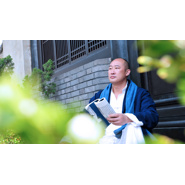

潘麟
============================

|  |  |
| :--: | :-- |
| [ 潘麟](https://i.xiami.com/panlindaoshi) | **播放数**: 1118591 **粉丝数**: 1713 **评论数**: 30 **地区**: China 中国大陆 **风格**: 新世纪音乐 New Age, 有声书 Audio Book, 西藏传统乐 Tibetan Traditional Music  |

## 档案

潘麟先生，印度德里大学佛教哲学与中印佛教史专业硕士，东方生命研究院创立人，当代杰出的原创型学者和哲学家。       先生年幼时即与圣学相契感通，日夜涵养于东方文化诸学派经典。及至成年，先生深感学问必要实践方能致用，遂远离家乡，遍访贤达，投师于当代多位贤能、大德、学者、思想家之门下，广学博览，艰苦实证，历经磨难，融会贯通，集东方文化之大成于一身。

## 专辑

| 名称 | 语种 | 唱片公司 | 发行时间 | 专辑类别 | 专辑风格 |
| :--: | :-- | :-- | :-- | :-- | :-- |
| [ 潘麟先生音乐](./albums/2105019457.md) | 其他 | 独立发行 | 2020年02月28日 | 录音室专辑 | 精神新世纪 Spiritual New Age |
| [ 《家门没上锁》](./albums/2106073606.md) | 国语 | 独立发行 | 2020年02月24日 | 有声书 | 有声书 Audio Book |
| [ 《〈瑜伽经〉直解》](./albums/2106067827.md) | 国语 | 独立发行 | 2020年02月20日 | 有声书 | 有声书 Audio Book |
| [ 《以心传心——潘麟先生讲授皇冠瑜伽》](./albums/2106067760.md) | 国语 | 独立发行 | 2020年02月20日 | 有声书 | 有声书 Audio Book |
| [ 《皇冠瑜伽——从身心健康到生命觉醒》](./albums/2106065461.md) | 国语 | 独立发行 | 2020年02月20日 | 有声书 | 有声书 Audio Book |
| [ 《到彼岸赏月——〈金刚经〉的智慧》](./albums/2106054710.md) | 国语 | 独立发行 | 2020年02月18日 | 有声书 | 有声书 Audio Book |
| [ 《直指生命的真相——〈心经〉直解》](./albums/2106054223.md) | 国语 | 独立发行 | 2020年02月17日 | 有声书 | 有声书 Audio Book |
| [ 《〈大学〉广义》](./albums/2105814571.md) | 国语 | 独立发行 | 2020年02月07日 | 有声书 | 有声书 Audio Book |

## 评论

|  |  |  |  |
| :-- | :-- | :-- | :-- |
|  [虾米用户](https://emumo.xiami.com/u/446208749) 言语道断 心行处灭 2020-12-01 10:54 赞(2) 踩(0) | 
阿弥陀佛 
 |
|  [虾米用户](https://emumo.xiami.com/u/13869808) 可能这个站已经没有编辑了... 2020-10-14 04:12 赞(1) 踩(0) | 
这小号做得也太粗糙了吧，何必呢&amp;hellip;&amp;hellip;
 |
|  [虾米用户](https://emumo.xiami.com/u/445010751)  2020-09-20 15:53 赞(1) 踩(0) | 
感恩恩师   
 |
|  [虾米用户](https://emumo.xiami.com/u/443060457) 我还没想好要写什么... 2020-09-04 08:59 赞(3) 踩(0) | 
人生 有一个对的师父 是多么庆幸的事情
 |
|  [虾米用户](https://emumo.xiami.com/u/443830888)  2020-09-03 22:57 赞(1) 踩(0) | 
老师，太感恩您了
 |
|  [虾米用户](https://emumo.xiami.com/u/432423723)  2020-08-14 22:09 赞(2) 踩(0) | 
虽然没有见过恩师您！可每天都着您的声音入睡 孩子每天都说您是她师父！她非常喜欢您！已经听了二年多了 ！不知道用什么语言表达    
 |
|  [虾米用户](https://emumo.xiami.com/u/318655710)  2020-07-29 15:33 赞(1) 踩(0) | 
是潘麟导师的粉丝，我也姓潘，也是安徽人
 |
|  [虾米用户](https://emumo.xiami.com/u/435306298)  2020-07-10 00:18 赞(1) 踩(0) | 
非常幸运，能在网上听到潘麟导师的声音
 |
|  [虾米用户](https://emumo.xiami.com/u/439821792)  2020-01-25 21:10 赞(2) 踩(0) | 
总是显示电台播放出错。易网音乐不是很好吗?搞得很神秘。
 |
|  [虾米用户](https://emumo.xiami.com/u/439821792)  2020-01-25 21:08 赞(1) 踩(0) | 
为何从易网音乐转过来，而且没法听呢?需要付费吗？
 |
|  [虾米用户](https://emumo.xiami.com/u/435394965)  2020-01-20 14:10 赞(1) 踩(0) | 
潘麟导师唱莲师心咒听了肚子涨调气脉。听倒拨生物钟，阿旺法王2012年圆寂，乐山大佛亮光，周围空气爆炸一样，有法力
 |
|  [虾米用户](https://emumo.xiami.com/u/435317674)  2020-01-09 08:12 赞(0) 踩(0) | 
请问老师，怎么听不见呢
 |
|  [虾米用户](https://emumo.xiami.com/u/434691328)  2019-12-26 17:49 赞(2) 踩(0) | 
喇嘛千诺！
 |
|  [虾米用户](https://emumo.xiami.com/u/434691328)  2019-12-26 17:49 赞(2) 踩(0) | 
喇嘛千诺！
 |
|  [虾米用户](https://emumo.xiami.com/u/434148412)  2019-12-16 13:51 赞(2) 踩(0) | 
感恩   
 |
|  [虾米用户](https://emumo.xiami.com/u/432674703)  2019-11-25 23:02 赞(3) 踩(0) | 
感恩潘麟导师   
 |
|  [虾米用户](https://emumo.xiami.com/u/432643663)  2019-11-24 22:58 赞(1) 踩(0) | 
终于找到了，感恩老师
 |
|  [虾米用户](https://emumo.xiami.com/u/312996176)  2019-11-23 22:55 赞(1) 踩(0) | 
师父   
 |
|  [虾米用户](https://emumo.xiami.com/u/432448922)  2019-11-23 21:15 赞(2) 踩(0) | 
从网易音乐追随到虾米音乐
 |
| ⇒ |  [虾米用户](https://emumo.xiami.com/u/435317674)  2020-01-09 08:13 赞(0) 踩(0) | 
我也是从网易音乐追随过来，这个软件怎么听呢
 |
|  [虾米用户](https://emumo.xiami.com/u/432539994) 一切都是最好的安排！ 2019-11-22 10:08 赞(1) 踩(0) | 
感恩导师 
 |
|  [虾米用户](https://emumo.xiami.com/u/430969574)  2019-11-20 15:37 赞(1) 踩(0) | 
感恩师父！
 |
|  [虾米用户](https://emumo.xiami.com/u/430969574)  2019-11-20 08:07 赞(2) 踩(0) | 
感恩师父慈悲开示！
 |
|  [虾米用户](https://emumo.xiami.com/u/432485010)  2019-11-19 23:45 赞(1) 踩(0) | 
感恩
 |
|  [虾米用户](https://emumo.xiami.com/u/30653975) 活着就是为了折腾 2019-07-17 02:07 赞(1) 踩(0) | 
无锡腾辉电子
 |
|  [虾米用户](https://emumo.xiami.com/u/353543494) 我还没想好要写什么... 2019-01-07 13:14 赞(1) 踩(0) | 
感恩导师
 |
|  [虾米用户](https://emumo.xiami.com/u/403051908)  2018-08-30 16:31 赞(1) 踩(0) | 
潘麟老师太棒了，敬仰，赞叹，师心我心。
 |
|  [虾米用户](https://emumo.xiami.com/u/255442670)  2016-12-27 17:37 赞(1) 踩(0) | 
  
 |
|  [虾米用户](https://emumo.xiami.com/u/167526204)  2016-06-03 20:34 赞(3) 踩(0) | 
我刚入驻了虾米音乐人，欢迎大家来我的个人主页，收听我的最新音乐
 |
| ⇒ |  [虾米用户](https://emumo.xiami.com/u/12353070)  2017-09-30 10:27 赞(0) 踩(0) | 
苏州 楼天虹涂青春
 |
