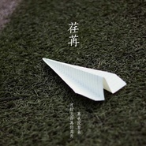
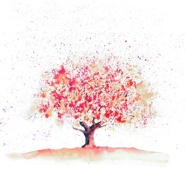
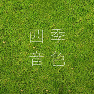

四季音色
============================

|  |  |
| :--: | :-- |
| [ 四季音色](https://i.xiami.com/fourseason) | **地区**: China 中国大陆 **风格**: 轻音乐 Easy Listening **播放数**: 2832962 **粉丝数**: 1766 **评论数**: 89  |

## 档案

跟着心情写曲的纯音乐音乐人~ 喜欢我就支持我吧

## 专辑

| 名称 | 语种 | 唱片公司 | 发行时间 | 专辑类别 | 专辑风格 |
| :--: | :-- | :-- | :-- | :-- | :-- |
| [ 归途](./albums/2103537696.md) | 其他 | 独立发行 | 2018年02月17日 | EP, 单曲 | 管弦乐流行 Orchestral Pop, 轻音乐 Easy Listening, 新世纪音乐 New Age |
| [ 端午](./albums/2103751853.md) | 纯音乐 | 独立发行 | 2017年06月18日 | EP, 单曲 | 轻音乐 Easy Listening |
| [ 新愿](./albums/2103663736.md) | 纯音乐 | 独立发行 | 2016年12月31日 | EP, 单曲 | 轻音乐 Easy Listening |
| [ 暖冬](./albums/2103663724.md) | 纯音乐 | 独立发行 | 2016年12月21日 | EP, 单曲 | 轻音乐 Easy Listening |
| [ 一颗木棉](./albums/2103524545.md) | 纯音乐 | 独立发行 | 2016年11月18日 | EP, 单曲 | 轻音乐 Easy Listening |
| [ 爱情就像](./albums/2102878913.md) | 其他 | 独立发行 | 2016年11月13日 | EP, 单曲 | 轻音乐 Easy Listening |
| [ 秋音冬韵](./albums/2102878910.md) | 其他 | 独立发行 | 2016年11月04日 | EP, 单曲 | 轻音乐 Easy Listening |
| [ 四季音色](./albums/2102878904.md) | 其他 | 独立发行 | 2016年10月16日 | EP, 单曲 | 轻音乐 Easy Listening |
| [ 陌日列车](./albums/2102401477.md) | 其他 | 独立发行 | 2016年09月13日 | EP, 单曲 | 轻音乐 Easy Listening |
| [ 四季音色](./albums/2100386964.md) | 其他 | 独立发行 | 2016年09月07日 | EP, 单曲 | 轻音乐 Easy Listening |
| [ 陌日列车](./albums/2100381474.md) | 其他 | 独立发行 | 2016年08月21日 | EP, 单曲 | 轻音乐 Easy Listening |
| [ 四季音色](./albums/2100376500.md) | 其他 | 独立发行 | 2016年08月03日 | EP, 单曲 | 轻音乐 Easy Listening |
| [ 四季音色](./albums/2100374458.md) | 其他 | 独立发行 | 2016年07月30日 | EP, 单曲 | 轻音乐 Easy Listening |
| [ 四季音色](./albums/2100373796.md) | 其他 | 独立发行 | 2016年07月28日 | EP, 单曲 | 轻音乐 Easy Listening |
| [ 愿有岁月可回首](./albums/2100366379.md) | 其他 | 独立发行 | 2016年07月13日 | EP, 单曲 | 轻音乐 Easy Listening |
| [ 四季音色](./albums/2100366360.md) | 其他 | 独立发行 | 2016年07月12日 | EP, 单曲 | 轻音乐 Easy Listening |
| [ 春夏之交，清旋淡律](./albums/2100353892.md) | 其他 | 独立发行 | 2016年06月10日 | EP, 单曲 | 轻音乐 Easy Listening |

## 评论

|  |  |  |
| :-- | :-- | :-- |
|  [虾米用户](https://emumo.xiami.com/u/196066430) Wilderness R... 2021-01-25 00:07 赞(0) 踩(0) | 
快三年没更新了，现在虾米也要关闭了&amp;hellip;
 |
|  [虾米用户](https://emumo.xiami.com/u/319656950)  2020-10-02 10:40 赞(0) 踩(0) | 
第一个听的是海风，从此迷上了
 |
|  [虾米用户](https://emumo.xiami.com/u/8337431) 以乐会友 2020-09-08 02:30 赞(0) 踩(0) | 
20200908，87
 |
|  [虾米用户](https://emumo.xiami.com/u/3197383) 生活中碰到知音的几率是零 2020-07-20 14:01 赞(0) 踩(0) | 
挺好的 ，听着有些类似JPP
 |
|  [虾米用户](https://emumo.xiami.com/u/91029584) 遇上方知有 2020-05-24 15:12 赞(0) 踩(0) | 
非常好听!支持!  
 |
|  [虾米用户](https://emumo.xiami.com/u/33157024)  2020-04-01 02:30 赞(0) 踩(0) | 
很好听
 |
|  [虾米用户](https://emumo.xiami.com/u/7151428) 暖暖的～～ 2020-03-25 11:06 赞(0) 踩(0) | 
！！
 |
|  [虾米用户](https://emumo.xiami.com/u/231797) 活着真好 好好活着 2020-03-12 20:46 赞(0) 踩(0) | 
~~
 |
|  [虾米用户](https://emumo.xiami.com/u/421205708)  2020-02-27 22:45 赞(0) 踩(0) | 
感觉他的曲子有点像july  但我还是很喜欢
 |
|  [虾米用户](https://emumo.xiami.com/u/421205708)  2020-02-27 22:39 赞(0) 踩(0) | 
比朗朗好听多了  你才是音乐人
 |
|  [虾米用户](https://emumo.xiami.com/u/3250268) 一首好歌都比爱一个人长久... 2020-02-17 22:23 赞(0) 踩(0) | 
很好听   
 |
|  [虾米用户](https://emumo.xiami.com/u/34061188)  2020-01-03 17:02 赞(1) 踩(0) | 
很棒的轻音乐，赞一个
 |
|  [虾米用户](https://emumo.xiami.com/u/3250268) 一首好歌都比爱一个人长久... 2019-12-04 10:21 赞(0) 踩(0) | 
真好听  
 |
|  [虾米用户](https://emumo.xiami.com/u/274084615) 音乐是心灵的寄宿地 2019-09-14 17:00 赞(0) 踩(0) | 
特别喜欢星夜，其他的也非常非常棒，加油，支持你！
 |
|  [虾米用户](https://emumo.xiami.com/u/319679684)  2019-07-07 11:57 赞(0) 踩(0) | 
第一次听你的音乐是端午，然后入坑了 
 |
|  [虾米用户](https://emumo.xiami.com/u/73580006)  2019-06-07 09:16 赞(1) 踩(0) | 
喜欢你的音乐
 |
|  [虾米用户](https://emumo.xiami.com/u/9327494) http://www.x... 2019-04-15 08:35 赞(0) 踩(0) | 
love
 |
|  [虾米用户](https://emumo.xiami.com/u/361037631)  2019-04-11 08:29 赞(0) 踩(0) | 
******
 |
|  [虾米用户](https://emumo.xiami.com/u/260469641) 我还没想好要写什么... 2019-03-21 00:16 赞(3) 踩(0) | 
中国的纯音乐人必顶，喜欢纯音乐新世纪
 |
|  [虾米用户](https://emumo.xiami.com/u/402078377) 流行   古风    纯... 2019-03-20 00:01 赞(1) 踩(0) | 
支持你的轻松愉快的纯音乐        
 |
|  [虾米用户](https://emumo.xiami.com/u/255751253) (ㅍ_ㅍ) 2019-02-24 13:59 赞(0) 踩(0) | 
从来没有哪位虾米艺人的音乐让我一听就上瘾，除了这位
 |
|  [虾米用户](https://emumo.xiami.com/u/269346930) 终究是一个人 2019-02-15 00:26 赞(0) 踩(0) | 
我来打破888和66
 |
|  [虾米用户](https://emumo.xiami.com/u/323021388) 2019,见证奇迹！ 2019-01-20 20:42 赞(1) 踩(0) | 
什么时候把四季音色的歌都做到游戏钢琴块2中去就好了！              
 |
|  [虾米用户](https://emumo.xiami.com/u/316502674) 在最后陪着你吧，我的虾米 2018-11-17 12:08 赞(1) 踩(0) | 
放上新专了啊
 |
|  [虾米用户](https://emumo.xiami.com/u/379889437)  2018-11-08 00:13 赞(1) 踩(0) | 
你怎么  没有放照片上去啊 介绍自己     介绍自的内心所想 可以找到    更多  共同  爱好的小伙伴哦
 |
|  [虾米用户](https://emumo.xiami.com/u/405647711)  2018-10-07 16:46 赞(1) 踩(0) | 
没有圣诞这首音乐，好喜欢，啥时候放上来？
 |
|  [虾米用户](https://emumo.xiami.com/u/351601848) 我还没想好要写什么... 2018-10-07 15:31 赞(2) 踩(0) | 
喜欢轻风
 |
|  [虾米用户](https://emumo.xiami.com/u/30527758) 学习是一种信仰 2018-09-27 08:01 赞(2) 踩(0) | 
好听 每年只出一首啊？
 |
|  [虾米用户](https://emumo.xiami.com/u/256541823) 冬天来了，春天还会远吗 2018-08-16 19:03 赞(9) 踩(0) | 
旋律很好听很悠扬，但有些曲子旋律有些单调，缺少一些变化。个人意见，还是希望能越做越好！
 |
|  [虾米用户](https://emumo.xiami.com/u/16994877) 音海拾音 2018-08-02 00:35 赞(3) 踩(0) | 
听惜别过来
 |
|  [虾米用户](https://emumo.xiami.com/u/783808) 夏夜，霓虹灯照亮的天际，... 2018-07-30 23:01 赞(2) 踩(0) | 
如街角静谧的小酒馆，洗去了一天的凡尘，这一刻，我回来了
 |
|  [虾米用户](https://emumo.xiami.com/u/295542159) Ciao 2018-05-20 06:00 赞(3) 踩(0) | 
内容已删除
 |
| ⇒ |  [虾米用户](https://emumo.xiami.com/u/322235515) 在音乐里澎湃，在玩笑里开... 2018-05-30 08:31 赞(0) 踩(0) | 
同感。星空浩渺，作者只写了几个星座。原野辽阔，作者只写了几个草坪。心灵复杂，作者屏蔽了私心杂念。经典的音乐，一定是丰富多彩的，但是小清新真的还不错！毕竟年轻嘛，或许一直靠勤奋和天赋做出来的。若历经沧桑，还有这样一份童心，与美好自然融合，那就好了。缺了点阅历。等你长大。
 |
|  [虾米用户](https://emumo.xiami.com/u/13343929)  2018-05-19 14:43 赞(3) 踩(0) | 
最美不过四季   彩色世界 四季之音
 |
|  [虾米用户](https://emumo.xiami.com/u/12194481) 敲击的不是音符,是心率;... 2018-05-16 20:31 赞(1) 踩(0) | 
这里歌曲少了 隔壁那么多 
 |
|  [虾米用户](https://emumo.xiami.com/u/222915583) 天性野 勿束缚 2018-05-07 20:08 赞(1) 踩(0) | 
还有 最喜欢 初遇 和欣月！！
 |
|  [虾米用户](https://emumo.xiami.com/u/222915583) 天性野 勿束缚 2018-05-07 20:06 赞(1) 踩(0) | 
有点中毒听这些轻音乐，感觉很简单的音调，为什么听每首的心情都不一样 ？？而且很有中式的感觉
 |
|  [虾米用户](https://emumo.xiami.com/u/312875471) 我这辈子只会饭一个男团E... 2018-04-29 14:24 赞(2) 踩(0) | 
一直都很喜欢四季的纯音乐，加油，一直支持你，期待你的新作品。 
 |
|  [虾米用户](https://emumo.xiami.com/u/325302985)  2018-04-23 14:09 赞(2) 踩(0) | 
好听
 |
|  [虾米用户](https://emumo.xiami.com/u/356528076)  2018-04-01 21:12 赞(16) 踩(0) | 
是不是四季的铁粉全在网易里呢 
 |
|  [虾米用户](https://emumo.xiami.com/u/41763276) 说浅了不感人，说深了没人... 2018-03-31 13:52 赞(2) 踩(0) | 
好听，我非常喜欢！
 |
|  [虾米用户](https://emumo.xiami.com/u/306669308) 忘 2018-03-11 20:29 赞(0) 踩(0) | 
四季。
 |
|  [虾米用户](https://emumo.xiami.com/u/23862178) keep the fai... 2018-02-26 00:50 赞(1) 踩(0) | 
❤️
 |
|  [虾米用户](https://emumo.xiami.com/u/349426161)  2018-02-10 21:14 赞(1) 踩(0) | 
很喜欢
 |
|  [虾米用户](https://emumo.xiami.com/u/339716643) 支边去了，我要淡定，一切... 2018-02-09 11:51 赞(0) 踩(0) | 
这个还可以
 |
|  [虾米用户](https://emumo.xiami.com/u/50272073)  2018-02-08 09:47 赞(3) 踩(0) | 
总感觉做出这种的音乐的人大概是有一份童心未泯的吧，真是件很难的事情啊。
 |
| ⇒ |  [虾米用户](https://emumo.xiami.com/u/303907625)  2018-06-16 09:10 赞(0) 踩(0) | 
作曲者是理工科大学生
 |
|  [虾米用户](https://emumo.xiami.com/u/285031527) 站定五月天！ 2018-01-28 21:48 赞(20) 踩(0) | 
太好听了，今天第一次听到这个推荐，听到的第一首是夏日，非常喜欢，毫不犹豫的全部收藏，力挺，感谢作者，
 |
| ⇒ |  [虾米用户](https://emumo.xiami.com/u/91029584) 遇上方知有 2020-05-24 15:13 赞(0) 踩(0) | 
啊哈哈哈哈我是春日入的坑
 |
|  [虾米用户](https://emumo.xiami.com/u/5130980) 透明人間18号 2018-01-23 04:18 赞(2) 踩(0) | 
加油❤️
 |
|  [虾米用户](https://emumo.xiami.com/u/114950790)  2018-01-10 02:30 赞(2) 踩(0) | 
最喜欢轻风了
 |
|  [虾米用户](https://emumo.xiami.com/u/3494308) 戴上耳机听好听的歌。 2017-12-22 21:14 赞(0) 踩(0) | 
今天是冬至!冬至快乐！我在微信上听到四季音色-冬至，这首音乐，虾米上没找到啊。
 |
|  [虾米用户](https://emumo.xiami.com/u/15280328) 开朗之人双足踏四方，沉着... 2017-12-11 22:01 赞(3) 踩(0) | 
好听好听，真心好
 |
|  [虾米用户](https://emumo.xiami.com/u/15280328) 开朗之人双足踏四方，沉着... 2017-12-10 22:13 赞(3) 踩(0) | 
中国也有这么好的音质，大赞一个 
 |
|  [虾米用户](https://emumo.xiami.com/u/339120459) 小云朵想吃糖  2017-12-08 22:09 赞(0) 踩(0) | 
斑光什么时候可以听啊 
 |
|  [虾米用户](https://emumo.xiami.com/u/339120459) 小云朵想吃糖  2017-12-08 22:08 赞(0) 踩(0) | 
斑光什么时候可以听啊
 |
|  [虾米用户](https://emumo.xiami.com/u/339120459) 小云朵想吃糖  2017-12-08 22:08 赞(0) 踩(0) | 
斑光什么时候可以听啊
 |
|  [虾米用户](https://emumo.xiami.com/u/339120459) 小云朵想吃糖  2017-12-08 22:08 赞(0) 踩(0) | 
斑光什么时候可以听啊
 |
|  [虾米用户](https://emumo.xiami.com/u/339120459) 小云朵想吃糖  2017-12-08 22:08 赞(0) 踩(0) | 
斑光什么时候可以听啊
 |
|  [虾米用户](https://emumo.xiami.com/u/317949857) 宁教我负天下人，休教天下... 2017-11-30 21:28 赞(2) 踩(0) | 
喜欢他的曲风
 |
|  [虾米用户](https://emumo.xiami.com/u/4400366) 再也不见 2017-11-23 06:48 赞(1) 踩(0) | 
囍
 |
|  [虾米用户](https://emumo.xiami.com/u/199559854) 我还没想好要写什么... 2017-11-20 10:35 赞(1) 踩(0) | 
可以啊
 |
|  [虾米用户](https://emumo.xiami.com/u/96123036) ちゃんと、生きているよ 2017-11-06 21:27 赞(1) 踩(0) | 
棒 
 |
|  [虾米用户](https://emumo.xiami.com/u/331992948) 想飞 2017-10-27 22:03 赞(1) 踩(0) | 
很棒
 |
|  [虾米用户](https://emumo.xiami.com/u/12876004) ` 2017-09-10 14:03 赞(1) 踩(0) | 
。
 |
|  [虾米用户](https://emumo.xiami.com/u/251752093)  2017-09-10 08:31 赞(2) 踩(0) | 
音乐清澈、流畅、动听！ 
 |
|  [虾米用户](https://emumo.xiami.com/u/309575777) 简沁 2017-08-30 01:55 赞(2) 踩(0) | 
喜欢他的轻音乐
 |
|  [虾米用户](https://emumo.xiami.com/u/31222853)  2017-08-29 00:56 赞(1) 踩(0) | 
从养猪场那边追过来这边。
 |
|  [虾米用户](https://emumo.xiami.com/u/54686131) 要听更多喜欢的歌~~~ 2017-08-14 11:00 赞(2) 踩(0) | 
春夏秋冬，因心情而更有特色，喜怒哀乐，周而复始，便是人生~~~
 |
|  [虾米用户](https://emumo.xiami.com/u/195632921)  2017-08-13 21:06 赞(1) 踩(0) | 
熟人
 |
|  [虾米用户](https://emumo.xiami.com/u/48009894) 系统消息：玩家一寸灰请求... 2017-07-18 12:24 赞(1) 踩(0) | 

 |
| ⇒ |  [虾米用户](https://emumo.xiami.com/u/218732109)  2017-07-21 18:10 赞(0) 踩(0) | 
斑斓也很好听
 |
|  [虾米用户](https://emumo.xiami.com/u/9347662) ❤forever 2017-07-02 14:10 赞(2) 踩(0) | 
曲库的收藏又增加了呢
 |
|  [虾米用户](https://emumo.xiami.com/u/71936716)  2017-05-25 19:40 赞(3) 踩(0) | 
哈哈，找到你了 
 |
|  [虾米用户](https://emumo.xiami.com/u/240089894)   2017-04-12 09:16 赞(3) 踩(0) | 
会有越来越多的人喜欢❤️
 |
|  [虾米用户](https://emumo.xiami.com/u/279652373)  2017-03-28 16:39 赞(2) 踩(0) | 
荏苒呢？怎么被撤掉了，好可惜~~
 |
|  [虾米用户](https://emumo.xiami.com/u/259540991)  2017-01-05 17:25 赞(2) 踩(0) | 
来了
 |
|  [虾米用户](https://emumo.xiami.com/u/48009894) 系统消息：玩家一寸灰请求... 2016-12-06 23:33 赞(0) 踩(0) | 

 |
|  [虾米用户](https://emumo.xiami.com/u/48009894) 系统消息：玩家一寸灰请求... 2016-11-26 23:35 赞(0) 踩(0) | 

 |
|  [虾米用户](https://emumo.xiami.com/u/7941874) 于是我逆流而上，奋发向前... 2016-10-24 18:42 赞(1) 踩(0) | 
好听！ 
 |
|  [虾米用户](https://emumo.xiami.com/u/7287017) 姌稥毓影，复刻轻悠 2016-08-01 14:42 赞(0) 踩(0) | 
时光是回眸的诗赋， 岁月是沉淀的淡然， 流年是氤氲的光影， 觉醒是漫步的茗客，.............................
 |
|  [虾米用户](https://emumo.xiami.com/u/44517684) 暂无签名~ 2016-07-29 20:51 赞(0) 踩(0) | 
追到这里来，还是我～
 |
| ⇒ |  [虾米用户](https://emumo.xiami.com/u/45876663) 喜欢我就关注我吧，尽力更... 2016-07-30 00:22 赞(0) 踩(0) | 
头像不是猫头鹰～
 |
|  [虾米用户](https://emumo.xiami.com/u/6866753)  2016-07-14 22:59 赞(1) 踩(0) | 
非常喜欢轻风～在网易有听，发现虾米也有，好棒！
 |
| ⇒ |  [虾米用户](https://emumo.xiami.com/u/45876663) 喜欢我就关注我吧，尽力更... 2016-07-15 15:35 赞(0) 踩(0) | 
刚刚入住虾米
 |
|  [虾米用户](https://emumo.xiami.com/u/48304635) 音乐信仰 2016-07-03 16:45 赞(0) 踩(0) | 
弟弟安利的，，
 |
|  [虾米用户](https://emumo.xiami.com/u/177648922) 还有诗和远方的田野 2016-06-22 18:29 赞(0) 踩(0) | 
海风呢
 |
| ⇒ |  [虾米用户](https://emumo.xiami.com/u/45876663) 喜欢我就关注我吧，尽力更... 2016-07-12 23:46 赞(0) 踩(0) | 
发布啦～
 |
|  [虾米用户](https://emumo.xiami.com/u/50315509)  2016-06-21 18:41 赞(0) 踩(0) | 

 |
|  [虾米用户](https://emumo.xiami.com/u/45876663) 喜欢我就关注我吧，尽力更... 2016-06-12 22:07 赞(74) 踩(0) | 
我刚入驻了虾米音乐人，欢迎大家来我的个人主页，收听我的最新音乐~
 |
