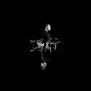
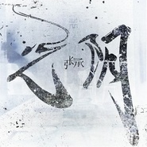

张承
============================

|  |  |
| :--: | :-- |
| [ 张承](https://i.xiami.com/zhangcheng) | **播放数**: 3541927 **粉丝数**: 405 **评论数**: 37 **地区**: China 中国大陆 **风格**:   |

## 档案

张承，1990年6月10日出生于北京，中国内地流行乐男歌手、影视演员，毕业于中国传媒大学音乐系。 
演员 
2011年，出演《夏日甜心》第五集《摇滚公寓》，在剧中饰演乐团鼓手。2012年，参加《八星入海》的比赛，获得决赛前八强；同年，报名参加《寻找新小虎队》选秀比赛，获得全国30强。2013年，主演民国抗战传奇剧《侠探高飞》。2014年，主演抗战剧《猛兽列车》。2015年，参演年代传奇电视剧《面具侠》。2016年，主演悬疑犯罪网络剧《余罪》掀起了全国的收视热潮，张承剧中饰演的“骆驼”一角广受好评，也因此获得了更多粉丝的支持。 
音乐人 
除了认真演绎好每一个角色之外，张承还是一个音乐人。超级网剧《余罪》 的片尾曲《落日谣》就是他为这部电视剧作出的原创歌曲，并与好兄弟张一山葛铮一起演唱。继《余罪》之后原班人马出演的电影《站住，别跑》片尾曲《我爹说》，也是由张承亲自作曲演唱的。歌唱和表演双栖发展的影视新星张承，将在即将过去的2016年一直喜爱和支持他的粉丝们献出第一份礼物——原创单曲《岛》。 
7月开始筹备个人音乐会，音乐会将在2017年1月1日星光现场举行，张承工作室也在同期筹备完善。 
更多张承消息请关注微博@张承工作室 。 
工作合作邮箱： maliyabobo@126.com 
工作合作电话：13811820751

## 专辑

| 名称 | 语种 | 唱片公司 | 发行时间 | 专辑类别 | 专辑风格 |
| :--: | :-- | :-- | :-- | :-- | :-- |
| [ 吹梦](./albums/5020998294.md) | 国语 |  | 2019年03月29日 | EP, 单曲 |  |
| [ 愚行](./albums/5020989983.md) | 国语 |  | 2019年02月13日 | EP, 单曲 | 流行 Pop |
| [ 光阴](./albums/2104158492.md) | 国语 | 海蝶音乐 | 2018年10月25日 | EP, 单曲 |  |
| [ 予七书](./albums/2102812158.md) | 国语 | 独立发行 | 2017年08月11日 | EP, 单曲 | 流行摇滚 Pop Rock |
| [ 再见，浪人](./albums/2102761845.md) | 国语 | 独立发行 | 2017年06月08日 | EP, 单曲 | 摇滚 Rock & Roll |
| [ 走火枪](./albums/2102761838.md) | 国语 | 独立发行 | 2017年06月08日 | EP, 单曲 | 重金属 Heavy Metal |
| [ 而若海风](./albums/2102761842.md) | 国语 | 独立发行 | 2017年06月08日 | EP, 单曲 | 流行 Pop |
| [ 你是年少的欢喜You Are The Joy Of Youth](./albums/2102694290.md) | 国语 | 独立发行 | 2017年02月16日 | EP, 单曲 | 国语流行 Mandarin Pop |
| [ 岛](./albums/2102672429.md) | 国语 | 独立发行 | 2016年12月26日 | EP, 单曲 | 国语流行 Mandarin Pop, 华语唱作人 Chinese Singer-Songwriter |

## 评论

|  |  |  |  |
| :-- | :-- | :-- | :-- |
|  [虾米用户](https://emumo.xiami.com/u/98318924)   2019-02-07 18:04 赞(0) 踩(0) | 
原来是拐哥啊
 |
|  [虾米用户](https://emumo.xiami.com/u/127002252)   2019-01-25 23:13 赞(0) 踩(0) | 
是拐哥吗
 |
|  [虾米用户](https://emumo.xiami.com/u/320754158)  2018-07-23 21:35 赞(0) 踩(0) | 
过
 |
|  [虾米用户](https://emumo.xiami.com/u/258413981)  2018-06-10 20:52 赞(0) 踩(0) | 
挺好听的、关注好久了
 |
|  [虾米用户](https://emumo.xiami.com/u/34592214)  2018-05-28 21:52 赞(0) 踩(0) | 
加油
 |
|  [虾米用户](https://emumo.xiami.com/u/280580557) xxhyzzd 2018-03-26 20:07 赞(1) 踩(0) | 
记住我是第226位粉丝 
 |
|  [虾米用户](https://emumo.xiami.com/u/280580557) xxhyzzd 2018-03-26 19:51 赞(2) 踩(0) | 
感觉看这个封面就像你.就进来啦.之前看剧的时候你最帅气.喜欢.现在要开始认真粉你啦. 
 |
|  [虾米用户](https://emumo.xiami.com/u/334669523)   2018-02-06 16:06 赞(1) 踩(0) | 
没想到虾米居然推送了初中同桌的歌曲，对张承的印象还是戴着牙套喷口水的，哈哈，声音好听，歌好听！
 |
|  [虾米用户](https://emumo.xiami.com/u/318253134)  2017-09-04 23:20 赞(0) 踩(0) | 
喜欢这幅嗓音。
 |
|  [虾米用户](https://emumo.xiami.com/u/13555511) 听蛙 2017-08-12 23:18 赞(0) 踩(0) | 
♡
 |
|  [虾米用户](https://emumo.xiami.com/u/247967017)  2017-08-12 22:39 赞(3) 踩(0) | 
考研看书看的想吐 可是我要坚持
 |
|  [虾米用户](https://emumo.xiami.com/u/318621308)  2017-08-11 08:48 赞(0) 踩(0) | 
人帅 声音性感 三观正 演技高 创作能力强 总之 哪都好
 |
|  [虾米用户](https://emumo.xiami.com/u/147240412)  2017-07-24 21:23 赞(0) 踩(0) | 
加油＾０＾~，我给你分享！你一定能火！歌唱的好！
 |
|  [虾米用户](https://emumo.xiami.com/u/38258851)   2017-07-01 15:45 赞(1) 踩(0) | 
张承你会大火，等 
 |
|  [虾米用户](https://emumo.xiami.com/u/243089191) 歌收藏的越多，失去的就越... 2017-05-31 23:37 赞(0) 踩(0) | 
你是年少的欢喜 求谱子乌克丽丽
 |
|  [虾米用户](https://emumo.xiami.com/u/247967017)  2017-05-28 11:15 赞(0) 踩(0) | 
居然在五月前入住了 我都不知道
 |
|  [虾米用户](https://emumo.xiami.com/u/245389774) 诗酒趁年华 2017-05-26 23:40 赞(0) 踩(0) | 
骆驼原来也唱歌啊
 |
|  [虾米用户](https://emumo.xiami.com/u/5108153) 杨柳岸晓风残月 2017-05-08 00:01 赞(0) 踩(0) | 
( ^_^ )不错嘛
 |
|  [虾米用户](https://emumo.xiami.com/u/12955002) 花が咲かない季節 2017-04-04 23:16 赞(0) 踩(0) | 
ごめん
 |
|  [虾米用户](https://emumo.xiami.com/u/34690182) 我还没想好要写什么... 2017-02-25 09:33 赞(0) 踩(0) | 
90后的少年回忆，与80后并没有什么分别 
 |
|  [虾米用户](https://emumo.xiami.com/u/50382788) 读书睡觉，这样挺好。 2017-01-28 22:54 赞(0) 踩(0) | 
前排 
 |
|  [虾米用户](https://emumo.xiami.com/u/262869044)  2017-01-18 22:55 赞(0) 踩(0) | 
******
 |
|  [虾米用户](https://emumo.xiami.com/u/257878405)   2016-12-29 21:16 赞(0) 踩(0) | 
支持老张 
 |
|  [虾米用户](https://emumo.xiami.com/u/248139334)  2016-12-27 19:29 赞(0) 踩(0) | 
好喜欢你的岛，你的岛，唱出我的心境
 |
|  [虾米用户](https://emumo.xiami.com/u/256397830) 我在岛的中间等着你 2016-12-27 11:47 赞(17) 踩(0) | 
我刚入驻了虾米音乐人，欢迎大家来我的个人主页，收听我的最新音乐
 |
| ⇒ |  [虾米用户](https://emumo.xiami.com/u/152973392) 狂野中带着性感，风情中带... 2017-11-12 02:38 赞(0) 踩(0) | 
词和旋律都很棒！加油张承
 |
| ⇒ |  [虾米用户](https://emumo.xiami.com/u/821947) S.H. 2019-02-25 07:49 赞(0) 踩(0) | 
同名的小可爱你好呀 
 |
| ⇒ |  [虾米用户](https://emumo.xiami.com/u/344567143) 脚踏实地,无愧于心 2020-01-21 01:25 赞(0) 踩(0) | 
声音很好听
 |
|  [虾米用户](https://emumo.xiami.com/u/51549693) 很快我们就可以见面了 2016-08-06 11:42 赞(0) 踩(0) | 
我爹说，真心好听 
 |
|  [虾米用户](https://emumo.xiami.com/u/159322860)  2016-08-03 23:18 赞(0) 踩(0) | 
虾米加关注啦 
 |
|  [虾米用户](https://emumo.xiami.com/u/203896367)  2016-08-03 11:11 赞(0) 踩(0) | 
张承张承~~
 |
|  [虾米用户](https://emumo.xiami.com/u/10309945) stay hungry,... 2016-08-02 12:55 赞(0) 踩(0) | 
坐等主页更新啊
 |
|  [虾米用户](https://emumo.xiami.com/u/196964610)  2016-07-30 06:08 赞(0) 踩(0) | 
歌呢…… 
 |
|  [虾米用户](https://emumo.xiami.com/u/204243328) 一路张扬 为承而狂 2016-07-23 16:34 赞(3) 踩(0) | 
骆驼什么都会，爱我承一辈子 
 |
|  [虾米用户](https://emumo.xiami.com/u/197091059)  2016-07-03 22:49 赞(0) 踩(0) | 
咋没歌呢
 |
|  [虾米用户](https://emumo.xiami.com/u/121660836)   2016-06-30 12:31 赞(0) 踩(0) | 
 
 |
|  [虾米用户](https://emumo.xiami.com/u/48367700)  2016-06-29 09:19 赞(0) 踩(0) | 
沙发 
 |
