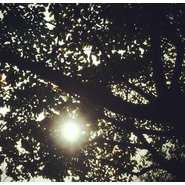

不见
============================

|  |  |
| :--: | :-- |
| [ 不见](https://emumo.xiami.com/album/2102752849) | **艺人**: [李雨](../index.md) **语种**: 国语 **唱片公司**: 独立发行 **发行时间**: 2017年05月23日 **专辑类别**: EP, 单曲 **专辑风格**: 独立民谣 Indie Folk **播放数**: 422933 **收藏数**: 188 **评论数**: 47  |

## 简介

用来交换成长的那些微小  
最后最后 都会重新回来 

## 曲目

## 评论

|  |  |  |  |
| :-- | :-- | :-- | :-- |
|  [虾米用户](https://emumo.xiami.com/u/125081446)  2018-04-14 16:53 赞(1) 踩(0) | 
真的很喜欢你的歌，就这么自由的唱下去吧
 |
|  [虾米用户](https://emumo.xiami.com/u/4277989) 我还没想好要写什么... 2018-02-06 23:43 赞(1) 踩(0) | 
好像每次听这首歌，都是想换工作的时候，但到现在还没换 
 |
|  [虾米用户](https://emumo.xiami.com/u/16206377) rabbit_❀moon 2017-08-11 22:09 赞(0) 踩(0) | 
A
 |
|  [虾米用户](https://emumo.xiami.com/u/311424037)  2017-08-03 07:57 赞(0) 踩(0) | 
失去的 不见的 都会在午夜梦回时 跌跌撞撞 入你怀
 |
|  [虾米用户](https://emumo.xiami.com/u/316733425)  2017-08-02 11:21 赞(0) 踩(0) | 
喜欢你所有歌，加油
 |
|  [虾米用户](https://emumo.xiami.com/u/235585497)  2017-07-31 01:11 赞(0) 踩(0) | 
特别赞的歌，听了很有感觉。
 |
|  [虾米用户](https://emumo.xiami.com/u/230763536)  2017-07-31 00:15 赞(1) 踩(0) | 
ok
 |
|  [虾米用户](https://emumo.xiami.com/u/121024900)  2017-07-30 15:24 赞(0) 踩(0) | 
加油呀
 |
|  [虾米用户](https://emumo.xiami.com/u/120516450)   2017-07-20 15:39 赞(1) 踩(0) | 
好听！
 |
|  [虾米用户](https://emumo.xiami.com/u/170979856)  2017-07-13 13:53 赞(0) 踩(0) | 
开口跪~雨哥常来成都 
 |
|  [虾米用户](https://emumo.xiami.com/u/121024900)  2017-07-03 13:12 赞(0) 踩(0) | 
好希望每首歌都放demo出来，太诚恳的声音 
 |
|  [虾米用户](https://emumo.xiami.com/u/235585497)  2017-06-12 07:37 赞(1) 踩(0) | 
最爱李雨，独立音乐人
 |
|  [虾米用户](https://emumo.xiami.com/u/232603045)  2017-06-07 19:23 赞(2) 踩(0) | 
喜欢她
 |
|  [虾米用户](https://emumo.xiami.com/u/302400041)  2017-06-06 20:22 赞(1) 踩(0) | 
好听好听，雨哥加油
 |
|  [虾米用户](https://emumo.xiami.com/u/121024900)  2017-06-05 01:38 赞(1) 踩(0) | 
喜欢DEMO的不见、姐姐、吾妻、苏四，离开了新专辑里各种高大上的编曲配乐，简简单单朴实诚恳的才是小姐姐你呀，嘻，可是另外两首的DEMO得在网易听，所以还是象征性催催鲤语电台，略略略。比心~
 |
|  [虾米用户](https://emumo.xiami.com/u/298875616)   2017-05-31 20:22 赞(2) 踩(0) | 
对自己内心的解读，记得解放自己，别想太多。@fishfish李雨啊
 |
|  [虾米用户](https://emumo.xiami.com/u/121024900)  2017-05-29 04:03 赞(0) 踩(0) | 
被感动到啦
 |
|  [虾米用户](https://emumo.xiami.com/u/232347707)  2017-05-27 23:36 赞(1) 踩(0) | 
吉他感很强，就很适合想安静的心情
 |
|  [虾米用户](https://emumo.xiami.com/u/264650464) 只是怕亲手将我的真心葬送 2017-05-27 20:08 赞(1) 踩(0) | 
我的雨
 |
|  [虾米用户](https://emumo.xiami.com/u/272590418)  2017-05-27 14:30 赞(1) 踩(0) | 
爱你 
 |
|  [虾米用户](https://emumo.xiami.com/u/200196385) 连雨不知春去，一觉方知夏... 2017-05-25 22:25 赞(1) 踩(0) | 
没有拥抱你，没有好好的感受过你 
 |
|  [虾米用户](https://emumo.xiami.com/u/247381685)  2017-05-25 20:38 赞(1) 踩(0) | 
快快乐乐呃
 |
|  [虾米用户](https://emumo.xiami.com/u/278666238)  2017-05-25 15:26 赞(1) 踩(0) | 
超级爱吖！比心无限循环循环循环
 |
|  [虾米用户](https://emumo.xiami.com/u/278666238)  2017-05-25 15:24 赞(1) 踩(0) | 
比心 
 |
|  [虾米用户](https://emumo.xiami.com/u/69392448)  2017-05-24 23:49 赞(1) 踩(0) | 
喜欢❤
 |
|  [虾米用户](https://emumo.xiami.com/u/275309415) 林深时见鹿  海蓝时见鲸... 2017-05-24 18:39 赞(1) 踩(0) | 
我还在原地等你，我的李雨 
 |
|  [虾米用户](https://emumo.xiami.com/u/228587515)  2017-05-24 15:53 赞(1) 踩(0) | 
大火
 |
|  [虾米用户](https://emumo.xiami.com/u/223453997) 原来山海皆可平，难平是人... 2017-05-24 12:49 赞(1) 踩(0) | 
你也不见了，我还在原地等你
 |
|  [虾米用户](https://emumo.xiami.com/u/201650041) 不管怎样  要坚持 2017-05-24 12:42 赞(1) 踩(0) | 
我在呢，一直都在呢
 |
|  [虾米用户](https://emumo.xiami.com/u/201650041) 不管怎样  要坚持 2017-05-24 12:41 赞(1) 踩(0) | 
厉害了，我的雨锅！
 |
|  [虾米用户](https://emumo.xiami.com/u/278595562)  2017-05-24 08:56 赞(1) 踩(0) | 
一定会回来。
 |
|  [虾米用户](https://emumo.xiami.com/u/278595562)  2017-05-24 08:56 赞(1) 踩(0) | 
见。
 |
|  [虾米用户](https://emumo.xiami.com/u/23940956)  2017-05-24 08:07 赞(1) 踩(0) | 
雨哥我来了
 |
|  [虾米用户](https://emumo.xiami.com/u/12711348)  2017-05-24 07:21 赞(1) 踩(0) | 
现在像这样的歌者已经越来越少了&amp;hellip;
 |
|  [虾米用户](https://emumo.xiami.com/u/264108866)   2017-05-24 07:18 赞(1) 踩(0) | 
好听
 |
|  [虾米用户](https://emumo.xiami.com/u/230774050) 所有的悲观都是远见 2017-05-24 04:19 赞(1) 踩(0) | 
不期而遇 不言而喻 不药而愈 
 |
|  [虾米用户](https://emumo.xiami.com/u/232093599) 春风十里不如鲤， 2017-05-24 01:15 赞(1) 踩(0) | 
好听，不见
 |
|  [虾米用户](https://emumo.xiami.com/u/191940044) 你好，我姓黄，红绿灯的黄 2017-05-24 00:57 赞(1) 踩(0) | 
好听，想到自己
 |
|  [虾米用户](https://emumo.xiami.com/u/265453223) 哼哼唧唧，咿咿呀呀。 2017-05-24 00:50 赞(1) 踩(0) | 
晚睡还是有好处的，愿一切都好 
 |
|  [虾米用户](https://emumo.xiami.com/u/54588732) ₍•͈˽•͈₎ 2017-05-24 00:47 赞(1) 踩(0) | 
喜欢李雨
 |
|  [虾米用户](https://emumo.xiami.com/u/38177579)  2017-05-24 00:34 赞(1) 踩(0) | 
前排 
 |
|  [虾米用户](https://emumo.xiami.com/u/200741494) 圈地自萌 2017-05-24 00:27 赞(1) 踩(0) | 
爱您
 |
|  [虾米用户](https://emumo.xiami.com/u/254537755)  2017-05-24 00:24 赞(1) 踩(0) | 
哇 写歌好快
 |
|  [虾米用户](https://emumo.xiami.com/u/121024900)  2017-05-24 00:10 赞(0) 踩(0) | 
青春总是过得太快，满满的遗憾。但还是要积极和勇敢，没有人能够代替我们坚强。
 |
|  [虾米用户](https://emumo.xiami.com/u/121024900)  2017-05-24 00:00 赞(2) 踩(0) | 
我第二个评论！！！！！刚被翻牌赞果然好运气
 |
|  [虾米用户](https://emumo.xiami.com/u/209866346)  2017-05-23 23:59 赞(1) 踩(0) | 
板凳
 |
|  [虾米用户](https://emumo.xiami.com/u/37145779)  2017-05-23 23:54 赞(1) 踩(0) | 
不见 仅听
 |
