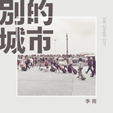

别的城市
============================

|  |  |
| :--: | :-- |
| [ 别的城市](https://emumo.xiami.com/album/2103826560) | **艺人**: [李雨](../index.md) **语种**: 国语 **唱片公司**: 发生音乐 **发行时间**: 2018年07月20日 **专辑类别**: EP, 单曲 **专辑风格**: 华语唱作人 Chinese Singer-Songwriter, 独立民谣 Indie Folk, 城市民谣 Urban Folk **播放数**: 4651832 **收藏数**: 197 **评论数**: 41  |

## 简介

总是在路上的人生啊，每个停留的地方，最后都成为了别的城市。  
如果远行是你的梦想，带着祝福跌跌撞撞，也会是故事的一部分。  
再次离开的这个城市，则带着它独有的温度，永远留在了你的人生里。  
  
《别的城市》是李雨将在2018年8月发行的第二张个人全创作专辑的第二支曝光单曲，也是与虾米音乐「社会音乐实录」计划的特别合作单曲。简单温暖的编曲，希望为不断迁徙的小鸟们带去暖意，拂去他们身上的疲倦。

## 曲目

## 评论

|  |  |  |  |
| :-- | :-- | :-- | :-- |
|  [虾米用户](https://emumo.xiami.com/u/248569474)  2020-10-03 11:08 赞(0) 踩(0) | 
多触动人心啊
 |
|  [虾米用户](https://emumo.xiami.com/u/149546728) 感谢虾米。 2018-10-24 22:24 赞(0) 踩(0) | 
真好
 |
|  [虾米用户](https://emumo.xiami.com/u/321562844) 保持微笑 2018-10-17 20:01 赞(0) 踩(0) | 
好听啊，好治愈。
 |
|  [虾米用户](https://emumo.xiami.com/u/96631834)  2018-10-06 22:14 赞(0) 踩(0) | 
我不敢说我很懂得你
 |
|  [虾米用户](https://emumo.xiami.com/u/103955696) 我还没想好要写什么... 2018-09-28 10:11 赞(0) 踩(0) | 
什么时候再回黑龙江 听你唱歌
 |
|  [虾米用户](https://emumo.xiami.com/u/260867644)  2018-09-21 08:45 赞(0) 踩(0) | 
真棒
 |
|  [虾米用户](https://emumo.xiami.com/u/357773449) 不知刀剑如何错，不辨痴心... 2018-09-02 09:54 赞(0) 踩(0) | 
人们选择奔波到别的城市，难免会感到孤独。这首歌打动我的，是治愈的节奏和真切的情感。两个流浪者的交心，是千千万万流浪者的安慰。我们只有经历了，才懂得家的可贵。
 |
|  [虾米用户](https://emumo.xiami.com/u/299666526) 你……是谁？ 2018-08-23 20:55 赞(0) 踩(0) | 
希望雨哥越来越好~
 |
|  [虾米用户](https://emumo.xiami.com/u/321320743) infinite onl... 2018-08-20 21:35 赞(1) 踩(0) | 
喜欢李雨的歌
 |
|  [虾米用户](https://emumo.xiami.com/u/336781084) (๑´∀`๑) 2018-08-15 20:07 赞(4) 踩(0) | 
打一星的水军吧？？米娜桑记得评分五星哟~
 |
|  [虾米用户](https://emumo.xiami.com/u/47479564)  2018-08-12 15:21 赞(0) 踩(0) | 
。
 |
|  [虾米用户](https://emumo.xiami.com/u/6232148) 在虾米坚持到最后一秒 2018-08-02 07:47 赞(4) 踩(0) | 
那11个打一星的朋友很迷哎 
 |
|  [虾米用户](https://emumo.xiami.com/u/345032839)  2018-07-30 21:11 赞(0) 踩(0) | 
想你了
 |
|  [虾米用户](https://emumo.xiami.com/u/9810726) 风景装饰着你的窗子，你装... 2018-07-26 23:57 赞(1) 踩(0) | 
有一首能抚慰心灵的歌，就是在深夜里配一罐啤酒的歌。日子就是这样，习惯了，有惊喜，希望不受委屈&amp;hellip;&amp;hellip;歌写的真好，不知道怎么形容就是想去听上几遍，就像北京难得的好天气！
 |
|  [虾米用户](https://emumo.xiami.com/u/32594610) 风雨无阻 2018-07-24 19:53 赞(0) 踩(0) | 
正因为现实的悲沧，才需要这样能抚慰人心的温暖。
 |
|  [虾米用户](https://emumo.xiami.com/u/278501270)  2018-07-23 14:57 赞(0) 踩(0) | 
走心
 |
|  [虾米用户](https://emumo.xiami.com/u/30502981)  2018-07-22 13:54 赞(0) 踩(0) | 
一首小清新的歌,很纯粹,回忆式的小伤感,不错.........
 |
|  [虾米用户](https://emumo.xiami.com/u/342540732) 我还没想好要写什么... 2018-07-22 10:44 赞(1) 踩(0) | 
纯净的穿透心灵的声音
 |
|  [虾米用户](https://emumo.xiami.com/u/48935681) 樓閣新晨花欲語，夢中誰是... 2018-07-22 07:51 赞(0) 踩(0) | 
还可以
 |
|  [虾米用户](https://emumo.xiami.com/u/358042231) 闭上眼睛听李雨的演唱，包... 2018-07-21 21:32 赞(2) 踩(0) | 
不要因为别人的言论丧失了自己 ​​​.爱李雨
 |
|  [虾米用户](https://emumo.xiami.com/u/8835605)  2018-07-21 14:48 赞(3) 踩(0) | 
在不同城市漂泊过，看过了不同的四季，会懂得拿起行囊时那种，期待和不舍杂糅一起的特别感情。
 |
|  [虾米用户](https://emumo.xiami.com/u/23357667)  2018-07-21 08:57 赞(0) 踩(0) | 
治愈心灵，很不错！
 |
|  [虾米用户](https://emumo.xiami.com/u/1369298) 听是人生中一段漫长的旅途... 2018-07-20 22:33 赞(0) 踩(0) | 
好听哇
 |
|  [虾米用户](https://emumo.xiami.com/u/33742422) 宁静致远 2018-07-20 18:06 赞(2) 踩(0) | 
请你离开这座城市到别的城市，好吗？
 |
|  [虾米用户](https://emumo.xiami.com/u/199429845)  2018-07-20 17:36 赞(0) 踩(0) | 
好听的
 |
|  [虾米用户](https://emumo.xiami.com/u/187557937) EXO 2018-07-20 16:22 赞(0) 踩(0) | 
李雨加油
 |
|  [虾米用户](https://emumo.xiami.com/u/240541023) 还年轻，别放弃。 2018-07-20 12:15 赞(1) 踩(0) | 
雨哥的所以歌我都有认真听
 |
| ⇒ |  [虾米用户](https://emumo.xiami.com/u/336781084) (๑´∀`๑) 2018-08-18 23:27 赞(0) 踩(0) | 
+1 OVO
 |
|  [虾米用户](https://emumo.xiami.com/u/117175348)  2018-07-20 10:59 赞(1) 踩(0) | 
感谢李雨小朋友一直以来给我们带来的宽慰和感动会好好走下去呀～
 |
|  [虾米用户](https://emumo.xiami.com/u/278845808) 鱼 2018-07-20 10:29 赞(0) 踩(0) | 
很棒
 |
|  [虾米用户](https://emumo.xiami.com/u/187721664) 每个人都是值得一桌两人三... 2018-07-20 09:39 赞(0) 踩(0) | 
喜欢
 |
|  [虾米用户](https://emumo.xiami.com/u/316306289)  2018-07-20 09:20 赞(1) 踩(0) | 
好听啊！
 |
|  [虾米用户](https://emumo.xiami.com/u/316306289)  2018-07-20 09:17 赞(0) 踩(0) | 
我究竟怎么才能得到你的消息
 |
|  [虾米用户](https://emumo.xiami.com/u/238801092)  2018-07-20 08:43 赞(0) 踩(0) | 

 |
|  [虾米用户](https://emumo.xiami.com/u/208403768) 你当温柔，却有力量。 2018-07-20 07:11 赞(0) 踩(0) | 
很生活，很李雨。
 |
|  [虾米用户](https://emumo.xiami.com/u/48935681) 樓閣新晨花欲語，夢中誰是... 2018-07-20 02:55 赞(0) 踩(0) | 
還不錯
 |
|  [虾米用户](https://emumo.xiami.com/u/28737414) 清风，烈酒，归途。 2018-07-20 01:25 赞(0) 踩(0) | 
可以。
 |
|  [虾米用户](https://emumo.xiami.com/u/25719964) 我还没想好要写什么... 2018-07-20 00:13 赞(0) 踩(0) | 
这么晚都不睡觉啊？
 |
|  [虾米用户](https://emumo.xiami.com/u/51647054) 姿月真爱粉 2018-07-20 00:06 赞(0) 踩(0) | 
沙发没了
 |
|  [虾米用户](https://emumo.xiami.com/u/285366998) 欣欣 2018-07-20 00:01 赞(0) 踩(0) | 
晚安，陌生人，晚安，歌手。
 |
|  [虾米用户](https://emumo.xiami.com/u/285366998) 欣欣 2018-07-20 00:00 赞(0) 踩(0) | 
哇。
 |
