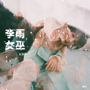
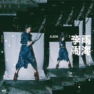
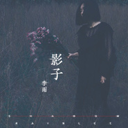
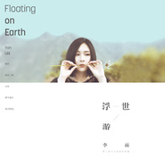
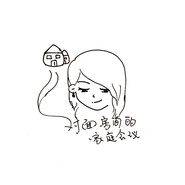

李雨
============================

|  |  |
| :--: | :-- |
| [ 李雨](https://i.xiami.com/fishfishlee) | **地区**: China 中国大陆 **风格**: 华语唱作人 Chinese Singer-Songwriter, 独立民谣 Indie Folk **播放数**: 23985383 **粉丝数**: 13420 **评论数**: 425  |

## 档案

李雨，出生于黑龙江宝清县，学生，就读于哈尔滨师范大学，在大二时离开学校。 
2016年5月2日，在芒果TV《超级女声》百强分班赛第二场中，顺利晋级全国20强，成为入住女声学院的首批正式生之一 。 
内地民谣女歌手、音乐创作人 
1993.03.24 白羊座 
171cm / 52kg 
黑龙江省双鸭山市宝清县 
哈尔滨师范大学 
音乐风格/流行,民谣 
代表作品/苏四、姊姊、酒僧、万水、吾妻 
李雨，一位93年的东北女孩，用人生经历与满满的情感想象，一字一笔的写出文化的优雅与感怀，她充满感染力、故事性与情境感的文字，不仅是她表达内心情感的最直接工具，同时更带给听众满满的画面感，用词与曲建构了一个世间百态的图景，将故事娓娓道来。 
2016年参加芒果TV选秀娱乐节目《超级女声》的比赛，获得锋尚958黑龙江媒体直通区冠军，并成为入住女声学院的首批正式生之一，最终获得全国总决赛第七名，其创作才华在比赛时期即备受赞扬，赛间演出十首原创歌曲，于各大音乐平台上皆有较高视听量，媒体更给出〝三十年难得一见的民谣歌手〞称号。除了网友与媒体的关注以外，李雨的创作能力也使评审给出极高评价，更让吴克群、古巨基主动邀歌，创作实力不容小觑。 
从自身经历抒发情坏；以古文入词；或借由传统中国经典角色作为创作灵感，李雨的创作灵感从生活、从突发感悟、从自身所处的文化圈出发，对身体里住着位老灵魂的李雨来说，每首歌曲的创作都来自一种体悟与感受而有了创作的动机，透过记录生活中的各种情绪再延伸为旋律与歌词。 
李雨的声线平实但又极具个人特色，温婉却又扎实的音质，屡屡刻划出旋律既蕴含柔美同时又透着强韧的特质。一把吉他，一支笔，她用音乐谱一段故事，以声音唱出沈静的力量。 
〝闭上眼睛听李雨的演唱，仿佛安宁地坐在古色古香的深宅大院，却一直凝视着、嗅闻着屋檐之外洗涤都市的夏雨。身置飘渺云阁，思想，却在现实之中。〞---搜狐音乐 
深受自身文化圈影响的李雨，着迷于中国的文化记录模式，渗入市井小民的日常生活中，无论在任何空间与时间下，文化底蕴皆深刻于城市的纹理中，这让从生活周遭酝酿创作灵感的李雨，其音乐风格带有浓厚的中国味，然而作为一个乐坛中的新兴音乐创作人，李雨并不自我设限，在筹备新辑的同时，更积极投入音乐制作等更深入表达音乐个性的环节，用她最喜欢的音乐与听众来场有趣的茶憩。

## 专辑

| 名称 | 语种 | 唱片公司 | 发行时间 | 专辑类别 | 专辑风格 |
| :--: | :-- | :-- | :-- | :-- | :-- |
| [ 万千观止](./albums/5021942169.md) | 国语 | 发生音乐 | 2020年07月22日 | 录音室专辑 |  |
| [ 归期 demo归期 demo](./albums/2105766639.md) | 国语 | 独立发行 | 2020年01月22日 | EP, 单曲 | 流行 Pop |
| [ 女巫](./albums/5021940437.md) | 国语 | 盛华宣 | 2019年12月03日 | EP, 单曲 |  |
| [ 闹海](./albums/5021957553.md) | 国语 | 发生音乐 | 2019年10月29日 | EP, 单曲 |  |
| [ 像没有过 demo](./albums/2104780563.md) | 国语 |  | 2019年04月16日 | EP, 单曲 | 民谣 Folk |
| [ 远乡 (demo)](./albums/2104528548.md) | 国语 | 发生音乐 | 2019年01月24日 | EP, 单曲 | 民谣 Folk, 流行 Pop |
| [ 影子](./albums/5021956113.md) | 国语 | 盛华宣 | 2018年09月28日 | EP, 单曲 |  |
| [ 浮世游](./albums/2103874800.md) | 国语 | 发生音乐 | 2018年08月02日 | 录音室专辑 | 独立民谣 Indie Folk, 民谣流行 Folk Pop, 华语唱作人 Chinese Singer-Songwriter |
| [ 别的城市](./albums/2103826560.md) | 国语 | 发生音乐 | 2018年07月20日 | EP, 单曲 | 华语唱作人 Chinese Singer-Songwriter, 独立民谣 Indie Folk, 城市民谣 Urban Folk |
| [ 大梦](./albums/2103766810.md) | 国语 | 发生音乐 | 2018年07月02日 | EP, 单曲 | 华语唱作人 Chinese Singer-Songwriter, 独立民谣 Indie Folk |
| [ 少年 Demo](./albums/2103673593.md) | 国语 | 发生音乐 | 2018年04月08日 | EP, 单曲 | 民谣流行 Folk Pop |
| [ 年 （demo）](./albums/2103517456.md) | 国语 | 发生音乐 | 2018年02月06日 | EP, 单曲 | 民谣 Folk, 流行 Pop |
| [ 对面房间的家庭会议 Demo](./albums/2102943592.md) | 国语 | 独立发行 | 2017年11月18日 | 合集, 杂锦 | 国语流行 Mandarin Pop, 独立民谣 Indie Folk |
| [ 鱼里言吾Soliloquy of The Fish](./albums/2102804670.md) | 国语 | 发生音乐 | 2017年07月31日 | 录音室专辑 | 华语唱作人 Chinese Singer-Songwriter, 当代民谣 Contemporary Folk |
| [ 不见](./albums/2102752849.md) | 国语 | 独立发行 | 2017年05月23日 | EP, 单曲 | 独立民谣 Indie Folk |
| [ 鲤语](./albums/2102705698.md) | 国语 | 发生音乐 | 2017年03月08日 | EP, 单曲 | 华语唱作人 Chinese Singer-Songwriter, 国语流行 Mandarin Pop, 华语唱作人 Chinese Singer-Songwriter |

## 评论

|  |  |  |
| :-- | :-- | :-- |
|  [虾米用户](https://emumo.xiami.com/u/6320476) 再见 2021-01-23 19:35 赞(0) 踩(0) | 
再见
 |
|  [虾米用户](https://emumo.xiami.com/u/446447332)  2020-12-30 15:29 赞(1) 踩(0) | 
为了李雨的一首 年 我把虾米音乐下载了
 |
|  [虾米用户](https://emumo.xiami.com/u/420341) 盛夏夜里绽放最耀眼的花火 2020-11-19 11:08 赞(0) 踩(0) | 
为啥没有万千观止？奇怪
 |
|  [虾米用户](https://emumo.xiami.com/u/405460297)  2020-06-29 20:04 赞(2) 踩(0) | 
李雨姐姐 你好，希望你不要介意我这冒然的称呼。想起自己应该是从3年前您的一首《吾妻》喜欢上你，而后的时光也关注着你，你上次演唱会，耽误了一次，感觉挺可惜的。 喜欢您的歌这么久了，我也特别想对您说 我大概听懂了您的歌，却又觉得自己还要走更长的路，才能体会到你的忧伤。 我特别希望见到你，如果能有一张和您的&amp;ldquo;合照&amp;rdquo;那就会高兴的起飞，然后向逢人就说&amp;ldquo;这是我得偶像&amp;rdquo;如果有人问起我为什么喜欢您的话，我一定会说她的歌唱出了所有人间美好。。
 |
| ⇒ |  [虾米用户](https://emumo.xiami.com/u/316298650) 纵欲对不起灵魂 禁欲对不... 2020-09-13 15:25 赞(0) 踩(0) | 
冒昧打扰了，因为真的觉得和你很像啊。李雨姐姐的歌陪我度过了最艰难的一段时间，每天都听她的歌才会心安。后来去了一次演唱会，胆子太小太小，一见面眼泪就快控制不住了。后来排签名，有一堆一堆的话好想说，可是最后只说出来一句谢谢你。连合照也不敢要求。幸好从后门去停车场，碰到门后坐在地上的李雨姐姐。像疯了一样冲过去跪下来了，一句完整的话都说不出来了。是我妈妈陪我一起去的，她帮我把我想说的告诉李雨姐姐，李雨姐姐还看了我听她的歌时画的画。她还说她以前也很胆小，让我勇敢一点，也拍了我做梦都会笑醒的合照。她真的是一个很温柔的姐姐，她很真诚地对待每一个人。我现在真的变得大胆了许多，比如说现在我就敢把心里面的话说出。
 |
|  [虾米用户](https://emumo.xiami.com/u/248068211) 让你被爱是我光荣 2020-06-24 21:18 赞(3) 踩(0) | 
一直以为李雨没有继续出新作品，然后发现，哦，新作品去了腾讯家 ：）
 |
|  [虾米用户](https://emumo.xiami.com/u/403187114)  2020-06-16 10:09 赞(1) 踩(0) | 
我哭了，我听了两年李雨的歌，最近发现虾米音乐很多首没有版权了，哭死我算了
 |
|  [虾米用户](https://emumo.xiami.com/u/43875708)  遣词造句 穿山过水 他... 2020-06-10 00:57 赞(1) 踩(0) | 
怎么说呢 词不错曲调也不错 乍一听不错 偶尔循环也不错 但是风格确实单一了 没有不好的意思 就是如果不细听感觉每首歌都一样 加油
 |
|  [虾米用户](https://emumo.xiami.com/u/192392416) 我以为不露痕迹，思念却满... 2020-05-14 12:48 赞(1) 踩(0) | 
从《万水》开始，中了李雨的毒
 |
| ⇒ |  [虾米用户](https://emumo.xiami.com/u/316298650) 纵欲对不起灵魂 禁欲对不... 2020-06-24 17:27 赞(0) 踩(0) | 
我也是 天
 |
|  [虾米用户](https://emumo.xiami.com/u/339520002)   2020-03-24 10:03 赞(1) 踩(0) | 
李雨作为快乐女生比较小众的音乐选手，这样的很难有有市场，可我还是最喜欢她。
 |
|  [虾米用户](https://emumo.xiami.com/u/101532292)  2020-02-29 09:57 赞(0) 踩(0) | 
好你个李雨！今天搜万水的百科才知道比我小十岁！！我还以为跟我年龄差不多甚至比我还大些吧？？      ！！怪不得给强东玥助唱呢，害我为你叫屈半天，，话说回来历届快男快女不说都全都看过也是很熟悉了，看来为了你我得补补2016超女了！！！！
 |
|  [虾米用户](https://emumo.xiami.com/u/358995000) 散场本是常态 尽兴而归就... 2020-02-29 01:31 赞(0) 踩(0) | 
⚙︎
 |
|  [虾米用户](https://emumo.xiami.com/u/439853961)  2020-01-27 02:56 赞(1) 踩(0) | 
爱了 ，新年快乐
 |
|  [虾米用户](https://emumo.xiami.com/u/49511) 这家伙很聪明什么也没留下... 2020-01-07 21:12 赞(0) 踩(0) | 
喜欢很久 不经意看资料 才发现是母校的妹妹 不知道什么时候会回哈尔滨唱歌？期待
 |
|  [虾米用户](https://emumo.xiami.com/u/48629773) 我还没想好要写什么... 2019-11-23 22:26 赞(0) 踩(0) | 
有幸
 |
|  [虾米用户](https://emumo.xiami.com/u/275917092)  2019-10-22 21:56 赞(1) 踩(0) | 
鲤姐姐真的很会写词
 |
|  [虾米用户](https://emumo.xiami.com/u/403569920) 你们好，我是庞博。 2019-10-09 08:21 赞(1) 踩(0) | 
写的真好，我能在小剧场翻唱吗？
 |
|  [虾米用户](https://emumo.xiami.com/u/330678292)  2019-09-19 18:34 赞(0) 踩(0) | 
你就是最牛X的女人
 |
|  [虾米用户](https://emumo.xiami.com/u/12464596)  2019-08-23 23:01 赞(0) 踩(0) | 
词写得很好
 |
|  [虾米用户](https://emumo.xiami.com/u/461779)  2019-08-02 01:00 赞(0) 踩(0) | 
有深度，有温度。加油！
 |
|  [虾米用户](https://emumo.xiami.com/u/10419853) 暂无签名~ 2019-07-30 16:46 赞(1) 踩(0) | 
幸会。
 |
|  [虾米用户](https://emumo.xiami.com/u/8322366) 我还没想好要写什么... 2019-07-09 07:37 赞(1) 踩(0) | 
你的歌 都好赞
 |
|  [虾米用户](https://emumo.xiami.com/u/5066465) 时间不够用 多听好歌 2019-07-08 11:07 赞(0) 踩(0) | 
希望有一天你能来我的小酒馆，我要开瓶好酒，不接客。
 |
|  [虾米用户](https://emumo.xiami.com/u/275917092)  2019-05-22 11:17 赞(0) 踩(0) | 
少年我真的是喜欢到***
 |
|  [虾米用户](https://emumo.xiami.com/u/3140019) 天马行空 2019-05-17 18:20 赞(0) 踩(0) | 
希望李雨大步往前走，来个大突破华丽转身
 |
|  [虾米用户](https://emumo.xiami.com/u/403765436)  2019-05-01 20:03 赞(2) 踩(0) | 
歌词写的都像诗，唱出来反而更好听了
 |
|  [虾米用户](https://emumo.xiami.com/u/84791874) 音乐无国界 2019-04-08 17:29 赞(0) 踩(0) | 
东北老乡，喜欢上她的声音了.
 |
|  [虾米用户](https://emumo.xiami.com/u/219128193) 猜猜我的占有欲有多可怕_ 2019-03-25 23:00 赞(0) 踩(0) | 
万水却难解渴
 |
|  [虾米用户](https://emumo.xiami.com/u/411417626) 我爱(⑉°з°)-♡学习... 2019-03-18 13:04 赞(0) 踩(0) | 
喜欢你的歌
 |
|  [虾米用户](https://emumo.xiami.com/u/33575558) 一丈孤勇心外仙 2019-03-11 21:10 赞(0) 踩(0) | 
我要买你的嗓音
 |
|  [虾米用户](https://emumo.xiami.com/u/14622761) 拜拜 2019-03-07 16:47 赞(0) 踩(0) | 
雨哥有新歌了啊
 |
|  [虾米用户](https://emumo.xiami.com/u/405460297)  2019-02-26 20:07 赞(1) 踩(0) | 
雨哥，你的歌我总是一个专辑一个专辑的循环，它有一些淡淡的忧伤，我词汇量可少，也不能总结出什么来。  简单的来说，我喜欢这样文艺的你，和你的样子，我也晓得，那种沧桑的状态，也有很多人文关怀在里面。就如同我以往看到的那些文学作品一样，及写实又美好，我晓得如果没有一颗热爱着世界的心，它是如何都办不到这些的。我恨迷恋着你呢    我习惯着听你的歌，从结束上一段感情到现在也有了3年，如今也碰到了那个温柔的女孩，她告诉我说，喜欢我的气息，也喜欢我的磁场，好像我就是那个她一直在等的人。她哭完了以前的悲伤与委屈，我们就怀着对各自的喜欢，慢慢的相处着……
 |
|  [虾米用户](https://emumo.xiami.com/u/352339) 暂无签名~ 2019-01-31 13:08 赞(1) 踩(0) | 
的确是一股清流，耳目一新，需要这样的歌者
 |
|  [虾米用户](https://emumo.xiami.com/u/336781084) (๑´∀`๑) 2019-01-27 21:08 赞(1) 踩(0) | 
从几千粉丝看她一步一步走到现在的几万粉丝，我好歹也勉强算个老粉了吧？(*｀▽´*)
 |
|  [虾米用户](https://emumo.xiami.com/u/281174586)  2019-01-21 23:40 赞(3) 踩(0) | 
<a href="http://emumo.xiami.com/u/210484972" target="_blank" rel="nofollow" name_card="210484972">@李雨 </a>姐姐，我真的很喜欢您，在去年，我对民谣产生了极大的兴趣，就查找了民谣歌手，我看到您的背景图片很酷，于是我就点开您的虾米主页，听了您的歌，发现您的歌都很好听，于是我就在百度搜索了您的资料，发现您是黑龙江人，我当时真的很高兴，也很骄傲，因为我也是黑龙江人，姐姐，我想说，您是我们黑龙江的骄傲！最后，无论您看不看的见这条评论，我都会一直喜欢您，关注您的！
 |
|  [虾米用户](https://emumo.xiami.com/u/184403147)  2019-01-19 14:31 赞(1) 踩(0) | 
只有我们还相信这些字眼:温暖，爱情
 |
|  [虾米用户](https://emumo.xiami.com/u/284722379) 我还没想好要写什么... 2019-01-08 09:53 赞(1) 踩(0) | 
是讲故事的人
 |
|  [虾米用户](https://emumo.xiami.com/u/68021750)  2019-01-07 16:51 赞(1) 踩(0) | 
在你是超女时就听过这首歌了，改的温柔了，唱的也温柔了，加油
 |
|  [虾米用户](https://emumo.xiami.com/u/187342300) 哎 2019-01-04 19:24 赞(0) 踩(0) | 
真的好听你的歌
 |
|  [虾米用户](https://emumo.xiami.com/u/47447372) 欲望满足的瞬间即是偿还的... 2019-01-02 13:37 赞(2) 踩(0) | 
始于酒僧，陷于梦画，忠于李雨<a href="http://emumo.xiami.com/u/210484972" target="_blank" rel="nofollow" name_card="210484972">@李雨 </a>
 |
|  [虾米用户](https://emumo.xiami.com/u/47447372) 欲望满足的瞬间即是偿还的... 2019-01-02 13:37 赞(2) 踩(0) | 
我想去见你，然后拥抱你<a href="http://emumo.xiami.com/u/210484972" target="_blank" rel="nofollow" name_card="210484972">@李雨 </a>
 |
|  [虾米用户](https://emumo.xiami.com/u/247311982)  2018-12-31 21:36 赞(1) 踩(0) | 
连续几首都是雨姐的歌，我听着听着我以为我只是点了雨的歌单里每首一直播放下去的。发现不是，只是推荐的 然后我点进去真的每首都去听啦哈
 |
|  [虾米用户](https://emumo.xiami.com/u/34511422)  2018-12-08 23:10 赞(1) 踩(0) | 
谁能告诉我浮世游实体专辑哪里能买
 |
|  [虾米用户](https://emumo.xiami.com/u/121024900)  2018-12-01 09:51 赞(1) 踩(0) | 
这世界上怎么会有这么傻突然想着给自己葬礼写歌的人啊TAT又傻气又让人心疼
 |
| ⇒ |  [虾米用户](https://emumo.xiami.com/u/121024900)  2018-12-01 09:53 赞(0) 踩(0) | 
风信要听哭了
 |
|  [虾米用户](https://emumo.xiami.com/u/15564845) 温柔致死 2018-11-12 16:46 赞(2) 踩(0) | 
所有的歌都非常棒，尤其喜欢那种淡淡的描写生活片段的感觉，像对面房间的家庭会议、市集这些，仿佛就是自己曾经的某一个顺间。其实90后有很多特有的怀旧点，当我听到姐姐的时候，就觉得太对味了，就像听到儿时一样，感动 
 |
|  [虾米用户](https://emumo.xiami.com/u/286740871) 最好不相见，免得我牵念！... 2018-11-09 17:28 赞(1) 踩(0) | 
小姐姐，歌好好听啊，你的声音我听到了，你歌里的故事我也听到了...
 |
|  [虾米用户](https://emumo.xiami.com/u/377766063) 那花开 2018-10-21 22:19 赞(0) 踩(0) | 
加油
 |
|  [虾米用户](https://emumo.xiami.com/u/306956596)  2018-10-17 13:00 赞(2) 踩(0) | 
一开始听的，姐姐，把自己听哭了，然后越来越喜欢李雨的声音，每首歌都是一个故事
 |
|  [虾米用户](https://emumo.xiami.com/u/379335868)  2018-10-09 18:43 赞(0) 踩(0) | 
姐姐 很好听
 |
|  [虾米用户](https://emumo.xiami.com/u/275618946)  2018-10-07 12:33 赞(0) 踩(0) | 
听了好几天了  好听 支持黑龙江老乡 期待更多作品 加油
 |
|  [虾米用户](https://emumo.xiami.com/u/68427048) R&B 嘻哈才是最音乐 2018-10-06 12:31 赞(0) 踩(0) | 
好听的
 |
|  [虾米用户](https://emumo.xiami.com/u/288248353) 好好活 2018-10-01 09:55 赞(0) 踩(0) | 
很棒，听着你的音乐，总会回想很多 ，加油
 |
|  [虾米用户](https://emumo.xiami.com/u/564335) 每一个缺少音乐相伴的日子... 2018-09-24 22:32 赞(2) 踩(0) | 
加油! 真滴很不错、还可以做的更棒滴  想成为苏珊.薇格那样的民谣诗人吗 
 |
|  [虾米用户](https://emumo.xiami.com/u/379639728) 挺好 2018-09-20 10:52 赞(0) 踩(0) | 
听你的歌会很感触，真的非常好听
 |
|  [虾米用户](https://emumo.xiami.com/u/304629893)  2018-09-11 03:28 赞(0) 踩(0) | 
   
 |
|  [虾米用户](https://emumo.xiami.com/u/273943907)  2018-09-10 21:30 赞(2) 踩(0) | 
果然追星还是北上广
 |
|  [虾米用户](https://emumo.xiami.com/u/375228694)  2018-09-08 10:11 赞(0) 踩(0) | 
第一次听你的歌，留下了眼泪，我也不知道为谁，为了什么
 |
|  [虾米用户](https://emumo.xiami.com/u/71842508)  - 2018-09-06 02:01 赞(1) 踩(0) | 
喜欢
 |
|  [虾米用户](https://emumo.xiami.com/u/26967867) 入戏太深 2018-09-05 21:27 赞(1) 踩(0) | 
谢谢你的歌声陪伴着我每一天 
 |
|  [虾米用户](https://emumo.xiami.com/u/4421063) 梦里是谁 2018-09-01 13:04 赞(0) 踩(0) | 
刺激 哲毕难艹
 |
|  [虾米用户](https://emumo.xiami.com/u/187050430)  2018-08-21 00:36 赞(0) 踩(0) | 
深圳场我要去！
 |
|  [虾米用户](https://emumo.xiami.com/u/149546728) 感谢虾米。 2018-08-17 12:34 赞(0) 踩(0) | 
雨哥啊，我特别特别希望有一天你能有机会见见我健哥（李健），你们有些地方特别特别像，他一定喜欢你的音乐，你们肯定能相互从对方身上得到带音乐上的灵感 考虑下
 |
|  [虾米用户](https://emumo.xiami.com/u/86513568)  2018-08-16 15:02 赞(1) 踩(0) | 
想不到，能写出这样淡然歌曲的歌手竟然这么年轻
 |
|  [虾米用户](https://emumo.xiami.com/u/4095521) 善行无辙迹 2018-08-15 11:01 赞(2) 踩(0) | 
喜欢李雨的浅吟低唱，宛转悠扬。
 |
|  [虾米用户](https://emumo.xiami.com/u/303506160) 因为我对你爱的深沉 2018-08-14 02:30 赞(1) 踩(0) | 
嘿呦
 |
|  [虾米用户](https://emumo.xiami.com/u/346130288)  2018-08-10 15:56 赞(1) 踩(0) | 
早晚得火
 |
|  [虾米用户](https://emumo.xiami.com/u/353560864) 这家伙很聪明什么也没留下... 2018-08-09 19:33 赞(1) 踩(0) | 
有多少人和我一样喜欢这个段发的小姐姐，喜欢她的音乐，喜欢她的故事。不能说她唱的歌我都听过，但是她唱的歌我都很喜欢。初次听到她的歌是 姐姐 ，我是有多久没听的这么入神了，不知不觉我落泪了。后来我听了 吾妻  别的城市&amp;hellip;&amp;hellip;她就是李雨，一个我渐渐喜欢上的歌手。我是她的粉丝，她的演唱会我一定会去的。加油李雨，我会支持你的！
 |
|  [虾米用户](https://emumo.xiami.com/u/1799677) entertain me... 2018-08-09 09:55 赞(4) 踩(0) | 
李雨的歌词一看就知道这是个精神世界特别丰富的人，字里行间都是生活的真实与琐碎，却又充满了诗意与想象力。李雨再开口吟唱起来，便立刻又知道这女孩一定是个平淡的人，像一杯水一样静静地等着真正口渴的人来喝。希望她能一直保持这样好的心态，保持着她难得的不浮躁，静静地写歌，别辜负了才华。
 |
|  [虾米用户](https://emumo.xiami.com/u/255930652) 音乐仿佛人生 2018-08-07 10:31 赞(1) 踩(0) | 
期待有一天来重庆开演唱会！！！！！！！！！！
 |
| ⇒ |  [虾米用户](https://emumo.xiami.com/u/11284556)  2018-08-11 12:35 赞(0) 踩(0) | 
约约约
 |
|  [虾米用户](https://emumo.xiami.com/u/272298270)  2018-08-06 09:29 赞(0) 踩(0) | 
好美啊，每首个都像一首诗，一个故事，画面感好强
 |
|  [虾米用户](https://emumo.xiami.com/u/299950863)  2018-08-03 19:17 赞(1) 踩(0) | 
我喜欢你的歌，也喜欢你的人  
 |
|  [虾米用户](https://emumo.xiami.com/u/87176696) 如果每个人都能理解你，你... 2018-08-02 13:14 赞(0) 踩(0) | 
你真是一个超级超级厉害的歌手啊
 |
|  [虾米用户](https://emumo.xiami.com/u/211424325)  2018-08-02 12:28 赞(0) 踩(0) | 
绝对的安眠系 
 |
|  [虾米用户](https://emumo.xiami.com/u/270141084) 我终将落俗但浪漫不死 2018-08-02 11:37 赞(1) 踩(0) | 
你怎么这么对我胃口呢
 |
|  [虾米用户](https://emumo.xiami.com/u/315908365) 我还没想好要写什么... 2018-08-02 10:45 赞(0) 踩(0) | 
希望你被更多的人认知与喜爱，我反正贴定粉定你了
 |
|  [虾米用户](https://emumo.xiami.com/u/299950863)  2018-08-02 00:51 赞(0) 踩(0) | 
最打动我的是你的真诚与真实，加油李雨   
 |
|  [虾米用户](https://emumo.xiami.com/u/358514936)  2018-07-30 22:50 赞(0) 踩(0) | 
你好，不知道什么原因，别的城市这首歌曲没法听。
 |
|  [虾米用户](https://emumo.xiami.com/u/244561095)  2018-07-29 22:13 赞(0) 踩(0) | 
喜欢《姐姐》
 |
|  [虾米用户](https://emumo.xiami.com/u/38066660)  2018-07-26 01:09 赞(2) 踩(0) | 
就喜欢这个调调，才知道有个李雨
 |
|  [虾米用户](https://emumo.xiami.com/u/3674946)  2018-07-26 00:34 赞(1) 踩(0) | 
你是一个感性有才华的歌者。
 |
|  [虾米用户](https://emumo.xiami.com/u/251419488) 随行有诗意，点点任风留。 2018-07-24 16:23 赞(4) 踩(0) | 
这样的歌手，火起来只是时间问题了！
 |
|  [虾米用户](https://emumo.xiami.com/u/336270301)  2018-07-24 12:05 赞(1) 踩(0) | 
同是93年却不能结识你。
 |
|  [虾米用户](https://emumo.xiami.com/u/43875708)  遣词造句 穿山过水 他... 2018-07-23 19:56 赞(1) 踩(0) | 
如果你愿意 娶你都可以
 |
|  [虾米用户](https://emumo.xiami.com/u/379191622)  2018-07-23 12:54 赞(0) 踩(0) | 
加油！
 |
|  [虾米用户](https://emumo.xiami.com/u/130542278) 未来 谁又说得准呢 2018-07-23 07:54 赞(0) 踩(0) | 
听哭了
 |
|  [虾米用户](https://emumo.xiami.com/u/378158558)  2018-07-21 23:15 赞(0) 踩(0) | 
大爱
 |
|  [虾米用户](https://emumo.xiami.com/u/231777341) 对  2018-07-21 19:45 赞(0) 踩(0) | 
你值得所有最好的东西
 |
|  [虾米用户](https://emumo.xiami.com/u/379191166)  2018-07-20 19:07 赞(0) 踩(0) | 
潮
 |
|  [虾米用户](https://emumo.xiami.com/u/377711477)  2018-07-20 15:58 赞(1) 踩(0) | 
 小姐姐唱的真的好好听，很喜欢你的声音
 |
|  [虾米用户](https://emumo.xiami.com/u/328657369) 风格随心而变、 2018-07-20 14:02 赞(1) 踩(0) | 
路转粉、
 |
|  [虾米用户](https://emumo.xiami.com/u/9398771)  2018-07-20 13:22 赞(1) 踩(0) | 
加油！坚持下去
 |
|  [虾米用户](https://emumo.xiami.com/u/45075389) 心若是海，浪便是爱 2018-07-20 13:16 赞(1) 踩(0) | 
加油 短发小姐姐
 |
|  [虾米用户](https://emumo.xiami.com/u/377506483)  2018-07-18 15:45 赞(0) 踩(0) | 
哇哇
 |
|  [虾米用户](https://emumo.xiami.com/u/329313376) 呜 2018-07-14 18:49 赞(0) 踩(0) | 
喜欢李雨
 |
|  [虾米用户](https://emumo.xiami.com/u/275808395) onceinawhile... 2018-07-05 14:32 赞(1) 踩(0) | 
难 得
 |
|  [虾米用户](https://emumo.xiami.com/u/270141084) 我终将落俗但浪漫不死 2018-07-03 19:08 赞(1) 踩(0) | 
从前的从前 有个姑娘叫李雨 她能力有限 但她拯救了我 喜欢她 我很骄傲 
 |
|  [虾米用户](https://emumo.xiami.com/u/4277989) 我还没想好要写什么... 2018-07-02 20:14 赞(0) 踩(0) | 
新图，特别，酷啊
 |
|  [虾米用户](https://emumo.xiami.com/u/112642490) 你不霸占凉椅，就会有情侣... 2018-07-02 14:57 赞(0) 踩(0) | 
想去认识你，了解你。
 |
|  [虾米用户](https://emumo.xiami.com/u/349418127) 我还没想好要写什么... 2018-06-26 20:22 赞(1) 踩(0) | 
吾妻今天第一次听 也就循环了几十遍吧
 |
| ⇒ |  [虾米用户](https://emumo.xiami.com/u/336781084) (๑´∀`๑) 2018-08-17 21:21 赞(0) 踩(0) | 
是么？真是不好意思呢~我看到你只听了李雨小姐姐一首歌，仅仅一首的那首歌还是吾妻，怕不是你对几十遍有什么误解？还有啊，拜托点赞的人机智一点好吧？就算是别人编也是十几遍，谁会说循环几十遍？太浮夸谁回信？几十遍，呵呵，编的挺好（鼓掌）装李雨小姐姐的粉丝？就听了她一首歌，一次吾妻还说循环几十遍的粉丝？我不同意，最讨厌这种骗子
 |
|  [虾米用户](https://emumo.xiami.com/u/6545705) ooooo……在于不不不 2018-06-13 10:22 赞(1) 踩(0) | 
机会
 |
|  [虾米用户](https://emumo.xiami.com/u/4277989) 我还没想好要写什么... 2018-06-12 17:44 赞(3) 踩(0) | 
李雨2018巡演&amp;ldquo;出走人间&amp;rdquo;了解一下： 6.22苏州、6.23杭州、6.27广州、6.29广州增城音乐节
 |
| ⇒ |  [虾米用户](https://emumo.xiami.com/u/353560864) 这家伙很聪明什么也没留下... 2018-08-09 19:02 赞(0) 踩(0) | 
我会去
 |
| ⇒ |  [虾米用户](https://emumo.xiami.com/u/4277989) 我还没想好要写什么... 2018-08-13 22:51 赞(0) 踩(0) | 
<q><b>U说：</b></q>
 |
|  [虾米用户](https://emumo.xiami.com/u/302823183)  2018-06-12 10:43 赞(2) 踩(0) | 
爱你！懂你的无助和寂寞！ 
 |
|  [虾米用户](https://emumo.xiami.com/u/370074388) *哈哈哈 2018-06-12 10:12 赞(2) 踩(0) | 
66
 |
|  [虾米用户](https://emumo.xiami.com/u/332409794)  2018-06-06 13:05 赞(2) 踩(0) | 
喜欢
 |
|  [虾米用户](https://emumo.xiami.com/u/332409794)  2018-06-06 13:05 赞(0) 踩(0) | 
姑娘不错哦
 |
|  [虾米用户](https://emumo.xiami.com/u/328169462)  2018-05-22 22:34 赞(2) 踩(0) | 
听李雨的歌第一遍感觉很普通，一点都没有惊艳的感觉，但越听越好听，通过酒僧认识你，感觉唱出了一丝无奈一丝洒脱，通过这首歌被圈粉了。词，曲都是自己编的，声音有一种治愈系的感觉，相信你一定能在音乐路上走的更远
 |
|  [虾米用户](https://emumo.xiami.com/u/1948315)  2018-05-21 09:39 赞(2) 踩(0) | 
声线好听，辨识度高
 |
|  [虾米用户](https://emumo.xiami.com/u/476776) 暂无签名~ 2018-04-30 06:38 赞(1) 踩(0) | 
我认为李雨可以尝试做幕后
 |
|  [虾米用户](https://emumo.xiami.com/u/356208954)  2018-04-29 12:35 赞(4) 踩(0) | 
李雨&amp;mdash;&amp;mdash;鲤语
 |
| ⇒ |  [虾米用户](https://emumo.xiami.com/u/6545705) ooooo……在于不不不 2018-06-11 16:38 赞(0) 踩(0) | 
666
 |
| ⇒ |  [虾米用户](https://emumo.xiami.com/u/6545705) ooooo……在于不不不 2018-06-11 16:38 赞(0) 踩(0) | 
<q><b>虾小菜说：</b></q>
 |
|  [虾米用户](https://emumo.xiami.com/u/225398288)  2018-04-28 02:32 赞(13) 踩(0) | 
李雨你的歌都好好听阿，赞！
 |
|  [虾米用户](https://emumo.xiami.com/u/336000171)  2018-04-20 17:38 赞(0) 踩(0) | 
年轻的时光。
 |
|  [虾米用户](https://emumo.xiami.com/u/235335432)  2018-04-10 23:18 赞(1) 踩(0) | 
喜欢了你一年半！会一直爱下去！
 |
| ⇒ |  [虾米用户](https://emumo.xiami.com/u/332409794)  2018-06-06 13:06 赞(0) 踩(0) | 
嗯嗯
 |
|  [虾米用户](https://emumo.xiami.com/u/4277989) 我还没想好要写什么... 2018-04-08 08:19 赞(3) 踩(0) | 
那个说颜值忽高忽低的，你出来！哈哈哈～
 |
|  [虾米用户](https://emumo.xiami.com/u/6995928) ∪ 2018-04-08 01:43 赞(1) 踩(0) | 
专访？
 |
|  [虾米用户](https://emumo.xiami.com/u/46936658)  2018-04-07 21:48 赞(3) 踩(0) | 
你才是我的榜样 你那么勇敢的生活
 |
|  [虾米用户](https://emumo.xiami.com/u/187887040)  2018-04-06 23:22 赞(7) 踩(0) | 
万水
 |
|  [虾米用户](https://emumo.xiami.com/u/217048851)  2018-04-06 22:55 赞(3) 踩(0) | 
&amp;ldquo;得到一份尊贵的礼物，得以坚持自己的梦想&amp;rdquo;每个人都有最初的梦想，因为各种原因不得不回归主流，所以。手握手为你加油。
 |
|  [虾米用户](https://emumo.xiami.com/u/25867992) 暂无签名~ 2018-04-06 20:56 赞(1) 踩(0) | 
喜欢李雨
 |
| ⇒ |  [虾米用户](https://emumo.xiami.com/u/370074388) *哈哈哈 2018-06-12 10:12 赞(0) 踩(0) | 
嗯
 |
|  [虾米用户](https://emumo.xiami.com/u/4277989) 我还没想好要写什么... 2018-04-06 17:06 赞(65) 踩(0) | 
李雨说&amp;ldquo;我救济不了苍生，但我活在苍生里&amp;rdquo;
 |
| ⇒ |  [虾米用户](https://emumo.xiami.com/u/348270046)  2018-04-06 23:17 赞(0) 踩(0) | 
说这句话有什么意义&amp;hellip;
 |
| ⇒ |  [虾米用户](https://emumo.xiami.com/u/325614523)  2018-08-28 15:34 赞(0) 踩(0) | 
<q><b>明明说：</b></q>
 |
| ⇒ |  [虾米用户](https://emumo.xiami.com/u/7118978) 我们都生活在阴沟里，但仍... 2019-03-22 06:43 赞(0) 踩(0) | 
<q><b>明明说：</b></q>
 |
| ⇒ |  [虾米用户](https://emumo.xiami.com/u/434793400)  2019-12-28 09:31 赞(0) 踩(0) | 
<q><b>明明说：</b></q>
 |
| ⇒ |  [虾米用户](https://emumo.xiami.com/u/86182452)  2020-09-07 07:21 赞(0) 踩(0) | 
<q><b>明明说：</b></q>
 |
|  [虾米用户](https://emumo.xiami.com/u/149546728) 感谢虾米。 2018-04-06 00:09 赞(1) 踩(0) | 
好梦 
 |
|  [虾米用户](https://emumo.xiami.com/u/12221090) 逍遥于天地而心意自得 2018-03-09 22:22 赞(1) 踩(0) | 
赞
 |
|  [虾米用户](https://emumo.xiami.com/u/309364953) 就。。。只希望你快乐 2018-03-01 13:52 赞(1) 踩(0) | 
没什么，只有喜欢就是啦
 |
|  [虾米用户](https://emumo.xiami.com/u/47724297) 最大的怀疑  最渺小的自... 2018-02-23 23:40 赞(3) 踩(0) | 
明明是中国风的曲和词，编曲能不能用点心啊&amp;hellip;&amp;hellip;李雨应该签个大公司的&amp;hellip;&amp;hellip;
 |
| ⇒ |  [虾米用户](https://emumo.xiami.com/u/673677) 今天的路也要走 2018-03-13 05:37 赞(0) 踩(0) | 
但是本来就是民谣人。没必要做古风编曲，其实就是词文艺一点而已，你可以理解是的现代文人。
 |
| ⇒ |  [虾米用户](https://emumo.xiami.com/u/47724297) 最大的怀疑  最渺小的自... 2018-03-17 10:22 赞(0) 踩(0) | 
<q><b>Ava1oN龙龙说：</b></q>
 |
| ⇒ |  [虾米用户](https://emumo.xiami.com/u/47724297) 最大的怀疑  最渺小的自... 2018-04-05 10:13 赞(0) 踩(0) | 
<q><b>Ava1oN龙龙说：</b></q>
 |
|  [虾米用户](https://emumo.xiami.com/u/281667471)  2018-02-23 16:45 赞(0) 踩(0) | 
苏四呢？
 |
|  [虾米用户](https://emumo.xiami.com/u/307093834)  2018-02-22 17:21 赞(2) 踩(0) | 
没有那首歌不是反应出人生遇境的，细腻。我喜欢 
 |
|  [虾米用户](https://emumo.xiami.com/u/153807434) hi 2018-02-14 22:56 赞(1) 踩(0) | 
颜值忽高忽低 
 |
|  [虾米用户](https://emumo.xiami.com/u/55117370) 音乐相随。 2018-02-06 21:01 赞(2) 踩(0) | 
我很喜欢你的声音，你的歌词，你的旋律。嗯。很喜欢。谢谢你带给我的感动。
 |
|  [虾米用户](https://emumo.xiami.com/u/263610611) 淮 2018-02-05 06:30 赞(1) 踩(0) | 
喜欢上了你的民谣，让人听了很安心，加油
 |
|  [虾米用户](https://emumo.xiami.com/u/8457693) 因为懂得，所以慈悲 2018-02-03 16:42 赞(2) 踩(0) | 
又双叒叕哭了哭了
 |
|  [虾米用户](https://emumo.xiami.com/u/324931541)  2018-02-02 10:22 赞(2) 踩(0) | 
姐姐这首歌有戏曲元素，喜欢
 |
|  [虾米用户](https://emumo.xiami.com/u/209932036) 我还没想好要写什么... 2018-01-26 10:38 赞(1) 踩(0) | 
我喜欢你
 |
|  [虾米用户](https://emumo.xiami.com/u/342160211) 多谢你如此精彩耀眼，做我... 2018-01-19 20:56 赞(3) 踩(0) | 
她的声音，有戏曲的味道
 |
|  [虾米用户](https://emumo.xiami.com/u/342160211) 多谢你如此精彩耀眼，做我... 2018-01-19 20:40 赞(1) 踩(0) | 
不知道怎么，就被这个女孩吸引了
 |
|  [虾米用户](https://emumo.xiami.com/u/304127518) 我不得记得我有多久没有好... 2018-01-17 21:37 赞(2) 踩(0) | 
简单的歌浓浓的情
 |
|  [虾米用户](https://emumo.xiami.com/u/341085117) 五个木是森林 2018-01-07 00:07 赞(2) 踩(0) | 
发现了宝藏 
 |
|  [虾米用户](https://emumo.xiami.com/u/341512094)   2018-01-06 15:26 赞(3) 踩(0) | 
愿你十年之后还是如此一尘不染
 |
|  [虾米用户](https://emumo.xiami.com/u/329458035)  2017-12-25 23:05 赞(1) 踩(0) | 
真的感动，好听
 |
|  [虾米用户](https://emumo.xiami.com/u/190976431)  2017-12-16 22:14 赞(6) 踩(0) | 
我一下子下载了她好多歌，因为我总觉得有一天会要钱的
 |
|  [虾米用户](https://emumo.xiami.com/u/194129232)  2017-11-28 08:43 赞(1) 踩(0) | 
李雨 可以出专辑吗
 |
|  [虾米用户](https://emumo.xiami.com/u/308232172)  2017-11-23 14:32 赞(2) 踩(0) | 
心情不好就想听小姐姐的歌，声线简直戳心
 |
|  [虾米用户](https://emumo.xiami.com/u/3140019) 天马行空 2017-11-22 01:21 赞(4) 踩(0) | 
你们说，这姑娘的作品是不是诠释了什么叫男默女泪
 |
|  [虾米用户](https://emumo.xiami.com/u/3140019) 天马行空 2017-11-19 21:42 赞(0) 踩(0) | 
她的音乐触感声线样子都是跟陈晓娟极相似啊
 |
|  [虾米用户](https://emumo.xiami.com/u/3140019) 天马行空 2017-11-19 21:02 赞(0) 踩(0) | 
封面美呀
 |
|  [虾米用户](https://emumo.xiami.com/u/334527040)  2017-11-13 06:39 赞(0) 踩(0) | 
被感动了诶。。。。
 |
|  [虾米用户](https://emumo.xiami.com/u/256226319)  2017-11-09 18:02 赞(0) 踩(0) | 
很好听，喜欢你的音乐
 |
|  [虾米用户](https://emumo.xiami.com/u/259856126) Hola！ 2017-11-04 16:45 赞(0) 踩(0) | 
前阵子单曲循环你的万水，感觉治好了我&amp;middot;&amp;middot;&amp;middot;听来听去又像是走不出来了？哈哈，昨天刚刚加入了虾米音乐人，上传了个人原创demo，希望能有机会学习交流。
 |
|  [虾米用户](https://emumo.xiami.com/u/252256875) 致 李雨 2017-11-03 13:01 赞(1) 踩(0) | 
我的小鲤鱼， 我爱你啊。 罗生很爱你。 很爱很爱。
 |
|  [虾米用户](https://emumo.xiami.com/u/4277989) 我还没想好要写什么... 2017-10-31 21:50 赞(0) 踩(0) | 
@fishfish李雨啊 每当踌躇、迷茫、委屈、困惑，我都会来听你的电台，翻看你微博。可能是信仰
 |
|  [虾米用户](https://emumo.xiami.com/u/97536764)  2017-10-30 09:53 赞(1) 踩(0) | 
本人今年33岁，听歌无数，大李雨10岁。你演绎歌曲的方式太吸引人了，让我几乎有种惊为天人的感觉。加油，你是我在音乐播放平台上的第四个粉丝。
 |
| ⇒ |  [虾米用户](https://emumo.xiami.com/u/336781084) (๑´∀`๑) 2018-08-17 21:24 赞(0) 踩(0) | 
有病句
 |
|  [虾米用户](https://emumo.xiami.com/u/125484986)  2017-10-28 00:43 赞(2) 踩(0) | 
最初因为圈9去看超女，却被李雨一首《吾妻》打动，再听到《酒僧》，粉的人就转移了。很有内涵的一个歌手，她的歌每一首都感觉很走心，有我们民族的文化沉淀在里面。可能一时在这样的舞台上，没有某些靠外形之类的条件，依靠哗众取宠的歌手受欢迎，但的的确确是最为难能可贵的。
 |
|  [虾米用户](https://emumo.xiami.com/u/5020716) 想象另一种可能。 2017-10-27 19:00 赞(0) 踩(0) | 
好感动的姐姐，好贴心的20岁以前。
 |
|  [虾米用户](https://emumo.xiami.com/u/50659708) 时间永远是旁观者，所有的... 2017-10-21 05:28 赞(0) 踩(0) | 
支持你
 |
|  [虾米用户](https://emumo.xiami.com/u/13293344) Save the wor... 2017-10-18 00:36 赞(1) 踩(0) | 
我不想当第250个评论啊啊啊啊
 |
|  [虾米用户](https://emumo.xiami.com/u/298948030) 中國詩音樂電影创始人作曲... 2017-10-17 21:59 赞(0) 踩(0) | 
你好
 |
|  [虾米用户](https://emumo.xiami.com/u/55669401)  2017-10-17 19:07 赞(0) 踩(0) | 
我想写给你
 |
|  [虾米用户](https://emumo.xiami.com/u/43308067)   2017-10-16 10:03 赞(0) 踩(0) | 
真好听啊
 |
|  [虾米用户](https://emumo.xiami.com/u/519)  2017-10-09 21:31 赞(0) 踩(0) | 
难得的好才华，好声音。
 |
|  [虾米用户](https://emumo.xiami.com/u/221643289)   2017-10-05 01:02 赞(1) 踩(0) | 
李雨 礼遇
 |
|  [虾米用户](https://emumo.xiami.com/u/320150430) 我还没想好要写什么... 2017-09-26 17:50 赞(0) 踩(0) | 
高兴遇见你。
 |
|  [虾米用户](https://emumo.xiami.com/u/249822839)  2017-09-26 01:56 赞(0) 踩(0) | 
李雨
 |
|  [虾米用户](https://emumo.xiami.com/u/249822839)  2017-09-26 01:56 赞(0) 踩(0) | 
吾妻
 |
|  [虾米用户](https://emumo.xiami.com/u/247572669) 生于烈火 2017-09-10 22:18 赞(0) 踩(0) | 
还是喜欢她超女比赛时的live啊&amp;hellip;&amp;hellip; 干净又深情 最动人
 |
|  [虾米用户](https://emumo.xiami.com/u/50180787) 一百年后没有你也没有我 2017-09-05 01:29 赞(0) 踩(0) | 
不望天流泪，能昂首向前[文字up][文字up][文字up]
 |
|  [虾米用户](https://emumo.xiami.com/u/273027347)  2017-09-04 10:29 赞(1) 踩(0) | 
想买正版专辑，如何购买？
 |
| ⇒ |  [虾米用户](https://emumo.xiami.com/u/4277989) 我还没想好要写什么... 2017-09-24 09:40 赞(0) 踩(0) | 
去淘宝搜五大正版就可以
 |
|  [虾米用户](https://emumo.xiami.com/u/6789379)  2017-08-26 19:42 赞(0) 踩(0) | 
喜欢这调调
 |
|  [虾米用户](https://emumo.xiami.com/u/318925103)  2017-08-21 21:23 赞(0) 踩(0) | 
  
 |
|  [虾米用户](https://emumo.xiami.com/u/111870876) 我，爱这生活。 2017-08-18 20:52 赞(1) 踩(0) | 
小老乡，一首摇篮曲，你让我想咱妈了。
 |
|  [虾米用户](https://emumo.xiami.com/u/3749751) 白天是夜晚的仆从 2017-08-15 15:14 赞(0) 踩(0) | 
伞娘最好听。
 |
|  [虾米用户](https://emumo.xiami.com/u/101798224) 2012.4.8—爱丽 2017-08-12 00:59 赞(1) 踩(0) | 
喜欢你的歌，听完很有感觉，很安心，心感觉很舒坦
 |
|  [虾米用户](https://emumo.xiami.com/u/221695408) 我还没想好要写什么... 2017-08-09 11:57 赞(0) 踩(0) | 
♪
 |
|  [虾米用户](https://emumo.xiami.com/u/1303705) 现在基本活在spotif... 2017-08-09 01:18 赞(16) 踩(0) | 
给我地址，我要买十张专辑
 |
| ⇒ |  [虾米用户](https://emumo.xiami.com/u/2202439)  2017-08-25 10:41 赞(0) 踩(0) | 
<a href="https://detail.tmall.com/item.htm?spm=a230r.1.14.1.76bf523CYegoV&amp;amp;amp;id=555943046001&amp;amp;amp;ns=1&amp;amp;amp;abbucket=18" target="_blank" rel="nofollow noreferrer noopener">https://detail.tmall.com/item.htm?spm=a230r.1.14.1.76bf523CYegoV&amp;amp;amp;id=555943046001&amp;amp;amp;ns=1&amp;amp;amp;abbucket=18</a>
 |
|  [虾米用户](https://emumo.xiami.com/u/39185876) 蓝月 2017-08-08 13:27 赞(1) 踩(0) | 
与你同月同日出生，不知不觉还是比你小了6岁
 |
|  [虾米用户](https://emumo.xiami.com/u/277357214)  2017-08-08 11:39 赞(0) 踩(0) | 
很喜欢你的歌词和你的吟唱，你是一位有感悟人生天赋的歌者，加油！
 |
|  [虾米用户](https://emumo.xiami.com/u/146909952) 静观潮起潮落 2017-08-07 17:39 赞(0) 踩(0) | 
为何不给下载 
 |
|  [虾米用户](https://emumo.xiami.com/u/33575558) 一丈孤勇心外仙 2017-08-06 21:36 赞(2) 踩(0) | 
世人皆唱饮酒词，饮酒词不过是你的词
 |
|  [虾米用户](https://emumo.xiami.com/u/82588866) 如果没有如果，也许再也没... 2017-08-06 18:41 赞(0) 踩(0) | 
第一次听到是酒僧，就被这声线迷住了，
 |
|  [虾米用户](https://emumo.xiami.com/u/55117370) 音乐相随。 2017-08-06 11:00 赞(0) 踩(0) | 
我喜欢你
 |
|  [虾米用户](https://emumo.xiami.com/u/14622761) 拜拜 2017-08-05 23:59 赞(23) 踩(0) | 
女生喜欢的女生，是个不错的女生
 |
| ⇒ |  [虾米用户](https://emumo.xiami.com/u/90109968) acabbage 2017-08-06 05:30 赞(0) 踩(0) | 
最打动我的评论，
 |
|  [虾米用户](https://emumo.xiami.com/u/306397541) 我不配得到自由 2017-08-05 11:51 赞(0) 踩(0) | 
最喜欢的新人歌手，今年
 |
|  [虾米用户](https://emumo.xiami.com/u/287228251) 彼此羁绊，亦剪不断 2017-08-05 11:41 赞(1) 踩(0) | 
她的歌让我感到世间应该 多点感动，少点套路
 |
|  [虾米用户](https://emumo.xiami.com/u/277964460) 要走多远，迷失的自己才能... 2017-08-05 11:41 赞(0) 踩(0) | 
天啊，你和我同桌的名字一样啊，真巧啊！
 |
|  [虾米用户](https://emumo.xiami.com/u/8457693) 因为懂得，所以慈悲 2017-08-05 02:58 赞(0) 踩(0) | 
什么时候来广州baby
 |
| ⇒ |  [虾米用户](https://emumo.xiami.com/u/235298835) 一朝笑人间苍生 一夕夜里... 2017-08-05 19:19 赞(0) 踩(0) | 
9.24 真是羡慕 
 |
| ⇒ |  [虾米用户](https://emumo.xiami.com/u/8457693) 因为懂得，所以慈悲 2017-08-06 05:32 赞(0) 踩(0) | 
<q><b>李雨的西瓜兔说：</b></q>
 |
| ⇒ |  [虾米用户](https://emumo.xiami.com/u/2202439)  2017-08-25 10:42 赞(0) 踩(0) | 
<q><b>@说：</b></q>
 |
|  [虾米用户](https://emumo.xiami.com/u/317068582)   2017-08-04 19:07 赞(0) 踩(0) | 
雨哥 真的太喜欢太喜欢你了
 |
|  [虾米用户](https://emumo.xiami.com/u/2692818) 寻找幸运的人 2017-08-03 22:26 赞(0) 踩(0) | 
讲故事的人
 |
|  [虾米用户](https://emumo.xiami.com/u/314733464) ilsole baby 2017-08-03 05:32 赞(0) 踩(0) | 
挺不错的
 |
|  [虾米用户](https://emumo.xiami.com/u/231742805) 原来，这尘世是有这样一种... 2017-08-02 22:18 赞(0) 踩(0) | 
介绍那儿的&amp;ldquo;风格&amp;rdquo;，不应该写little star嘛
 |
| ⇒ |  [虾米用户](https://emumo.xiami.com/u/235298835) 一朝笑人间苍生 一夕夜里... 2017-08-05 19:19 赞(0) 踩(0) | 
说相声的
 |
|  [虾米用户](https://emumo.xiami.com/u/185391016) EXO/Sechskie... 2017-08-02 14:12 赞(0) 踩(0) | 
挺好听
 |
|  [虾米用户](https://emumo.xiami.com/u/311424037)  2017-08-02 10:36 赞(1) 踩(0) | 
词曲洞悉人间世事
 |
|  [虾米用户](https://emumo.xiami.com/u/269638634) 小小的手势 在我心里刮起... 2017-08-01 13:38 赞(0) 踩(0) | 
听姐姐这首歌想哭
 |
|  [虾米用户](https://emumo.xiami.com/u/303506160) 因为我对你爱的深沉 2017-08-01 12:22 赞(1) 踩(0) | 
嘿呦
 |
|  [虾米用户](https://emumo.xiami.com/u/262020643) 这家伙很愚蠢什么也没留下... 2017-08-01 10:18 赞(1) 踩(0) | 
乐器着实单薄
 |
|  [虾米用户](https://emumo.xiami.com/u/293888426) 逍遥最好 2017-08-01 07:43 赞(1) 踩(0) | 
第一次静下心来聆听李雨的歌，慢慢的就被她歌声吸引住了，简单而轻盈的曲风，舒缓了我最近疲惫不堪的心&amp;hellip;&amp;hellip;
 |
|  [虾米用户](https://emumo.xiami.com/u/279841066)  2017-08-01 00:06 赞(0) 踩(0) | 
晚安啊
 |
|  [虾米用户](https://emumo.xiami.com/u/311966440)  2017-07-31 20:20 赞(1) 踩(0) | 
她是听着摇篮曲的孩童，她是缝缝补补的伞娘，她是怀念妻子的耄耋老人。她走过桃夭时分，跨过万水迢迢，来到我们身边。她口笔皆生花，心中有世界。好时节，听歌吧。
 |
|  [虾米用户](https://emumo.xiami.com/u/316306289)  2017-07-31 14:29 赞(1) 踩(0) | 
活得明媚又洒脱。
 |
|  [虾米用户](https://emumo.xiami.com/u/264910189)  2017-07-31 13:25 赞(0) 踩(0) | 
我喜欢姐姐这首歌
 |
|  [虾米用户](https://emumo.xiami.com/u/120884454)  2017-07-31 12:46 赞(0) 踩(0) | 
李雨，我爱你
 |
|  [虾米用户](https://emumo.xiami.com/u/121024900)  2017-07-30 15:20 赞(1) 踩(0) | 
等你
 |
|  [虾米用户](https://emumo.xiami.com/u/97536528) 都走吧 2017-07-29 20:42 赞(1) 踩(0) | 
长春见你 上海见你 往后的日子想多见你几次
 |
|  [虾米用户](https://emumo.xiami.com/u/315908365) 我还没想好要写什么... 2017-07-29 17:52 赞(1) 踩(0) | 
最喜欢的女音乐人李雨
 |
|  [虾米用户](https://emumo.xiami.com/u/314843465)  2017-07-25 11:30 赞(1) 踩(0) | 
我的李雨  照顾好自己  很爱你
 |
|  [虾米用户](https://emumo.xiami.com/u/83893196) 我还没想好要写什么... 2017-07-22 16:59 赞(1) 踩(0) | 
 
 |
|  [虾米用户](https://emumo.xiami.com/u/1178927) 你从来都不是我的船长啊，... 2017-07-17 12:29 赞(3) 踩(0) | 
就是她的哥莫名听哭好几首
 |
|  [虾米用户](https://emumo.xiami.com/u/4277989) 我还没想好要写什么... 2017-07-09 23:29 赞(1) 踩(0) | 
一股清流，让二十大几的我开始有了追星的行动。我是贴海报、听演唱会、等专辑&amp;hellip;&amp;hellip;愿永远能听你唱
 |
|  [虾米用户](https://emumo.xiami.com/u/119126888)  2017-07-07 21:03 赞(1) 踩(0) | 
歌声厚重唯美，让人在歌声中看到歌曲想表达的画面
 |
|  [虾米用户](https://emumo.xiami.com/u/121024900)  2017-07-05 00:21 赞(1) 踩(0) | 
破189
 |
|  [虾米用户](https://emumo.xiami.com/u/121024900)  2017-06-30 19:14 赞(2) 踩(0) | 
好幸运，那天马云爸爸在支付宝送了三个月虾米会员，让两个同学下载虾米又互得会员了。刚开始的虾米，虾米也没有，只有田馥甄林宥嘉五月天，后来发现你也在虾米发了歌，再后来鲤语也发在虾米，再后来又有了不见。          
 |
|  [虾米用户](https://emumo.xiami.com/u/225295514)  2017-06-21 21:34 赞(2) 踩(0) | 
怎么去寻光计划给雨投票啊，难道要一首一首听？
 |
| ⇒ |  [虾米用户](https://emumo.xiami.com/u/236797756)  2017-06-25 12:30 赞(0) 踩(0) | 
直接搜索李雨 所有歌的最上面有一个链接
 |
| ⇒ |  [虾米用户](https://emumo.xiami.com/u/121024900)  2017-06-30 19:01 赞(0) 踩(0) | 
也可以看寻光时实排行 还蛮靠前的  
 |
| ⇒ |  [虾米用户](https://emumo.xiami.com/u/121024900)  2017-06-30 19:02 赞(0) 踩(0) | 
点进去投
 |
|  [虾米用户](https://emumo.xiami.com/u/284615792)   2017-06-18 23:28 赞(2) 踩(0) | 
期待你发万水呀，看超女的时候就超级爱那首歌
 |
|  [虾米用户](https://emumo.xiami.com/u/93085370)  2017-06-18 22:54 赞(2) 踩(0) | 
喜欢，她在北语唱的《姐姐》真的很棒
 |
|  [虾米用户](https://emumo.xiami.com/u/304797093)  2017-06-16 13:08 赞(2) 踩(0) | 
我老公唱歌坠好听啦！坠爱老公呢
 |
|  [虾米用户](https://emumo.xiami.com/u/304594030)  2017-06-16 13:07 赞(2) 踩(0) | 
老公坠棒惹！坠爱老公哦！
 |
|  [虾米用户](https://emumo.xiami.com/u/304532457)  2017-06-16 13:06 赞(2) 踩(0) | 
老公坠懵惹！坠爱老公啦
 |
|  [虾米用户](https://emumo.xiami.com/u/304796246)  2017-06-16 13:04 赞(2) 踩(0) | 
老公坠阔爱啦！最爱老公
 |
|  [虾米用户](https://emumo.xiami.com/u/304594459)  2017-06-16 13:02 赞(2) 踩(0) | 
老公坠美啦！坠爱老公惹！
 |
|  [虾米用户](https://emumo.xiami.com/u/9741887)  2017-06-15 22:38 赞(2) 踩(0) | 
相见恨晚
 |
|  [虾米用户](https://emumo.xiami.com/u/8182192)  2017-06-11 21:04 赞(2) 踩(0) | 
请问，鲤语什么时候开卖呀？
 |
|  [虾米用户](https://emumo.xiami.com/u/71842508)  - 2017-06-06 03:12 赞(2) 踩(0) | 
❤️从此以后就是你的真爱粉
 |
|  [虾米用户](https://emumo.xiami.com/u/96757912) 看生活一步步将你逼向深渊... 2017-06-05 13:27 赞(1) 踩(0) | 
吾妻
 |
|  [虾米用户](https://emumo.xiami.com/u/54377168)  2017-06-04 21:22 赞(3) 踩(0) | 
披星戴月的人啊多寂寞
 |
|  [虾米用户](https://emumo.xiami.com/u/48733308) 一闪一闪的星星   在这... 2017-05-31 13:30 赞(1) 踩(0) | 
非常感谢，能听到你的歌 真的是太好了 (*≧&amp;omega;≦)
 |
|  [虾米用户](https://emumo.xiami.com/u/263899075) 老生常谈，十年一梦。 2017-05-25 07:52 赞(2) 踩(0) | 
图丑不重要，歌好听就行
 |
|  [虾米用户](https://emumo.xiami.com/u/54377168)  2017-05-24 00:34 赞(1) 踩(0) | 
雨哥✌
 |
|  [虾米用户](https://emumo.xiami.com/u/256806662) 趁熄灭前 还可一见 2017-05-21 15:47 赞(36) 踩(0) | 
被吾妻感动的一塌糊涂。
 |
| ⇒ |  [虾米用户](https://emumo.xiami.com/u/432016792)  2019-12-21 16:52 赞(0) 踩(0) | 
拔刀吧，骚年
 |
|  [虾米用户](https://emumo.xiami.com/u/201650041) 不管怎样  要坚持 2017-05-13 22:16 赞(1) 踩(0) | 
活久一点  然后在台下默默爱着你
 |
|  [虾米用户](https://emumo.xiami.com/u/77289310) 抱住我的小被子静静听歌声... 2017-05-12 10:27 赞(2) 踩(0) | 
加油，你很棒的呢
 |
|  [虾米用户](https://emumo.xiami.com/u/16213339) 毛线的意义，在毛线之外 2017-05-09 23:19 赞(3) 踩(0) | 
&amp;ldquo;我突然懂事在你出嫁那年&amp;rdquo;有姐姐的人都会懂吧。越听越有味道，越听越开始想念我的姐姐。
 |
|  [虾米用户](https://emumo.xiami.com/u/52056952) 人生即是到來、相遇、陪伴... 2017-04-30 20:52 赞(1) 踩(0) | 

 |
|  [虾米用户](https://emumo.xiami.com/u/285035364) 南风知我意 2017-04-27 01:03 赞(2) 踩(0) | 
好久没有听到这种动人心弦的歌了，谢谢
 |
|  [虾米用户](https://emumo.xiami.com/u/267322627)  2017-04-26 23:01 赞(1) 踩(0) | 
朋友们，有想去成都或者重庆听现场的么？ 
 |
|  [虾米用户](https://emumo.xiami.com/u/291092858)  2017-04-24 13:15 赞(2) 踩(0) | 
城市中的格格不入，也许这就是寂寞的原因
 |
|  [虾米用户](https://emumo.xiami.com/u/104831840)  2017-04-22 14:20 赞(1) 踩(0) | 
封面。。
 |
|  [虾米用户](https://emumo.xiami.com/u/252098783)  2017-04-14 11:46 赞(2) 踩(0) | 
转粉了
 |
|  [虾米用户](https://emumo.xiami.com/u/252098783)  2017-04-13 13:54 赞(2) 踩(0) | 
清流
 |
|  [虾米用户](https://emumo.xiami.com/u/196740797)  2017-04-06 13:10 赞(2) 踩(0) | 
心一下就静了，回忆一下就闯入了心底。
 |
|  [虾米用户](https://emumo.xiami.com/u/2201298)  2017-04-02 18:33 赞(3) 踩(0) | 
挺好，酒僧、吾妻、姐姐，是听了能多喝两杯的曲儿， 有些情啊爱啊的，还是年轻点了。没什么意思。
 |
|  [虾米用户](https://emumo.xiami.com/u/46398403)  2017-04-01 12:56 赞(4) 踩(0) | 
听了吾妻来的
 |
|  [虾米用户](https://emumo.xiami.com/u/721393)  2017-03-26 02:18 赞(2) 踩(0) | 
好好听，我看好你，哈哈哈
 |
|  [虾米用户](https://emumo.xiami.com/u/282067675)  2017-03-25 18:30 赞(2) 踩(0) | 
声音很干净！
 |
|  [虾米用户](https://emumo.xiami.com/u/721393)  2017-03-24 03:53 赞(2) 踩(0) | 
厉害啊
 |
|  [虾米用户](https://emumo.xiami.com/u/85884804) 过去也值得你珍藏 2017-03-22 22:54 赞(2) 踩(0) | 
我听了你的歌 想去现场看你的歌声
 |
|  [虾米用户](https://emumo.xiami.com/u/23418105) Hello from t... 2017-03-22 19:02 赞(4) 踩(0) | 
因为你想去看看去年你在超女的视频
 |
|  [虾米用户](https://emumo.xiami.com/u/281192117)  2017-03-18 00:18 赞(3) 踩(0) | 
寂静的午夜  听着你的歌  看着身旁熟睡的女儿  心里异常安宁
 |
|  [虾米用户](https://emumo.xiami.com/u/26072948) 我还没想好要写什么... 2017-03-17 23:18 赞(2) 踩(0) | 
雨哥加油
 |
|  [虾米用户](https://emumo.xiami.com/u/217884335) 我的目标是星辰大海！ 2017-03-17 22:11 赞(3) 踩(0) | 
原来你是去年的快女 
 |
|  [虾米用户](https://emumo.xiami.com/u/254537755)  2017-03-17 18:20 赞(2) 踩(0) | 

 |
|  [虾米用户](https://emumo.xiami.com/u/254537755)  2017-03-17 12:33 赞(1) 踩(0) | 

 |
|  [虾米用户](https://emumo.xiami.com/u/254537755)  2017-03-16 16:00 赞(1) 踩(0) | 
嘿嘿
 |
|  [虾米用户](https://emumo.xiami.com/u/34293495) 这家伙很聪明什么也没留下... 2017-03-15 21:45 赞(1) 踩(0) | 
   棒棒棒
 |
|  [虾米用户](https://emumo.xiami.com/u/254537755)  2017-03-15 16:40 赞(2) 踩(0) | 

 |
|  [虾米用户](https://emumo.xiami.com/u/280533572)  2017-03-15 13:45 赞(3) 踩(0) | 
为了李雨特地下载虾米音乐 真的！！！
 |
| ⇒ |  [虾米用户](https://emumo.xiami.com/u/283231824)  2017-04-03 18:45 赞(0) 踩(0) | 
同上
 |
|  [虾米用户](https://emumo.xiami.com/u/71842508)  - 2017-03-15 10:14 赞(4) 踩(0) | 
像那个疯和尚一样，糊糊涂涂地过罢。从此就是你的小迷妹了，快把我收入宫中吧 
 |
|  [虾米用户](https://emumo.xiami.com/u/8433395) poper 2017-03-15 10:00 赞(2) 踩(0) | 
棒
 |
|  [虾米用户](https://emumo.xiami.com/u/10526872) 海未干涸，艺术未尽，她已... 2017-03-15 09:11 赞(2) 踩(0) | 
没有广州站，香菇
 |
|  [虾米用户](https://emumo.xiami.com/u/96961808) 本宝宝的微博不定期吐槽想... 2017-03-14 23:02 赞(2) 踩(0) | 
雨哥巡演的票在秀动app上买 关注雨哥微博有链接
 |
|  [虾米用户](https://emumo.xiami.com/u/32137611) 我还没想好要写什么... 2017-03-14 20:57 赞(2) 踩(0) | 
想去上海听～怎么买票呢？
 |
| ⇒ |  [虾米用户](https://emumo.xiami.com/u/96961808) 本宝宝的微博不定期吐槽想... 2017-03-14 23:01 赞(0) 踩(0) | 
秀动app可以买 雨哥微博有链接
 |
| ⇒ |  [虾米用户](https://emumo.xiami.com/u/32137611) 我还没想好要写什么... 2017-03-15 07:22 赞(0) 踩(0) | 
<q><b>别找我的微博666666说：</b></q>
 |
|  [虾米用户](https://emumo.xiami.com/u/254202853)  2017-03-14 19:49 赞(4) 踩(0) | 
词曲都好棒，这个浮躁的年代，渗入感情的新歌太少。希望能听到你更多的歌。加油~
 |
|  [虾米用户](https://emumo.xiami.com/u/39551513)  2017-03-14 10:19 赞(4) 踩(0) | 
听到你的声音，表情亮了，四首歌果断下载，重复中            
 |
| ⇒ |  [虾米用户](https://emumo.xiami.com/u/207661245) 音乐 2017-03-17 16:00 赞(0) 踩(0) | 
我也是我也是诶
 |
|  [虾米用户](https://emumo.xiami.com/u/278633454)  2017-03-13 01:13 赞(2) 踩(0) | 
雨~
 |
|  [虾米用户](https://emumo.xiami.com/u/269887030)  2017-03-11 23:52 赞(2) 踩(0) | 
❤❤❤
 |
|  [虾米用户](https://emumo.xiami.com/u/84987784)  2017-03-11 00:17 赞(4) 踩(0) | 
雨哥 心情不好的时候就喜欢听你的歌！
 |
|  [虾米用户](https://emumo.xiami.com/u/44640535)  2017-03-10 13:08 赞(4) 踩(0) | 
我的天&amp;hellip;&amp;hellip;校友啊  不过我是美术系的 遗憾没能有机会认识她    不管怎么样~加油同学    为你骄傲 
 |
| ⇒ |  [虾米用户](https://emumo.xiami.com/u/276050931) 喜欢你，应该是我这一生做... 2017-03-27 22:19 赞(0) 踩(0) | 
(⊙o⊙)哇羡慕啊！你是哪个学校的？
 |
|  [虾米用户](https://emumo.xiami.com/u/278983216) 踏踏声重不敌斜阳向晚。。... 2017-03-10 07:15 赞(3) 踩(0) | 
听这首歌，我才下的虾米哦~加油
 |
|  [虾米用户](https://emumo.xiami.com/u/279087387)  2017-03-10 00:29 赞(1) 踩(0) | 
听你的歌就会想起上个暑假 高考毕业
 |
|  [虾米用户](https://emumo.xiami.com/u/39819168) 这家伙很聪明什么也没留下... 2017-03-09 23:43 赞(1) 踩(0) | 
喜欢你的音乐 加油
 |
|  [虾米用户](https://emumo.xiami.com/u/478527) 好想跟衣服在洗衣机里滚 2017-03-09 22:57 赞(1) 踩(0) | 
关注
 |
|  [虾米用户](https://emumo.xiami.com/u/121024900)  2017-03-09 22:36 赞(0) 踩(0) | 
爱心爱心~~~~~很棒~~~~~
 |
|  [虾米用户](https://emumo.xiami.com/u/267165503)  2017-03-09 21:12 赞(1) 踩(0) | 
鲤
 |
|  [虾米用户](https://emumo.xiami.com/u/45298985) Wechat:dqx19... 2017-03-09 19:42 赞(1) 踩(0) | 

 |
|  [虾米用户](https://emumo.xiami.com/u/279000421)  2017-03-09 18:59 赞(1) 踩(0) | 
从超女唱酒僧  开始喜欢   词好好
 |
|  [虾米用户](https://emumo.xiami.com/u/254537755)  2017-03-09 14:37 赞(1) 踩(0) | 

 |
|  [虾米用户](https://emumo.xiami.com/u/97536764)  2017-03-09 14:05 赞(2) 踩(0) | 
如果回忆有颜色，你就是那支画笔!
 |
|  [虾米用户](https://emumo.xiami.com/u/97536764)  2017-03-09 13:51 赞(1) 踩(0) | 
你的歌声让我想起了自己曾经去过的异乡。
 |
|  [虾米用户](https://emumo.xiami.com/u/97536764)  2017-03-09 13:37 赞(1) 踩(0) | 
太好
 |
|  [虾米用户](https://emumo.xiami.com/u/265798643)  2017-03-09 13:30 赞(1) 踩(0) | 
喜欢你的曲子，喜欢你的歌词，也喜欢你的声线，会永远支持你的 
 |
|  [虾米用户](https://emumo.xiami.com/u/254537755)  2017-03-09 13:07 赞(1) 踩(0) | 

 |
|  [虾米用户](https://emumo.xiami.com/u/254537755)  2017-03-09 13:07 赞(1) 踩(0) | 
雨哥
 |
|  [虾米用户](https://emumo.xiami.com/u/8872831)  2017-03-09 12:57 赞(1) 踩(0) | 
听着你简单的歌词，一句一句，自然而然在脑海里勾勒出一幕幕嬉笑玩耍的的画面，第一次听，就被深深打动！      
 |
|  [虾米用户](https://emumo.xiami.com/u/278903199)  2017-03-09 10:40 赞(1) 踩(0) | 
雨哥我来了
 |
|  [虾米用户](https://emumo.xiami.com/u/1946030)  2017-03-09 09:17 赞(1) 踩(0) | 
雨后初晴一般，暖暖的阳光、淡淡的湿气，折射出真实的生活，这就是最真诚的态度！
 |
|  [虾米用户](https://emumo.xiami.com/u/148523560) 风里有诗句，可我听不清。 2017-03-09 00:51 赞(1) 踩(0) | 
雨哥加油噢
 |
|  [虾米用户](https://emumo.xiami.com/u/244683672)  2017-03-09 00:25 赞(2) 踩(0) | 
古辞，让人倍感宁静，放慢节奏，很好的音乐！加油！
 |
|  [虾米用户](https://emumo.xiami.com/u/263794940)  2017-03-09 00:24 赞(1) 踩(0) | 

 |
|  [虾米用户](https://emumo.xiami.com/u/225693473)  2017-03-09 00:06 赞(1) 踩(0) | 
声音美到心里，一听就被惊艳到！大爱 
 |
|  [虾米用户](https://emumo.xiami.com/u/225693473)  2017-03-09 00:00 赞(1) 踩(0) | 
唱到心里去
 |
|  [虾米用户](https://emumo.xiami.com/u/210723592) 你毛姐姐阿 2017-03-08 23:48 赞(89) 踩(0) | 
十里春风不如鲤 三里桃花不及卿 
 |
|  [虾米用户](https://emumo.xiami.com/u/201391232) 最快的方法是先抱抱 2017-03-08 23:24 赞(1) 踩(0) | 
）
 |
|  [虾米用户](https://emumo.xiami.com/u/1303705) 现在基本活在spotif... 2017-03-08 21:58 赞(1) 踩(0) | 
加油
 |
|  [虾米用户](https://emumo.xiami.com/u/39936028)  2017-03-08 21:18 赞(3) 踩(0) | 
你好美女！
 |
|  [虾米用户](https://emumo.xiami.com/u/414287)  2017-03-08 19:43 赞(4) 踩(0) | 
已经好久没有听国内新人新歌，总觉得老歌才有味道，直到今天无意点了推荐的李雨。唱出来的歌就是在说着带些许哀伤的故事，说着平淡而不平凡的人生，竟然触动了泪腺。
 |
|  [虾米用户](https://emumo.xiami.com/u/278764739)  2017-03-08 18:34 赞(1) 踩(0) | 
我来了
 |
|  [虾米用户](https://emumo.xiami.com/u/276595342)  2017-03-08 18:24 赞(1) 踩(0) | 
到此一听
 |
|  [虾米用户](https://emumo.xiami.com/u/147139966) 孤独而忘情的度日  2017-03-08 18:02 赞(1) 踩(0) | 
喜欢！
 |
|  [虾米用户](https://emumo.xiami.com/u/187969420) Lay的理智小迷妹 2017-03-08 17:56 赞(1) 踩(0) | 
小姐姐会火的！！！
 |
|  [虾米用户](https://emumo.xiami.com/u/187969420) Lay的理智小迷妹 2017-03-08 17:56 赞(0) 踩(0) | 
姐姐会火的！！！
 |
|  [虾米用户](https://emumo.xiami.com/u/88713452)  2017-03-08 17:02 赞(0) 踩(0) | 
好好加油，么么哒
 |
|  [虾米用户](https://emumo.xiami.com/u/49125475) 很挑 爱电子/古典钢琴/... 2017-03-08 14:27 赞(0) 踩(0) | 
才女
 |
|  [虾米用户](https://emumo.xiami.com/u/278712064)  2017-03-08 13:47 赞(0) 踩(0) | 
雨哥新歌好听
 |
|  [虾米用户](https://emumo.xiami.com/u/254537755)  2017-03-08 13:45 赞(0) 踩(0) | 
雨哥
 |
|  [虾米用户](https://emumo.xiami.com/u/44187756) 玩乐器的朋友来 2017-03-08 12:57 赞(1) 踩(0) | 
与其说这个时代需要这样的你，还不如说是我需要你
 |
|  [虾米用户](https://emumo.xiami.com/u/101709396) 2021.6.7冲冲冲上... 2017-03-08 12:28 赞(0) 踩(0) | 
从one里来的，文章写得还不错，支持一下
 |
|  [虾米用户](https://emumo.xiami.com/u/6733300) 誩 2017-03-08 11:26 赞(0) 踩(0) | 
我喜欢，有曲有格，有文化！！加油
 |
|  [虾米用户](https://emumo.xiami.com/u/111935030) 老四啊老四 2017-03-08 09:40 赞(0) 踩(0) | 
雨哥，你是我2016年的意外收获，哈哈哈，能在2016有幸知道你，真的是太开心了，你的每一首歌都是那么的好听那么的有意义，希望以后能听到你更多的好听的歌啊。加油。
 |
|  [虾米用户](https://emumo.xiami.com/u/278666238)  2017-03-08 09:35 赞(0) 踩(0) | 
每一首歌都唱到心坎里
 |
|  [虾米用户](https://emumo.xiami.com/u/278666238)  2017-03-08 09:35 赞(0) 踩(0) | 
为李雨而来
 |
|  [虾米用户](https://emumo.xiami.com/u/226516522) 人 2017-03-08 08:57 赞(0) 踩(0) | 
李雨，我爱你，我爱你，我爱死你了
 |
|  [虾米用户](https://emumo.xiami.com/u/96961808) 本宝宝的微博不定期吐槽想... 2017-03-08 07:46 赞(0) 踩(0) | 
雨哥
 |
|  [虾米用户](https://emumo.xiami.com/u/96961808) 本宝宝的微博不定期吐槽想... 2017-03-08 07:46 赞(0) 踩(0) | 
 
 |
|  [虾米用户](https://emumo.xiami.com/u/278633454)  2017-03-08 01:16 赞(0) 踩(0) | 
老婆
 |
|  [虾米用户](https://emumo.xiami.com/u/272590418)  2017-03-08 01:04 赞(0) 踩(0) | 

 |
|  [虾米用户](https://emumo.xiami.com/u/228448231) ️ 2017-03-08 00:17 赞(0) 踩(0) | 
逃之夭夭也快出了吗 好期待 
 |
|  [虾米用户](https://emumo.xiami.com/u/230857671)  2017-03-08 00:12 赞(0) 踩(0) | 
听了苍耳之后想流浪
 |
|  [虾米用户](https://emumo.xiami.com/u/231431386) 不道苦楚，莫问前尘。  ... 2017-03-07 23:31 赞(0) 踩(0) | 
鲤鱼❤❤❤❤❤❤❤❤爱你
 |
|  [虾米用户](https://emumo.xiami.com/u/235388981) 春风十里不如鲤  鱼丸永... 2017-03-07 14:24 赞(0) 踩(0) | 
春风十里不如鲤
 |
|  [虾米用户](https://emumo.xiami.com/u/96961808) 本宝宝的微博不定期吐槽想... 2017-02-18 13:02 赞(0) 踩(0) | 
  
 |
|  [虾米用户](https://emumo.xiami.com/u/96961808) 本宝宝的微博不定期吐槽想... 2017-02-18 13:02 赞(0) 踩(0) | 
雨哥
 |
|  [虾米用户](https://emumo.xiami.com/u/28146435) 无法回家 2017-02-18 11:42 赞(1) 踩(0) | 
你的歌词和声音是一潭湖，泥沙都沉淀在下面，清晰得能够看见
 |
|  [虾米用户](https://emumo.xiami.com/u/272590418)  2017-02-17 20:57 赞(0) 踩(0) | 
春风十里不如鲤
 |
|  [虾米用户](https://emumo.xiami.com/u/198946552)   2017-02-12 01:24 赞(0) 踩(0) | 
爱你
 |
|  [虾米用户](https://emumo.xiami.com/u/42179446) 鱼丸纸一颗~ 2017-02-11 21:36 赞(0) 踩(0) | 
春风十里不如鲤
 |
|  [虾米用户](https://emumo.xiami.com/u/272590418)  2017-02-11 15:26 赞(0) 踩(0) | 
雨哥 
 |
|  [虾米用户](https://emumo.xiami.com/u/235298835) 一朝笑人间苍生 一夕夜里... 2017-02-11 11:07 赞(2) 踩(0) | 
真爱无需多言，只需直接打榜 
 |
|  [虾米用户](https://emumo.xiami.com/u/36375983)   2017-02-11 10:04 赞(0) 踩(0) | 
比起超女 更应该去中国好歌曲吖
 |
|  [虾米用户](https://emumo.xiami.com/u/231431876) 给自己的未来打气， 2017-02-11 09:59 赞(0) 踩(0) | 
等你的专辑 
 |
|  [虾米用户](https://emumo.xiami.com/u/12832061) 行善沒有條件 2017-02-04 17:58 赞(0) 踩(0) | 
酒僧，好！好！好！
 |
|  [虾米用户](https://emumo.xiami.com/u/96961808) 本宝宝的微博不定期吐槽想... 2017-02-01 12:45 赞(0) 踩(0) | 
雨哥啊
 |
|  [虾米用户](https://emumo.xiami.com/u/96961808) 本宝宝的微博不定期吐槽想... 2017-02-01 12:45 赞(0) 踩(0) | 
爱你
 |
|  [虾米用户](https://emumo.xiami.com/u/52770461)  2017-01-14 19:47 赞(2) 踩(0) | 
李雨呀好棒好漂亮
 |
|  [虾米用户](https://emumo.xiami.com/u/35278613)  2016-12-29 21:21 赞(4) 踩(0) | 
虽然不知道李雨以后会不会有新歌儿让我们听到，还是写一下个人最爱的歌词吧: 脚踏黄土，头顶清风，不道苦楚，莫问前程。 黄土散尽，清风无声，有苦是福，可福祸相生。 (做事情要踏踏实实，真诚，豁达，结果亦是开始，笑看无常才是真正的大智慧 )  他说，你看人生是何其得短啊，人世却那么长。 (人生时间虽有限，但思想无限，健康时候不放纵，疾病时候就用思想去填补破旧的皮囊，根性真善，就可以直面任何境况) 
 |
|  [虾米用户](https://emumo.xiami.com/u/232603045)  2016-12-28 00:54 赞(0) 踩(0) | 
在我心里，李雨无人超越
 |
|  [虾米用户](https://emumo.xiami.com/u/232603045)  2016-12-28 00:53 赞(0) 踩(0) | 
李雨
 |
|  [虾米用户](https://emumo.xiami.com/u/201390671) 拯救不开心。  梅格妮/... 2016-12-21 18:58 赞(2) 踩(0) | 
词写的简直了
 |
|  [虾米用户](https://emumo.xiami.com/u/201390671) 拯救不开心。  梅格妮/... 2016-12-21 18:58 赞(0) 踩(0) | 
爱她
 |
|  [虾米用户](https://emumo.xiami.com/u/1799677) entertain me... 2016-11-19 19:53 赞(2) 踩(0) | 
谢谢你认真写歌 安静讲故事 谢谢你用你对文字的敏锐和清澈的嗓音一次次感动了我 谢谢你让我通过你的歌走进了你的世界 真的很美
 |
|  [虾米用户](https://emumo.xiami.com/u/247301697)   2016-11-19 00:58 赞(0) 踩(0) | 
可惜了！不过名次不重要，重要的是今后越来越多的人会喜欢你，期待你的下首歌。。。  我很喜欢你，李雨   
 |
|  [虾米用户](https://emumo.xiami.com/u/210484972) 无 2016-11-17 01:35 赞(3) 踩(0) | 
噜啦啦
 |
|  [虾米用户](https://emumo.xiami.com/u/232347707)  2016-11-13 15:37 赞(0) 踩(0) | 
春风十里不如鲤
 |
|  [虾米用户](https://emumo.xiami.com/u/49997955)  2016-11-06 12:23 赞(0) 踩(0) | 
真是吓坏了孩童  
 |
|  [虾米用户](https://emumo.xiami.com/u/45017805)  2016-10-28 03:55 赞(0) 踩(0) | 
每一曲都好
 |
|  [虾米用户](https://emumo.xiami.com/u/236635861)  2016-10-28 00:11 赞(0) 踩(0) | 
爱歌爱人 
 |
|  [虾米用户](https://emumo.xiami.com/u/232347707)  2016-10-23 22:12 赞(0) 踩(0) | 
雨哥
 |
|  [虾米用户](https://emumo.xiami.com/u/30901671)  2016-10-18 23:18 赞(0) 踩(0) | 
想要对你说的话太多，总之，就是喜欢你，莫名的喜欢你，而且喜欢了这么久，越爱越深！未来，我会一直陪着你！爱你❤
 |
|  [虾米用户](https://emumo.xiami.com/u/236140696) 打榜专用✔ 2016-10-18 12:32 赞(0) 踩(0) | 
春风十里不如鲤
 |
|  [虾米用户](https://emumo.xiami.com/u/235471240)  2016-10-13 15:01 赞(0) 踩(0) | 
因为桃夭爱上你～
 |
|  [虾米用户](https://emumo.xiami.com/u/42179446) 鱼丸纸一颗~ 2016-10-12 14:26 赞(0) 踩(0) | 
雨哥
 |
|  [虾米用户](https://emumo.xiami.com/u/193688357)  2016-10-11 13:07 赞(1) 踩(0) | 
爱你不多说
 |
|  [虾米用户](https://emumo.xiami.com/u/230916936)   2016-10-11 06:01 赞(0) 踩(0) | 
雨哥很棒
 |
|  [虾米用户](https://emumo.xiami.com/u/235477966) 推荐你们听苏四-李雨 2016-10-11 00:14 赞(0) 踩(0) | 
好棒
 |
|  [虾米用户](https://emumo.xiami.com/u/235450500)  2016-10-10 22:58 赞(1) 踩(0) | 
雨哥棒棒棒，听了重新编曲后的苏四，更想念你了
 |
|  [虾米用户](https://emumo.xiami.com/u/235248123) 。。。 2016-10-10 11:53 赞(0) 踩(0) | 
爱雨哥
 |
|  [虾米用户](https://emumo.xiami.com/u/232987595)  2016-10-03 22:37 赞(0) 踩(0) | 
好喜欢李雨，好喜欢她，我不会放开她的！
 |
|  [虾米用户](https://emumo.xiami.com/u/231632175) 戒躁、戒废话、戒杀生。 2016-09-30 22:09 赞(86) 踩(0) | 
你的歌是一股清流，可以洗散岁月的浑浊。
 |
| ⇒ |  [虾米用户](https://emumo.xiami.com/u/265798643)  2017-03-09 13:29 赞(0) 踩(0) | 
我也有这种感觉
 |
|  [虾米用户](https://emumo.xiami.com/u/231632175) 戒躁、戒废话、戒杀生。 2016-09-30 22:08 赞(2) 踩(0) | 
春风十里不如鲤，我愿意一直陪着你。
 |
|  [虾米用户](https://emumo.xiami.com/u/230882665)  2016-09-30 20:11 赞(0) 踩(0) | 
春风十里不如鲤，鱼丸永远陪着你
 |
|  [虾米用户](https://emumo.xiami.com/u/38793757) Love music 2016-09-30 11:33 赞(0) 踩(0) | 
加油
 |
|  [虾米用户](https://emumo.xiami.com/u/231009376) 人情冷暖，我必精彩 2016-09-28 23:43 赞(0) 踩(0) | 
唱得太好了
 |
|  [虾米用户](https://emumo.xiami.com/u/230882665)  2016-09-28 18:29 赞(0) 踩(0) | 
雨哥
 |
|  [虾米用户](https://emumo.xiami.com/u/205672846) 我叫小雪花 2016-09-28 11:32 赞(0) 踩(0) | 
雨哥 
 |
|  [虾米用户](https://emumo.xiami.com/u/228962644) 知世故而不世故 2016-09-27 20:20 赞(0) 踩(0) | 
你很好李雨 
 |
|  [虾米用户](https://emumo.xiami.com/u/227968561) 劉连忘返，若水三千，英为... 2016-09-19 13:29 赞(0) 踩(0) | 
天天听着你的歌声入眠
 |
|  [虾米用户](https://emumo.xiami.com/u/227968561) 劉连忘返，若水三千，英为... 2016-09-19 13:29 赞(0) 踩(0) | 
雨哥的歌真的是太好听了
 |
|  [虾米用户](https://emumo.xiami.com/u/4366896) 铅铭 2016-09-09 15:00 赞(0) 踩(0) | 
我一个快80的老头了，也喜欢
 |
|  [虾米用户](https://emumo.xiami.com/u/199734219)  2016-09-07 22:37 赞(0) 踩(0) | 
谁把苏四版权买走了？？
 |
|  [虾米用户](https://emumo.xiami.com/u/16645219) 偏执心（映客：17959... 2016-09-07 10:47 赞(1) 踩(0) | 
酒僧不是一般的棒。
 |
|  [虾米用户](https://emumo.xiami.com/u/25957578)  2016-08-23 08:40 赞(2) 踩(0) | 
太喜欢她了，听她唱歌有一种宁静下的悸动，感觉自己的心不再是麻木的了。
 |
|  [虾米用户](https://emumo.xiami.com/u/38891542)  2016-08-22 11:00 赞(0) 踩(0) | 
已經循環停了三天了
 |
|  [虾米用户](https://emumo.xiami.com/u/94551594)  2016-08-11 20:59 赞(12) 踩(0) | 
第一次听，一天已听几十遍了～
 |
|  [虾米用户](https://emumo.xiami.com/u/26684604)  2016-08-09 17:02 赞(1) 踩(0) | 
此女必火
 |
|  [虾米用户](https://emumo.xiami.com/u/9051138)  2016-08-09 15:17 赞(0) 踩(0) | 
什么时候能有“吾妻”，令人感动落泪的好歌
 |
| ⇒ |  [虾米用户](https://emumo.xiami.com/u/1882463) 我还没想好要写什么... 2016-08-09 16:23 赞(0) 踩(0) | 
已有
 |
| ⇒ |  [虾米用户](https://emumo.xiami.com/u/9051138)  2016-08-09 16:26 赞(0) 踩(0) | 
<q><b>月光牧羊人说：</b></q>
 |
|  [虾米用户](https://emumo.xiami.com/u/210782927)  2016-08-09 11:40 赞(0) 踩(0) | 
好听
 |
|  [虾米用户](https://emumo.xiami.com/u/118435364)  2016-08-09 08:10 赞(171) 踩(0) | 
“我知道，用这些东西写首歌没什么难的，比我透彻的人也太多太多。但我写下来了，我想几十年后，人终要不在了，尘归尘土归土，至少留在这世界上的，还有一些关于我和另一个时空里的那个人的一些痕迹和烟火。  我还知道，在这个世道上，不管活多久，得明明白白地做人，做个聪明的人，但今天明天，往后的日子，我都想要像那个疯和尚一样，糊糊涂涂地过。” cr李雨
 |
| ⇒ |  [虾米用户](https://emumo.xiami.com/u/279071486)   2017-03-09 23:51 赞(0) 踩(0) | 
为了你，才下的虾米。期待你录&amp;#39;别离&amp;#39;。
 |
| ⇒ |  [虾米用户](https://emumo.xiami.com/u/47560121) 暂无签名~ 2017-03-30 09:59 赞(0) 踩(0) | 
好
 |
| ⇒ |  [虾米用户](https://emumo.xiami.com/u/288291002) 以前是许嵩现在是李雨。与... 2017-04-13 02:13 赞(0) 踩(0) | 
可以唱么
 |
| ⇒ |  [虾米用户](https://emumo.xiami.com/u/118435364)  2017-07-17 01:10 赞(0) 踩(0) | 
<q><b>丿丶末先森说：</b></q>
 |
| ⇒ |  [虾米用户](https://emumo.xiami.com/u/118435364)  2017-07-17 01:10 赞(0) 踩(0) | 
<q><b>丿丶末先森说：</b></q>
 |
| ⇒ |  [虾米用户](https://emumo.xiami.com/u/12865563) “万物如诗” 2017-12-03 18:34 赞(0) 踩(0) | 
这段话&amp;hellip;
 |
| ⇒ |  [虾米用户](https://emumo.xiami.com/u/12865563) “万物如诗” 2017-12-03 18:34 赞(0) 踩(0) | 
喜欢上了
 |
| ⇒ |  [虾米用户](https://emumo.xiami.com/u/3140019) 天马行空 2020-03-23 18:05 赞(0) 踩(0) | 
是得多感伤才说出这种话，哎
 |
|  [虾米用户](https://emumo.xiami.com/u/118435364)  2016-08-09 08:05 赞(1) 踩(0) | 
希望上热搜，毕竟太走心 
 |
|  [虾米用户](https://emumo.xiami.com/u/118435364)  2016-08-09 07:36 赞(1) 踩(0) | 
雨哥戳中人心啊
 |
|  [虾米用户](https://emumo.xiami.com/u/210200492) 此中有真意，欲辨已忘言 2016-08-07 20:22 赞(1) 踩(0) | 
棒
 |
|  [虾米用户](https://emumo.xiami.com/u/209963182) 春风十里不如你 2016-08-07 10:24 赞(0) 踩(0) | 
春风十里不如你
 |
|  [虾米用户](https://emumo.xiami.com/u/727696) 在这里相遇，在这里告别，... 2016-08-04 21:11 赞(0) 踩(0) | 
喜欢李雨~~
 |
|  [虾米用户](https://emumo.xiami.com/u/3822646)  2016-07-28 14:02 赞(0) 踩(0) | 
历经爱恨悲喜执着释然之后，当词经繁化简直戳人心之后，你会越来越好。
 |
|  [虾米用户](https://emumo.xiami.com/u/37145779)  2016-07-13 08:23 赞(0) 踩(0) | 
虾米为啥不放歌！雨哥么么
 |
|  [虾米用户](https://emumo.xiami.com/u/16598317)             ... 2016-07-07 05:21 赞(0) 踩(0) | 
雨雨姐 欧欧
 |
