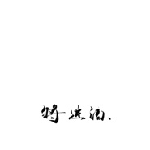

将进酒
============================

|  |  |
| :--: | :-- |
| [ 将进酒](https://emumo.xiami.com/album/2100363963) | **艺人**: [厨子和戏子](../index.md) **语种**: 国语 **唱片公司**: 独立发行 **发行时间**: 2016年06月29日 **专辑类别**: EP, 单曲 **专辑风格**: 独立摇滚 Indie Rock, 中国风 China-Wave **播放数**: 2289798 **收藏数**: 204 **评论数**: 35  |

## 简介

南京本土独立乐队--厨子和戏子乐队
 

首发单曲《将进酒》

## 曲目

## 评论

|  |  |  |  |
| :-- | :-- | :-- | :-- |
|  [虾米用户](https://emumo.xiami.com/u/444600080)  2020-10-25 21:58 赞(0) 踩(0) | 
非常好听。
 |
|  [虾米用户](https://emumo.xiami.com/u/340664844)  2020-04-07 16:35 赞(1) 踩(0) | 
听到这首歌后单曲循环了一夜。
 |
|  [虾米用户](https://emumo.xiami.com/u/429298162)  2019-09-24 22:45 赞(2) 踩(0) | 
一股清流
 |
|  [虾米用户](https://emumo.xiami.com/u/324297517)  2019-08-30 04:45 赞(2) 踩(0) | 
及其难得的原创音乐，这是我愿意花钱买的音乐。
 |
|  [虾米用户](https://emumo.xiami.com/u/344018512) 我还没想好要写什么... 2019-07-03 19:46 赞(0) 踩(0) | 
D
 |
|  [虾米用户](https://emumo.xiami.com/u/343065041)  2019-04-02 12:04 赞(3) 踩(0) | 
     
 |
|  [虾米用户](https://emumo.xiami.com/u/20177386) 感谢一切美好的遇见❤️ 2018-01-24 10:51 赞(2) 踩(0) | 

 |
|  [虾米用户](https://emumo.xiami.com/u/746612)  2017-12-24 22:16 赞(2) 踩(0) | 
跟燕池那首两种不同风格，个人更喜欢这个版本，更加豪迈些
 |
|  [虾米用户](https://emumo.xiami.com/u/193786720) 我还没想好要写什么... 2017-10-07 22:01 赞(1) 踩(0) | 
太赞了
 |
|  [虾米用户](https://emumo.xiami.com/u/273606795) 我想再次用虾米音乐与你分... 2017-07-06 17:28 赞(0) 踩(0) | 
待评，细品再评
 |
|  [虾米用户](https://emumo.xiami.com/u/211234214) RED VELVET(｡... 2017-05-17 00:10 赞(1) 踩(0) | 
好好听哎
 |
|  [虾米用户](https://emumo.xiami.com/u/20413258)   2017-05-05 16:34 赞(1) 踩(0) | 

 |
|  [虾米用户](https://emumo.xiami.com/u/228520614) . 2017-04-05 16:32 赞(0) 踩(0) | 
古典，戏曲，摇滚，真tm 的好听！
 |
|  [虾米用户](https://emumo.xiami.com/u/257573986) 这家伙很聪明什么也没留下... 2017-03-08 21:33 赞(4) 踩(0) | 
对我而言，第一次听到听着有想喝酒冲动的绝美之音，谢谢！太多言语仿佛一下崩住在了心底，感觉都在心里，不说了，我得去买酒，现在
 |
|  [虾米用户](https://emumo.xiami.com/u/5669721) 享受生活，生命不悔 2017-03-04 22:51 赞(1) 踩(0) | 
气势的调调，加油
 |
|  [虾米用户](https://emumo.xiami.com/u/54754355)  2017-02-13 23:18 赞(4) 踩(0) | 
为什么只有一首歌呀，是我打开的方式不对吗？好听死了。声音，配乐好听到爆
 |
|  [虾米用户](https://emumo.xiami.com/u/39052588)  2017-02-12 13:21 赞(0) 踩(0) | 
另一首还没上架哦
 |
|  [虾米用户](https://emumo.xiami.com/u/52303092)   2016-11-19 09:01 赞(1) 踩(0) | 
感谢厨戏，用心做音乐  
 |
|  [虾米用户](https://emumo.xiami.com/u/210305106) 用力过猛的人要缝补自己了 2016-11-05 20:31 赞(1) 踩(0) | 
制作真心不错！
 |
|  [虾米用户](https://emumo.xiami.com/u/115565918)  2016-09-23 09:36 赞(0) 踩(0) | 
今天要吃童子鸡！
 |
|  [虾米用户](https://emumo.xiami.com/u/49886818)  2016-08-30 10:47 赞(1) 踩(0) | 
特别喜欢这种又有古典又有戏曲风的原创
 |
|  [虾米用户](https://emumo.xiami.com/u/201382485)  2016-07-15 23:14 赞(0) 踩(0) | 
这首歌，忒有感觉了哈！谢谢厨子戏子 有机会来深圳，请你们吃烤全羊 
 |
|  [虾米用户](https://emumo.xiami.com/u/198623007)  2016-07-08 11:21 赞(0) 踩(0) | 
大爱厨戏！
 |
|  [虾米用户](https://emumo.xiami.com/u/193036641)   2016-07-07 15:36 赞(19) 踩(0) | 
感谢混音师制作人吉松浩，感谢玩偶之主录音棚，感谢厨戏团队所有成员，感谢曾经厨戏团队的所有成员，感谢所有帮助过我们的人。
 |
|  [虾米用户](https://emumo.xiami.com/u/193036641)   2016-07-07 15:36 赞(40) 踩(0) | 
为了更真实，这首《将进酒》几乎所有乐器都采取实录。录音人员：人声：童子文，秦秀乾；吉他：葛浩，秦秀乾；贝斯：李阳；架子鼓：贺超；中国大鼓：王欢；笛子：张志鹏；古筝：陈敏；键盘：陈亮均。
 |
| ⇒ |  [虾米用户](https://emumo.xiami.com/u/251522218) On CD or Vin... 2017-02-13 21:19 赞(0) 踩(0) | 
今天虾米推的第一首是你们的，后面29首被直接忽视，你们出碟我买！真他妈好听呀！我来自福州山间一家书屋，谢谢你们的音乐！
 |
| ⇒ |  [虾米用户](https://emumo.xiami.com/u/1511342)  2017-05-17 17:06 赞(0) 踩(0) | 
<q><b>豹说：</b></q>
 |
| ⇒ |  [虾米用户](https://emumo.xiami.com/u/251522218) On CD or Vin... 2018-09-01 02:19 赞(0) 踩(0) | 
<q><b>hz说：</b></q>
 |
| ⇒ |  [虾米用户](https://emumo.xiami.com/u/1511342)  2018-10-26 00:54 赞(0) 踩(0) | 
<q><b>豹说：</b></q>
 |
| ⇒ |  [虾米用户](https://emumo.xiami.com/u/47531995)  2019-01-05 09:04 赞(0) 踩(0) | 
曲风跟李白的词很配，但是后来写的词不行，有狗尾续貂之嫌。会引起人反感的。建议只保留李白的词，别的都去掉，这样这首歌就一定会火。
 |
| ⇒ |  [虾米用户](https://emumo.xiami.com/u/12077612)  2019-07-13 20:55 赞(0) 踩(0) | 
<q><b>千江明月说：</b></q>
 |
| ⇒ |  [虾米用户](https://emumo.xiami.com/u/444600080)  2020-08-24 09:54 赞(0) 踩(0) | 
<q><b>诡异空间老和tattoo说：</b></q>
 |
| ⇒ |  [虾米用户](https://emumo.xiami.com/u/251522218) On CD or Vin... 2020-09-30 15:15 赞(0) 踩(0) | 
<q><b>hz说：</b></q>
 |
