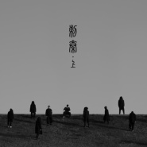

厨子和戏子
============================

|  |  |
| :--: | :-- |
| [ 厨子和戏子](https://i.xiami.com/chuzihexizi) | **播放数**: 3497535 **粉丝数**: 2579 **评论数**: 104 **地区**: China 中国大陆 **风格**: 独立民谣 Indie Folk, 独立摇滚 Indie Rock  |

## 档案

厨子和戏子 
一位为黄河浇灌 
一位沿江而来 
恰巧架起一座南与北 
过去世界与现实世界的桥梁 
他们用衣着、思考和音乐 
不断诠释“新式中国风”的文化理念 
19年5月，厨子和戏子“无归”24城巡回正式开启， 
嗅一口这春天潮湿的空气， 
我们与你赴一场不归的见面。

## 专辑

| 名称 | 语种 | 唱片公司 | 发行时间 | 专辑类别 | 专辑风格 |
| :--: | :-- | :-- | :-- | :-- | :-- |
| [ 无归](./albums/2104865350.md) | 国语 | StreetVoice, 以太文化 | 2019年05月17日 | EP, 单曲 | 摇滚 Rock & Roll |
| [ 家和万事兴](./albums/2104555760.md) | 国语 | StreetVoice, 以太文化 | 2019年01月30日 | EP, 单曲 | 摇滚 Rock & Roll |
| [ 廿叁](./albums/2103626274.md) | 国语 | StreetVoice, 以太 | 2018年03月23日 | EP, 单曲 | 独立民谣 Indie Folk, 独立摇滚 Indie Rock |
| [ 刺秦·上](./albums/2103607961.md) | 国语 | StreetVoice, 以太 | 2018年03月16日 | EP, 单曲 | 独立民谣 Indie Folk |
| [ 三碗不过岗Drink Then Pass](./albums/2102748074.md) | 国语 | StreetVoice, 以太 | 2017年05月15日 | 录音室专辑 | 独立民谣 Indie Folk |
| [ 将进酒](./albums/2100363963.md) | 国语 | 独立发行 | 2016年06月29日 | EP, 单曲 | 独立摇滚 Indie Rock, 中国风 China-Wave |

## 评论

|  |  |  |  |
| :-- | :-- | :-- | :-- |
|  [虾米用户](https://emumo.xiami.com/u/36437914) WX：IXUS-- 2021-01-01 23:05 赞(0) 踩(0) | 
这个照片怎么回事
 |
|  [虾米用户](https://emumo.xiami.com/u/349206704)  2020-07-05 18:16 赞(1) 踩(0) | 
很喜欢这种洪厚有力风格，极具中国风的鼓声听着热血沸腾&amp;hellip;&amp;hellip;
 |
|  [虾米用户](https://emumo.xiami.com/u/14094908)  2019-11-22 20:03 赞(0) 踩(0) | 
跟福禄乐队的风格很像，都是中国风的摇滚。
 |
|  [虾米用户](https://emumo.xiami.com/u/347527020)  2019-11-15 19:53 赞(0) 踩(0) | 

 |
|  [虾米用户](https://emumo.xiami.com/u/212356465) 庸人罢了 2019-10-20 13:22 赞(3) 踩(0) | 
听说厨戏要上乐队夏天第二季哦
 |
|  [虾米用户](https://emumo.xiami.com/u/45918442)  2019-09-17 10:59 赞(2) 踩(0) | 
将进酒很有意思啊！第一部分引用诗文原句酣畅淋漓，第二部分部分引用其他诗句典故大杂烩都是痛快的！
 |
|  [虾米用户](https://emumo.xiami.com/u/96862668) 这个人很聪明，只留下了一... 2019-09-16 13:10 赞(2) 踩(0) | 
很喜欢，这种古风外加激昂的感觉
 |
|  [虾米用户](https://emumo.xiami.com/u/44637150)  2019-09-12 17:38 赞(2) 踩(0) | 
终于，也到了下载需要vip的时候，这个心情有点复杂。不过还是很高兴的——收费了，意味着有钱了，会有更多好曲子，我又能听更多歌了。所以，加油！
 |
|  [虾米用户](https://emumo.xiami.com/u/44637150)  2019-09-12 17:29 赞(1) 踩(0) | 
加油加油加油加油！务必加油！真的很期待！民乐、摇滚、文言，却又有人气地气，真的好！好高兴，还以为你们没出新，后来才发现是当初没关注，赶紧补票，蹲了 
 |
|  [虾米用户](https://emumo.xiami.com/u/292730080) Free like dr... 2019-09-09 18:58 赞(0) 踩(0) | 
2019
 |
|  [虾米用户](https://emumo.xiami.com/u/43261751) 偷看没用，你已经忘不了我... 2019-08-11 09:30 赞(2) 踩(0) | 
能不能进下一季的《乐夏》呢，期待期待！希望爱奇艺能挖掘出你们
 |
|  [虾米用户](https://emumo.xiami.com/u/43261751) 偷看没用，你已经忘不了我... 2019-08-11 09:29 赞(0) 踩(0) | 
宝藏95后男孩，摇滚新生代，但是很有实力
 |
|  [虾米用户](https://emumo.xiami.com/u/337846064)  2019-08-10 11:45 赞(0) 踩(0) | 
无意中听到了云朵，喜欢的也不再是云朵了！！！！！
 |
|  [虾米用户](https://emumo.xiami.com/u/409180033)  2019-08-07 21:10 赞(0) 踩(0) | 

 |
|  [虾米用户](https://emumo.xiami.com/u/285598403)  2019-08-07 13:23 赞(2) 踩(0) | 
从将进酒找到你，喜欢的就不止将进酒了。
 |
|  [虾米用户](https://emumo.xiami.com/u/285598403)  2019-08-07 13:23 赞(1) 踩(0) | 
从将进酒找到你，喜欢的就不止将进酒了。
 |
|  [虾米用户](https://emumo.xiami.com/u/344018512) 我还没想好要写什么... 2019-07-03 19:42 赞(0) 踩(0) | 
D
 |
|  [虾米用户](https://emumo.xiami.com/u/200333125) 聚散不由你我…… 2019-06-24 05:30 赞(0) 踩(0) | 
这才是音乐啊！太奇妙了！！！
 |
|  [虾米用户](https://emumo.xiami.com/u/49299590) 波澜不惊 2019-05-27 22:31 赞(1) 踩(0) | 
中国元素有搞头，加油
 |
|  [虾米用户](https://emumo.xiami.com/u/13290606) on a merry g... 2019-05-11 14:32 赞(0) 踩(0) | 
鼓点和节奏不错。声音不适合唱苍凉的古长歌类，快去唱流行摇滚
 |
|  [虾米用户](https://emumo.xiami.com/u/11446884) New York MoM... 2019-05-08 05:18 赞(1) 踩(0) | 
将进酒太赞！
 |
|  [虾米用户](https://emumo.xiami.com/u/246098860) 为了忘却的纪念 2019-04-18 10:05 赞(2) 踩(0) | 
魔性循环停不下来
 |
|  [虾米用户](https://emumo.xiami.com/u/52056952) 人生即是到來、相遇、陪伴... 2019-02-07 09:20 赞(0) 踩(0) | 
φ(≧ω≦*)♪
 |
| ⇒ |  [虾米用户](https://emumo.xiami.com/u/250065023) 我很懒，什么都没留下… 2019-08-01 03:24 赞(0) 踩(0) | 
竟然又看见你了 
 |
|  [虾米用户](https://emumo.xiami.com/u/140113232) 自娱自乐自得其乐 2019-01-08 23:30 赞(0) 踩(0) | 
真的好优秀啊！！！
 |
|  [虾米用户](https://emumo.xiami.com/u/319504210) 从你开始。 2018-11-28 19:25 赞(0) 踩(0) | 
这是我学长的乐队啊  -鹤高小学妹
 |
|  [虾米用户](https://emumo.xiami.com/u/47015117)   2018-11-06 20:24 赞(0) 踩(0) | 
乐队成员需要更新哦
 |
|  [虾米用户](https://emumo.xiami.com/u/298964872)  2018-11-01 23:18 赞(1) 踩(0) | 
鹤高60周年庆过来的举个手 
 |
|  [虾米用户](https://emumo.xiami.com/u/43816145) 品味是一个无底洞 2018-10-20 01:36 赞(0) 踩(0) | 
emmmm痞子呢？
 |
|  [虾米用户](https://emumo.xiami.com/u/99435334) 西湖听秋雨，试剑断桥边。 2018-10-19 15:59 赞(0) 踩(0) | 
校友~~~~
 |
|  [虾米用户](https://emumo.xiami.com/u/93092514) 不求闻达于诸侯 2018-10-11 09:13 赞(0) 踩(0) | 
突然发现是校友啊
 |
|  [虾米用户](https://emumo.xiami.com/u/351947579)  2018-09-27 15:16 赞(0) 踩(0) | 
现场更好听，在空旷的场地上更有味道！
 |
|  [虾米用户](https://emumo.xiami.com/u/85627606) 我还没想好要写什么... 2018-09-27 09:48 赞(0) 踩(0) | 
厨戏冲冲冲！
 |
|  [虾米用户](https://emumo.xiami.com/u/221714142)   2018-09-05 18:15 赞(0) 踩(0) | 
真的超级棒，希望你们下次来深圳巡演是在周末....超想听现场
 |
|  [虾米用户](https://emumo.xiami.com/u/276260049) 八零后 2018-07-22 21:35 赞(0) 踩(0) | 
想整个超大的喇叭，让全世界听到！
 |
|  [虾米用户](https://emumo.xiami.com/u/276260049) 八零后 2018-07-22 21:33 赞(0) 踩(0) | 
赞一个，加油！比当下大牌歌星都棒，词曲意俱佳，甚合朕之脾胃！ 
 |
|  [虾米用户](https://emumo.xiami.com/u/207316667) 一辈子你会遇到很多人，但... 2018-07-18 10:38 赞(2) 踩(0) | 
多好的乐队，年轻却显老成，文化深度与生活反思都兼顾得很好，每首歌从编曲到制作都诚意十足，你在今天的中国还真很难找到其他了，上一个给我这样感觉的是万青，可惜出道即巅峰，过后就归于平静了，希望厨子戏子继续下去！    
 |
|  [虾米用户](https://emumo.xiami.com/u/17208945) 重金属、西方古典、中国风... 2018-05-18 12:06 赞(1) 踩(0) | 
很有特色的组合，期待更多作品
 |
|  [虾米用户](https://emumo.xiami.com/u/207144906) 守简致茂 2018-04-26 21:14 赞(0) 踩(0) | 
听得很爽
 |
|  [虾米用户](https://emumo.xiami.com/u/346078314)  2018-04-25 08:50 赞(0) 踩(0) | 
准备给学生听。
 |
|  [虾米用户](https://emumo.xiami.com/u/12878321) 辗转井的谣言中徘徊风的宫... 2018-03-15 21:48 赞(0) 踩(0) | 
大气！
 |
|  [虾米用户](https://emumo.xiami.com/u/22562362) 暂无签名~ 2018-03-13 12:25 赞(1) 踩(0) | 
能来武汉演出吗？
 |
|  [虾米用户](https://emumo.xiami.com/u/43810881)  2018-02-27 15:29 赞(0) 踩(0) | 
好听，加油！
 |
|  [虾米用户](https://emumo.xiami.com/u/14652349) 壹贰叁 肆伍陆 柒捌玖 2018-02-21 15:00 赞(3) 踩(0) | 
《将进酒》年代：【唐】作者：【李白】体裁：【乐府】君不见黄河之水天上来，奔流到海不复回。君不见高堂明镜悲白发，朝如青丝暮成雪。『人生得意须尽欢，莫使金樽空对月&amp;nbsp;&amp;nbsp;&amp;nbsp; 天生我材必有用，千金散尽还复来』烹羊宰牛且为乐，会须一饮三百杯。岑夫子，丹丘生，将进酒，君莫停。与君歌一曲，请君为我侧耳听。钟鼓馔玉不足贵，但愿长醉不愿醒。古来圣贤皆寂寞，惟有饮者留其名。陈王昔时宴平乐，斗酒十千恣欢谑。主人何为言少钱，径须沽取对君酌。五花马，千金裘，呼儿将出换美酒，与尔同销万古愁!《将进酒》＆歌词作词＆作曲: 李白 杨慎 秦秀乾~~君不见 黄河水天上来奔流到海不复
 |
|  [虾米用户](https://emumo.xiami.com/u/9078112) 一念一世界 2018-01-10 22:46 赞(0) 踩(0) | 
作品真用心啊！必须支持
 |
|  [虾米用户](https://emumo.xiami.com/u/746612)  2018-01-07 16:56 赞(1) 踩(0) | 
中华文化融入独立摇滚，很有大汉风范！一直找寻找这种风格的独立乐队！
 |
|  [虾米用户](https://emumo.xiami.com/u/235456661) 我还没想好要写什么... 2018-01-01 20:09 赞(0) 踩(0) | 
喜欢童子文阿
 |
|  [虾米用户](https://emumo.xiami.com/u/333980738)  2017-11-25 19:45 赞(0) 踩(0) | 
好喜欢《将进酒》期待你们更多作品！加油！加油！加油！！！
 |
|  [虾米用户](https://emumo.xiami.com/u/238730176)  2017-11-12 19:22 赞(0) 踩(0) | 
《将进酒》真心好听！
 |
|  [虾米用户](https://emumo.xiami.com/u/205951213) 我还没想好要写什么... 2017-09-28 22:41 赞(1) 踩(0) | 
aha 音乐节见
 |
|  [虾米用户](https://emumo.xiami.com/u/42809770) 喜欢听你说 2017-09-08 15:36 赞(1) 踩(0) | 
加油，编曲挺不错的。期待更多的作品
 |
|  [虾米用户](https://emumo.xiami.com/u/283391626) 我还没想好要写什么... 2017-08-31 18:40 赞(0) 踩(0) | 
这里的歌比网易云多，我已经满足了
 |
|  [虾米用户](https://emumo.xiami.com/u/50668976)  2017-07-26 15:22 赞(2) 踩(0) | 
能不能再好听一点！
 |
| ⇒ |  [虾米用户](https://emumo.xiami.com/u/283391626) 我还没想好要写什么... 2017-08-31 18:39 赞(0) 踩(0) | 
哈哈哈哈哈哈
 |
|  [虾米用户](https://emumo.xiami.com/u/22800485)  2017-07-14 17:19 赞(0) 踩(0) | 
为什么虾米没有  及冠臆语 
 |
|  [虾米用户](https://emumo.xiami.com/u/50154318) Always. 2017-07-04 15:07 赞(0) 踩(0) | 
很赞！期待新歌！
 |
|  [虾米用户](https://emumo.xiami.com/u/4903128) 不好玩 2017-06-30 23:19 赞(1) 踩(0) | 
好听到不舍得和别人分享
 |
|  [虾米用户](https://emumo.xiami.com/u/11782490)  2017-06-26 13:33 赞(0) 踩(0) | 
十分好听有种骑马奔放得感觉
 |
|  [虾米用户](https://emumo.xiami.com/u/4219524)  2017-06-23 09:45 赞(0) 踩(0) | 
好听
 |
|  [虾米用户](https://emumo.xiami.com/u/35826125) 暂无签名~ 2017-06-16 22:04 赞(0) 踩(0) | 
曲子好少啊 还有新的吗 听着相当棒
 |
|  [虾米用户](https://emumo.xiami.com/u/254285047) 听这音乐看这书 2017-06-08 15:38 赞(0) 踩(0) | 
好听
 |
|  [虾米用户](https://emumo.xiami.com/u/290025297)  2017-05-27 10:55 赞(0) 踩(0) | 
词很工整
 |
|  [虾米用户](https://emumo.xiami.com/u/275825264)  2017-05-24 22:14 赞(2) 踩(0) | 
而立之年  忙碌的工作  生活的压力  以为不会像年轻时喜欢什么音乐和歌手  突然听到  无言的感动  加油 ！ 加油！！！
 |
|  [虾米用户](https://emumo.xiami.com/u/2439570) 女王大人～ 2017-05-19 00:56 赞(2) 踩(0) | 
突然蓬勃的民族自豪感
 |
|  [虾米用户](https://emumo.xiami.com/u/2439570) 女王大人～ 2017-05-19 00:56 赞(2) 踩(0) | 
突然蓬勃的民族自豪感
 |
|  [虾米用户](https://emumo.xiami.com/u/7028528)  2017-05-17 23:03 赞(0) 踩(0) | 
从第一个音符开始喜欢
 |
|  [虾米用户](https://emumo.xiami.com/u/6745658)  2017-05-16 20:28 赞(0) 踩(0) | 
还不错
 |
|  [虾米用户](https://emumo.xiami.com/u/12714877)   2017-05-16 19:43 赞(0) 踩(0) | 
蛮有意思
 |
|  [虾米用户](https://emumo.xiami.com/u/274503600) 永不能见平素音容成隔世 2017-05-16 19:35 赞(1) 踩(0) | 
很有特色(*/&amp;omega;＼*)鼓声敲好听！！！！
 |
|  [虾米用户](https://emumo.xiami.com/u/36675234) 吃铁丝拉笊篱真能编。 2017-05-16 09:49 赞(0) 踩(0) | 
坚持下去&amp;hellip;
 |
|  [虾米用户](https://emumo.xiami.com/u/187017638)  2017-05-15 22:57 赞(0) 踩(0) | 
不错不错不错  好听好听好听   真不错
 |
|  [虾米用户](https://emumo.xiami.com/u/289408708) 我的天呀！ 2017-05-15 10:50 赞(0) 踩(0) | 
这首歌还不错
 |
|  [虾米用户](https://emumo.xiami.com/u/163507740) 虾米我赖着不想走 2017-04-14 17:30 赞(4) 踩(0) | 
只有这一首吗，还想听更多。
 |
|  [虾米用户](https://emumo.xiami.com/u/71842508)  - 2017-03-19 10:35 赞(0) 踩(0) | 
听的时候就来打卡
 |
|  [虾米用户](https://emumo.xiami.com/u/71842508)  - 2017-03-19 10:35 赞(0) 踩(0) | 
爱你哦 好好听
 |
|  [虾米用户](https://emumo.xiami.com/u/6213668)  2017-02-13 20:45 赞(0) 踩(0) | 
不错，不错，好听！
 |
|  [虾米用户](https://emumo.xiami.com/u/261604434)   2017-02-13 18:15 赞(0) 踩(0) | 
严肃的说，实际这个歌和乐队流派中定义的有点儿出入吧？流派这个东西该严肃点吧？  感觉挺好的。加油！
 |
|  [虾米用户](https://emumo.xiami.com/u/121465530) LISTENING TH... 2017-01-20 10:29 赞(0) 踩(0) | 
的确不错的
 |
|  [虾米用户](https://emumo.xiami.com/u/2375136) 暂无签名~ 2017-01-01 15:57 赞(0) 踩(0) | 
再来点歌嘛~~
 |
|  [虾米用户](https://emumo.xiami.com/u/35893018) 就是爱音乐 爱生活~ 2016-10-05 00:04 赞(0) 踩(0) | 
非常好！
 |
|  [虾米用户](https://emumo.xiami.com/u/12715941)  2016-08-09 21:30 赞(1) 踩(0) | 
霸气，霸气，霸气，估计李白能爬起来击节而合！！！！
 |
|  [虾米用户](https://emumo.xiami.com/u/3933185)  2016-07-15 15:27 赞(0) 踩(0) | 
将进酒好听，你也是交大的么？
 |
| ⇒ |  [虾米用户](https://emumo.xiami.com/u/5557961)   2016-11-17 21:46 赞(0) 踩(0) | 
他们是南农的啊
 |
|  [虾米用户](https://emumo.xiami.com/u/5557961)   2016-07-09 13:20 赞(0) 踩(0) | 
2014 交大菁菁堂。 网易云音乐全国校园歌手大赛 上海区域赛三强 初识。
 |
|  [虾米用户](https://emumo.xiami.com/u/3296562) 古典恶补中 2016-07-08 14:03 赞(0) 踩(0) | 
画面感好强，听出了大唐的感觉
 |
|  [虾米用户](https://emumo.xiami.com/u/30592141)   2016-07-07 19:12 赞(0) 踩(0) | 
好哒好哒
 |
|  [虾米用户](https://emumo.xiami.com/u/193036641)   2016-07-07 15:12 赞(88) 踩(0) | 
我刚入驻了虾米音乐人，欢迎大家来我的个人主页，收听我的最新音乐
 |
| ⇒ |  [虾米用户](https://emumo.xiami.com/u/30592141)   2016-07-07 19:18 赞(0) 踩(0) | 
好巧  一搜索就恰好看到了    现在只上传一首么
 |
| ⇒ |  [虾米用户](https://emumo.xiami.com/u/49222025) 宁得一人心，白首不相离。 2016-07-07 23:39 赞(0) 踩(0) | 
有才华的人永远不会被埋没 你们会越来越棒 加油！
 |
| ⇒ |  [虾米用户](https://emumo.xiami.com/u/9833147) . 2017-01-07 23:28 赞(0) 踩(0) | 
作为同行，支持个 
 |
| ⇒ |  [虾米用户](https://emumo.xiami.com/u/117471374)   2017-01-21 07:52 赞(0) 踩(0) | 
加油
 |
| ⇒ |  [虾米用户](https://emumo.xiami.com/u/43525879)  2017-04-12 22:59 赞(0) 踩(0) | 
好听
 |
| ⇒ |  [虾米用户](https://emumo.xiami.com/u/43525879)  2017-04-12 23:00 赞(0) 踩(0) | 
多来点作品。听的不过瘾
 |
| ⇒ |  [虾米用户](https://emumo.xiami.com/u/290025297)  2017-05-27 10:56 赞(0) 踩(0) | 
支持
 |
| ⇒ |  [虾米用户](https://emumo.xiami.com/u/9347298)  2017-06-02 10:47 赞(0) 踩(0) | 
新的专辑相当赞！
 |
| ⇒ |  [虾米用户](https://emumo.xiami.com/u/48162016)  2017-09-07 21:42 赞(0) 踩(0) | 
很给力！加油！
 |
| ⇒ |  [虾米用户](https://emumo.xiami.com/u/40433871)   2017-09-16 00:44 赞(0) 踩(0) | 
2017独立音乐中为数不多的好专辑
 |
| ⇒ |  [虾米用户](https://emumo.xiami.com/u/301237025)  2017-10-24 08:59 赞(0) 踩(0) | 
加油 浚县老乡
 |
| ⇒ |  [虾米用户](https://emumo.xiami.com/u/334953528)  2017-11-19 15:55 赞(0) 踩(0) | 
你倒是赶紧发点新歌啊
 |
| ⇒ |  [虾米用户](https://emumo.xiami.com/u/1193154) 我还没想好要写什么... 2018-01-20 16:34 赞(0) 踩(0) | 
加油哦！你们的歌很喜欢
 |
| ⇒ |  [虾米用户](https://emumo.xiami.com/u/3924655)  2018-04-17 20:30 赞(0) 踩(0) | 
可以参加央视经典咏流传这个节目，让更多的人听到，相信大家都会喜欢这一版的将进酒!
 |
| ⇒ |  [虾米用户](https://emumo.xiami.com/u/332609862) 她大摇大摆晃着尾巴，喷着... 2018-06-02 14:25 赞(0) 踩(0) | 
你们真厉害，偶尔听了一首，喜欢上了你们的全部
 |
| ⇒ |  [虾米用户](https://emumo.xiami.com/u/54766707)  2018-11-12 22:27 赞(0) 踩(0) | 
<q><b>qianlimu说：</b></q>
 |
| ⇒ |  [虾米用户](https://emumo.xiami.com/u/273729608) 取暖. 2019-08-27 17:21 赞(0) 踩(0) | 
将进酒，真的喜欢，很高级的音乐，独一无二。华语音乐有你们很骄傲，比其他一些仿抄的无聊作品高级很多。
 |
