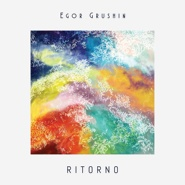

Ritorno
============================

|  |  |
| :--: | :-- |
| [ Ritorno](https://emumo.xiami.com/album/2104389650) | **艺人**: [Egor Grushin](../index.md) **语种**: 纯音乐 **唱片公司**: VIRTUOSO RECORDS **发行时间**: 2018年10月16日 **专辑类别**: 录音室专辑 **专辑风格**: 室内乐 / 重奏 Chamber Music, 现代古典 Modern Classical, 轻音乐 Easy Listening **播放数**: 425560 **收藏数**: 211 **评论数**: 26  |

## 简介

Album recording :  
Egor Grushin (piano, keyboards)  
Roksolana Grushina (cello),  
Alexey Sakevich (synthesizers),  
Diana Koval and Alexander Moroz (violin)  
Andrew Lominsky (alto),  
Yevgeny Karvatsky (guitar)  
  
Composer: Egor Grushin  
Arrangement of strings: Egor Grushin, Roksolana Grushin, Diana Koval.  
Recording - Virtuoso Records   
Mastering - Inside Records  
Illustration: Darya Tekuch  
Designed by Igor Fomin  
  
As CHRONOS keeps turning the Zodiac Wheel  
We RUN to live &amp; alter  
Leave our CHIMERAS behind  
Feel the HARMONY of the universe  
RISE up from the shadows of the past to the future light  
RITORNO - Initsio del Nuovo viaggio  
  
EP release date:  
16th October 2018  
  
Track List：  
1. Chronos   
2. Run (feat. Endless Melancholy)   
3. Chimeras (feat. Endless Melancholy)   
4. Harmony   
5. Rise   
6. Ritorno   

## 曲目

## 评论

|  |  |  |
| :-- | :-- | :-- |
|  [虾米用户](https://emumo.xiami.com/u/416346) 边走边听，人山人海。 2020-10-06 13:17 赞(0) 踩(0) | 

 |
|  [虾米用户](https://emumo.xiami.com/u/6375818) 走走走。 2020-08-30 00:49 赞(0) 踩(0) | 
入睡
 |
|  [虾米用户](https://emumo.xiami.com/u/400715332) 留白 2020-03-05 10:09 赞(5) 踩(0) | 
——
 |
|  [虾米用户](https://emumo.xiami.com/u/9523997) 容止 2020-01-08 11:13 赞(0) 踩(0) | 

 |
|  [虾米用户](https://emumo.xiami.com/u/115057136) 我还没想好要写什么... 2019-11-19 22:31 赞(0) 踩(0) | 
这音乐真心赞
 |
|  [虾米用户](https://emumo.xiami.com/u/2426133)  2019-08-23 14:29 赞(0) 踩(0) | 
❤️
 |
|  [虾米用户](https://emumo.xiami.com/u/322235515) 在音乐里澎湃，在玩笑里开... 2019-08-22 22:03 赞(0) 踩(0) | 
我觉得这张专辑是一个关于战争的故事。所有的伤痛，都被作曲家以不动声色的旋律写了出来。我刚开始听的时候，还以为是商业广告风格，但是听了好多遍之后，觉得真的穿透我的心。战争的痛楚是人类留下的残忍伤疤，唯一能救赎的只有不忘历史，珍爱和平。
 |
|  [虾米用户](https://emumo.xiami.com/u/42560187) 归于传统 2019-07-18 17:10 赞(0) 踩(0) | 
新专打个卡
 |
|  [虾米用户](https://emumo.xiami.com/u/3442087) Dust To Dust 2019-05-09 20:38 赞(0) 踩(0) | 
m
 |
|  [虾米用户](https://emumo.xiami.com/u/346165752)  2019-04-13 20:24 赞(0) 踩(0) | 

 |
|  [虾米用户](https://emumo.xiami.com/u/277512940) 躬身入局 2019-03-31 14:56 赞(0) 踩(0) | 
用心制作的好专辑
 |
|  [虾米用户](https://emumo.xiami.com/u/408041543)  2019-01-10 13:49 赞(0) 踩(0) | 
特别棒，很喜欢
 |
|  [虾米用户](https://emumo.xiami.com/u/256532306) 我还没想好要写什么... 2019-01-07 11:46 赞(0) 踩(0) | 
⛄️
 |
|  [虾米用户](https://emumo.xiami.com/u/21164070) 一沙一世界 一花一天堂 ... 2018-12-20 19:20 赞(0) 踩(0) | 
.
 |
|  [虾米用户](https://emumo.xiami.com/u/7273291)  2018-12-20 12:18 赞(0) 踩(0) | 
美
 |
|  [虾米用户](https://emumo.xiami.com/u/1425152)  2018-12-19 06:03 赞(0) 踩(0) | 

 |
|  [虾米用户](https://emumo.xiami.com/u/61077064)  2018-12-18 20:23 赞(0) 踩(0) | 
66666666666
 |
|  [虾米用户](https://emumo.xiami.com/u/254915652)  2018-12-18 20:11 赞(0) 踩(0) | 
WM
 |
|  [虾米用户](https://emumo.xiami.com/u/220644515) 这家伙很那个 2018-12-18 13:40 赞(0) 踩(0) | 
√
 |
|  [虾米用户](https://emumo.xiami.com/u/6569477) 风随风飞 云随云走 雨落... 2018-12-18 12:28 赞(0) 踩(0) | 
封面也好棒
 |
|  [虾米用户](https://emumo.xiami.com/u/6459825)  2018-12-18 11:12 赞(3) 踩(0) | 

 |
| ⇒ |  [虾米用户](https://emumo.xiami.com/u/410402206)  2018-12-18 12:21 赞(0) 踩(0) | 
Thank you!
 |
| ⇒ |  [虾米用户](https://emumo.xiami.com/u/6459825)  2018-12-18 12:39 赞(0) 踩(0) | 
<q><b>Egor Grushin说：</b></q>
 |
|  [虾米用户](https://emumo.xiami.com/u/6459825)  2018-12-18 11:12 赞(1) 踩(0) | 
☄️
 |
|  [虾米用户](https://emumo.xiami.com/u/6459825)  2018-12-18 11:12 赞(1) 踩(0) | 
☄️
 |
|  [虾米用户](https://emumo.xiami.com/u/6459825)  2018-12-18 11:11 赞(1) 踩(0) | 
☄️
 |
