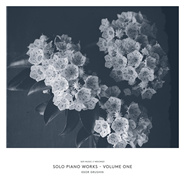
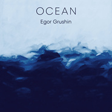

Egor Grushin
============================

|  |  |
| :--: | :-- |
| [ Egor Grushin](https://i.xiami.com/egorgrushin) | **播放数**: 2341606 **粉丝数**: 1917 **评论数**: 82 **地区**: Ukraine 乌克兰 **风格**: 室内乐 / 重奏 Chamber Music, 器乐独奏 Solo Instrumental, 现代古典 Modern Classical, 电影原声 Film Score, 轻音乐 Easy Listening  |

## 档案

叶戈尔（Egor Grushin） 【个人介绍】 乌克兰新古典主义代表音乐家，与众多现代古典音乐不同，叶戈尔的作品风格更容易感知，听众更广泛。 他的音乐会巡演总是提前售罄。 其作品亦或多愁善感、充满戏剧性的，极富情绪化，旋律性则是叶戈尔创造力的决定性特征。 【相关成就】：  乌克兰iTunes器乐专辑位列榜首。 首张EP钢琴曲《Ocean》被选入德国钢琴家Niels Fram在Soundcloud上创建的热门钢琴曲歌单《Piano Day》。 至今已为7部乌克兰电影/短片作曲配乐。 2013年10月，叶戈尔首创音乐节“利沃夫原声音乐节”，约有20个音乐团体参加。音乐节最大的亮点是年轻表演者可以有机会同他们仰慕的音乐家一起演出。 《Mediastar》授予叶戈尔 “文化发展”奖, 并被评为基辅最具影响力人物100强之一。 【叶戈尔配乐的电影】 2012 《A TOY’S STORY》 2012 《CHOICEMAN》 2013 《FINITA LA TRAGEDIA》 2013 《ANGELS DIE IN THE MORNING》 2015 《A SAVED ROMANCE》 2016 《ZHYVA》 2016 《LIVE》

## 专辑

| 名称 | 语种 | 唱片公司 | 发行时间 | 专辑类别 | 专辑风格 |
| :--: | :-- | :-- | :-- | :-- | :-- |
| [ Together](./albums/5021981351.md) | 其他 | Primavera Records Ua | 2020年03月03日 | 录音室专辑 | 古典音乐 Classical |
| [ Ritorno](./albums/2104389650.md) | 纯音乐 | VIRTUOSO RECORDS | 2018年10月16日 | 录音室专辑 | 室内乐 / 重奏 Chamber Music, 现代古典 Modern Classical, 轻音乐 Easy Listening |
| [ Carpathians](./albums/2103234867.md) | 英语 | Yehor Hrushyn | 2017年03月01日 | EP, 单曲 | 古典跨界 Classical Crossover |
| [ Solo Piano Works - Volume One](./albums/2100364344.md) | 英语 | 1631 Recordings | 2016年07月08日 | 录音室专辑 |  |
| [ Once](./albums/2100364502.md) | 英语 | 1631 Recordings | 2016年06月01日 | 录音室专辑 |  |
| [ Ocean (Piano Solo)](./albums/2100364496.md) | 英语 | 1631 Recordings | 2016年03月28日 | 录音室专辑 |  |
| [ Dominicano](./albums/2100364495.md) | 英语 | 1631 Recordings | 2014年04月12日 | 录音室专辑 |  |
| [ Absolution](./albums/2100364354.md) | 英语 | 1631 Recordings | 2013年02月01日 | 录音室专辑 |  |

## 评论

|  |  |  |  |
| :-- | :-- | :-- | :-- |
|  [虾米用户](https://emumo.xiami.com/u/6024992) 夏天 2020-12-30 22:01 赞(0) 踩(0) | 
༄
 |
|  [虾米用户](https://emumo.xiami.com/u/3250268) 一首好歌都比爱一个人长久... 2020-10-24 12:15 赞(0) 踩(0) | 
好喜欢
 |
|  [虾米用户](https://emumo.xiami.com/u/218378303) 静 2020-07-17 15:42 赞(0) 踩(0) | 
沙发
 |
|  [虾米用户](https://emumo.xiami.com/u/201391232) 最快的方法是先抱抱 2020-06-26 12:45 赞(0) 踩(0) | 
彡
 |
|  [虾米用户](https://emumo.xiami.com/u/290033622) 自由自私 自私高尚 2020-06-16 20:14 赞(0) 踩(0) | 
#
 |
|  [虾米用户](https://emumo.xiami.com/u/427384237) 我还没想好要写什么... 2020-05-15 00:16 赞(0) 踩(0) | 
➕
 |
|  [虾米用户](https://emumo.xiami.com/u/43443614) 微信M7-Bonnie，... 2020-03-26 08:13 赞(0) 踩(0) | 
感情充沛
 |
|  [虾米用户](https://emumo.xiami.com/u/330900828) 高舉一面五星紅旗在蝦米！ 2020-03-22 08:34 赞(0) 踩(0) | 
好美旋律
 |
|  [虾米用户](https://emumo.xiami.com/u/400715332) 留白 2020-03-05 10:09 赞(0) 踩(0) | 
——
 |
|  [虾米用户](https://emumo.xiami.com/u/375931285)  2020-03-04 10:57 赞(0) 踩(0) | 

 |
|  [虾米用户](https://emumo.xiami.com/u/73740960)  2020-02-26 18:14 赞(0) 踩(0) | 

 |
|  [虾米用户](https://emumo.xiami.com/u/38457192) Xiami.Stay.w... 2020-02-14 22:15 赞(1) 踩(0) | 
啥时候还来啊，沈阳人表示鞍山这个距离非常可以 
 |
|  [虾米用户](https://emumo.xiami.com/u/2156426) 天天听歌，佛系交友 2020-02-03 21:46 赞(0) 踩(0) | 
买了票没去，现在听到推荐，后悔了。
 |
|  [虾米用户](https://emumo.xiami.com/u/326165803) 我还没想好要写什么... 2020-01-04 21:18 赞(0) 踩(0) | 

 |
|  [虾米用户](https://emumo.xiami.com/u/340707108) 我还没想好要写什么... 2019-11-25 19:04 赞(7) 踩(0) | 
昨晚刚看过现场表演，棒极了
 |
|  [虾米用户](https://emumo.xiami.com/u/33641779) 我还没想好要写什么... 2019-11-24 22:01 赞(1) 踩(0) | 
没有CD卖
 |
|  [虾米用户](https://emumo.xiami.com/u/8280845) 狸狸狸 2019-11-21 00:31 赞(2) 踩(0) | 
他的风格偏通俗…过几天现场听听～
 |
|  [虾米用户](https://emumo.xiami.com/u/8785260)  2019-11-20 22:35 赞(0) 踩(0) | 
刚在鞍山看完，太精彩了！！！！！！！但是这上座率一言难尽。。。
 |
|  [虾米用户](https://emumo.xiami.com/u/8166217) 感谢虾米音乐❤️ 2019-09-23 21:37 赞(0) 踩(0) | 
鞍山的话可以去了嘻嘻嘻嘻
 |
|  [虾米用户](https://emumo.xiami.com/u/305651) 攒钱买碟的路遥遥无期 2019-09-23 16:52 赞(0) 踩(0) | 
哈哈哈神奇的巡演路线。。。不过有的看了嘻嘻
 |
|  [虾米用户](https://emumo.xiami.com/u/42963872) 我还没想好要写什么... 2019-09-06 15:39 赞(3) 踩(0) | 
神奇的巡演路线... 
 |
|  [虾米用户](https://emumo.xiami.com/u/7273291)  2019-09-06 12:27 赞(0) 踩(0) | 
 为啥只有这几个城市有
 |
|  [虾米用户](https://emumo.xiami.com/u/6889509) 黑与白很美黑或白亦愿和你... 2019-09-06 12:26 赞(1) 踩(0) | 
武汉、北京呢？
 |
|  [虾米用户](https://emumo.xiami.com/u/340903899) 我还没想好要写什么... 2019-09-05 10:05 赞(0) 踩(0) | 
，
 |
|  [虾米用户](https://emumo.xiami.com/u/40080369) . 2019-08-25 21:22 赞(2) 踩(0) | 
哇！11月要来上海了！
 |
|  [虾米用户](https://emumo.xiami.com/u/42963872) 我还没想好要写什么... 2019-07-11 07:50 赞(0) 踩(0) | 
.
 |
|  [虾米用户](https://emumo.xiami.com/u/50502911) 随时间的流逝泯灭之中 2019-05-08 18:49 赞(1) 踩(0) | 

 |
|  [虾米用户](https://emumo.xiami.com/u/346165752)  2019-04-13 20:24 赞(0) 踩(0) | 

 |
|  [虾米用户](https://emumo.xiami.com/u/276944698) 不要自我设限..... 2019-03-30 15:25 赞(3) 踩(0) | 

 |
|  [虾米用户](https://emumo.xiami.com/u/720271)  2019-03-17 11:16 赞(0) 踩(0) | 

 |
|  [虾米用户](https://emumo.xiami.com/u/421112133)  2019-03-16 22:52 赞(0) 踩(0) | 

 |
|  [虾米用户](https://emumo.xiami.com/u/720271)  2019-03-14 00:09 赞(0) 踩(0) | 

 |
|  [虾米用户](https://emumo.xiami.com/u/45686435) 一壺飛鳧 尋山夢鶴   ... 2019-03-11 13:55 赞(0) 踩(0) | 

 |
|  [虾米用户](https://emumo.xiami.com/u/346018401)  2019-03-10 22:35 赞(0) 踩(0) | 
作ost简直了
 |
|  [虾米用户](https://emumo.xiami.com/u/411217332)  2019-03-07 09:56 赞(0) 踩(0) | 
来自宇宙的宁静
 |
|  [虾米用户](https://emumo.xiami.com/u/38926881) - 2019-03-05 11:38 赞(0) 踩(0) | 
～
 |
|  [虾米用户](https://emumo.xiami.com/u/52415194) ♬♩♫♪♡ 2019-02-05 03:35 赞(0) 踩(0) | 

 |
|  [虾米用户](https://emumo.xiami.com/u/324879742)   2019-01-23 17:46 赞(2) 踩(0) | 
.
 |
|  [虾米用户](https://emumo.xiami.com/u/47139708) 我还没想好要写什么... 2019-01-11 05:50 赞(0) 踩(0) | 
—
 |
|  [虾米用户](https://emumo.xiami.com/u/46467302)  2019-01-04 00:27 赞(0) 踩(0) | 

 |
|  [虾米用户](https://emumo.xiami.com/u/21164070) 一沙一世界 一花一天堂 ... 2018-12-06 21:39 赞(0) 踩(0) | 
.
 |
|  [虾米用户](https://emumo.xiami.com/u/12876004) ` 2018-10-28 09:39 赞(0) 踩(0) | 
，
 |
|  [虾米用户](https://emumo.xiami.com/u/276944698) 不要自我设限..... 2018-09-02 14:24 赞(2) 踩(0) | 

 |
|  [虾米用户](https://emumo.xiami.com/u/50093825) 。 2018-06-16 14:25 赞(0) 踩(0) | 
: )
 |
|  [虾米用户](https://emumo.xiami.com/u/191482885)  2018-06-05 21:44 赞(1) 踩(0) | 
好
 |
|  [虾米用户](https://emumo.xiami.com/u/4487129)  2018-05-21 06:46 赞(0) 踩(0) | 
！！！
 |
|  [虾米用户](https://emumo.xiami.com/u/254915652)  2018-05-13 15:43 赞(0) 踩(0) | 
Mark
 |
|  [虾米用户](https://emumo.xiami.com/u/43659838) 静静听歌就好 2018-05-04 12:36 赞(0) 踩(0) | 
安
 |
|  [虾米用户](https://emumo.xiami.com/u/4026458)   2018-04-25 19:18 赞(0) 踩(0) | 
非常棒
 |
|  [虾米用户](https://emumo.xiami.com/u/49748006) Fly me to th... 2018-04-22 19:37 赞(0) 踩(0) | 
night
 |
|  [虾米用户](https://emumo.xiami.com/u/242717386) ☭ 2018-04-22 03:32 赞(0) 踩(0) | 
Tropic
 |
|  [虾米用户](https://emumo.xiami.com/u/13555511) 听蛙 2018-04-10 10:04 赞(2) 踩(0) | 
居然在这
 |
|  [虾米用户](https://emumo.xiami.com/u/11264971) 灵魂不知何去何从... 2018-04-01 01:05 赞(0) 踩(0) | 
酷
 |
|  [虾米用户](https://emumo.xiami.com/u/48898343) 生命已经过期 2018-03-27 00:47 赞(6) 踩(0) | 
goodnight
 |
|  [虾米用户](https://emumo.xiami.com/u/256746836)   2018-03-25 12:41 赞(0) 踩(0) | 
嗯
 |
|  [虾米用户](https://emumo.xiami.com/u/20177386) 感谢一切美好的遇见❤️ 2018-03-01 10:51 赞(0) 踩(0) | 

 |
|  [虾米用户](https://emumo.xiami.com/u/13111079) 有缘再见 2018-02-26 12:41 赞(0) 踩(0) | 
ෆ
 |
|  [虾米用户](https://emumo.xiami.com/u/33246301) 世间万物，向心公转。 2018-01-28 09:58 赞(0) 踩(0) | 
_
 |
|  [虾米用户](https://emumo.xiami.com/u/1196512)  2018-01-06 13:47 赞(4) 踩(0) | 
居然是93年的 情绪快要爆出来了
 |
|  [虾米用户](https://emumo.xiami.com/u/36057872) 网易/BC: Breat... 2017-12-28 23:56 赞(0) 踩(0) | 
1631 Recordings
 |
|  [虾米用户](https://emumo.xiami.com/u/247358999) 在荒野上跳舞 2017-12-09 18:27 赞(1) 踩(0) | 

 |
|  [虾米用户](https://emumo.xiami.com/u/7750515) Cloud  Nine 2017-11-29 13:45 赞(1) 踩(0) | 
&amp;lsquo;&amp;rsquo;
 |
|  [虾米用户](https://emumo.xiami.com/u/5604492) ‪‪♬✧訂閱號：Morn... 2017-10-28 10:04 赞(3) 踩(0) | 
为你的侧颜倾倒
 |
|  [虾米用户](https://emumo.xiami.com/u/3442087) Dust To Dust 2017-10-22 11:33 赞(0) 踩(0) | 
m
 |
|  [虾米用户](https://emumo.xiami.com/u/44206889) kms 2017-10-15 14:57 赞(0) 踩(0) | 
-
 |
|  [虾米用户](https://emumo.xiami.com/u/66823378)  2017-10-10 23:23 赞(2) 踩(0) | 
邂逅
 |
|  [虾米用户](https://emumo.xiami.com/u/85779820) 愿每天开心 2017-09-10 17:26 赞(0) 踩(0) | 
好喜欢他的鼻子
 |
|  [虾米用户](https://emumo.xiami.com/u/22444238) 邱比官方虾米 2017-07-18 02:20 赞(2) 踩(0) | 
Get.
 |
|  [虾米用户](https://emumo.xiami.com/u/22444238) 邱比官方虾米 2017-07-18 01:13 赞(3) 踩(0) | 
Get.
 |
|  [虾米用户](https://emumo.xiami.com/u/47570236)  　⠀ 2017-06-24 00:09 赞(0) 踩(0) | 

 |
|  [虾米用户](https://emumo.xiami.com/u/122670826) 我还没想好要写什么... 2017-06-13 10:23 赞(0) 踩(0) | 

 |
|  [虾米用户](https://emumo.xiami.com/u/6569477) ☁️ID：-柴北- 2017-04-25 15:17 赞(0) 踩(0) | 
M
 |
|  [虾米用户](https://emumo.xiami.com/u/2586846)  2017-03-25 22:07 赞(1) 踩(0) | 
巧遇
 |
|  [虾米用户](https://emumo.xiami.com/u/1710522) 我还没想好要写什么... 2017-03-10 01:01 赞(0) 踩(0) | 

 |
|  [虾米用户](https://emumo.xiami.com/u/112463526) 豆瓣: 坤斤拷    我... 2017-01-14 19:13 赞(0) 踩(0) | 
。
 |
|  [虾米用户](https://emumo.xiami.com/u/40727682) 后会有期 2016-12-26 14:58 赞(0) 踩(0) | 

 |
|  [虾米用户](https://emumo.xiami.com/u/3583995) 一個人的戰爭 2016-11-16 01:01 赞(2) 踩(0) | 

 |
|  [虾米用户](https://emumo.xiami.com/u/44140680) 旅途愉快 2016-11-14 23:05 赞(0) 踩(0) | 
⚫️
 |
|  [虾米用户](https://emumo.xiami.com/u/50812128) _ 2016-11-08 23:57 赞(0) 踩(0) | 
♪
 |
|  [虾米用户](https://emumo.xiami.com/u/40080369) . 2016-08-15 11:03 赞(0) 踩(0) | 
〔〕
 |
|  [虾米用户](https://emumo.xiami.com/u/50664322) 我还没想好要写什么... 2016-07-11 10:41 赞(0) 踩(0) | 
/
 |
|  [虾米用户](https://emumo.xiami.com/u/7340280) 大夢愚蠢 2016-07-08 13:26 赞(25) 踩(0) | 
已提交音乐人：Egor Grushin《Absolution》，《Dominicano》，《Ocean (Piano Solo)》《Sparkle》，《Once》，及最新专辑《Solo Piano Works - Volume One》如有误，待补充正在上传
 |
