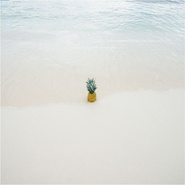
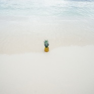

Andy Mei
============================

|  |  |
| :--: | :-- |
| [ Andy Mei](https://i.xiami.com/andymei) | **播放数**: 2693475 **粉丝数**: 534 **评论数**: 43 **地区**: China 中国大陆 **风格**: 浩室舞曲 House  |

## 档案

Andy Mei (梅子杰)，一位疯狂的电子音乐冒险家，来自江苏江阴的98年电子音乐制作人。自2016年开始尝试制作电子音乐，风格多为各类浩室，融入演讲、自然音效等元素，曲风清新欢快。代表作：Big Hearts (宽阔心胸)、Dreamer (梦想家)、The Cure (Remix)。邮箱： mzj19980427@icloud.com 。交流qun：585739280。

## 专辑

| 名称 | 语种 | 唱片公司 | 发行时间 | 专辑类别 | 专辑风格 |
| :--: | :-- | :-- | :-- | :-- | :-- |
| [ Jingle Bells (铃儿响叮当)](./albums/5022287860.md) | 纯音乐 | 独立发行 | 2020年12月24日 | EP, 单曲 | 电子舞曲 EDM / Electronic Dance Music |
| [ The Story So Far](./albums/5021292265.md) | 纯音乐 | 独立发行 | 2020年08月14日 | EP, 单曲 | 浩室舞曲 House |
| [ 序幕](./albums/5021193674.md) | 纯音乐 | 独立发行 | 2020年07月30日 | EP, 单曲 | 器乐独奏 Solo Instrumental |
| [ Sugar (Andy Mei Remix)](./albums/5020900274.md) | 英语 | 独立发行 | 2020年06月02日 | EP, 单曲 | 浩室舞曲 House, 陷阱说唱 Trap Rap |
| [ Astronomia (钢琴版)](./albums/5020651576.md) | 纯音乐 | 独立发行 | 2020年05月15日 | EP, 单曲 | 器乐独奏 Solo Instrumental |
| [ Free Your Soul](./albums/2108280249.md) | 国语 | 独立发行 | 2020年03月28日 | EP, 单曲 | 陷阱说唱 Trap Rap |
| [ Never Before (前所未有)](./albums/2108138963.md) | 纯音乐 | 独立发行 | 2020年03月02日 | EP, 单曲 | 电子 Electronic |
| [ Robot](./albums/2105613787.md) | 纯音乐 | 独立发行 | 2019年12月21日 | EP, 单曲 | 浩室舞曲 House |
| [ Enchantment](./albums/2104967954.md) | 纯音乐 |  | 2019年07月01日 | EP, 单曲 | 出神舞曲 Trance |
| [ Feel This Moment](./albums/2104730521.md) | 其他 |  | 2019年03月31日 | EP, 单曲 | 浩室舞曲 House |
| [ Ice Cold (清凉一夏)](./albums/2104369220.md) | 其他 |  | 2018年12月13日 | EP, 单曲 | 热带浩室 Tropical House |
| [ Alone (钢琴版)](./albums/2104071735.md) | 其他 | 独立发行 | 2018年10月01日 | EP, 单曲 | 器乐独奏 Solo Instrumental |
| [ Dreamer](./albums/2103827251.md) | 纯音乐 | 独立发行 | 2018年07月19日 | EP, 单曲 | 浩室舞曲 House |
| [ Adult Lessons](./albums/2103755018.md) | 国语 | 草台回声 | 2018年06月26日 | EP, 单曲 | 独立电子乐 Indietronica |
| [ Now Or Never](./albums/2103650093.md) | 其他 | 独立发行 | 2018年03月29日 | EP, 单曲 | 浩室舞曲 House |
| [ Obstacle](./albums/2103579484.md) | 其他 | 独立发行 | 2018年03月02日 | EP, 单曲 | 浩室舞曲 House |
| [ 喜洋洋](./albums/2103529143.md) | 其他 | 独立发行 | 2018年02月15日 | EP, 单曲 | 浩室舞曲 House |
| [ Freedom (Original Mix)](./albums/2102979479.md) | 英语 | 独立发行 | 2017年12月22日 | EP, 单曲 | 浩室舞曲 House |
| [ Vacation (Original Mix)](./albums/2102943542.md) | 其他 | 独立发行 | 2017年11月18日 | EP, 单曲 | 浩室舞曲 House |
| [ 我的世界](./albums/2102884393.md) | 国语 | 独立发行 | 2017年10月27日 | EP, 单曲 | 浩室舞曲 House |
| [ Last Sunset](./albums/2102866382.md) | 其他 | 独立发行 | 2017年09月30日 | EP, 单曲 | 弛放 Chillout |
| [ Legendary (Original Mix)](./albums/2102805176.md) | 其他 | 独立发行 | 2017年07月29日 | EP, 单曲 | 浩室舞曲 House |
| [ Reload (Original Mix)](./albums/2102780826.md) | 其他 | 独立发行 | 2017年07月10日 | EP, 单曲 | 浩室舞曲 House |
| [ Ocean Melody (Original Mix)](./albums/2102762309.md) | 其他 | 独立发行 | 2017年06月09日 | EP, 单曲 | 浩室舞曲 House |
| [ The Cure (Andy Mei Remix)](./albums/2102744797.md) | 英语 | 独立发行 | 2017年05月06日 | EP, 单曲 | 浩室舞曲 House |
| [ Eh Eh (Nothing Else I Can Say)(Andy Mei Remix)](./albums/2102721619.md) | 英语 | 独立发行 | 2017年03月26日 | EP, 单曲 | 浩室舞曲 House |
| [ Set Sail (Original Mix)](./albums/2102716922.md) | 其他 | 独立发行 | 2017年03月17日 | EP, 单曲 | 浩室舞曲 House |
| [ Fresh Air (Original Mix)](./albums/2102690662.md) | 其他 | 独立发行 | 2017年02月08日 | EP, 单曲 | 浩室舞曲 House |
| [ Big Hearts (Original Mix)](./albums/2102683151.md) | 英语 | 独立发行 | 2017年01月19日 | EP, 单曲 | 浩室舞曲 House |
| [ Ocean Whisper (Original Mix)](./albums/2102674160.md) | 其他 | 独立发行 | 2016年12月30日 | EP, 单曲 | 浩室舞曲 House |
| [ Riotous 2.0 (Original Mix)](./albums/2102657791.md) | 其他 | 独立发行 | 2016年11月30日 | EP, 单曲 | 浩室舞曲 House |
| [ Independence (Original Mix)](./albums/2102654504.md) | 其他 | 独立发行 | 2016年11月19日 | EP, 单曲 | 浩室舞曲 House |
| [ Sunburst](./albums/2102410910.md) | 其他 | 独立发行 | 2016年10月15日 | EP, 单曲 | 浩室舞曲 House |
| [ Faded (钢琴版)](./albums/2103561030.md) | 其他 | 独立发行 | 2016年08月29日 | EP, 单曲 | 器乐独奏 Solo Instrumental |
| [ Leisure Time](./albums/2100364640.md) | 其他 | 独立发行 | 2016年07月07日 | EP, 单曲 | 浩室舞曲 House |

## 评论

|  |  |  |  |
| :-- | :-- | :-- | :-- |
|  [虾米用户](https://emumo.xiami.com/u/358104299) 悲观的唯心存在现实解构虚... 2020-12-23 07:19 赞(0) 踩(0) | 
43810
 |
|  [虾米用户](https://emumo.xiami.com/u/217823188)  2020-06-08 23:44 赞(0) 踩(0) | 
優秀
 |
|  [虾米用户](https://emumo.xiami.com/u/429732797) *面对懒惰的你充满了决心 2020-05-21 22:32 赞(3) 踩(0) | 
从ta的很多首歌中，我听出来了我们中国的电音技术正在快速发展中，我们会把中国风的电音继续传播下去，让更多的人能听到我们独一无二的中国风电音！
 |
|  [虾米用户](https://emumo.xiami.com/u/379384265)  2020-05-08 14:57 赞(0) 踩(0) | 
喜欢
 |
|  [虾米用户](https://emumo.xiami.com/u/366919221) 听出好心情。 2020-04-28 19:51 赞(1) 踩(0) | 
音乐让你的灵魂不再孤单，那一霎那的共鸣，那一霎那的碰撞。那一霎那你勾起的回忆，那一霎那思绪的飘浮，那一霎那你上扬的嘴角，最美。
 |
|  [虾米用户](https://emumo.xiami.com/u/420831355) 音乐制作人，DJ，努力中 2020-01-01 23:07 赞(3) 踩(0) | 
加油老哥
 |
|  [虾米用户](https://emumo.xiami.com/u/54686131) 要听更多喜欢的歌~~~ 2019-12-29 18:46 赞(1) 踩(0) | 
～
 |
|  [虾米用户](https://emumo.xiami.com/u/346848694) 我还没想好要写什么... 2019-10-28 13:15 赞(3) 踩(0) | 
才华横溢, 有丰富的想象力, 会多关注您的创作。
 |
|  [虾米用户](https://emumo.xiami.com/u/330900828) 高舉一面五星紅旗在蝦米！ 2019-08-14 21:33 赞(2) 踩(0) | 
意念在你走過的美好
 |
|  [虾米用户](https://emumo.xiami.com/u/46378692) If you come.... 2019-05-26 08:41 赞(2) 踩(0) | 
每一首都超赞    
 |
|  [虾米用户](https://emumo.xiami.com/u/300509876)  2019-05-06 18:55 赞(1) 踩(0) | 
不错
 |
|  [虾米用户](https://emumo.xiami.com/u/324879742)   2019-05-01 13:05 赞(1) 踩(0) | 
.
 |
|  [虾米用户](https://emumo.xiami.com/u/325374787)  2019-03-27 21:10 赞(2) 踩(0) | 
到此一游
 |
|  [虾米用户](https://emumo.xiami.com/u/35586392) SHOCKEDYOURS... 2018-10-02 22:12 赞(3) 踩(0) | 

 |
|  [虾米用户](https://emumo.xiami.com/u/195504066) 电子音乐制作人 2018-04-28 06:18 赞(9) 踩(0) | 
内容已删除
 |
| ⇒ |  [虾米用户](https://emumo.xiami.com/u/270588419) 遵从内心~♪ 2018-05-31 13:37 赞(0) 踩(0) | 
棒棒哒
 |
| ⇒ |  [虾米用户](https://emumo.xiami.com/u/232315547)  2019-06-13 08:59 赞(0) 踩(0) | 
emm，谷歌邮箱
 |
|  [虾米用户](https://emumo.xiami.com/u/285301094)  2018-03-27 00:29 赞(0) 踩(0) | 
喜欢
 |
|  [虾米用户](https://emumo.xiami.com/u/313988864) 这个人很懒，连签名都不写... 2017-12-02 06:41 赞(2) 踩(0) | 
国产纯音乐其实还是蛮有前途的
 |
|  [虾米用户](https://emumo.xiami.com/u/270588419) 遵从内心~♪ 2017-11-25 15:55 赞(2) 踩(0) | 
  
 |
|  [虾米用户](https://emumo.xiami.com/u/275943775)  2017-11-13 17:11 赞(0) 踩(0) | 
厉害
 |
|  [虾米用户](https://emumo.xiami.com/u/195504066) 电子音乐制作人 2017-11-11 11:07 赞(5) 踩(0) | 
内容已删除
 |
| ⇒ |  [虾米用户](https://emumo.xiami.com/u/270588419) 遵从内心~♪ 2017-11-25 15:55 赞(0) 踩(0) | 
天！
 |
|  [虾米用户](https://emumo.xiami.com/u/329785937)  2017-10-12 12:57 赞(1) 踩(0) | 
加油，大梅哥(DMG)！
 |
|  [虾米用户](https://emumo.xiami.com/u/264850941)  2017-10-08 19:16 赞(1) 踩(0) | 

 |
|  [虾米用户](https://emumo.xiami.com/u/316509853) 音乐使人陶醉，使我感到生... 2017-10-06 06:40 赞(1) 踩(0) | 
大爱！！
 |
|  [虾米用户](https://emumo.xiami.com/u/286948152) 我还没想好要写什么... 2017-08-27 15:45 赞(1) 踩(0) | 
在澳洲？
 |
|  [虾米用户](https://emumo.xiami.com/u/274124301) …… 2017-08-20 20:41 赞(1) 踩(0) | 
加油
 |
|  [虾米用户](https://emumo.xiami.com/u/309428324)  2017-08-13 14:49 赞(1) 踩(0) | 
 很喜欢
 |
|  [虾米用户](https://emumo.xiami.com/u/9907882) 如如不动 万法唯心 2017-08-05 13:12 赞(1) 踩(0) | 

 |
|  [虾米用户](https://emumo.xiami.com/u/11917054) 『常年卧底医院并乔装成医... 2017-08-01 20:06 赞(1) 踩(0) | 
『get&amp;radic;U』
 |
|  [虾米用户](https://emumo.xiami.com/u/901611)  2017-07-23 21:34 赞(1) 踩(0) | 
就油
 |
|  [虾米用户](https://emumo.xiami.com/u/247273333)  2017-07-21 17:59 赞(3) 踩(0) | 
可以出国留学 
 |
|  [虾米用户](https://emumo.xiami.com/u/247273333)  2017-07-21 17:58 赞(2) 踩(0) | 
很羡慕你呢 
 |
|  [虾米用户](https://emumo.xiami.com/u/247273333)  2017-05-19 21:32 赞(2) 踩(0) | 
加油
 |
|  [虾米用户](https://emumo.xiami.com/u/278471839)  2017-04-18 20:58 赞(2) 踩(0) | 
赞
 |
|  [虾米用户](https://emumo.xiami.com/u/234680366) 怪人喜欢做坏事 2017-04-14 10:12 赞(2) 踩(0) | 
I    Love    You 
 |
|  [虾米用户](https://emumo.xiami.com/u/234680366) 怪人喜欢做坏事 2017-04-14 10:10 赞(1) 踩(0) | 
好喜欢  好喜欢  好喜欢
 |
|  [虾米用户](https://emumo.xiami.com/u/284474619)  2017-04-08 08:57 赞(2) 踩(0) | 
Andy Mei
 |
|  [虾米用户](https://emumo.xiami.com/u/208290824)  2017-03-21 21:38 赞(14) 踩(0) | 
你好，可以发一份《Faded (纯钢琴版)Andy Mei;Alan Walker》，的钢琴谱吗？  你的这个版本好好听
 |
|  [虾米用户](https://emumo.xiami.com/u/10076838)  2017-02-27 00:35 赞(1) 踩(0) | 
.
 |
|  [虾米用户](https://emumo.xiami.com/u/47193351) 做你力所能及的事 2016-10-05 02:12 赞(1) 踩(0) | 
我可以点歌吗？
 |
|  [虾米用户](https://emumo.xiami.com/u/47193351) 做你力所能及的事 2016-10-05 02:11 赞(0) 踩(0) | 
我喜欢 加油，弟弟
 |
|  [虾米用户](https://emumo.xiami.com/u/92139628) msr 2016-10-03 20:34 赞(1) 踩(0) | 

 |
|  [虾米用户](https://emumo.xiami.com/u/222862494)  2016-09-04 21:18 赞(2) 踩(0) | 

 |
