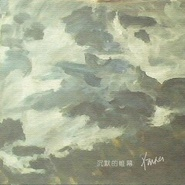

任灿
============================

|  |  |
| :--: | :-- |
| [ 任灿](https://i.xiami.com/rencan) | **播放数**: 3117459 **粉丝数**: 766 **评论数**: 56 **地区**: China 中国大陆 **风格**: 独立摇滚 Indie Rock, 独立民谣 Indie Folk  |

## 档案

任灿 
独立音乐人和上班族 
和大部分音乐人一样，少年时期，因为喜爱音乐而学琴，大一的时候写了人生中的第一首歌，后来受国内外独立音乐人，摇滚歌手的影响，开始了自己的创作生涯。

## 专辑

| 名称 | 语种 | 唱片公司 | 发行时间 | 专辑类别 | 专辑风格 |
| :--: | :-- | :-- | :-- | :-- | :-- |
| [ 未予显示](./albums/2102818858.md) | 国语 | 众乐纪 | 2017年08月24日 | 录音室专辑 | 独立民谣 Indie Folk, 独立摇滚 Indie Rock |
| [ 沉默的帷幕](./albums/2100365719.md) | 国语 | 众乐纪 | 2016年07月13日 | 录音室专辑 | 独立民谣 Indie Folk, 独立摇滚 Indie Rock |

## 评论

|  |  |  |  |
| :-- | :-- | :-- | :-- |
|  [虾米用户](https://emumo.xiami.com/u/444315914)  2020-08-09 23:08 赞(0) 踩(0) | 
歌很听啊   是我喜欢的
 |
|  [虾米用户](https://emumo.xiami.com/u/410854061)  2020-01-04 15:24 赞(0) 踩(0) | 
你的歌很好听(ง •̀_•́)ง，你在哪里有演唱会吗
 |
|  [虾米用户](https://emumo.xiami.com/u/12777118)  2019-09-09 13:29 赞(2) 踩(0) | 
声音很喜欢呀。。期待新作品
 |
|  [虾米用户](https://emumo.xiami.com/u/52338885) 我还没想好要写什么... 2019-07-20 16:29 赞(1) 踩(0) | 
真心觉得你的歌很好。想去听现场，给我个地址就可以了。因为我没有在其他地方发现你现场演出的信息。顺便说一下，我是一个40多的大叔，不是追星的那种人   
 |
| ⇒ |  [虾米用户](https://emumo.xiami.com/u/52338885) 我还没想好要写什么... 2019-07-20 16:30 赞(0) 踩(0) | 
<a href="http://emumo.xiami.com/u/43128244" target="_blank" rel="nofollow" name_card="43128244">@任灿</a>
 |
|  [虾米用户](https://emumo.xiami.com/u/426074386)  2019-07-12 19:42 赞(0) 踩(0) | 
联想到一个人唱你歌的感觉 就不停想笑❤️
 |
|  [虾米用户](https://emumo.xiami.com/u/52338885) 我还没想好要写什么... 2019-06-19 23:07 赞(1) 踩(0) | 
什么有演唱会？或者其他什么形式的现场演唱都行。给我说一声，我想现场听你的歌 
 |
|  [虾米用户](https://emumo.xiami.com/u/9258235) 城堡 2019-03-20 13:59 赞(1) 踩(0) | 
超级喜欢一声叹息，每天中午都无限循环
 |
|  [虾米用户](https://emumo.xiami.com/u/257033009) 这家伙很懒什么也没留下.... 2019-02-28 07:41 赞(0) 踩(0) | 
加油
 |
|  [虾米用户](https://emumo.xiami.com/u/318664711)  2019-02-26 15:34 赞(0) 踩(0) | 
大仙，怎么不出新作品，真心期待着你！
 |
|  [虾米用户](https://emumo.xiami.com/u/2625062) 手握寸铁，近人可读。 2019-01-08 22:17 赞(1) 踩(0) | 
穿行很好听，希望能创作更多好听的音乐。关注，赞
 |
|  [虾米用户](https://emumo.xiami.com/u/360412217)  2018-11-23 23:38 赞(1) 踩(0) | 
很喜欢穿行，分享以后朋友也喜欢！
 |
|  [虾米用户](https://emumo.xiami.com/u/404877155) 宁要清醒的痛苦，不要浑噩... 2018-10-26 16:26 赞(0) 踩(0) | 
就喜欢你的吐字不清，更有感觉！喜欢你的作品，让人一下子就掉进去了。
 |
|  [虾米用户](https://emumo.xiami.com/u/40163384) 我还没想好要写什么... 2018-10-21 03:37 赞(0) 踩(0) | 
一个字：赞
 |
|  [虾米用户](https://emumo.xiami.com/u/52338885) 我还没想好要写什么... 2018-10-17 23:55 赞(0) 踩(0) | 
我看好你
 |
|  [虾米用户](https://emumo.xiami.com/u/560935) 给点阳光就会灿烂 2018-10-05 13:08 赞(0) 踩(0) | 
很不错，声音有磁性
 |
|  [虾米用户](https://emumo.xiami.com/u/9478563) 成都的雨不停的下，就像你... 2018-09-22 00:03 赞(1) 踩(0) | 
才华直逼逼哥啊兄弟！看好你！加油 
 |
|  [虾米用户](https://emumo.xiami.com/u/309806561) 浮荒千里 2018-08-28 14:39 赞(0) 踩(0) | 
乡音怎么了？你们听不懂么？
 |
|  [虾米用户](https://emumo.xiami.com/u/346087991) 医路漫漫 音乐为伴 2018-08-23 18:21 赞(2) 踩(0) | 
吐字不清没关系啊有口音也没关系啊那么好的音乐足够完美了支持期待更多佳作
 |
|  [虾米用户](https://emumo.xiami.com/u/96835356) 嘘—— 2018-07-30 23:22 赞(1) 踩(0) | 
挺有味道的音乐人，有一些些游走漂泊的意蕴。
 |
|  [虾米用户](https://emumo.xiami.com/u/342256261)  2018-05-22 08:17 赞(0) 踩(0) | 
吐词太难听，不要再给我推荐
 |
|  [虾米用户](https://emumo.xiami.com/u/287560964)  2018-05-15 08:59 赞(0) 踩(0) | 
请保持自己的风格。支持！
 |
|  [虾米用户](https://emumo.xiami.com/u/28108371) 我还没想好要写什么... 2018-02-16 11:36 赞(0) 踩(0) | 
喜欢这磁性的嗓音
 |
|  [虾米用户](https://emumo.xiami.com/u/9104049) 我还没想好要写什么... 2018-02-07 16:04 赞(0) 踩(0) | 
很喜欢
 |
|  [虾米用户](https://emumo.xiami.com/u/255186901) 。 2018-02-03 03:25 赞(0) 踩(0) | 
我看你好哟
 |
|  [虾米用户](https://emumo.xiami.com/u/272255708)  2018-01-31 07:37 赞(0) 踩(0) | 
方言口音太重了，有意为之还是乡音难改？
 |
|  [虾米用户](https://emumo.xiami.com/u/125089920) 找到北方啦 2018-01-29 09:30 赞(0) 踩(0) | 
看好妳哦
 |
|  [虾米用户](https://emumo.xiami.com/u/8337431) 以乐会友 2018-01-26 09:08 赞(0) 踩(0) | 
中国国产独立民谣才子
 |
|  [虾米用户](https://emumo.xiami.com/u/8337431) 以乐会友 2018-01-26 08:04 赞(0) 踩(0) | 
民谣男声，有点陈鸿宇的味道。25
 |
|  [虾米用户](https://emumo.xiami.com/u/12668240) ... 2017-09-17 20:38 赞(0) 踩(0) | 
声音真好听，飘着走的音色
 |
|  [虾米用户](https://emumo.xiami.com/u/322100816)   2017-09-14 22:02 赞(1) 踩(0) | 
这嗓音，太喜欢了，惊起藏在内心深处那些人和事 
 |
|  [虾米用户](https://emumo.xiami.com/u/111870876) 我，爱这生活。 2017-08-03 23:28 赞(8) 踩(0) | 
恕我直言，我能叫你二逼哥么？因为真的和逼哥很像 
 |
| ⇒ |  [虾米用户](https://emumo.xiami.com/u/8337431) 以乐会友 2018-01-26 09:09 赞(0) 踩(0) | 
比逼哥还牛逼
 |
|  [虾米用户](https://emumo.xiami.com/u/304464294)  2017-07-15 17:25 赞(0) 踩(0) | 
从&amp;laquo;消化&amp;raquo;开始，被你的声音抓住了 
 |
|  [虾米用户](https://emumo.xiami.com/u/258759275) 不要让这一切变得没有意义 2017-05-27 17:47 赞(0) 踩(0) | 
俗一点  我想管你叫金子
 |
|  [虾米用户](https://emumo.xiami.com/u/5429478) 唯有音乐和亲情不可遗落！ 2017-05-03 10:36 赞(1) 踩(0) | 
喜欢你的歌，还有歌词
 |
| ⇒ |  [虾米用户](https://emumo.xiami.com/u/610315)  2018-12-28 08:36 赞(0) 踩(0) | 
哪儿都能遇见你 
 |
|  [虾米用户](https://emumo.xiami.com/u/5055178) 终不似，少年游。 2017-04-22 15:02 赞(0) 踩(0) | 
很好
 |
|  [虾米用户](https://emumo.xiami.com/u/161643278)  2017-04-21 17:48 赞(0) 踩(0) | 
不错哦，没想到粉丝还这么少，加油！
 |
|  [虾米用户](https://emumo.xiami.com/u/1955060)  2017-04-18 23:41 赞(0) 踩(0) | 
看好你！加油！
 |
|  [虾米用户](https://emumo.xiami.com/u/27281817)  2017-01-03 00:33 赞(0) 踩(0) | 
曾经跨越大陆，现在跨越星球，什么都不会有的～自逼哥之后又一个迷的独立摇滚，民谣歌手。
 |
|  [虾米用户](https://emumo.xiami.com/u/6187648) ✎。 2016-12-19 13:38 赞(0) 踩(0) | 
喜欢的feel！
 |
|  [虾米用户](https://emumo.xiami.com/u/122755326) 你又不认识我 2016-12-04 19:11 赞(0) 踩(0) | 
乐童音乐推荐来的 好听
 |
|  [虾米用户](https://emumo.xiami.com/u/10250709)  2016-11-03 11:30 赞(3) 踩(0) | 
只有我一个人觉得酷似李志么，但没有模仿的痕迹，一样很好。加油
 |
|  [虾米用户](https://emumo.xiami.com/u/102229384) 我诠释你独有 2016-09-24 20:11 赞(0) 踩(0) | 
治愈致郁
 |
|  [虾米用户](https://emumo.xiami.com/u/128490966)   2016-09-02 21:37 赞(0) 踩(0) | 
火钳刘明
 |
|  [虾米用户](https://emumo.xiami.com/u/186862254) 小人物，大梦想！ 2016-09-02 11:28 赞(1) 踩(0) | 
喜欢你的作品   支持
 |
|  [虾米用户](https://emumo.xiami.com/u/179496910)  2016-08-27 01:13 赞(0) 踩(0) | 
贴吧来的 好听
 |
|  [虾米用户](https://emumo.xiami.com/u/49895220) 一念静心花开遍世界 2016-08-16 20:41 赞(0) 踩(0) | 
南方银啊
 |
|  [虾米用户](https://emumo.xiami.com/u/49895220) 一念静心花开遍世界 2016-08-16 20:40 赞(0) 踩(0) | 
贴吧有人推荐来听听
 |
|  [虾米用户](https://emumo.xiami.com/u/51980597) 每个人的一生都是一次远行 2016-08-12 21:36 赞(0) 踩(0) | 
需要支持！
 |
|  [虾米用户](https://emumo.xiami.com/u/71703500) 復興中華 搖滾不死 2016-08-06 09:00 赞(0) 踩(0) | 
我倆不是一個風格，我是遊牧民謠
 |
|  [虾米用户](https://emumo.xiami.com/u/54060641) 我还没想好要写什么... 2016-07-22 17:07 赞(0) 踩(0) | 
好听
 |
|  [虾米用户](https://emumo.xiami.com/u/43128244) 吃点屎吧…… 2016-07-11 17:21 赞(18) 踩(0) | 
我刚入驻了虾米音乐人，欢迎大家来我的个人主页，收听我的最新音乐
 |
| ⇒ |  [虾米用户](https://emumo.xiami.com/u/219642779)  2016-08-28 17:03 赞(0) 踩(0) | 
悠长舒服的音色 简单的曲调 支持
 |
| ⇒ |  [虾米用户](https://emumo.xiami.com/u/2813689) 我还没想好要写什么... 2018-03-04 15:11 赞(0) 踩(0) | 
炒鸡喜欢你的声音，好想求一声叹息的吉他谱啊
 |
