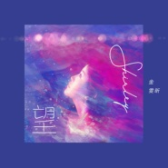

望
============================

|  |  |
| :--: | :-- |
| [ 望](https://emumo.xiami.com/album/2105407574) | **艺人**: [金雯昕](../index.md) **语种**: 国语 **唱片公司**: 天娱传媒 **发行时间**: 2019年10月30日 **专辑类别**: EP, 单曲 **专辑风格**:  **播放数**: 1168 **收藏数**: 2 **评论数**: 0  |

## 简介

金雯昕原创《望》首播 以月亮视角对太阳表达心声  
“月亮”与“太阳”的距离，是「望」。青春剧《竹马钢琴师》女主角，新晋演员、歌手金雯昕个人首支原创歌曲《望》今日正式上线。歌曲由金雯昕包揽词曲创作，新锐制作人黃竣琮编曲制作完成。预告视频在微博率先发布之后迅速点燃了粉丝的期待。  
歌曲《望》使用了大量弦乐、钢琴、吉他及贝斯乐器，铺垫缔造出空灵意境，金雯昕甜氧纯净又极具质感的声音让听者十分抓耳。“你的光是我抵抗黑暗的信仰”，“黑夜有你照亮，孤星不再彷徨”。伴随歌曲波荡起伏的情感抒发不失思考与深度，“望”的最终是全身心的触动。  
创作手记：以月亮的视角对太阳表达心声，写给热爱的事物与喜欢的人。我们也许很难和喜欢的事物并肩同行，因为它距离遥远，无法靠近，难以拥有，但我们真的被它的光芒照亮过。也因为这些光芒，让我们不再害怕不再孤单，成为了更好的自己，甚至成为了别人的光。

## 曲目

## 评论

|  |  |  |  |
| :-- | :-- | :-- | :-- |
