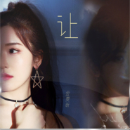

让
============================

|  |  |
| :--: | :-- |
| [ 让](https://emumo.xiami.com/album/2105638324) | **艺人**: [金雯昕](../index.md) **语种**: 国语 **唱片公司**: 天娱传媒 **发行时间**: 2019年12月26日 **专辑类别**: EP, 单曲 **专辑风格**: 国语流行 Mandarin Pop **播放数**: 659 **收藏数**: 2 **评论数**: 1  |

## 简介

新生代演员、唱作歌手金雯昕2019第四波原创新歌《让》上线！ 
《让》 用第一人称，与流言蜚语和恶意中伤自己的人对话 
我不是你们嘴里虚构的那个“我”，也不需要做你们定义中完美的“我” 
你们尽情地编造不属于我的过去，而我依然在成为自己认定的路上义无反顾地走着，无论悲喜都由我自行承担，与你无关。

## 曲目

## 评论

|  |  |  |  |
| :-- | :-- | :-- | :-- |
|  [虾米用户](https://emumo.xiami.com/u/428366072)  2019-12-29 20:27 赞(0) 踩(0) | 
很好听哦 小姐姐加油
 |
