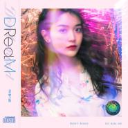
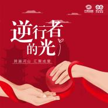
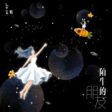
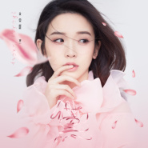

金雯昕
============================

|  |  |
| :--: | :-- |
| [ 金雯昕](https://i.xiami.com/jinwenxin) | **地区**: China 中国大陆 **风格**:  **播放数**: 1954694 **粉丝数**: 498 **评论数**: 47  |

## 档案

金雯昕，出生于武汉，中国内地女歌手，毕业于华中科技大学。 2014年，参加校园青春进取真人秀节目《blingbling青春纪》，进入湖北赛区前5强。2016年，参加芒果TV选秀娱乐节目《超级女声》，金雯昕顺利晋级全国20强；同年8月7日，在7强争夺战中止步，获得第8名；之后，推出个人单曲《Everybody Knows》和《催眠》；12月，推出个人单曲《甜蜜时间》。2018年11月，主演的民国悬疑网络剧《千门江湖之诡面疑云》上线。2018年，推出《黛》和《下一个你》两首个人单曲；2019年，拍摄民国甜宠剧《小女上房揭瓦》，主演的励志偶像剧《竹马钢琴师》在优酷和芒果TV上线。 
小档案 
中文名：金雯昕 
别名：小蚊子 
生日：1993年11月26日 
星座：射手座 
血型：B型 
身高：164cm 
体重：49kg 
出生地：武汉 
职业：歌手 
毕业院校：华中科技大学 
早年经历 
金雯昕小学就读于武汉市汉阳区车站小学。2005年，11岁的金雯昕被入选成为110名武汉市首届现代少年形象大使之一。2012年，金雯昕就读于华中科技大学，专业为播音主持。从大三开始，金雯昕利用课余时间在校外实习，当过民生新闻的出镜记者，也做过娱乐节目的主持人。 
金雯昕喜欢唱歌，特别喜欢的是邓丽君的歌。在大学期间，曾得过新闻院十大歌手第一名。 
演艺经历 
2014年，金雯昕参加校园青春进取真人秀《blingbling青春纪》，进入湖北赛区前5强。10月4日，金雯昕参加央视青年电视公开课《开讲啦》，向李娜探寻她对记者形象的看法 
2016年，金雯昕参加芒果TV选秀娱乐节目《超级女声》长沙地面赛区的海选，进入前10强。5月2日，在《超级女声》百强分班赛第二场中，顺利晋级全国20强并入住女声学院。5月3日，金雯昕出席“超级女声“百强集结发布会，并在现场与选手们一起演唱超级女声主题曲《想唱就唱》。6月27日，金雯昕参加“超级女声”首场演唱会

## 专辑

| 名称 | 语种 | 唱片公司 | 发行时间 | 专辑类别 | 专辑风格 |
| :--: | :-- | :-- | :-- | :-- | :-- |
| [ DReaM](./albums/5022068280.md) | 国语 | 天娱传媒 | 2020年11月26日 | EP, 单曲 | 电子舞曲 EDM / Electronic Dance Music |
| [ 向阳而生 影视原声带](./albums/5021677026.md) | 国语 | 天娱传媒 | 2020年10月12日 | 原声带, 影视音乐 | 电视原声 Television Music, 国语流行 Mandarin Pop |
| [ 逆行者的光](./albums/2105815056.md) | 国语 | 天娱传媒 | 2020年02月03日 | EP, 单曲 |  |
| [ 小女上房揭瓦 影视剧原声带](./albums/2105690500.md) | 国语 | 卓颜巍声 | 2020年01月14日 | 原声带, 影视音乐 |  |
| [ 让](./albums/2105638324.md) | 国语 | 天娱传媒 | 2019年12月26日 | EP, 单曲 | 国语流行 Mandarin Pop |
| [ 遥远的星星](./albums/2105537209.md) | 国语 | 天娱传媒 | 2019年11月26日 | EP, 单曲 | 国语流行 Mandarin Pop |
| [ 陌生的朋友](./albums/2105473149.md) | 国语 | 天娱传媒 | 2019年11月19日 | EP, 单曲 |  |
| [ 望](./albums/2105407574.md) | 国语 | 天娱传媒 | 2019年10月30日 | EP, 单曲 |  |
| [ 下一个你](./albums/2104389588.md) | 国语 | 天娱传媒 | 2018年12月18日 | EP, 单曲 | 国语流行 Mandarin Pop |
| [ 黛](./albums/2104255397.md) | 国语 | 天娱传媒 | 2018年11月21日 | EP, 单曲 | 国语流行 Mandarin Pop |
| [ 甜蜜时间](./albums/2102673466.md) | 国语 | 红点星文化 | 2016年12月29日 | EP, 单曲 |  |

## 评论

|  |  |  |
| :-- | :-- | :-- |
|  [虾米用户](https://emumo.xiami.com/u/444683263)  2020-08-26 10:30 赞(1) 踩(0) | 
干干净净的声音，让人听了很舒服 
 |
|  [虾米用户](https://emumo.xiami.com/u/126713220) 我还没想好要写什么... 2020-03-27 07:54 赞(0) 踩(0) | 
出张翻唱专辑吧，肯定会带给你更多流量和人气
 |
|  [虾米用户](https://emumo.xiami.com/u/294871791)  2019-09-14 14:14 赞(0) 踩(0) | 
我猜小姐姐肯定TD歌迷！
 |
|  [虾米用户](https://emumo.xiami.com/u/426741348)  2019-06-30 23:18 赞(0) 踩(0) | 
蚊子加油
 |
|  [虾米用户](https://emumo.xiami.com/u/282729134)  2017-10-28 00:06 赞(2) 踩(0) | 
漂亮姐姐，你不仅唱歌好听，而且人又美。希望你可以唱更多好听的歌。
 |
|  [虾米用户](https://emumo.xiami.com/u/278096586)  2017-06-10 19:47 赞(2) 踩(0) | 
姐姐，love
 |
|  [虾米用户](https://emumo.xiami.com/u/278096586)  2017-06-10 19:46 赞(1) 踩(0) | 
加油，会一直爱你 漂亮
 |
|  [虾米用户](https://emumo.xiami.com/u/268563025)  2017-05-21 14:52 赞(1) 踩(0) | 
全世界最好的金雯昕
 |
|  [虾米用户](https://emumo.xiami.com/u/254680196)   2017-04-08 08:12 赞(2) 踩(0) | 
你声音很好听，为梦想坚持继续努力吧&amp;hellip;我们一起加油&amp;hellip; 
 |
|  [虾米用户](https://emumo.xiami.com/u/285139862)  2017-04-01 22:50 赞(1) 踩(0) | 
加油
 |
|  [虾米用户](https://emumo.xiami.com/u/261955409)  2017-03-25 01:02 赞(1) 踩(0) | 
小蚊子好看，歌也好听
 |
|  [虾米用户](https://emumo.xiami.com/u/261673975)  2017-01-19 13:36 赞(1) 踩(0) | 
甜蜜时间很好听
 |
|  [虾米用户](https://emumo.xiami.com/u/261673975)  2017-01-19 13:36 赞(1) 踩(0) | 
昨天看了逛吃逛吃开饭了
 |
|  [虾米用户](https://emumo.xiami.com/u/261673975)  2017-01-19 13:35 赞(1) 踩(0) | 
期待你的电影
 |
|  [虾米用户](https://emumo.xiami.com/u/261673975)  2017-01-19 13:35 赞(1) 踩(0) | 
一直都记得你唱好想你的样子，深深地打动了我
 |
|  [虾米用户](https://emumo.xiami.com/u/261673975)  2017-01-19 13:34 赞(1) 踩(0) | 
加油
 |
|  [虾米用户](https://emumo.xiami.com/u/239368903) 少年时期的放浪是晚年的汇... 2017-01-16 15:28 赞(0) 踩(0) | 
fghting
 |
|  [虾米用户](https://emumo.xiami.com/u/257702475)  2016-12-29 09:59 赞(0) 踩(0) | 
全世界最好的金雯昕
 |
|  [虾米用户](https://emumo.xiami.com/u/235280989)   2016-12-14 00:25 赞(0) 踩(0) | 
全世界最好的金雯昕
 |
|  [虾米用户](https://emumo.xiami.com/u/250465156)  2016-11-28 09:03 赞(0) 踩(0) | 
美女姐姐我爱你，希望你可以唱更多歌曲
 |
|  [虾米用户](https://emumo.xiami.com/u/233506830)  2016-11-09 16:00 赞(0) 踩(0) | 
咋這麽美
 |
|  [虾米用户](https://emumo.xiami.com/u/233506830)  2016-11-09 16:00 赞(0) 踩(0) | 
好美啊
 |
|  [虾米用户](https://emumo.xiami.com/u/237215473)  2016-10-16 12:17 赞(0) 踩(0) | 
耀眼如金，温暖人昕。蚊子加油！！
 |
|  [虾米用户](https://emumo.xiami.com/u/237215473)  2016-10-16 12:16 赞(0) 踩(0) | 
耀眼如金，温暖人昕。蚊子加油！
 |
|  [虾米用户](https://emumo.xiami.com/u/235897276)  2016-10-13 16:08 赞(0) 踩(0) | 
加油，越来越好的小蚊子！
 |
|  [虾米用户](https://emumo.xiami.com/u/235894816) 性格双重，思维古怪，爱害... 2016-10-13 09:23 赞(1) 踩(0) | 

 |
|  [虾米用户](https://emumo.xiami.com/u/236078787) 是什么让我遇见这样的你  2016-10-13 00:32 赞(2) 踩(0) | 
全世界最好的金雯昕
 |
|  [虾米用户](https://emumo.xiami.com/u/235362167)   2016-10-12 22:03 赞(3) 踩(0) | 
我雯好美丽
 |
|  [虾米用户](https://emumo.xiami.com/u/235362167)   2016-10-12 21:56 赞(3) 踩(0) | 
爱我雯
 |
|  [虾米用户](https://emumo.xiami.com/u/31877391)  2016-10-12 21:21 赞(2) 踩(0) | 
一闪一闪金雯昕，满天都是幸运昕 
 |
|  [虾米用户](https://emumo.xiami.com/u/235883730)  2016-10-12 13:35 赞(3) 踩(0) | 
加油，全世界最好的金雯昕，幸运昕会一直陪着你
 |
|  [虾米用户](https://emumo.xiami.com/u/235883730)  2016-10-12 13:35 赞(3) 踩(0) | 
一直在，一直爱
 |
|  [虾米用户](https://emumo.xiami.com/u/235706276)  2016-10-11 20:09 赞(3) 踩(0) | 
不弃不离 
 |
|  [虾米用户](https://emumo.xiami.com/u/231312528)  2016-10-10 22:05 赞(2) 踩(0) | 
全世界最好的金雯昕！
 |
|  [虾米用户](https://emumo.xiami.com/u/235404053)  2016-10-10 20:19 赞(2) 踩(0) | 
雯子最棒  
 |
|  [虾米用户](https://emumo.xiami.com/u/235384229)  2016-10-10 19:58 赞(2) 踩(0) | 

 |
|  [虾米用户](https://emumo.xiami.com/u/235384296)  2016-10-10 19:27 赞(2) 踩(0) | 
全世界最好的金雯昕
 |
|  [虾米用户](https://emumo.xiami.com/u/235128629)  2016-10-10 16:01 赞(2) 踩(0) | 
么么哒！爱你！ 
 |
|  [虾米用户](https://emumo.xiami.com/u/235281416)  2016-10-10 12:46 赞(2) 踩(0) | 
耀眼如金，雯暖人心！！
 |
|  [虾米用户](https://emumo.xiami.com/u/235280989)   2016-10-10 12:44 赞(2) 踩(0) | 
么么哒
 |
|  [虾米用户](https://emumo.xiami.com/u/235269983) 只爱金雯昕❤ 2016-10-10 12:14 赞(2) 踩(0) | 
么么哒
 |
|  [虾米用户](https://emumo.xiami.com/u/235187217)   2016-10-10 12:13 赞(2) 踩(0) | 
 
 |
|  [虾米用户](https://emumo.xiami.com/u/214096838)  2016-10-10 12:13 赞(2) 踩(0) | 
蚊子么么哒
 |
|  [虾米用户](https://emumo.xiami.com/u/235128629)  2016-10-09 21:05 赞(6) 踩(0) | 
爱你
 |
|  [虾米用户](https://emumo.xiami.com/u/233888699)  2016-10-06 12:20 赞(2) 踩(0) | 
耀眼如金，雯暖人心 
 |
|  [虾米用户](https://emumo.xiami.com/u/230817464) 沿着来时的路，找寻回忆的... 2016-09-28 14:24 赞(6) 踩(0) | 
加油小蚊子！我爱你❤ 么么哒
 |
|  [虾米用户](https://emumo.xiami.com/u/211801133) you are my s... 2016-08-12 10:46 赞(8) 踩(0) | 
蚊子棒棒哒~
 |
