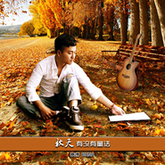

秋天有没有童话
============================

|  |  |
| :--: | :-- |
| [ 秋天有没有童话](https://emumo.xiami.com/album/2100387587) | **艺人**: [秦博](../index.md) **语种**: 国语 **唱片公司**: 秦博音乐工作室 **发行时间**: 2016年08月18日 **专辑类别**: EP, 单曲 **专辑风格**: 国语流行 Mandarin Pop, 华语唱作人 Chinese Singer-Songwriter **播放数**: 4546 **收藏数**: 1 **评论数**: 2  |

## 简介

   秦博完美情歌《秋天有没有童话》诠释爱的真善美  
  
爱是一个永恒的话题，爱情是美好的，美好的爱情究竟能不能永恒？灵魂歌手秦博继甜蜜情歌《要爱就爱一辈子》大热后，近日再推转型新作《秋天有没有童话》诠释爱的真善美与恒久远。  
  
又是一个秋天，又是一季浪漫温馨的七夕情人节。秋天是一个思念的季节，爱过才知情重，我们在青春岁月里爱着，思念着，却又在无数个日子里反复受着思念的煎熬，一曲《秋天有没有童话》是我们对那个秋天里如童话般的爱情最深刻的记忆，正如歌里所唱：秋天依然是秋天、童话在哪里上演，一把长椅只剩一个人思念… 我们也将随着这样的歌声一起思念曾经最爱的那个她。浪漫的七夕情人节搭配秦博的音乐，让我们一起感受音乐的魅力，一起倾听秋天的童话！跟着秦博的歌声，我们一起去寻找那段不能被遗忘的时光，一起缅怀最初最深的爱恋。  
  
《秋天有没有童话》是著名音乐人木杰先生根据亲身经历为秦博量身制作的唯美伤感情歌，歌曲在流行的基础之上添加了创新的时尚元素，歌曲编配旋律动感，精良的后期制作加之秦博独特声线，更是赋予了歌曲最真实的灵魂，秦博用最真挚的情感诠释演绎着最动听的伤感旋律。唯美的《秋天有没有童话》一经发布，便引来大众的共鸣与众多歌迷的好评与全民翻唱热潮。  
  
从步入歌坛开始，秦博就在尝试着不同曲风类型的歌曲；他既能唱出表达大众心声的《兄弟干杯》，也有表达对父母思念的《爸妈》与兄弟情谊的《从小到大的兄弟》，更有表达幸福爱恋的正能量甜蜜情歌《要爱就爱一辈子》。每一种类型的歌曲他都能游刃有余的去演绎，让听者从歌曲中体会人生百态。一步一个脚印的走来，秦博的演唱实力也是被越来越多的人认可；他也用自己的作品在华语乐坛留下了不可磨灭的印记。他的音乐往往都能直击人们灵魂,诠释爱情和生命的真谛。相信《秋天有没有童话》将开启秦博音乐道路上的又一个辉煌征程，实现音乐之路的再一次完美脱变。 
 

 

秋天有没有童话
 

 
 

词曲：木杰
 

编曲：玄昌俊
 

混缩：郑连华
 

演唱：秦博
 

伴唱：寂悸
 

版权方：秦博
 

监制：秦博工作室
 

制作人：秦博
 

 
 

习惯闻你发间淡淡玫瑰花香味
 

仿佛就连秋天都变得特别的妩媚
 

如果这就是童话的结局那该多完美
 

一把长椅两个恋人永远相依偎
 

 
 

难道秋天就该是个伤怀的季节
 

就连叶子都飘落得那么的凄美
 

握住你微凉的指间好想时间能永恒
 

能不能用我的生命留住你的美
 

 
 

秋天依然是秋天
 

童话却没有上演
 

一把长椅只剩一个人思念
 

没有你的世界生命只能是残缺
 

守着回忆熬过每个夜
 

 
 

秋天依然是秋天
 

童话在哪里上演
 

一把长椅洒满孤独的落叶
 

如果时空能穿越轻抚你带泪的脸
 

我不会再让你感觉冷
 

 
 

独白：如果时间可以重来 你会不会留在我身边 
 

      像童话里一样 一起听秋天的故事
 

 
 

难道秋天就该是个伤怀的季节
 

就连叶子都飘落得那么的凄美
 

握住你微凉的指间好想时间能永恒
 

能不能用我的生命留住你的美
 

 
 

秋天依然是秋天
 

童话却没有上演
 

一把长椅只剩一个人思念
 

没有你的世界生命只能是残缺
 

守着回忆熬过每个夜
 

 
 

秋天依然是秋天
 

童话在哪里上演
 

一把长椅洒满孤独的落叶
 

如果时空能穿越轻抚你带泪的脸
 

我不会再让你感觉冷
 

 
 

秋天依然是秋天
 

童话却没有上演
 

一把长椅只剩一个人思念
 

没有你的世界生命只能是残缺
 

守着回忆熬过每个夜
 

 
 

秋天依然是秋天
 

童话在哪里上演
 

一把长椅洒满孤独的落叶
 

如果时空能穿越轻抚你带泪的脸
 

我不会再让你感觉冷
 

我不会再让你感觉冷
 

## 曲目

## 评论

|  |  |  |
| :-- | :-- | :-- |
|  [虾米用户](https://emumo.xiami.com/u/326873853)  2017-09-26 09:03 赞(0) 踩(0) | 
曾经走过人间四季春秋，与美丽无言的青春有过相濡以沫的约定；茉莉在黄昏中浮动着神秘的幽香，终于，我还是长大了，伴着快乐与悲伤。只是，那悲伤，深不见底。
 |
|  [虾米用户](https://emumo.xiami.com/u/326873853)  2017-09-26 09:02 赞(1) 踩(0) | 
伫足在秋天不回来的悲伤中，独自品尝北极星的眼泪，谁能借我一双隐形的翅膀，飞向那清明雨上横跨天际的彩虹，也许彩虹背后恰有丁香花汇成的花海，弥漫着七里香。
 |
