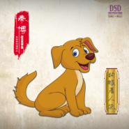

狗眼看人低狗眼看人低
============================

|  |  |
| :--: | :-- |
| [ 狗眼看人低狗眼看人低](https://emumo.xiami.com/album/2102401365) | **艺人**: [秦博](../index.md) **语种**: 国语 **唱片公司**: 秦博音乐工作室 **发行时间**: 2014年08月08日 **专辑类别**: EP, 单曲 **专辑风格**: 国语流行 Mandarin Pop, 流行摇滚 Pop Rock, 华语唱作人 Chinese Singer-Songwriter **播放数**: 608195 **收藏数**: 23 **评论数**: 4  |

## 简介

 
 

华语灵魂唱将秦博全新单曲《狗眼看人低》，诠释大众心声 解读社会问题。
 

 
 

    华语实力唱将秦博为喜爱他的听众奉上了诸多经典的流行佳曲，从步入歌坛开始，秦博就在尝试着不同曲风类型的歌曲；他既能唱出代表大众心声的《兄弟干杯》与诠释爱情真善美的《秋天有没有童话》，也有表达对父母思念的《爸妈》与兄弟情谊的《从小到大的兄弟》，更有传递正能量甜蜜情歌的《要爱就爱一辈子》。每一种类型的歌曲他都能游刃有余的去演绎，让听者从歌曲中体会人生百态。
 

    如果你家财万贯，不要瞧不起向你乞讨的人，有句话说，做人留一线日后好相见；如果你每天大鱼大肉，不要对路边麻辣烫嗤之以鼻，也不要对山珍海味就趋之若鹜，人活着不能太精打细算，有时候吃亏就是福；每个人都没有表面上光鲜亮丽，每个人努力奋斗的背后，都曾有过纠结和无奈的痛苦；所以，做人，永远不要看不起别人！因为人的一生有很多事是你自己无法决定的，就像你无法决定你自己的父母和出身一样，那些含着金钥匙出身的孩子，一生下来就过着衣食无忧的生活，他们往往不需要做任何努力就可以过得比任何人都好，动一动嘴就可以将你的劳动成果抹杀甚至是易主他人。在这个病态的社会，有钱有势有权的方才是老大，没钱没势没权的只徒增寂寥，遭人白眼，被人看不起。即使做得再好，也不一定会被别人认可，只因为你出身卑微。但天道一定是酬勤的，付出也许和回报不是等同，但也终会有所收获。
 

    在这个凉爽的秋季，灵魂歌手秦博带来全新单曲《狗眼看人低》，诠释大众心声 解读社会问题。
 

 

## 曲目

## 评论

|  |  |  |  |
| :-- | :-- | :-- | :-- |
|  [虾米用户](https://emumo.xiami.com/u/326873853)  2017-09-26 22:17 赞(0) 踩(0) | 
好听
 |
|  [虾米用户](https://emumo.xiami.com/u/3476355) 时光未央，岁月静好。 2017-09-22 19:05 赞(0) 踩(0) | 
民间传说，狗看东西时，都是把大东西看小、把高东西看矮。所以，它才什么也不怕。比如骡马牛之类的动物，它都敢咬敢追。狗原本是群居的动物，敬畏领袖，努力保护同伴，进入人类的生活之后，就听从一家之主的命令：女主人喂它、照料它，小孩跟它玩；在家时间最少的男主人，反而令它敬畏。反过来，如果女主人比较威严，引导全家，它也会完全听从女主人。 它恐惧，甚至害怕比它高大的，而跟它同高或个子小一些的，狗反而会因为好奇，进而对它们产生强烈的保护欲望。因此就有了&amp;amp;quot;狗眼看人低的说法&amp;amp;quot;。转自百度
 |
| ⇒ |  [虾米用户](https://emumo.xiami.com/u/326873853)  2017-09-26 22:17 赞(0) 踩(0) | 
懂得真多  
 |
| ⇒ |  [虾米用户](https://emumo.xiami.com/u/3476355) 时光未央，岁月静好。 2017-09-27 10:04 赞(0) 踩(0) | 
<q><b>能豆包燕儿说：</b></q>
 |
